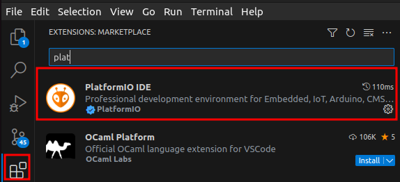
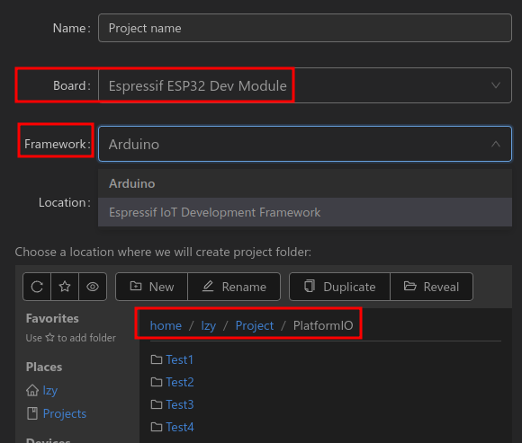
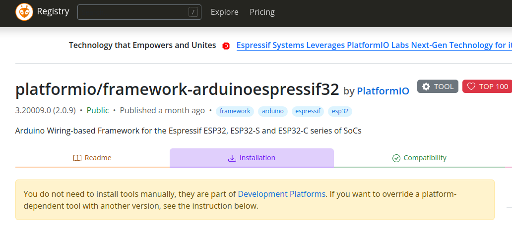

# Platform IO

## Table of Contents

[toc]

# 官网

[PlatformIO 官网](https://platformio.org/)

# 安装

流程
1. vscode
2. 开启VPN(最好手机热点+美国节点)
3. platformIO插件
   
4. 创建项目(以esp32为例，注意设置项目位置)
   

如果安装失败，直接去官网搜索，根据指令下载

[官网下载 platformio/framework-arduinoespressif32 (Arduino Wiring-based Framework for the Espressif ESP32, ESP32-S and ESP32-C series of SoCs)](https://registry.platformio.org/tools/platformio/framework-arduinoespressif32/installation)



```bash
# PlatformIO Core (CLI) Installation Install Shell Commands
export PATH=$PATH:$HOME/.local/bin
ln -s ~/.platformio/penv/bin/platformio ~/.local/bin/platformio
ln -s ~/.platformio/penv/bin/pio ~/.local/bin/pio
ln -s ~/.platformio/penv/bin/piodebuggdb ~/.local/bin/piodebuggdb

# Install PlatformIO
sudo apt install platformio

# Install Package
pio pkg install --global --tool "platformio/framework-arduinoespressif32@^3.20009.0"
```