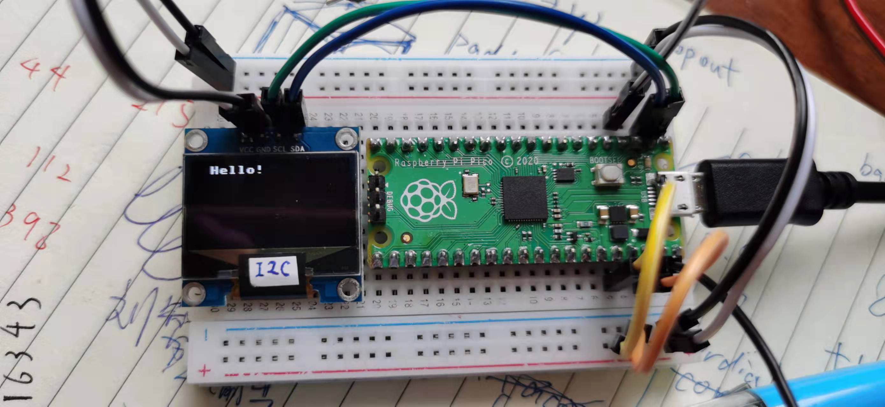
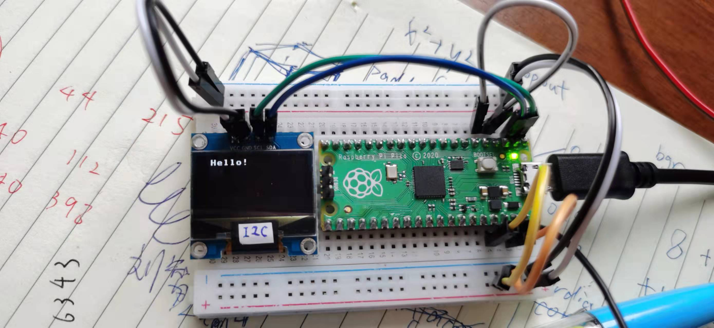
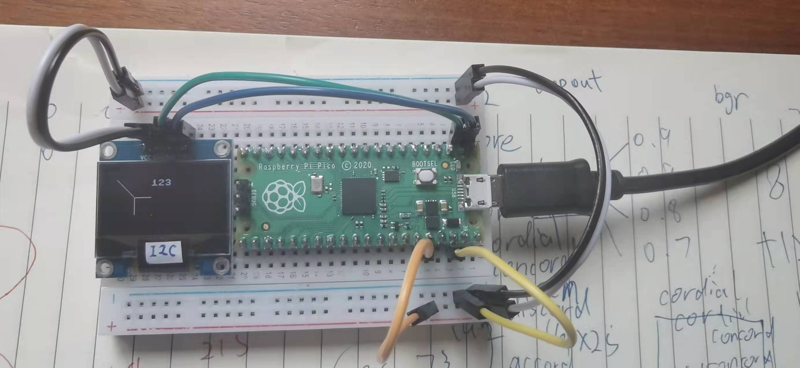
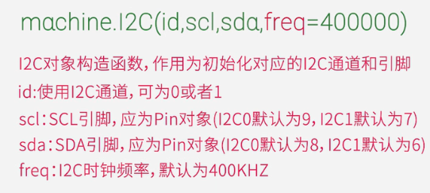
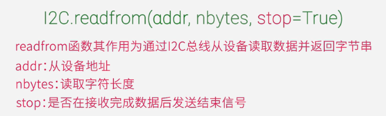
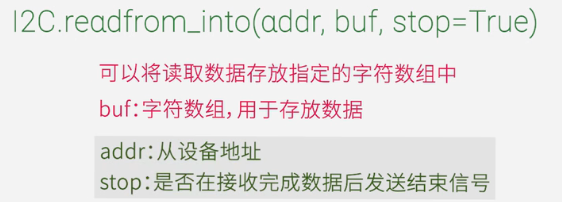
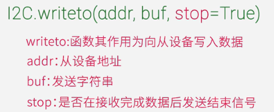
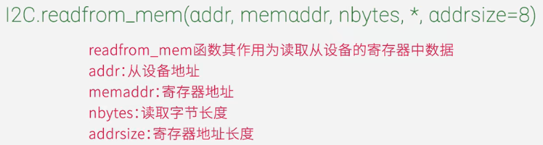
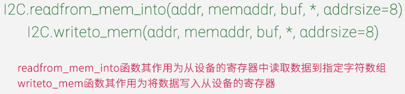
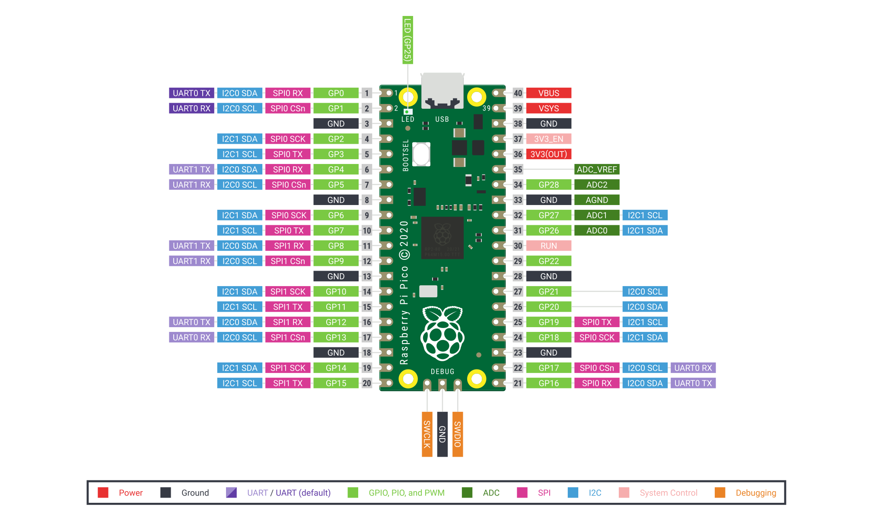

# RaspberryPi PICO

[toc]

# 个人使用

## 连接电脑

不按BOOTSEL连接会显示COM号。使用该COM号可以使用PuTTY连接，进入python环境。也可以直接使用thonnyIDE直接进行编程。


## GPIO LED

```python
from machine import Pin

g = Pin([number], Pin.OUT)
# 数字填多少可以查看 pico-r3-pinout.svg 文件的每一个引脚的GPIO号
g.high();g.on();g.value(1)  # 类似
g.low();g.off();g.value(0)  # 类似
g.value()  # 查看值
```




```python
from machine import Pin
I = Pin(3, Pin.IN)
O = Pin(2, Pin.OUT)
O.high()
LED = Pin(25, Pin.OUT)
while True:
    if I.value():
        LED.on()
    else:
        LED.off()
# 用GP2和3连接芯片上的led就会亮
```


## I2C OLED
注意接线正确，否则会有错误提示：OSError: [Errno 5] EIO

```python
from machine import I2C, Pin
from ssd1306 import SSD1306_I2C

i2c=I2C(id=0,sda=Pin(0),scl=Pin(1),freq=400_000)  # 0表示使用的是I2C0(GP0(I2C0 SDA)、GP1(I2C0 SCL))
oled=SSD1306_I2C(128, 64, i2c)  # 初始化OLED(实例化)
oled.fill(1)  # 全1
oled.fill(0)  # 全0
oled.text("123",50,10,1)  # 显示数字或者英文
oled.pixel(50,50,1)  # 一个点
oled.line(10,10,30,30,1)  # 两点连线
oled.hline(30,30,20,1)  # 横线
oled.vline(30,30,20,1)  # 竖线

oled.show()  # 显示所有内容
```





# 微雪电子 PICO系列教程

## I2C

[PICO系列教程6——I2C](https://www.bilibili.com/video/BV1GU4y1j763)


MCU常见通讯协议
1. UART
2. I2C 串行同步
3. SPI















# 其他

## 简介



Raspberry Pi Pico是具有灵活数字接口的低成本，高性能微控制器板。它集成了Raspberry Pi自己的RP2040微控制器芯片，运行速度高达133 MHz的双核Arm Cortex M0 +处理器，嵌入式264KB SRAM和2MB板载闪存以及26个多功能GPIO引脚。对于软件开发，可以使用Raspberry Pi的C / C ++ SDK或MicroPython。


## 安装

## 基础

## 传感器程序


## 一些备份

i2c hello
```python
from machine import SoftI2C, Pin
# 导入SSD1306驱动模块
from ssd1306 import SSD1306_I2C

if __name__ == '__main__':
    # 初始化SoftI2C
    # OLED屏幕的scl连接到树莓派PICO的GPIO0, sda连接到GPIO1
    i2c = SoftI2C(scl=Pin(0), sda=Pin(1))
    # oled = SSD1306_I2C(width, height, i2c, addr)
    # width:屏幕宽
    # height: 屏幕高
    # i2c:已定义的I2C对象
    oled = SSD1306_I2C(128, 64, i2c) #OLED显示屏初始化：128*64分辨率,OLED的I2C地址是0x3c
    # OLED显示的字符串，横坐标和纵坐标
    oled.text("Hello!", 10, 0)
    # OLED显示
    oled.show()

```


SSD1306驱动
```python
# MicroPython SSD1306 OLED driver, I2C and SPI interfaces

from micropython import const
import framebuf


# register definitions
SET_CONTRAST = const(0x81)
SET_ENTIRE_ON = const(0xA4)
SET_NORM_INV = const(0xA6)
SET_DISP = const(0xAE)
SET_MEM_ADDR = const(0x20)
SET_COL_ADDR = const(0x21)
SET_PAGE_ADDR = const(0x22)
SET_DISP_START_LINE = const(0x40)
SET_SEG_REMAP = const(0xA0)
SET_MUX_RATIO = const(0xA8)
SET_COM_OUT_DIR = const(0xC0)
SET_DISP_OFFSET = const(0xD3)
SET_COM_PIN_CFG = const(0xDA)
SET_DISP_CLK_DIV = const(0xD5)
SET_PRECHARGE = const(0xD9)
SET_VCOM_DESEL = const(0xDB)
SET_CHARGE_PUMP = const(0x8D)

# Subclassing FrameBuffer provides support for graphics primitives
# http://docs.micropython.org/en/latest/pyboard/library/framebuf.html
class SSD1306(framebuf.FrameBuffer):
    def __init__(self, width, height, external_vcc):
        self.width = width
        self.height = height
        self.external_vcc = external_vcc
        self.pages = self.height // 8
        self.buffer = bytearray(self.pages * self.width)
        super().__init__(self.buffer, self.width, self.height, framebuf.MONO_VLSB)
        self.init_display()

    def init_display(self):
        for cmd in (
            SET_DISP | 0x00,  # off
            # address setting
            SET_MEM_ADDR,
            0x00,  # horizontal
            # resolution and layout
            SET_DISP_START_LINE | 0x00,
            SET_SEG_REMAP | 0x01,  # column addr 127 mapped to SEG0
            SET_MUX_RATIO,
            self.height - 1,
            SET_COM_OUT_DIR | 0x08,  # scan from COM[N] to COM0
            SET_DISP_OFFSET,
            0x00,
            SET_COM_PIN_CFG,
            0x02 if self.width > 2 * self.height else 0x12,
            # timing and driving scheme
            SET_DISP_CLK_DIV,
            0x80,
            SET_PRECHARGE,
            0x22 if self.external_vcc else 0xF1,
            SET_VCOM_DESEL,
            0x30,  # 0.83*Vcc
            # display
            SET_CONTRAST,
            0xFF,  # maximum
            SET_ENTIRE_ON,  # output follows RAM contents
            SET_NORM_INV,  # not inverted
            # charge pump
            SET_CHARGE_PUMP,
            0x10 if self.external_vcc else 0x14,
            SET_DISP | 0x01,
        ):  # on
            self.write_cmd(cmd)
        self.fill(0)
        self.show()

    def poweroff(self):
        self.write_cmd(SET_DISP | 0x00)

    def poweron(self):
        self.write_cmd(SET_DISP | 0x01)

    def contrast(self, contrast):
        self.write_cmd(SET_CONTRAST)
        self.write_cmd(contrast)

    def invert(self, invert):
        self.write_cmd(SET_NORM_INV | (invert & 1))

    def show(self):
        x0 = 0
        x1 = self.width - 1
        if self.width == 64:
            # displays with width of 64 pixels are shifted by 32
            x0 += 32
            x1 += 32
        self.write_cmd(SET_COL_ADDR)
        self.write_cmd(x0)
        self.write_cmd(x1)
        self.write_cmd(SET_PAGE_ADDR)
        self.write_cmd(0)
        self.write_cmd(self.pages - 1)
        self.write_data(self.buffer)


class SSD1306_I2C(SSD1306):
    def __init__(self, width, height, i2c, addr=0x3C, external_vcc=False):
        self.i2c = i2c
        self.addr = addr
        self.temp = bytearray(2)
        self.write_list = [b"\x40", None]  # Co=0, D/C#=1
        super().__init__(width, height, external_vcc)

    def write_cmd(self, cmd):
        self.temp[0] = 0x80  # Co=1, D/C#=0
        self.temp[1] = cmd
        self.i2c.writeto(self.addr, self.temp)

    def write_data(self, buf):
        self.write_list[1] = buf
        self.i2c.writevto(self.addr, self.write_list)


class SSD1306_SPI(SSD1306):
    def __init__(self, width, height, spi, dc, res, cs, external_vcc=False):
        self.rate = 10 * 1024 * 1024
        dc.init(dc.OUT, value=0)
        res.init(res.OUT, value=0)
        cs.init(cs.OUT, value=1)
        self.spi = spi
        self.dc = dc
        self.res = res
        self.cs = cs
        import time

        self.res(1)
        time.sleep_ms(1)
        self.res(0)
        time.sleep_ms(10)
        self.res(1)
        super().__init__(width, height, external_vcc)

    def write_cmd(self, cmd):
        self.spi.init(baudrate=self.rate, polarity=0, phase=0)
        self.cs(1)
        self.dc(0)
        self.cs(0)
        self.spi.write(bytearray([cmd]))
        self.cs(1)

    def write_data(self, buf):
        self.spi.init(baudrate=self.rate, polarity=0, phase=0)
        self.cs(1)
        self.dc(1)
        self.cs(0)
        self.spi.write(buf)
        self.cs(1)


```
