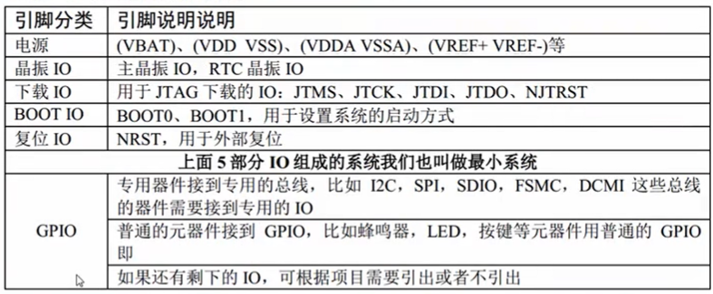
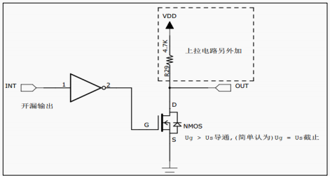
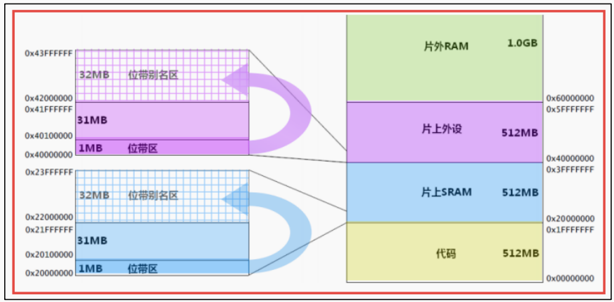
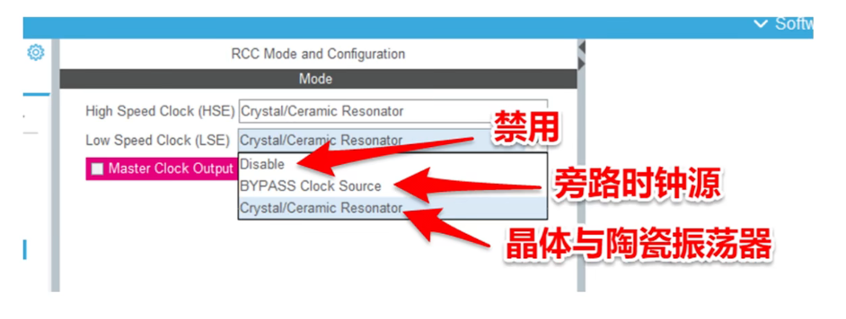
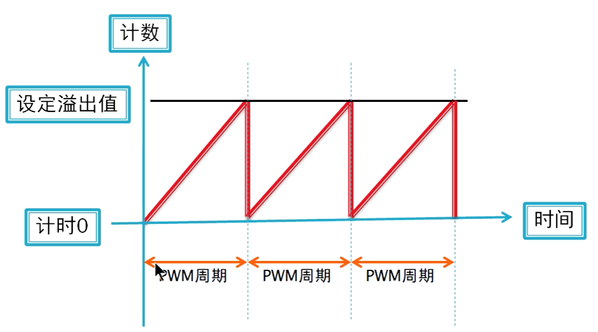
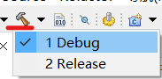

# STM32

[toc]

## Portals

[小蜜蜂 基于STM32CubeMX的嵌入式开发](https://www.bilibili.com/video/BV1m7411H7oT)

[洋桃电子 STM32入门100步](https://www.bilibili.com/video/BV1MW411q7Jn)

[洋桃电子 STM32物联网入门30步](https://www.bilibili.com/video/BV1jP4y1E7TJ)

[野火 STM32F103教学](https://www.bilibili.com/video/BV1yW411Y7Gw)

[MDK5 Software Packs](https://www.keil.com/dd2/pack/)

REMAIN

JUMP

# 野火 STM32F103教学

## 入门篇

**JUMP:P8 9 11 12 13 14 15 16 17 18 19 20**

### 初识STM32

ST：意法半导体
M：Microelectronics
32：32 位（指一个指令周期处理数据的最宽位数）

STM32 就是指 ST 公司开发的 32 位微控制器

STM32为小端序，little-endian

==基于ARMv7架构Cortex-M内核==


**分配原理图IO**



如果自己设计，就在数据手册中查看，并整理成excel。

数据手册中可以查看==引脚定义、存储器映像。参考手册也有存储器映像==

==参考手册==（Reference manual）**总线架构**
==数据手册==（Data Sheet）**引脚定义、功能的详细描述**


**数据手册**主要用于**芯片选型和设计原理图**时参考
**参考手册**主要用于在**编程**的时候查阅。

**引脚定义**


说明
1. 引脚序号
2. 引脚名称
3. 引脚类型
4. I/O电平
5. 主功能（复位后）
6. 默认复用功能
7. 重映射功能（有些引脚才有）


### 寄存器

**辨别正方向**

黑点下面为一号引脚，逆时针依次递增

**架构简图**

ARM（IP厂商 设计芯片、出售技术授权 内核设计）
ST（SOC芯片生产厂商 生产芯片+外设）


Master(内核 core)----Slave(外设 peripheral)

GPIO、USART（串口）、I2C、SPI 等都叫做片上外设

三条总线I、S、D。


程序放置在Flash中。内核通过ICode总线（Instruction）读取。

DCode（Data）数据总线。*常量*放在内部的*Flash*，*变量*（包括全局变量和局部变量）都放在*内部SRAM*。

DMA（也算是外设，用于搬运数据）也可以读取数据，可能与DCode冲突，由*总线矩阵*解决冲突。

System（系统总线），主要读取*寄存器*。

APB2为高速总线，AHB1为低速总线。

**存储器映射**

被控单元的FLASH，RAM，FSMC和AHB到APB的桥（即片上外设），这些功能部件共同排列在一个 4GB 的地址空间内。


32位，$2^{32}B=4GB$，可以访问4G内存。8位16进制等价于32位二进制。被均分为8块，每块512MB。（能控制的最小的一块是1byte）


每个块的功能基本被限制。主要关注block2。Block2 用于设计片内的外设，根据外设的总线速度不同，Block 被分成了 APB 和 AHB 两部分，其中 APB 又被分为 APB1 和 APB2。


存储器本身不具有地址信息，它的地址是由芯片厂商或用户分配，*给存储器内存单元分配地址的过程就称为存储器映射*。如果给存储器再分配一个地址就叫存储器重映射。

分配好后就可以通过地址访问

**寄存器映射**

四个字节为一个单元，共 32bit，每一个单元对应不同的功能，当我们控制这些单元时就可以驱动外设工作。

寄存器：给有特定功能的内存单元取别名。*给已经分配好地址的有特定功能的内存单元取别名的过程就叫寄存器映射*。

我们可以找到每个单元的起始地址，然后通过 C 语言指针的操作方式来访问这些单元。

通过宏定义#define更方便操作。

```c
# define [reg_name] *(unsigned int*)(address)
//先强制类型转换为指针，再通过取地址符操作，更方便
```

**总线基地址**

==可以在参考手册中查看外设的详细存储器映射（APB、AHB）==


在外设基地址（0x4000 0000）上添加偏移，得到各个总线基地址。

**外设基地址**


*一个端口400(hex)byte相当于1024(dec)byte，1KB*

在总线基地址的基础上（0x4001 0800）增加相对总线的地址偏移得到端口的偏移

**端口的寄存器地址**


*寄存器为32位，也就是四个字节，所以相当于每次加0x04*

在端口基地址的基础上增加寄存器偏移。

==*寄存器地址 = 外设基地址 + 总线偏移 + 外设（端口）偏移 + 外设寄存器偏移*==

进行宏定义时，只有写到寄存器地址的时候才需要 通过指针操作，前面的使用数值运算即可

**写0写1**
```cpp
//置1，其他保持不变
GPIO_XXX |= (1<<bias);

//置0，其他保持不变，-表示取反
GPIO_XXX &= -(1<<bias);
```

**使用结构体封装寄存器列表**

各个端口的寄存器列表相同，只是地址不同。


结构体成员正好进行占用，指针通过结构体成员的bias访问成员变量。

### GPIO

==general purpose input output==

GPIO为引脚，引脚不一定为GPIO

==在数据手册中的引脚定义中查看引脚的功能==

**GPIO功能框图**


详细说明
1. ①部分
   1. I/O引脚（visible）
   2. 保护二极管：如果I/O高于VDD（低于VSS），会向上（下）导通，保护芯片内部。如果高（低）的太多也会烧毁芯片
2. ②部分
   1. 通过ODR(output data register)输出，PMOS和NMOS之前添加了反向器。两个二极管应该是从I/O处等效过来的保护二极管
   2. 推挽输出
      
      1. 当INT为1，经过反相器为0。由于PMOS的栅极G(0)低于源极S(VDD)所以PMOS导通，NMOS截止
      2. 当INT为0，经过反相器为1。由于NMOS的栅极G(1)高于源极S(VSS)所以NMOS导通，PMOS截止
      3. 两个MOS管轮流导通（VDD推（拉电流，电流方向是向其外部流动），VSS挽（灌电流，电流方向是向其内部流动））
      4. ==效率高、电流大（MOS管内阻小）、驱动能力强==
   3. 开漏输出
      
      1. 开漏只能输出低电平，PMOS管不工作。
      2. 当INT为1，经过反相器为0。NMOS截止，高阻态。如果想要输出高电平，需要外加上拉电路。（可以输出更高的电平，通过上拉电路的设计、VDD的调整）
      3. 当INT为0，经过反相器为1。NMOS的栅极G(1)高于源极S(VSS)所以NMOS导通，输出低电平
      4. **线与**功能，一个为低、全部为低，多用于I2C和SMBUS总线
3. ③部分：ODR
   1. ODR，32位中只有低16位有效，对应GPIO端口的十六个引脚
   2. 可以直接操作输出数据寄存器(ODR)，也可以通过写位设置/清除寄存器(BSRR:Bit Set Reset Register,32位都有效)来间接写入ODR。还有一个BRR(端口位清除寄存器)
4. ④部分：复用功能输出
   1. 使用复用功能输出时，不经过ODR，直接来自片上外设
   2. 例如串口输出
5. ⑤部分：IDR
   1. 输入数据寄存器，32位，低16位有效
   2. ODR的数据可以通过IDR读取（**监控**）
   3. TTL肖特基触发器（施密特触发器），**门限的作用，模拟转为数字1/0**
   4. 输入时可以配置上拉输入，或者下拉输入，或者浮空输入。由CRL(config register low)、CRH(config register high)配置
   5. 默认电平由上拉或者下拉决定。浮空输入电平完全由外部输入决定
6. ⑥部分：复用功能输入
   1. 使用复用功能输入时，不经过IDR，直接连接片上外设
   2. 例如串口输入
   3. 经过施密特触发器
7. ⑦部分：模拟输入
   1. 不经过施密特触发器
   2. 例如ADC采集
   3. 对应的也有模拟输出（DAC），不经过MOS管，图上并未标出

**对应于CubeMX中的选项**
Input
1. GPIO mode
   1. Input mode
2. GPIO Pull-up/Pull-down
   1. No pull-up and no pull-down
   2. Pull-up
   3. Pull-down

Output
1. GPIO output level（默认输出的高低电平，程序初始化之后该Output口输出的电平信号是高还是低）
   1. Low
   2. High
2. GPIO mode（推挽输出、开漏输出）
   1. Output Push Pull
   2. Output Open Drain
3. GPIO Pull-up/Pull-down
   1. No pull-up and no pull-down
   2. Pull-up
   3. Pull-down（Open Drain时没有该选项）（开漏输出只有低电平和高阻态，高电平需要自己外接上拉电路）
   4. P.S.：在1处的保护二极管也有上下拉电阻，上下拉可以改变电流：上拉时，输出电流和上拉电阻上的电流一同向外流出，提高了电流驱动能力。下拉时，输出电流还有一部分会流入下拉电阻中，降低了电流驱动能力。一般output就no pull即可。
4. Maximum output speed
   1. Low
   2. Medium
   3. High
5. User Label


**GPIO初始化顺序**
1. 选定GPIO引脚
2. 配置GPIO工作模式
3. 控制GPIO输入暑促

**GPIO输入按键检测**
软件消抖（延时）、硬件消抖（加电容）

### 位带操作

支持位带操作后，可以使用普通的加载/存储直流对单一的bit进行读写。

两个区实现了位带，SRAM和片内外设的最低1MB范围（$2^{20}byte$，下一个区的bias就是0x0010 0000）




位带别名区，将位带区寄存器中每一bit膨胀为32bit的字（stm32总线为32位，效率高）。位带别名区的字只有LSB(Least Significant Bit)有意义（==对应于stm32的小端序，低字节存在低地址==）。

对位段别名写入数据的时候也会同时写入位段区域。

**==公式==**


bit_word_addr：在位带别名区的地址（第几个**字节**）
bit_band_base：位带别名区的首地址
byte_offset：位带区的字节的偏移量
bit_number：在位带区的字节的第几位，由于经过膨胀每一位都膨胀到了四个字节


*说明，由于1bit映射为32byte，所以位带区最后一个bit对应的位带别名区的4byte的起始地址为0xFFFC*

**优越性**
1. 简化跳转的判断
2. 多任务中实现共享资源在任务间的“互锁”访问，变为原子操作


## 中级篇

**JUMP：P24 25 26**

**REMAIN 中断博客**

### RCC 复位和时钟控制器

==RCC：reset clock control 复位和时钟控制器==

#### 时钟树


**时钟树分析**
1. ==**①HSE时钟**==
   1. High Speed External clock signal，高速外部时钟
   2. 由晶振提供
   3. 当使用有源晶振时，时钟从 OSC_IN 引脚进入，OSC_OUT 引脚悬空；当选用无源晶振时，时钟从 OSC_IN 和 OSC_OUT 进入，并且要配谐振电容
   4. 与之对应的还有HSI，Internal，内部时钟8M（没有倍频），受温度影响大，有温漂。当HSE故障，系统时钟自动切换到HSI，直到HSE启动成功。
   5. 由寄存器**RCC_CR**的位16(HSEON)控制。由于起振可能需要时间，用位17(HSERDY 外部高速时钟就绪标注位)进行检查是否就绪。HSI也有对应的这些位。
   6. 寄存器**RCC_CFGR**的位17：PLLXTPRE控制是否分频（0：不分频（一般），1：2分频）
2. ==**②PLL时钟源**==
   1. 寄存器**RCC_CFGR**的位16：PLLSRC(锁相环时钟源)，选择HSI/2（一定会被二分频）或者HSE（二分频或者不分频）
3. ==**③PLL时钟PLLCLK**==
   1. 经过**RCC_CFGR**的位21-18：PLLMUL倍频因子进行倍频
   
   2. 一般使用9倍频（8*9=72M（ST官方推荐））
4. ==**④系统时钟**==
   1. 最大72MHz（不考虑自己超频）。来源可以是HSE、HSI、PLLCLK。由**RCC_CFGR**的位1-0：SW(system clock switch控制)，用由**RCC_CFGR**的位3-2：SWS(system clock switch status)判断是否切换完毕。
   
5. ==**⑤⑥⑦总线时钟**==
   1. AHB预分频器：由**RCC_CFGR**的位7-4：HPRE(AHB Prescaler)（4位）。AHB：advanced high-performance bus
      
   2. APB1预分频器：由**RCC_CFGR**的位10-8：PPRE1(APB1 low-speed prescaler)（3位）
      
   3. APB2预分频器：由**RCC_CFGR**的位13-11：PPRE2(APB2 hight-speed prescaler)（3位）
      
   4. 对应架构图
      
   5. HCLK时钟：AHB高速总线时钟，为AHB总线外设提供时钟、为Cortex系统定时器提供时钟(SysTick)（8分频），为内核提供时钟(FCLK，自由运行时钟，不分频)
   6. PCLK1时钟：由HCLK分频，配置预分频器控制，低速外设。最高36M。倍频后为APB1总线的（2-7）定时器提供时钟TIMxCLK
   7. PCLK2时钟：由HCLK分频，配置预分频器控制，高速外设。GPIO、USART、SPI。倍频后为APB2总线的（1和8）定时器提供时钟TIMxCLK
6. **其他时钟**
   1. ==**A: USB时钟**==
   2. ==**B : Cortex系统时钟（SYSCLK经过AHB预分频器后，再8分频）**==
   3. ==**C : ADC时钟：最大时钟为14MHz，一般达不到**==
   4. ==**D : RTC时钟、独立看门狗时钟**==
      1. RTC:Real Time Clock。可以由LSE（32.768kHz）、LSI（30-60kHZ）、HSE_RTC（HSE128分频）。由**RCC_BDCR**（备份域控制寄存器）的位9-8：RTCSEL选择。
      2. IWDGCLK：只能由LSI提供
         1. 独立看门狗(IWDG)：可通过写入看门狗的键寄存器或硬件选择来启动IWDG。一旦启动了独立看门狗，除了系统复位，它不能再被停止
   5. ==**E : MCO时钟输出**==
      1. 微控制器时钟**输出引脚**(microcontroller clock output)，主要作用是可以对外提供时钟，相当于一个有源晶振
      2. 由**RCC_BDCR**（备份域控制寄存器）的位 26-24：MCO[2:0]决定
      3. 还可以通过示波器监控MCO引脚的时钟输出来验证我们的系统时钟配置是否正确
      4. 有些型号的芯片有多个MCO
7. 时钟安全系统(CSS)
   1. HSE故障，HSE会被自动关闭。产生CSSI时钟安全中断（不可屏蔽中断）。

### 中断

**STM32 中断非常强大，每个外设都可以产生中断**，异常等于中断。

可以实现中断嵌套，中断可以被中断（被优先级更高（数值小）的中断所打断）

Portals：[STM32的中断blog](https://www.cnblogs.com/h1019384803/p/10993140.html)

#### 中断类型

类型：
1. 系统异常：体现在内核水平（8个，算上Reset和HardFault有10个，还有3个为保留）
2. 外部中断：体现在外设水平（60个）

除了个别异常的优先级被定死外，其它异常的优先级都是可编程的。

==可以在参考手册中查看**中断向量表**==

*灰色部分为系统异常，白色部分为外部中断*（注意查看异常时是互联型产品还是容量产品）


。。。。。中间部分省略。。。。。


常用SysTick、BusFault、HardFault。

Reset优先级最高，重新运行。

#### NVIC

Nested Vectored Interrupt Controller，即嵌套向量中断控制器，属于**内核外设**，管理内核和片上所有外设的中断相关功能。

ST公司将Cortex-M内核中的NVIC进行裁剪。STM32的NVIC是Cortex-M内核的子集。

==系统异常和外部中断在stm32f10x.h、core_cm3.h(内核)、misc.h(固件库函数)查看==

**NVIC结构体定义**，来自固件库头文件：core_cm3.h（core_cm3.h中还可以查看NVIC库函数）


**==在PM0056 Programming manual中查看相关寄存器说明==**（和上方的结构体对应）
==NVIC_ISER:Interrupt set-enable registers==
==NVIC_ICER:Interrupt clear-enable registers==
NVIC_ISPR:Interrupt set-pending registers
NVIC_ICPR:Interrupt clear-pending registers
NVIC_IABR:Interrupt active bit registers
==NVIC_IPR:Interrupt priority registers==
NVIC_STIR:Software trigger interrupt register

ARM规定中断优先级有八位，实际上ST只使用了高四位。

在配置中断的时候一般只用 ISER、ICER和IPR这三个寄存器，ISER用来使能中断，ICER用来失能中断，IP用来设置中断优先级。

**core_cm3.h提供NVIC函数**
|NVIC库函数|描述|
|----------|----|
|void NVIC_EnableIRQ(IRQn_Type IRQn) |使能中断|
|void NVIC_DisableIRQ(IRQn_Type IRQn) |失能中断|
|void NVIC_SetPendingIRQ(IRQn_Type IRQn) |设置中断悬起位|
|void NVIC_ClearPendingIRQ(IRQn_Type IRQn) |清除中断悬起位|
|uint32_t NVIC_GetPendingIRQ(IRQn_Type IRQn) |获取悬起中断编号|
|void NVIC_SetPriority(IRQn_Type IRQn, uint32_t priority) |设置中断优先级|
|uint32_t NVIC_GetPriority(IRQn_Type IRQn) |获取中断优先级|
|void NVIC_SystemReset(void) |系统复位|

#### 优先级

**NVIC_IPR** : Interrupt priority registers

精简设计，使用高4bit


分组成抢占优先级(preemption)和子优先级(sub)


如果有多个中断同时响应，抢占优先级高的就会 抢占 抢占优先级低的优先得到执行，如果抢占优先级相同，就
比较子优先级。如果抢占优先级和子优先级都相同的话，就比较他们的硬件中断编号（*在中断向量表中查看*），编号越小，优先级越高。

**==在PM0056 Programming manual中查看相关寄存器说明==**

优先级分组由SCB_AIRCR的位[10:8]PRIGROUP配置（Application interrupt and reset control register）


SCB : System control block


对应于上面的中断 优先级表。

和CubeMX对应。


#### 中断编程

顺序:
1. **使能外设中断请求**（*小门*），这个具体由每个外设的相关中断使能位控制。比如串口有发送完成中断，接收完成中断，这两个中断都由串口控制寄存器的相关中断使能位控制。 （TCIE：发送完成中断使能 (Transmission complete interrupt enable)）
2. **配置NVIC寄存器**（*大门*：NVIC_ISER），初始化NVIC_InitTypeDef（结构体），配置中断优先级分组。
   
   1. NVIC_IRQChannel : 用来设置中断源，不同的中断中断源不一样，且不可写错，即使写错了程序也不会报错，只会导致不响应中断。
   2. NVIC_IRQChannelPreemptionPriority : 抢占优先级
   3. NVIC_IRQChannelSubPriority : 子优先级
   4. NVIC_IRQChannelCmd : （*大门的使能*）中断使能（ENABLE）或者失能（DISABLE）。操作的是 NVIC_ISER 和 NVIC_ICER 这两个寄存器。（*本身是一个枚举类型的变量* typedef enum {DISABLE = 0, ENABLE = !DISABLE} FunctionalState;）
3. 调用NVIC_Init()初始化函数，将结构体成员写入相应寄存器中。
4. **编写中断服务函数**:实际的中断服务函数都需要重新编写，要与启动文件startup_stm32fxxx_hd.s的中断向量表中的一致(有默认的，但都为空)
   1. 函数名称（函数的地址）
   2. 在启动文件中，将函数名初始化。中断向量表规定了，函数的地址。
   3. 关键字（[WEAK]），表示可以在其他文件定义，新定义的函数会被优先执行。如果新的函数函数名写错了（就没有用），则会执行默认的[WEAK]函数。


#### 代码解读

==**IRQn_Type**==

IRQn_Type是一个枚举类型。存放了所有的**中断源及其编号**（包含内核中断以及外设中断，包含了各种型号的（通过宏定义））。（*在stm32f10x.h中查看*）


内核中断的编号都小于0
内核中断优先级应配置寄存器：SCB_SHP
外设中断优先级应配置NVIC_IP


==**NVIC_Type**==

==*个人理解*==：NVIC_Type应该就是相当于NVIC在内存中的部分。（理解为一个对应模板）通过修改结构体成员的方式修改相应寄存器（内存位置）。

但需要注意的是STM32F103的**可屏蔽中断只有60个**，所以**用不到8个ISER**寄存器（每个32位），只用到了ISER[0]和ISER[1]这两个寄存器，ISER[0]和ISER[1]可以组成成64个中断使能位。

当需要*使能某个外设中断*时，就必须找到**ISER**寄存器的对应位，并将其置1，具体是置位哪一个位，可以**根据结构体IRQn_Type来查询**。

**ICER**寄存器的使用跟ISER是一样的，只是功能相反。ICER寄存器是用来清除某个中断的使能的。*NIVC的寄存器都是写1有效，而写0是无效的*，不能通过给ISER寄存器写0来清除中断使能位，所以增加了ICER寄存器与ISER寄存器对应。

**IP**[240]中断优先级控制寄存器*组*。每个可屏蔽中断占用**8bit**，总共可以表示240个可屏蔽中断，但是STM32F103只用到了IP[59]-IP[0]这60个。IP寄存器的8个bit并没有全部使用，只用了高4位，也就是bit4-bit7位。Bit4-bit7位又分为抢占优先级和响应先级，抢占优先级在前，响应先级在后。而对于抢占优先级和响应优先级各占几位，则需要根据SCB的AIRCR寄存器中的中断分组设置决定。

==**初始化**==

定义一个NVIC_InitTypeDef结构体后可以调用NVIC_Init()函数，将结构体传入，修改寄存器相关位。

### EXTI 外部中断/事件控制器

#### EXTI简介

每一个GPIO都可以产生中断，体现在电平变化（高到低、低到高）。电平变化由EXTI外设管理（EXTI产生中断），再传给NVIC处理。

**GPIO-->EXTI-->NVIC**

**EXTI : External interrupt/event controller**，即外部中断/事件控制器（外部指GPIO），管理了控制器的 20个中断/事件线。每个中断/事件线都对应有一个边沿检测器，可以实现输入信号的上升沿检测和下降沿的检测。EXTI 可以实现对每个中断/事件线进行单独配置，可以单独配置为中断或者事件，以及触发事件的属性。

#### EXTI功能框图


**功能说明**（*中断为红线，事件为绿线*）
1. ==**①输入线**==
   1. 外部中断/事件线路映像（*参考手册*）：112通用I/O端口以下图的方式连接到16个外部中断/事件线上(A、B、C、D、E、F、G)（7(A-G的个数，即GPIO组数)*16(1个GPIO引脚数)=112），还有4个不属于GPIO的线。功能框图中的20就是指EXTI可以管理20根线。
       
   2. 寄存器配置，选择是PAx-PGx中的哪一个
       
      1. 每一个外部中断配置寄存器都只有低16位有效。每4bit为一组（选择是从ABCEDFG中哪个GPIO），管理一根EXTI输入线
      2. 4个寄存器的功能一致，只是配置不同的输入线
      3. 4个寄存器，每个寄存器管理4根线，正好对应GPIO端口的16个I/O。
2. ==**②边沿检测电路**==
   1. 由上升沿触发选择寄存器(EXTI_RTSR(Rising trigger))和下降沿出发选择寄存器(EXTI_FTSR(Falling trigger))控制。都需要管理20根线，所以低20位有效。0表示无效（默认）。上升沿和下降沿可以捕捉按键。
   2. EXTI_RTSR
      
   3. EXTI_FTSR
      
3. ==**③或门&软件中断事件寄存器**(EXTI_SWIER(Software interrupt))==
   1. 或门
   2. 软件中断事件寄存器（低20位有效）
      
      IMR(Interrupt Mask)：中断屏蔽寄存器。
      EMR(Event Mask)：事件屏蔽寄存器。
      PR(Pending)：挂起寄存器。先挂起，暂不响应。
4. ==**④与门&中断屏蔽寄存器**==
   1. 当请求挂起寄存器中写1，说明已经捕捉到了请求信号。
   2. 如果同时中断屏蔽寄存器IMR写1说明开放线上的中断请求（*大开关*）
5. ==**⑤送至NVIC**==
   1. 两个条件同时满足（与门），将与门的结果送入**NVIC中断控制器**。由CM3内核响应中断，查找相应的中断服务函数(ESR)
6. ==**⑥与门&事件屏蔽寄存器**==
   1. 和④部分类似
   2. 将与门的结果送入脉冲触发器。
7. ==**⑦脉冲发生器**==
   1. 与门的结果为有效信号 1 时就会产生一个脉冲；如果输入端是无效信号就不会输出脉冲。
8. ==**⑧脉冲信号**==
   1. 产生事件的线路最终的产物，这个脉冲信号可以给其他外设电路使用，比如定时器TIM、模拟数字转换器 ADC等等，这样的脉冲信号一般用来触发TIM或者ADC开始转换。

#### 中断实验

**EXTI初始化结构体**
标准库函数对每个外设都建立了一个初始化结构体，比如 EXTI_InitTypeDef，结构体成员用于设置外设工作参数，并由外设初始化配置函数，比如 EXTI_Init()调用，这些设定参数将会设置外设相应的寄存器，达到配置外设工作环境的目的。


四个成员：
1. **EXTI_Line**：EXTI中断/事件线选择，可选EXTI_Line0至EXTI_Line19。为了配置后续其他寄存器方便（直接指定是哪一个位），而非配置AFIO_EXTICR。
2. **EXTI_Mode**：EXTI模式选择，可选为产生==中断==(EXTI_Mode_Interrupt)或者产生==事件==(EXTI_Mode_Event)
3. **EXTI_Trigger**：EXTI边沿触发事件，可选==上升沿触发、下降沿触发或者上升沿和下降沿都触发==
4. **EXTI_LineCmd**：控制是否使能EXTI线，可选使能EXTI线(ENABLE)或禁用(DISABLE)。和上面的EXTI_Mode配合


置于AFIO的寄存器配置，在stm32f10x_gpio.h中由函数GPIO+EXTILineConfig(uint8_t GPIO_PortSource,uint8_t GPIO_PinSource)函数进行控制（前面的参数配置PAx-PGx中的哪一个，后一个参数配置具体哪个引脚（0-15中断线，另外几个应该不归这里管））。

### SysTick 系统定时器

#### SysTick简介

**SysTick系统定时器**是属于CM3**内核**中的一个**外设**，**内嵌在 NVIC 中**。系统定时器是**一个24bit的向下递减**的计数器，计数器每计数一次的时间为**1/SYSCLK**，一般我们设置系统时钟 SYSCLK 等于 72M。当重装载数值寄存器的值**递减到 0 的时候**，系统定时器就产生**一次中断**，以此循环往复。
因为 SysTick 是属于 CM3内核的外设，所以所有**基于 CM3 内核的单片机都具有这个系统定时器**，使得软件在 CM3 单片机中可以很容易的移植。系统定时器一般用于操作系统，用于产生时基，维持操作系统的心跳。

#### SysTick功能框图


说明
1. STK_CLK：
2. STK_VAL&递减计数器：24bit，最大为$2^{24}$
3. STK_LOAD&重装载寄存器：24bit，最大为$2^{24}$

counter在时钟的驱动下，从**reload重装载寄存器的值**向下递减计数到零，产生中断（如果使能中断，中断服务程序也会执行）和置位COUNTFLAG标志。随后从reload值重新开始递减，如此循环。

STK_VAL可以实时查询到递减计数器的值

#### SysTick寄存器

**==在PM0056 Programming manual中查看相关寄存器说明==**


**SysTick control and status register (STK_CTRL)**


**SysTick reload value register (STK_LOAD)**


**SysTick current value register (STK_VAL)**


**SysTick calibration(校准) value register (STK_CALIB)**


常用寄存器说明

STK_CTRL中的TICKINT位写1表示执行中断服务程序，0表示不执行。


#### SysTick定时器实验

**定时时间计算**
 
可以在中断服务函数中进行计数。
Reload不应设定的太小，否则中断产生的过于频繁。一般ms数量级。

**core_cm3.h中SysTick寄存器定义**


**SysTick中断优先级**
在SCB_SHPR寄存器中配置（*PM0056中查看*）
STM32内核和外设都是使用4bit表示中断优先级
中断优先级分组对内核和外设同样重要。优先级的四个bit都是按照抢占优先级和子优先级进行解析。当这两个优先级都相同，则比较中断向量表中的编号，此时系统中断的优先级更小。

### 通信

#### 串行与并行


串行在硬件上只需要一根线。

==**常见协议**==
1. 串行：USART、I2C、SPI
2. 并行：SDIO(SD卡)、FSMC(控制液晶、显存)

#### 全双工、半双工、单工


**（同时+双向）->（双向）->（单向）**

串口、SPI可以是全/半双工

I2C为半双工

#### 同步与异步

保证数据传输的准确性

**有时钟信号的为同步**，在时钟信号高（或低）电平的时候数据信号才为有效


**没有时钟信号的为异步**，为了保证传输的准确性，加入校验位等。


在同步通讯中，数据信号所传输的内容绝大部分就是有效数据，而异步通讯中会包含有帧的各种标识符，所以同步通讯的效率更高，但是同步通讯双方的时钟允许误差较小，而异步通讯双方的时钟允许误差较大。

#### 通信速率

Bitrate：比特率，每秒钟传输的二进制位数，单位为比特每秒(bit/s)。
Baudrate：波特率，它表示每秒钟传输的码元个数。（有时需要多个二进制位表示一个码元）

对于串口通信，两者相同，0/1表示高低电平。

### 串口

#### 串口通信协议

物理层：硬件。协议层：软件。


TTL电平：5V或3.3V到0V。正表示1，负表示0。（芯片内部为TTL电平）
RS232电平：15V到-15V。负表示1，正表示0。（工业设备，容错大）

两者高低电平逻辑相反。

**RS232标准**

电平转换芯片
1. MAX3232
2. SP3232


**TTL标准**（USB转串口）

主要用于设备和电脑通信，电脑端需安装电平转换芯片驱动。
电平转换芯片
1. *CH340*
2. PL2303
3. CP2102
4. FT232

**TTL-TTL标准**（原生的串口到串口）

无需电平转换芯片，直接用线连接即可，直接使用TTL电平通信
GPS模块、GSM模块、串口转WIFI模块、HC04蓝牙模块


**串口数据包基本组成**

串口通讯的数据包由发送设备通过自身的 TXD 接口传输到接收设备的 RXD 接口。在串口通讯的协议层中，规定了数据包的内容，它由*启始位、主体数据、校验位以及停止位*组成，**通讯双方的数据包格式要约定一致才能正常收发数据**。
1. 起始位：*1个逻辑0*
2. 结束位：*0.5、1、1.5、2个逻辑1*
3. 有效数据位：起始位后，*5、6、7、8位*（stm32可以9个位）
4. 校验位(parity)：可选，使数据抗干扰，*奇校验（有效数据和校验位中的1为奇数，凑成奇数）、偶校验（有效数据和校验位中的1为偶数，凑成偶数）、0校验（校验位总为0）、1校验（校验位总为1）、无校验（数据包中不包含校验位）*


#### STM32串口功能框图
功能框图可以在参考手册中进行查看，具体对应哪些引脚在数据手册中查看(pinouts and pin description)


注意有些串口可能挂载在不同的总线上，所以要开启对应的总线时钟

**功能框图说明**
1. 引脚（使用GPIO与外界通信）仅同步通信时使用
   1. TX:数据发送
   2. RX:数据接收
   3. SCLK:时钟，==仅同步通信时使用==，通常为异步通信
      
   4. nRTS:请求发送(request to send，n表示低电平有效)
   5. nCTS:允许发送(clear to send，n表示低电平有效)
2. 数据寄存器
   1. 数据寄存器(USART_DR)：只有低9位有效[8:0]。USART_CR1控制字长(M)和校验选择(PCE、PS、PEIE)还有(UE:大门、TE&RE:小门)，USART_CR2控制停止位(STOP常用1位)和时钟使能。USART_CR3控制中断和DMA。
   2. 状态寄存器(USART_SR)，校验错误PE、帧错误FE、噪声错误NE、总线空闲IDLE、发送数据寄存器空TXE、读数据寄存器非空RXNE。
   3. USART_DR包含了已发送的数据或者接收到的数据。USART_DR实际是包含了两个寄存器，一个专门用于发送的可写 TDR，一个专门用于接收的可读 RDR。==一个地址对应两个物理内存==（串口可以全双工）。当进行发送操作时，往 USART_DR 写入数据会自动存储在 TDR 内；当进行读取操作时，向 USART_DR 读取数据会自动提取 RDR 数据。（相当于两个缓冲区）
   4. TDR和 RDR都是介于系统总线和移位寄存器之间。串行通信是一个位一个位传输的，发送时把 TDR 内容转移到发送移位寄存器，然后把移位寄存器数据每一位发送出去，接收时把接收到的每一位顺序保存在接收移位寄存器内然后才转移到 RDR。USART 支持 DMA 传输，可以实现高速数据传输，具体 DMA 使用将在 DMA 章节讲解。
3. 控制器（就是CR1、CR2、CR3这些控制寄存器）
4. 波特率
   1. USART_BRR：波特率寄存器
   2. 分为整数部分和小数部分
   3. 计算公式
      
      
      时钟频率 ： APB2：72MHz ， APB1：36MHz
      例子：（16相当于提前移动四位，将数据变为小数形式，其实直接除也没问题）
      
      


**数据发送&接收流程**
1. 发送
   1. UE、TE使能
   2. 发送数据来自CPU或者DMA，将数据存放入TDR
   3. TDR将数据传给发送移位寄存器（TXE寄存器位改变为1，表明TDR为空，全部送入发送移位寄存器。USART_SR寄存器）（TXEIE、TCIE）
   4. 发送移位寄存器将数据一位一位传到TX引脚（TC寄存器位改变为1，表名数据传输成功。USART_SR寄存器）
2. 接收
   1. UE、RE使能
   2. 接收数据来自RX引脚，一位一位传入接收移位寄存器
   3. 数据从接收移位寄存器传递给RDR（RXNE，为1说明收到数据可以读取）
   4. CPU或者DMA从RDR中接收数据

#### 代码


### DMA

DMA(Direct Memory Access)：直接存储器存取
主要功能是用来存取数据，但是不需要占用 CPU。
数据传输支持从外设到存储器或者存储器到存储器，这里的存储器可以是 SRAM 或者是 FLASH。
DMA控制器包含了DMA1和DMA2，其中DMA1有7个通道，DMA2有5个通道，这里的通道可以理解为传输数据的一种管道。

USART串口时，如果使用CPU进行数据传输，则会被一直占用。使用DMA后，CPU给DMA发送一条命令即可，数据传输时CPU空闲。

Memory to memory
Peripheral to memory
Memory to Peripheral

#### DMA功能框图


==**说明**==
1. **DMA请求**
2. **通道**（DMA1：7条，DMA2：5条）
   1. 可以在参考手册中查看，根据需要的功能选择对应的通道。如果是Memory to memory，则所有通道均可使用。
   2. 每个通道可以接收多个外设的请求，但是同一时间只能接收一个，不能同时接收多个。
   3. DMA1
       
   4. DMA2
       
3. **仲裁器**
   1. 多个DMA请求一起发送，由仲裁器进行管理。
   2. 两个阶段
      1. 第一阶段属于软件阶段，可以在DMA_CCRx寄存器中设置，有 4 个等级：非常高、高、中和低四个优先级。
         
      2. 第二阶段属于硬件阶段，如果两个或以上的DMA通道请求优先级一样，则取决于通道编号，编号越低优先权越高。DMA1控制器拥有高于DMA2控制器的优先级。


#### DMA相关库函数

### 常用存储器

### I2C

### SPI

### 串行FLASH


## 提高篇

### FSMC

### ADC

#### ADC简介

ADC：analog to digital，模拟数字转换器
1. 三个独立的ADC（f103）
2. 分辨率：12位
3. **每个**ADC有18个通道，外部通道16个（144脚、100脚，通道数不同。引脚少，可能GPIO不够），内部通道2个（GPIO没有引出）

#### ADC功能框图


==**说明**==
1. **电压输入范围**
   
   1. Vref+,Vref-:
   2. Vdda,Vssa:模拟电源、模拟地
   3. 将外部电路调整到0~3.3V再进行测量
      
2. **输入通道**（与芯片型号有关，在数据手册中的引脚定义中查看）
   
   外部的16个通道在转换的时候又分为**规则通道和注入通道**
      1. 注入通道（*最多4路*）：在规则通道转换的时候强行插入要转换的一种。如果在规则通道转换过程中，有注入通道插队，那么就要先转换完注入通道，等注入通道转换完成后，再回到规则通道的转换流程。这点跟中断程序很像。所以，注入通道只有在规则通道存在时才会出现。
      2. 规则通道（*最多16路*）：一般使用的通道
3. **转换顺序**
   
   规则序列寄存器有 3 个，分别为 SQR3、SQR2、SQR1
   SQR3 控制着规则序列中的第一个到第六个转换，对应的位为：SQ1[4:0]~SQ6[4:0]，第一次转换的是位 4:0 SQ1[4:0]，如果通道 16 想第一次转换，那么在 SQ1[4:0]写 16 即可。SQR2 控制着规则序列中的第 7 到第12 个转换，对应的位为：SQ7[4:0]~SQ12[4:0]，如果通道 1 想第 8 个转换，则 SQ8[4:0]写 1即可。SQR1 控制着规则序列中的第 13 到第 16 个转换，对应位为：SQ13[4:0]~SQ16[4:0]，如果通道 6 想第 10 个转换，则 SQ10[4:0]写 6 即可。具体使用多少个通道，由 SQR1 的位L[3:0]决定，最多 16 个通道。
   
   注入序列寄存器JSQR只有一个，最多支持4个通道，具体多少个由JSQR的JL[2:0]决定。如果JL的值小于4的话，则JSQR跟SQR决定转换顺序的设置不一样，第一次转换的不是JSQR1[4:0]，而是 JCQRx[4:0] ，x =（4-JL），跟SQR刚好相反（从下往上填充响应的数量，顺序还是从小到大，数量不足4个是整体向下平移），和之前的规则转换顺序不同。
4. **触发源**
   1. 软件触发：
      1. 寄存器：ADC_CR2（ADON、SWSTART、JSWSTART）
   2. 外部事件触发：内部定时器/外部IO
      1. ADC_CR2（EXTSEL（选择）、EXTRRIG（开关））
5. **转换时间**
   
   ADC_CLK(MAX:12MHz):一般使得ADC预分频器将72MHz时钟6分频为12MHz（由RCC_CFGR寄存器的ADCPRE位进行控制）
   
   
6. **数据寄存器**
   
   ADC_CR2寄存器的ALIGN位控制对齐方式
   多通道采集最好通过DMA（规则数据寄存器只有一个）
   双模式下只能是ADC1和ADC2，ADC2不具有ADC功能
   注入通道数据寄存器(ADC_JDR)由4*16，不存在数据覆盖问题
7. **中断**（三个）
   1. EOC（规则通道转换完成）
   2. JEOC（注入通道转换完成）
   3. AWD（模拟看门狗）：检测转换通道的上下限

电压转换（根据数据量计算模拟量）


### TIM

定时器功能：定时、输出比较、输入捕获、互补输出

定时器分类：
1. 基本定时器只有定时功能
2. 通用定时器只没有互补输出功能
3. 高级定时器具有全部功能


*黄色箭头为产生定时器中断的位置*

STM32H723系列定时器资源：==可以在参考手册中查看==


#### 基本定时器

只能向上计数

没有外部GPIO，是内部资源，只能用于定时


框图：
1. 时钟源：来自RCC的TIMx_CLK
2. 控制器：用于控制定时器的复位、使能、计数、触发DAC
3. 时基单元（最主要部分）
   1. 包括：预分频器PSC、计数器CNT、自动重装载寄存器ARR


==计算计数器时钟时，注意要加1（公式如上图）==（个人认为可以理解为间隔数）。得到计数器时钟后，驱动计数器。

16位，最多支持到65535。

自动重装载寄存器ARR限制了能够计数到的最大数值，实际上计数的量是[0,ARR]，共ARR+1个计数器时钟周期。

**影子寄存器**（上上图中自动重装载寄存器以及预分频器后的阴影）


也就是使用影子寄存器后，新值只会在本次计数完毕，下次重新计数时被采用。


#### 高级定时器&通用定时器

可以在==数据手册中的引脚定义中查看==

有外部GPIO

功能：定时、输出比较（PWM）、输入捕获、互补输出（高级定时器独有）

STM32H723系列高级定时器说明：


**高级定时器功能框图讲解**


说明：
1. 时钟源
   1. 内部时钟源 CK_INT（RCC_TIMx_CLK）
   2. 外部时钟模式 1：外部输入引脚 TIx（x=1,2,3,4）（较少使用，感觉是④部分的）
   3. 外部时钟模式 2：外部触发输入 ETR（①部分的）
   4. 内部触发输入(ITRx)
2. 控制器
3. 时基（比基本定时器多一个重复计数器）
4. 输入捕获（输入通道：TI1、2、3、4）
   1. 对输入信号的上升沿、下降沿、双边沿进行捕获。常用于测量输入信号的脉宽、PWM输入信号的频率、占空比。
   2. 原理：捕获到信号跳变的时候，把计数器CNT的值锁存到捕获寄存器CCR中，将前后两次捕获到的CCR寄存器中的值相减，即可算出脉宽及频率。
   3. 输入滤波器和边沿检测器，抗高频干扰
5. 输出比较
6. 断路功能


#### CubeMX&CubeIDE

查看==数据手册==中的引脚定义可以知道引脚对应的定时器以及通道。


配置CubeIDE


STM32的PWM有两种模式（可以在参考手册中查看）


**STM32H723系列定时器时钟**


### SDIO


### CAN


## 大师篇


# 小蜜蜂 基于STM32CubeMX的嵌入式开发

## 01 安装与快速入门

## 02 GPIO开发

## 03 按键开发

## 04 中断系统与外部中断

## 05 定时器开发基础

## 06 串口数据收发基础

## 07 定时器与串口综合

## 08 ADC模数转换器的基本工作原理

## 09 ADC开发基础

## 10 OLED开发基础

## 11 ADC与OLED

## 12 课程小结

# 洋桃电子 STM32入门100步

## 005 时钟、复位、电源管理

查看==STM32H723数据手册==封面可得：


上电（POR）/断电（PDR）复位、可编程电压监测（PVD）


高速时钟都是供给系统时钟，低速供给RTC（实时时钟）

**CubeMX中的RCC选择**



旁路时钟源是指具有独立输出时钟脉冲的外围电路，一般指有源晶振。

晶体与陶瓷振荡器是指无源石英晶体原件或无源RC振荡器，不能像有源晶振一样直接输出频率脉冲，只能被动连接在单片机上，组成单片机的时钟外围电路。

**CubeMX中的RTC选择**


**CubeMX中的时钟树选择**


分频器、倍频器


## 007 DMA和IO端口

可以将ADC数据直接放入RAM中，方便读取和操作。无需cpu帮助存储、传输数据。

黑线为传统数据传输方式。


GPIO


## 079 外部中断原理与驱动


中断的对象是**内核**，让内核停止当前任务，执行中断任务，完毕后再执行原任务。

**外部I/O中断**---**外部中断/事件控制器（EXTI）**

外部I/O可由上沿、下沿、高低电平的三种方式触发。
1. 下降沿
2. 上升沿
3. 高低电平（不考虑边沿、只考虑电平状态）


可以选择事件/中断触发。


## 082--085 舵机原理与驱动&定时器PWM原理


0.5-2.5ms对应0~180°。


PWM：脉冲宽度调制（占空比）（pulse width modulation）

**可以由STM32中的定时器产生**





CCRx决定高低电平的比例


# 洋桃电子 STM32物联网入门30步

## 01-05 CubeIDE & CubeMX

### 通用设置


第一项文件体积小。第二项文件体积大，编译慢。第三项折中。


### GPIO


端口输出电平：端口在上电时的初始电平。

端口模式：不设置输入输出，只设置模式。

端口上下拉：端口内部要不要加上下拉电阻。

最大输出速度：通信时可以选择高速。

用户标注：可用于代码编写，替代端口原名称。


### 工程的编译与下载

**生成代码，编译设置，工程编译**

**将图形化界面设置转化为程序代码**


**编译设置**





**程序下载**

CUBEIDE仿真器下载（需要ST-LINK）

首先需要设置JTAG（在SYS中选择）


其次需要进行仿真器设置


程序下载


可能会弹出仿真器在线升级窗口


## 06


## 17 外部中断与定时器


