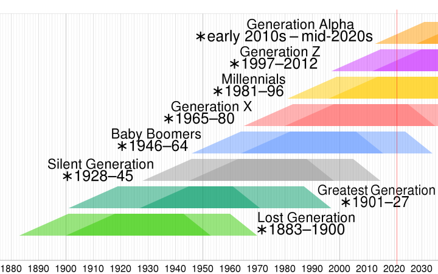

# Z世代、千禧一代、X世代

[【一图看懂】Z世代、千禧一代、X世代的划分和特征](https://zhuanlan.zhihu.com/p/404846629)

最常被提及的几个世代，年龄划分和特征(每一代标签是近 20 年人群态度、动机和历史事件的速记)：
1. 婴儿潮一代(Baby Boomers)
   1. 1946 - 1964
   2. 媒体消费: 电视、广播、杂志和报纸等传统媒体的最大消费者
   3. 塑造事件: 二战后的乐观主义、冷战和嬉皮运动
   4. 金融习惯: 更喜欢到实体银行办理业务，更喜欢使用现金
2. X 世代(Generation X) 
   1. 1965 - 1980
   2. Latchkey一代,MTV一代

   3. 媒体消费: 仍然阅读报纸、杂志、听广播和看电视
   4. 塑造事件: 冷战的结束，个人电脑的兴起，两代人之间的失落感
   5. 金融习惯: 精通数字技术，在网上做一些研究和财务管理，仍然更喜欢亲自进行交易，并表现出品牌忠诚度
3. 千禧一代(Millennials)
   1. 1981 - 1996
   2. Gen Y、Gen Me、Gen We、Echo Boomers
   3. 媒体消费: 95% 的人仍然看电视，但首选是 Netflix、爱奇艺流媒体服务。这一代人对移动设备非常满意，但 32% 的人仍会使用电脑购物
   4. 金融习惯: 品牌忠诚度低于前几代，更喜欢先购买产品和功能
   5. 塑造事件: 大衰退、互联网和社交媒体的技术爆炸
4. Z世代(Generation Z)
   1. 1997 - 2012
   2. i Generation、后千禧一代、Homeland Generation
   3. 媒体消费: 在高度互联的世界中长大，智能手机是他们首选的交流方式
   4. 塑造事件: 智能手机、社交媒体，以及看到他们父母的经济困境(X 世代)
5. 阿尔法一代(Generation Alpha)2013 - 2025
   1. 塑造事件: 全球疫情、社会正义运动、特朗普时代的政治和英国退欧

对营销人员来说是有用的术语，并且往往会逐渐渗透到常见用法中。无论使用什么术语或分组，目标都是向人们传达与其生活阶段相关的营销信息。简而言之，你能做的最重要的事情，就是设法了解想要吸引人群的特征。

