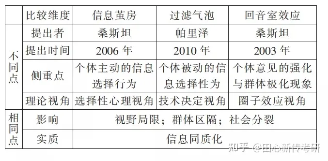

# 回声室效应

## 信息茧房(Information Cocoons)

**信息茧房**这个概念来自美国学者桑斯坦，他在2006年的专著《信息乌托邦——众人如何生产知识》中指出，信息茧房意味着，我们只听我们选择和愉悦我们的东西。而他提出这一问题的主要背景，是数字时代的个性化信息服务的逐步兴起。在桑斯坦看来，人们之所以会陷入信息茧房，是因为科学技术对消费者所读的信息进行了选择与过滤。

## 回音室效应(Echo Chamber)

**回音室效应**来自桑斯坦的著作《网络共和国》。简言之，即信息或想法在一个封闭的小圈子里得到加强。它是指在一个网络空间里，如果你听到的都是对你意见的相类回响，你会认为自己的看法代表主流，从而扭曲你对一般共识的认识。这一效应的存在常常同信息选择密切相关：个人总是倾向于接受协调性的信息而避免那些会带来不协调认知的信息。

## 过滤气泡(Filter Bubble)

**过滤气泡**概念最早由互联网活动家帕里泽(Pariser)2011年在其著作《过滤气泡：互联网没有告诉你的事》(The Filter Bubble: What the Internet Is Hiding from You)中提出。他发现搜索引擎可以随时了解用户偏好，并过滤掉异质信息，为用户打造个性化的信息世界，但同时也会筑起信息和观念的隔离墙，令用户身处在一个网络泡泡的环境中，阻碍多元化观点的交流。

## 异同

相同之处
1. 三者都与受众的选择性心理机制有关
2. 在新媒体环境下，皆离不开算法技术的推波助澜
3. 导致群体极化现象

不同之处
1. **信息茧房**更强调**个体的选择性心理**，即它的形成主要源于**个体主观原因**；**回音室效应**更强调**群体或系统的封闭**以及意见重复形成的**同质化信息环境**，即**客观环境原因**
2. **信息茧房**产生的根源是**个体的选择性心理**，算法推送并非是信息茧房的特殊成因；**过滤气泡**是互联网时代的产物，它更强**调新媒体环境下算法推荐等信息技术的影响**
3. **回音室效应**突出的是人们听到和自己类似的声音，即回音，强调**意见同质性造成的信息窄化**；而**过滤气泡**更强调**社会、技术因素导致的视野窄化**，由**算法构造的过滤器**组成了过滤气泡，每个人的过滤气泡**取决于个人网络生活的属性**，也决定了用户在网上接触的内容

## 总结

都是技术、人性、社会结构等共同作用的结果

三个概念的实质其实都可以归结于“网络信息同质化”，但侧重点有所不同：
1. **信息茧房**强调的是**个体主动的选择行为**导致的信息同质化
2. **过滤气泡**是指**算法推荐**让**个体在不知情的情况**下被动地接收了同质化信息
3. **回音室效应** 强调的是**群体压力导致**的**个体意见强化和群体意见极化**带来的观点同质化的问题。

