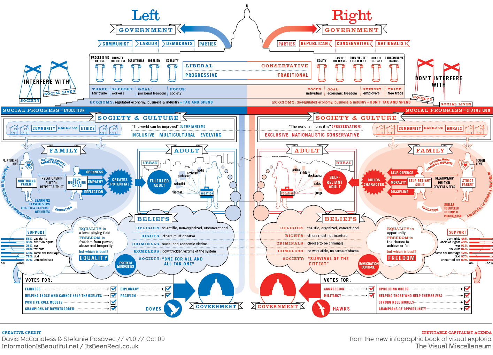

# 左👈&右👉

[toc]

[左派右派什么意思？全网最易懂介绍！](https://www.bilibili.com/video/BV1Fj411y771/)

## 英文词典解释

left    :   efficiency < equality 
right   :   efficiency > equality

理解
1. 西方 : 左派为激进派，右派为保守派
2. 中国 : 左派为保守派，右派为激进派

对应英语词典中（左派为激进派，右派为保守派）
1. Left
   1. 牛津高阶
      1. political groups who support the ideas and beliefs of socialism | （拥护社会主义思想和信念的）左派政治团体，左派
      2. the part of a political party whose members are most in favour of social change | （政党内的）激进派，激进分子
   2. 韦氏
      1. (often capitalized) those professing views usually characterized by desire to reform or overthrow the established order especially in politics and usually advocating change in the name of the greater freedom or well-being of the common man
      2. (often capitalized) a radical as distinguished from a conservative position
2. Right
   1. 牛津高阶
      1. political groups that most strongly support the capitalist system | 右派组织（或政党）
      2. the part of a political party whose members are most conservative | （政党内的）保守派
   2. 韦氏
      1. (often capitalized) individuals professing support of the established order and favoring traditional attitudes and practices and conservative governmental policies
      2. (often capitalized) a conservative position

## Political Spectrum

## 各国情况

中国
1. 左派“左”倾激进主义(王明左倾教条主义错误(导致长征)、大跃进、文革)
2. 左派(中国共产党，代表工农群众利益) 革命 进步
3. 左派右倾机会主义(陈独秀) 倒向中间势力
4. 中间势力(民族资产阶级(既联合又斗争)、富农(限制富农))
5. 右派左翼同情工农(宋庆龄)
6. 右派(中国国民党，代表大地主大资产阶级利益) 保守 反动
7. 右派右翼极端反动(蒋介石、汪精卫)

以女权为例
1. 左派左倾 女性至上
2. 左派(进步) 男女平权
3. 左派右倾 心里支持平权，现实中妥协忍受大男子主义
4. 右派左翼 嘴上支持平权，行动上奉行男权至上
5. 右派(保守) 男权至上
6. 右派右翼 物化女性

美国
1. 民主党 是 左翼政党，主张平权，重视环保，施行全民医保
2. 共和党 是 右翼政党，保守党派，鼓吹美国至上、白人至上、驱逐非法移民

英国
1. 工党   代表 劳动者的利益，属于左翼
2. 保守党 代表 资产阶级，划分为右翼

但美国不管是民主党还是共和党，英国无论是工党还是保守党，相对社会主义而言，都是右派

法西斯是极右翼主义

德国右翼政党选择党民粹主义浓厚，要求加强边境管制，不要让难民进入德国境内，主张退出欧盟

日本
1. 右翼分子指那些依然崇尚军国主义的保守顽固分子，最著名右翼政治家是石原慎太郎，参拜靖国神社，美化日本侵略历史
2. 左翼政治家则是强调对历史进行反省的，比如村山富市、福田康夫两位首相

## 看懂“左派/右派、左倾/右倾、左翼/右翼”

[看懂“左派/右派、左倾/右倾、左翼/右翼”](https://www.bilibili.com/video/BV1bw411Y7xK/)

[一文搞懂“左派/右派、左倾/右倾、左翼/右翼”](https://zhuanlan.zhihu.com/p/548302086)

起源 : 法国大革命
1. 左侧是激进的革命党人，主张平等、反对君主制、支持共和、反教权
2. 右侧是保王党，维护天主教会和贵族利益、维护资产阶级者的利益、守护传统价值

左派/右派 是方向之分
左倾/右倾、左翼/右翼 是同方向的路线之分

左派/右派属于国际政治一级分类
1. 左派主张积极改革
2. 右派主张稳妥、渐进、秩序、缓慢改革

左倾/右倾是左派的二级分类(在社会主义立场上存在认知偏差)
1. 左倾是指在政治上追求进步，同情劳动人民
2. “左倾”是指政治思想超越客观，脱离社会现实条件，陷入空想、盲动、冒险的倾向，急于求成，主观的夸大革命力量，轻视敌人力量和客观困难
3. 右倾是指政治思想上认识落后于实际，在革命斗争中过高估计敌人力量，过低估计革命力量，在实践中发展为右倾机会主义和右倾投降主义，斗争中往往放弃原则，牺牲无产阶级根本利益而求得妥协

左翼/右翼是右派的二级分类(在自由资本主义立场上存在认知偏差)
1. 左翼提倡社会公平，增加社会福利，改良资本主义弊病，在政策上给工人阶级带来实惠，缓和资产阶级与工人阶级矛盾
2. 右翼支持自然竞争，反对增长社会福利，反对资本主义改革，维持旧有的自由市场经济体系

左 : 支持平等原则，限制权贵富裕阶层，倡导社会资源分配平等，社会财富向多数人倾斜，缩减贫富差距，主张政府干预经济，反对资产阶级独大、垄断；

右 : 追求自由主义，最大限度地为权贵松绑，倡导利己主义，能者多得，反对政府干预经济，维护既得利益者的地位，拒绝以高福利政策滋养闲人。

“左”和“右”的界限逐渐模糊
1. 老牌资本主义国家为了维持社会稳定，引入**左派**相关理念，构建福利社会、缩减贫富差距、适当进行政府干预等
2. 社会主义国家也开始逐渐引入**右派**相关理念，诸如开放市场经济、国有企业改革、适当放宽经济干预等

