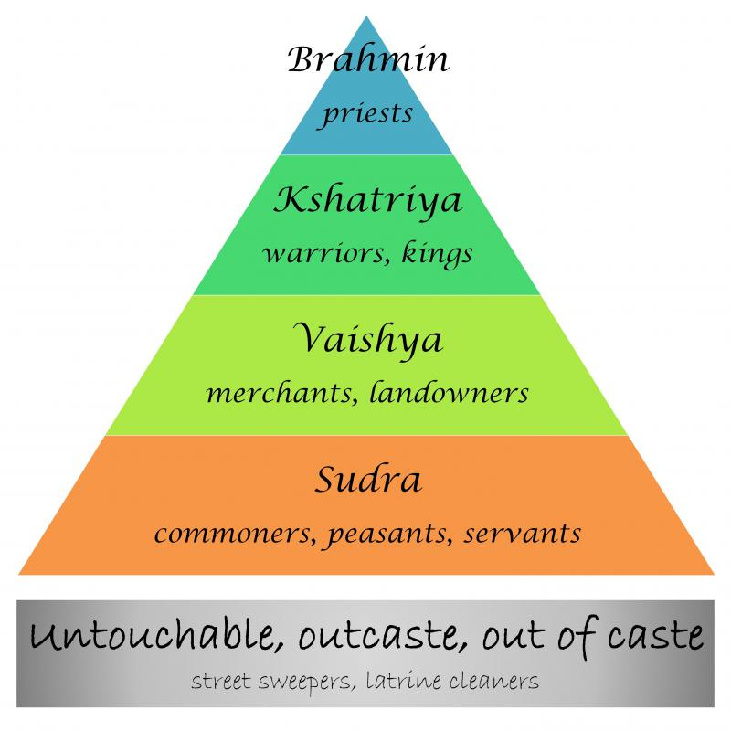
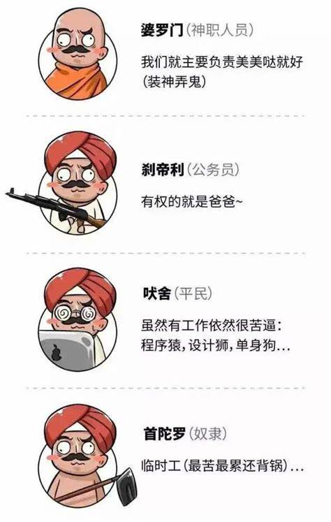

# The Caste System In India 印度社会种姓制度

种姓制度分层
1. Brahmin 婆罗门    : priest 神父，教士
2. Kshatriya 刹帝利  : warrior king
3. Vaishya 吠舍      : merchant,landowner
4. Sudra 首陀罗      : commoner平民,peasant农民,servant,labor
5. Untouchable 贱民  : street sweeper,lantrine公共厕所 cleaner

a system of dividing Hindu society into classes, or any of these classes

a division of society based on differences of wealth, inherited rank or privilege, profession, occupation, or race

