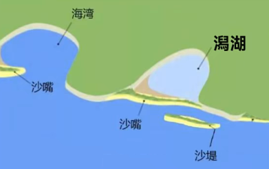

# Background Knowledge

[toc]

# 最实用的托福背景知识 (Professor Dave)

## 01 心理学简介

### Introduction to Psychology

take a deep dive into
neurons
action potentials(动作电位 nerve impulse)
neurotransmitters(神经递质)
makes sense of that information
consciousness(觉察；感觉；意识)
from the standpoint of
anatomy(解剖学)
physiology(生理学)
beyond elucidation(阐明)
enter the realm(领域) of psychology
intangible(无形的)
mind affects our behavior
morality(道德准则)
superstitious(迷信的)
prerequisite knowledge(预备知识)

### A Brief History of Psychology

what we consider to be psychology today is very different than what was considered to be psychology in the past
speculate(推测) on the nature of the mind and soul
the most prominent( 重要的；著名的；杰出的) figures
ancient Greek philosophers
Plato(柏拉图) and Aristotle(亚里斯多德)
psyche(灵魂；心灵；精神；心态)
emphasize observation and reason
develop through the renaissance(文艺复兴)
Cartesian(笛卡尔的) dualism = mind-body dualism
immaterial/physical substance
pineal gland(松果体) = pine tree(松树)
endocrine(内分泌) system
experimental psychology laboratory
grow into multiple schools of thought and fields of study
structuralism(结构主义) = all psychological processes are made of basic elements or structures
research participants
introspection(内省；反省)
functionalism(功能主义) = consciousness is a continuous and changing mental process
form relationships
psychoanalysis(精神分析) = unconscious thoughts and forgotten memories control literally everything
1. instincts(本我) = primitive desires = sexural and aggressive drives
2. reality(自我) = mediate between the other 2 parts
3. morality(超我) = moral conscience(良心；良知)
subscribe to(赞成)
in a scientific context(在科学背景下)
behaviorism(行为主义) = only studying observable behaviour
classical conditioning(经典典条件反射)
Pavlov(巴甫洛夫)
salivate(垂涎，流口水)
cognitive psychology = the study of internal 
developmental psychology

### Methods of Testing in Psychology

test the hypotheses
case studies = a detailed description about the behaviour of a single person or small group of people = be used to generate hypotheses for future experiments
no initial hypothesis
frontal lobe(脑叶) of the brain
observation = watching people in different scenarios(设想；方案；预测) and taking note of their behavior
get a glimpse of mind through behavior
self-report = questionnaires regarding feelings/thoughts = easy/inexpensive/quick
experimentation = isolating and manipulating(控制，操纵，影响) variables in order to measure the outcome
independent/dependent variable
control/experimental group
ensure the experiment is ethical(合乎道德的)
skin conductance(皮肤电导)
measure levels of stress hormones(激素；荷尔蒙)
in saliva samples(唾液样本)
eye-tracking devices
WEIRD population in psychology
1. western
2. educated
3. industrialized
4. rich
5. democratic
most studies are performed on these people
generalized to the entire world
moral decision making, fairness and visual perception

### Imperfect Perception

sensation = how we acquire information
basic sensory information through senses
smell/taste/hearing/touch/sight
molecular entity(分子实体)
transduce(转换) the raw information
mental representation
on a day to day basis
be easily fooled by illusion
Gestalt Laws of Grouping(格式塔组织原则)
1. proximity - cohesive object
2. similarity - differentiate between adjacent and overlapping objects
3. closure - mind tend to complete figures (incomplete or partially hidden) - recognize patterns and fill in mission info
4. good continuation - objects intersect with each other - continue the contours
5. common fate - move in the same direction - a large flock of birds
6. good form - tendency to perceive objects in the simplest way possible
susceptible(易受影响) to a variety of visual illusions due to visual context and expectations
language relativism = Linguistic relativism = Sapir-Whorf Hypothesis
thirsty -opp- quench
infuse(使具有，注入) bias at times(有时；间或)
creep in(开始发生（或影响）)

### The Psychology of Emotion

emotions are subjective(主观的) experiences
emotions are distinct from sensory expericen
James-Lange Theory(詹姆斯-兰格理论)
external stimuli like sensory experiences lead to psychological reaactions that we interpret as an emotion
psychological state
1. subjective experience - how you perceive an event
2. psychological response - how your body actually responds to an experience
3. behavioral response - how you actually express emotion
emotion & mood
1. emotion - short-lived & more intense & have an identifiable cause
2. mood - mild & long-lasting & hard to determine the specific event
an excerpt(摘录；节选) from the paper
clawing(抓，撕，挠) and hissing(发嘶嘶声)
six basic emotions = happiness/surprise/anger/disgust/sadness/fear
put another toe out of line(再犯任何的错误)
the validity of universal emotions
innate(天生的；先天的；与生俱来的)
congenitally(先天的；天生的) blind athletes
hate, grief and jealousy
engage in aggressive behaviour
depict a disgusting surgical(外科的；外科手术的) procedure
high/low-arousal(高唤醒) emotions

### Introduction to Developmental Psychology

# Coral Reef

[考场真题详解 | 重点难题分析解读——珊瑚礁篇 - 知乎](https://zhuanlan.zhihu.com/p/411813085)

珊瑚礁(Coral Reef)指的是珊瑚群体死后的遗骸(remains)所构成的岩体

珊瑚礁的主体是由珊瑚虫(Polyp)组成的

种类
1. 岸礁(fringing reef)
2. 堡礁(barrier reef)
3. 环礁(atoll)

珊瑚从一个下沉的陆台向上生长就可以实现一种珊瑚礁演变成另一种，并且演变还有一个顺序，即岸礁会先经历变为堡礁的阶段，然后随着堡礁的中心岛屿因沉降而消失，就只剩下了一个被珊瑚环绕起来的泻湖或者说环礁

# Lagoon 潟湖(泻湖)

潟 - 盐水浸渍的土地

潟湖 - 海边的湖泊，与海洋之间有隔离物(沙滩、沙嘴)

