# GRE 公开课

# 改革

[GRE旧版VS新版](https://www.bilibili.com/video/BV1cV4y1S7px/)

总时间 4h -> 2h

取消写作 argument 仅保留 issue

语文数学 : 40 -> 27

语文41min完成，数学47min完成

无加试及中间休息

# 真经GRE小白入门课

[真经GRE小白入门课](https://www.bilibili.com/video/BV13y4y1o7ST/)

## 阅读

170 + 170 + 6

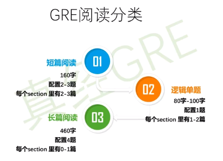

机考 verbal 左文章，右题目

体型
1. 单选题 5选1
2. 不定项 没有半对，错选漏选都不得分 3个选项
3. 在文中选句子回答问题

要保证作对的题目数量多

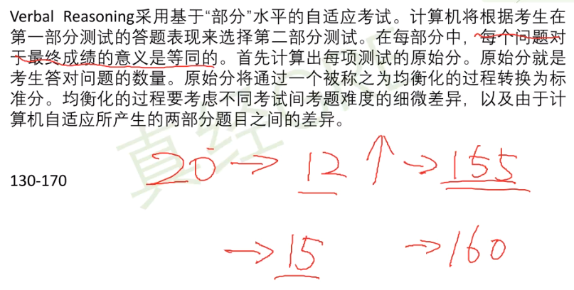

做题顺序
1. 写作
2. 数学/英语
   1. 若是数学 QVQV
   2. 若是英语 VQVQ

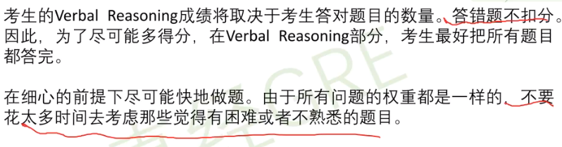

verbal 有两个可能性 长文章不是必考
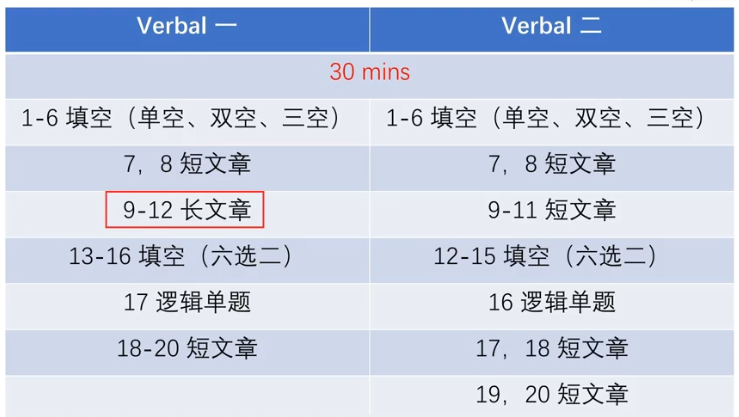

6选2 等价词

30分钟 过时不候

做题速度
1. 10分钟填空
2. 20分钟阅读

GRE阅读 -> 题型导向

填空对词汇量要求大

阅读要在原文中找到依据

读得懂、读得快、记得住

备考资料
1. 阅读机经，有可能碰到原题
2. 不要做模考题

语法 -> 分析长难句

双定位

**注意主语**

不要过度解读

## 数学

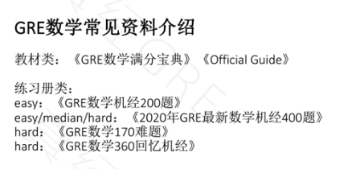

OG 太简单了 不推荐

题型介绍
1. 比较大小
2. 单选
3. 不定项选择
4. 填空

知识体系
1. 算数
2. 代数
3. 几何
4. 统计

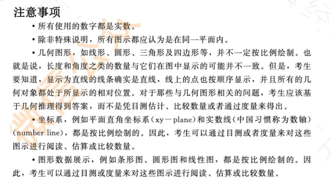

所有数字都是实数

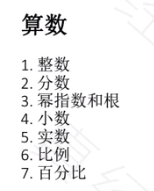

0也算偶数

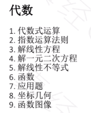

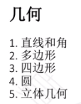

### 单词解释

mode 众数
median 中位数(偶数个取中间两个的平均值)
average 平均数

perimeter 周长

conjecture 推测

prime number 质数

factor 因数

rhombus 菱形

range 极差(最大值-最小值)

standard deviation 标准差(需要知道每一个数的具体大小)

percentile 百分位数

quartile 四分位数

unit digit 个位数

## 填空

五选一 六选二

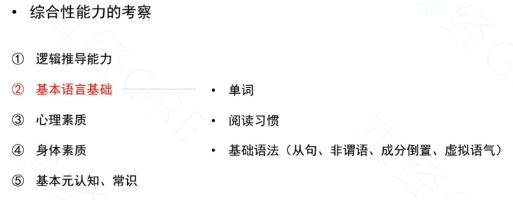

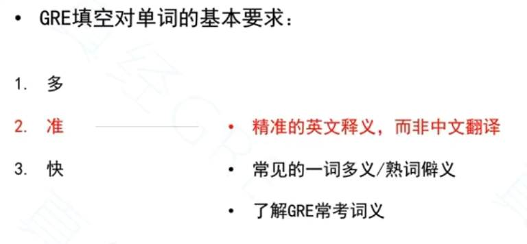

熟词辟意

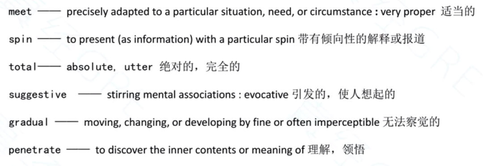

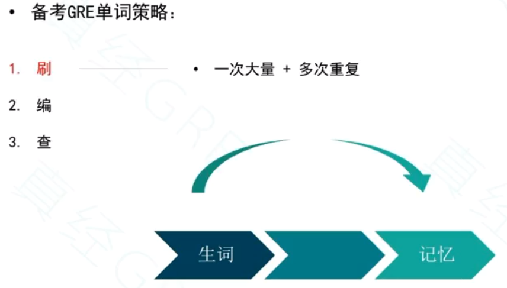

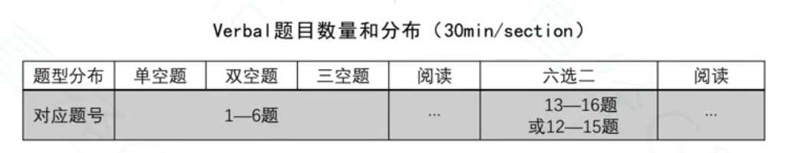

六选二两个选项要使得句子语义接近

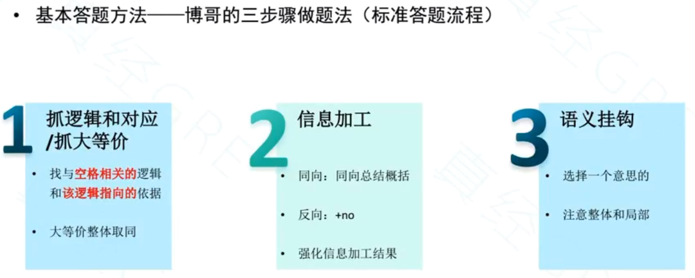

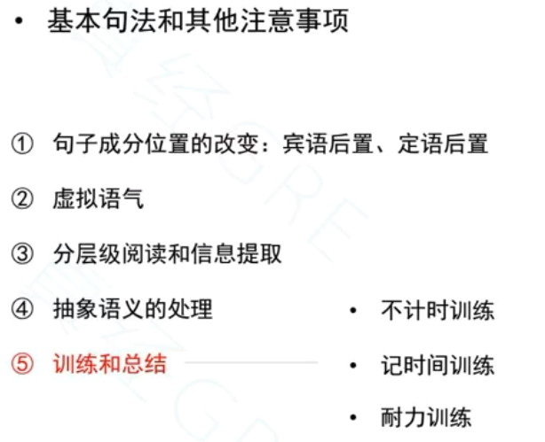

### 难词理解

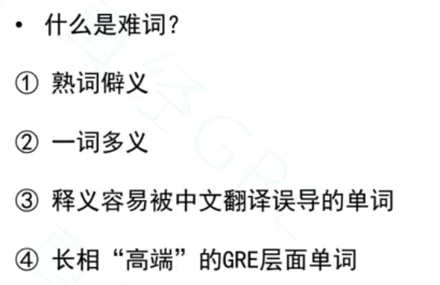

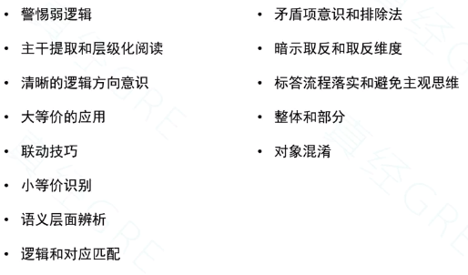

不要把可能当成必然

## 写作

450 - 500 词

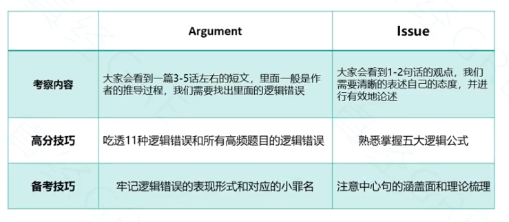

# GRE外教小班2020年新

[GRE外教小班2020年新](https://www.bilibili.com/video/BV1vD4y1m7yr/)

# 《GRE/GMAT/LSAT长难句300例精讲精练》

[《GRE/GMAT/LSAT长难句300例精讲精练》](https://www.bilibili.com/video/BV1iC4y1H7AK/)

## 《GRE核心词汇一本通》

[《GRE核心词汇一本通》](https://www.bilibili.com/video/BV1u3411W7ir/)

## 黄颀讲GRE填空

[黄颀讲GRE填空](https://www.bilibili.com/video/BV19J411E7nT/)

