# 英语语法

**目录**
[toc]

# 001 英语从句 Clause

[所有英语从句, 一个视频合集搞定 --- 英语兔](https://www.bilibili.com/video/BV1764y1f7nq/)

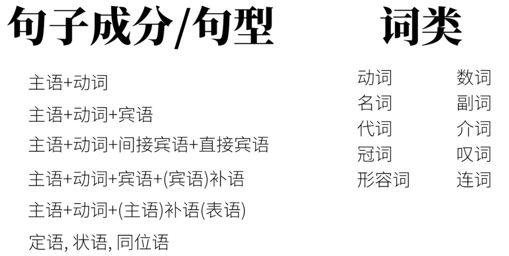

英语的三种句子
1. 简单句 simple sentences --- 不能再拆
2. 复合句 compound sentences --- 不分主次
3. 复杂句 complex sentences --- 主句+从句
   1. 主句 main clause
   2. 从句 subordinate clause --- 充当句子成分

除了**谓语动词** 其他全部句子成分都可以由从句充当

## 形容词性从句 == 定语从句 == 关系从句

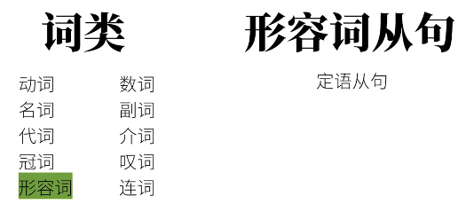

后置形容词从句

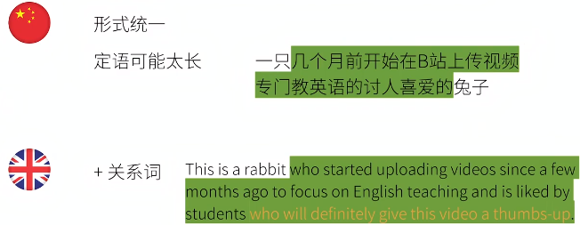

形容词从句的构成
1. 关系词
   1. 关系代词 
      1. the rabbit is eating a carrot that(关系代词) I bought
   2. 关系副词 
      1. this is the place where(关系副词) the rabbit ate the carrot
      2. this is the reason why(关系副词) ...
      3. that was the day when(关系副词) ...

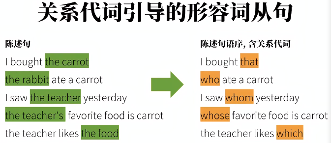

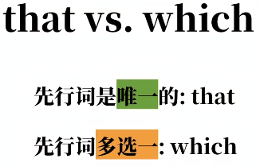

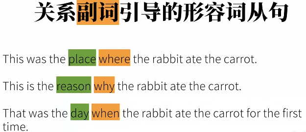

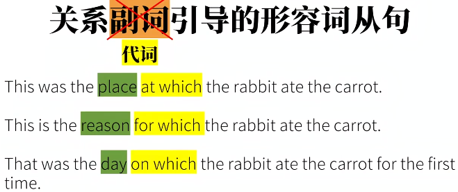

**关系副词 = 介词 + which**

限定性和非限定性
1. 限定性形容词从句
   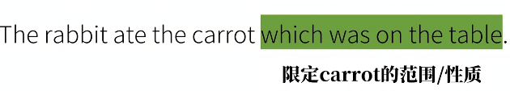
2. 非限定性形容词从句 一前一后两个信息
   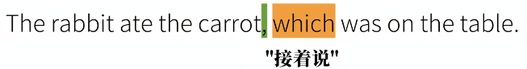

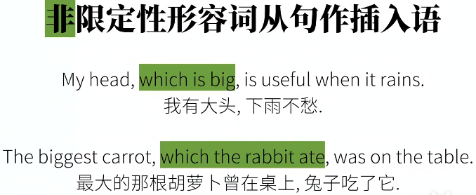

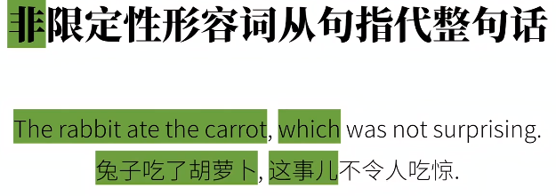

## 名词性从句

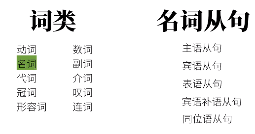

### 主语从句

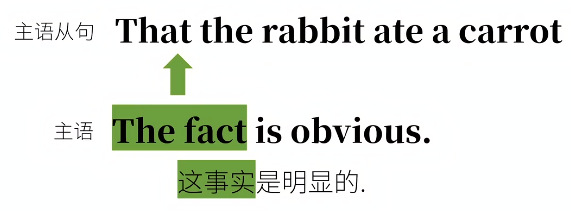

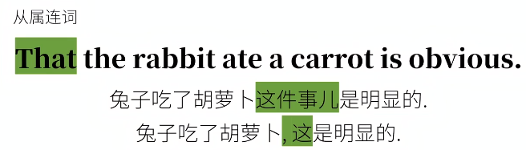

确定信息和不确定信息都可

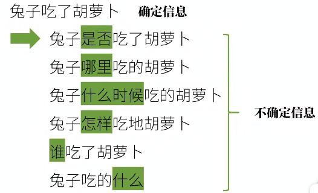

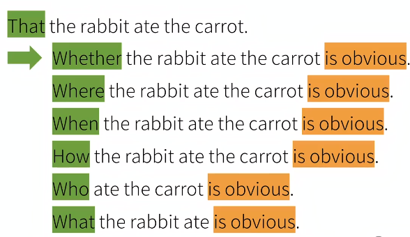

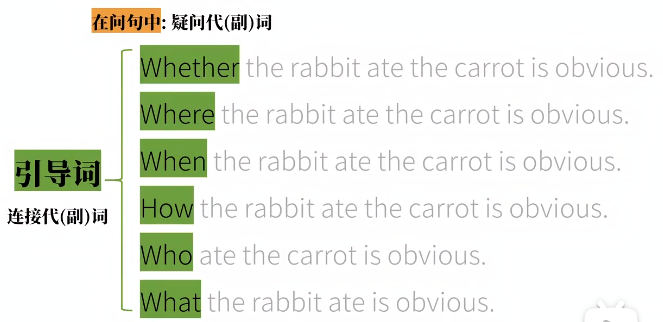

形式主语

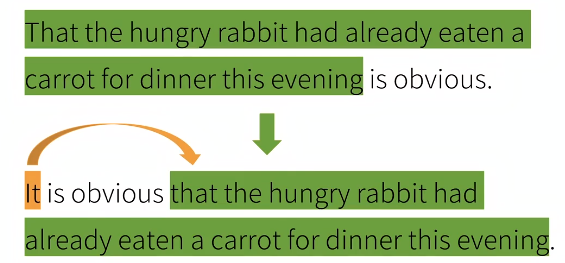

后面的从句才是真正的主语

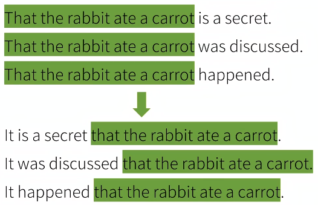

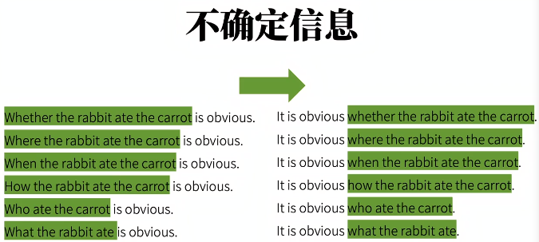

### 宾语从句

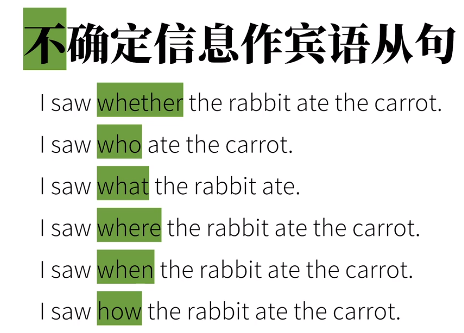

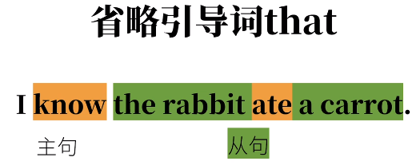

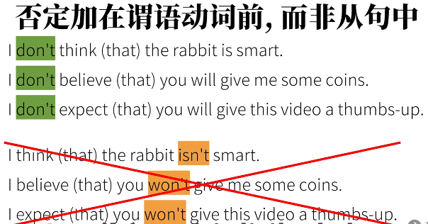

一般 **主语时态 = 宾语从句时态**

### 表语从句 == 主语补语从句

(连)系动词 linking verb

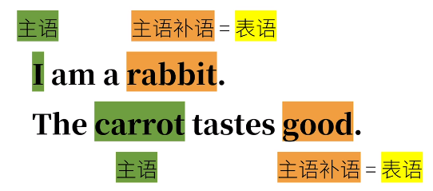

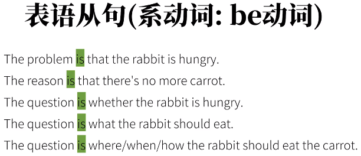

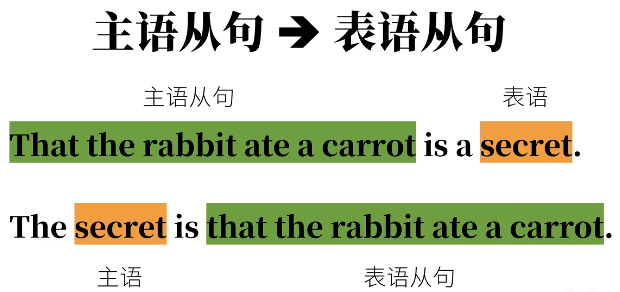

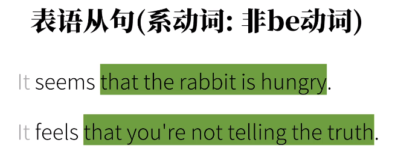

### 同位语从句

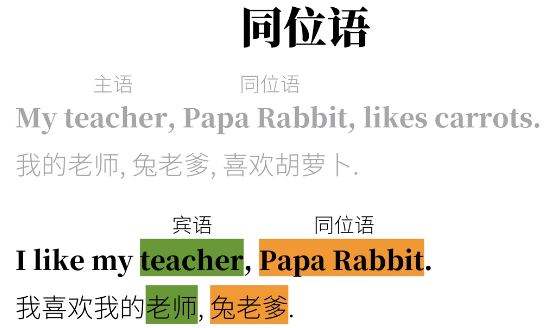

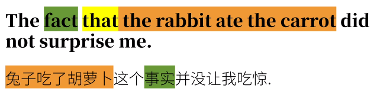

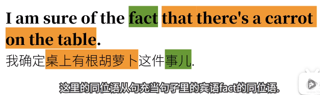

### 宾语补语从句

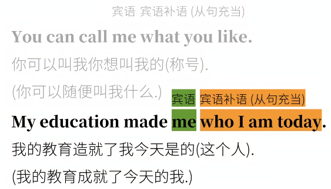

## 副词性从句 == 状语从句

补充说明形容词、动词、副词

状语可能性多

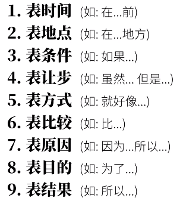

### 表时间

**before**

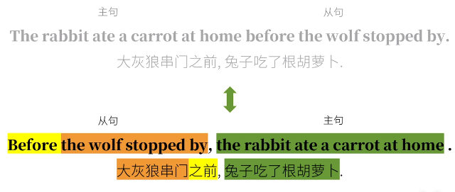

如果从句在前，要加逗号方便断句

**when(时间点) while(时间段) as(同时)**

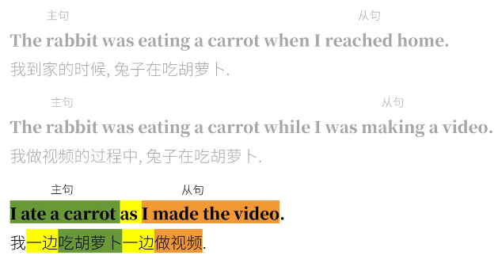

**after**

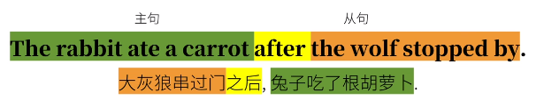

**since** 完成时态

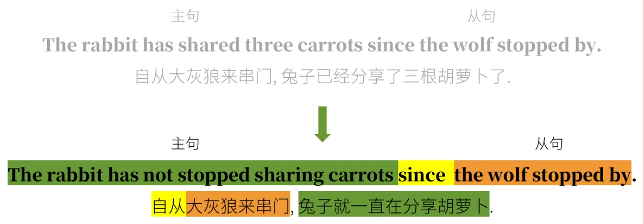

**until**

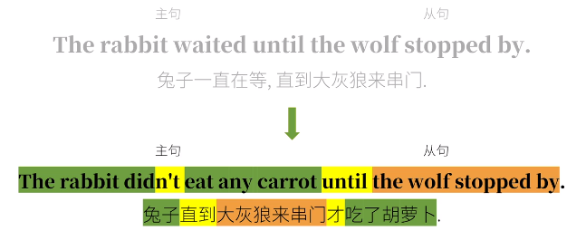

**as soon as**

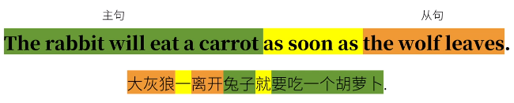

**the next time**

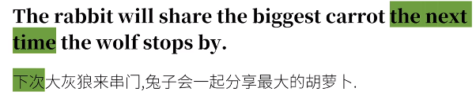

### 表地点

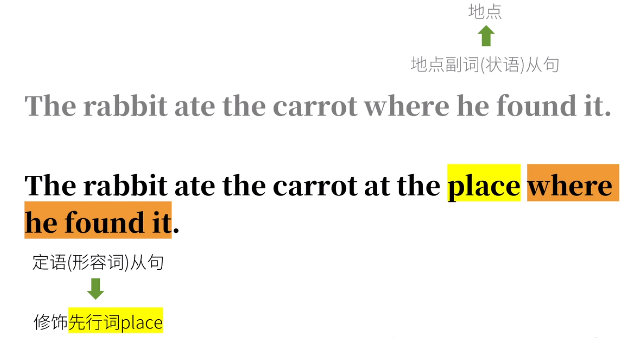

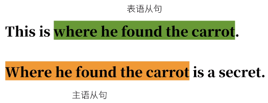

光看到引导词where还不能确定是哪种从句

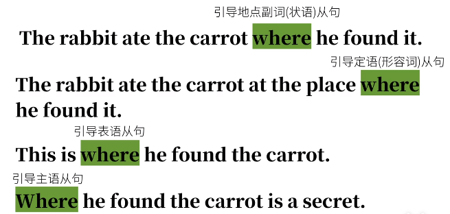

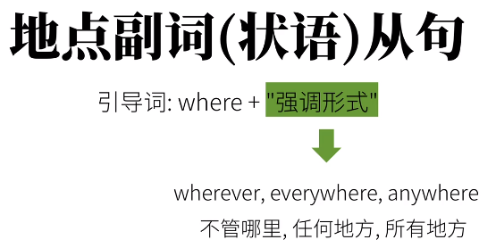

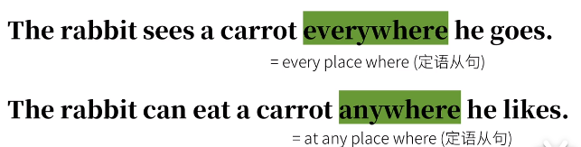

### 表比较

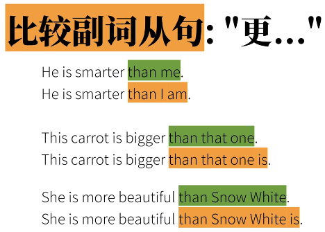

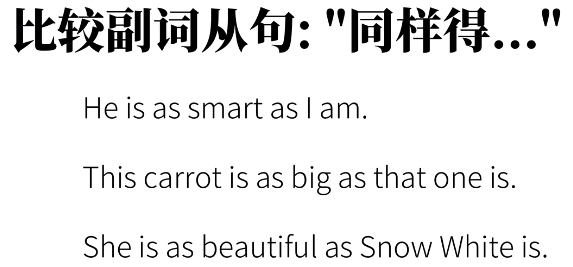

### 表条件

### 表让步

### 表方式

### 表原因

### 表目的

### 表结果

# 002 that 引导的 定语从句 & 同位语从句 辨析

区别
1. 同位语从句(解释内容)
2. 定语从句(修饰，限定范围)

The news that he lost the game is true. 同位语

The news that you told me is true. 定语

