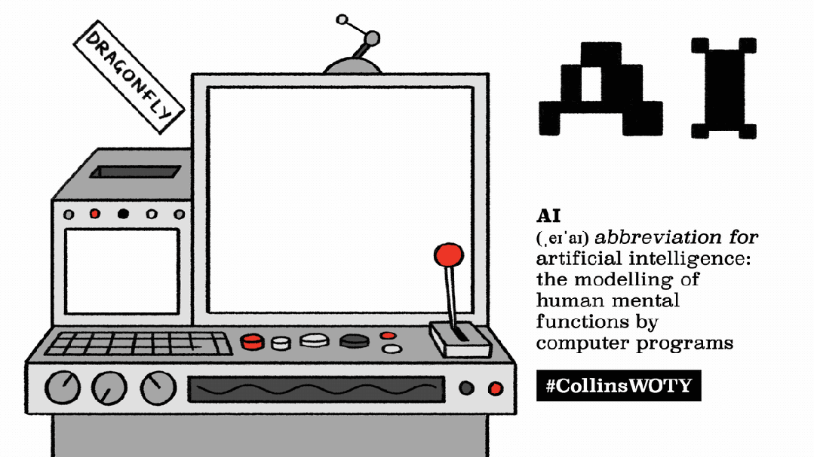
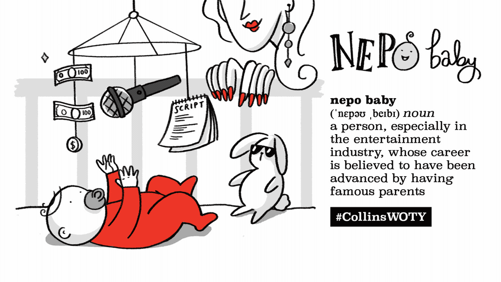
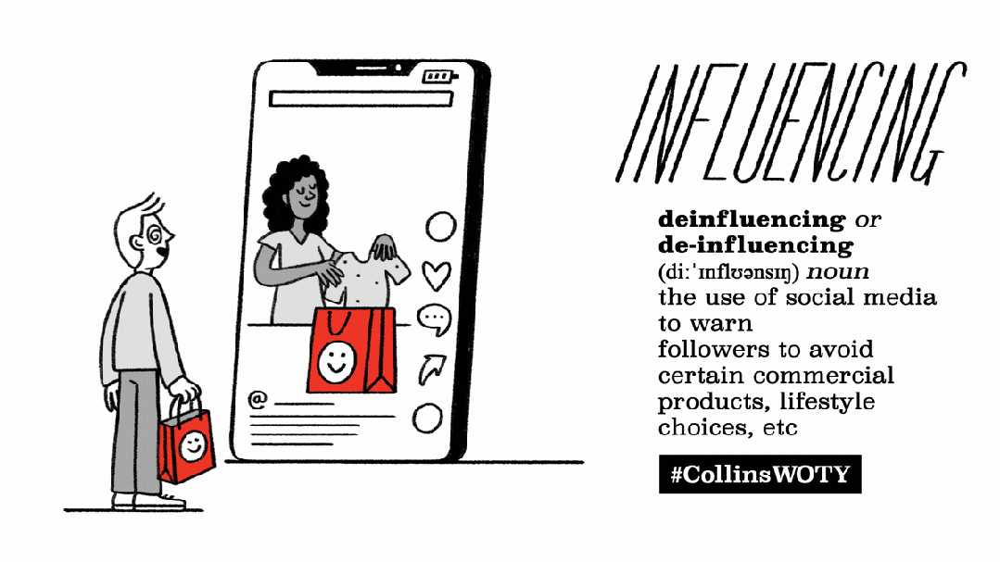
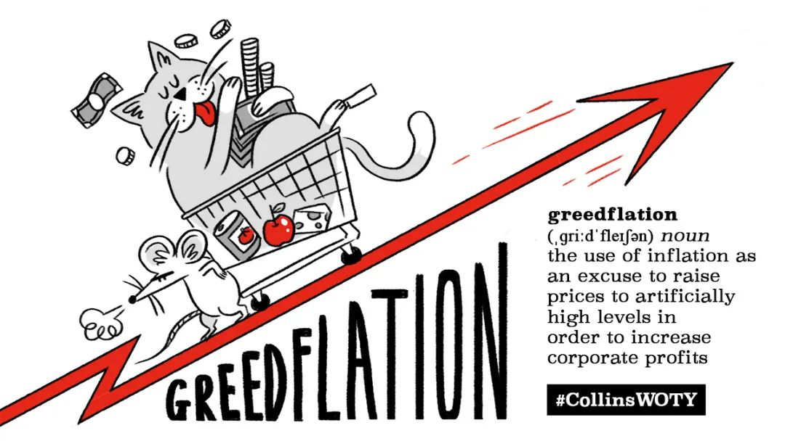

# 外刊记录

[toc]

## 20240120 Mourning China's boom years

[Mourning China's boom years](https://zhuanlan.zhihu.com/p/677682120)

## 20240119 China is NOT What I Expected

[China is NOT What I Expected](https://www.youtube.com/watch?v=b5FtjD2I8es)

rich in culture

famous for hard-working people and ancient history

be limited to what I have heard

maglev = magnetic levitation

drool流口水

omelet煎蛋卷

a peek一瞥 into daily life

roller coaster过山车

stroll around闲逛 = wander = amble

dig a little deeper into

scallion = green onion

soy sauce酱油

bun小圆面包

cameras on literally every single corner

general friendliness

payment methods

meat skewer肉串

mush软稠的一摊；糊状物

alleyway小巷；窄街

bubble tea珍珠奶茶

whipped cream

smoothie水果沙冰；鲜果奶昔

worries fizzle out成为泡影

genuine moment of joy and achievement

outside of our comfort zones

throw ourselves into the unexpected

defy the warnings

the heartbeat of a country

be rewarded with beautiful experiences

hospitality

gracious welcome

soaring skyscrapers

bustling streets

entrepreneurial activity

## 20240118 "Little Luxuries": The affordable treats driving consumer spending

[Economic Downturn](https://www.bilibili.com/video/BV1f5411i7ZH/)

pros and cons

the data of traveling and consumptions

reportedly have bounced back

economic downturn

consumption downgrade

eyebrow pencil

litter luxuries

the affordable treats

drive consumer spending

stave off避开，推迟 a recession

tighten the belt

surge = skyrocket = hike = spike = soar 激增

prolonged economic uncertainty

lipstick index口红指数

relative affordable splurges乱花钱；糟蹋钱；挥霍

small cosmetics and perfumes

budget-conscious consumers

big-ticket items大件

sluggish萧条的

encompass包含

drive robust growth

luxury-feeling products

tap into进入、利用 re-sale market

a broad sector of 广泛群体

snap up抢购

fall through失败 due to the disagreements on pricing

slack off摸鱼 on training

struggle with the upcoming challenges

roll out推出、发布 new product line

lay out布局 the schedule

lay out the budget

## 20240118 How reading can change our lives ? - TED

[How reading can change our lives?](https://www.bilibili.com/video/BV1494y1T7S1/)

lagging/leading indicator

stock price

franchise特许经销权 value

proprietary专卖的；专营的

a lonely, idiosyncratic异质的 undertaking事业

fill the void

feel racially conscious

indict起诉

conviction判罪

fight for the right to vote

Mississippi Delta

segregate隔离

guidance counselor辅导员

introspective内省的

depressing

zealous optimist

have a prestigious有威望的 law degree

progress/regress

mysterious and gorgeous

teach oneself to read and write

put sb in a kind of panic

school days

free of worry

run away with 相信

chancy有风险的；不确定的

earn the living

avenge-为他人复仇
revenge-报私仇

## 20240118 Maximizing your Personal Brand-Communicating Who You Are to Help Get What You Want

[最大化你的品牌, 如何建立个人品牌?](https://www.bilibili.com/video/BV1tC4y1Y7TG/)

economic benefits and disadvantages

measure quantifiedly

make rational/irrational choices

parents view

commitment

sports apparel运动服装

consultant speaker

personal brand

brand equity品牌资产

synonym for reputation

trademark

dive into

reputation managemnet

methodology

mirror back

in your industry or field

strategic thinker

package up

share a passion for strategic communication

stategic leverage杠杆作用

add some insight

feel intimidating令人胆怯的

who you are jealous of

jealousy can be a clue

stick pins in the voodoo doll巫毒娃娃

resonate and connect with

create the outline

kill two birds with one stone

take advantage of leverage

fear of missing out害怕错过心理

come up with the concept

tactical

put myself in situations

guiding principle/passion

develop expertise

put a stake in the ground认真对待

have the integrity of legitimate knowledge

at a fundamental level

a recognized公认的 expert

at scale大规模

content creation

intellectual property

amplification device

social proof

in the next step in their career

expand ones purview视野

take on more responsibility

Silicon Valley

theoretically encourage

discretionary自行决定的；酌情行事的；便宜行事的 activity

ubiquitous似乎无所不在的；十分普遍的

muck around游手好闲；游荡

set the agenda

a big chunk of time

keep developing myself

unfold逐渐展现；展示；透露

assiduous 兢兢业业，勤勤恳恳

per se 本身；本质上

career-centered

deep diving into

Barack Obama

emotions are contagious

control own physiology

demeanor外表；风度；行为；举止

## 20240110 Character.ai: Young people turning to AI therapist bots

[Character.ai: Young people turning to AI therapist bots](https://www.bbc.com/news/technology-67872693)

therapist 临床医学家；治疗师；物理治疗

persona n.角色；人物

create chatbots based on fictional or real people

be more in demand than

help with life difficulties 帮助解决生活中的困难

San Francisco Bay area firm

more interested in role-playing for entertainment

by far the most popular mental health character

sharing glowing reviews 分享热情洋溢的评论

be really positively affected by

utilize it as a source of comfort

in his words

the emerging trend of AI therapy and why it appeals to young people

less daunting than picking up the phone or having a face-to-face conversation

fails to gather all the information a human would and is not a competent therapist

high levels of mental ill health and a lack of public resources

odd place for a therapeutic revolution to take place

chat logs are private to users

the underlying technology called a Large Language Model (LLM)

LLMs act like predicted text messages by stringing words together in ways in which they are most likely to appear in other writing on which the AI has been trained

site is rated mature because of its sexual nature

psychologists warn that AI bots may be giving poor advice to patients

have ingrained biases against race or gender

tentatively accept them as tools to be used to help cope with high demands on public services

## 20240109 First major renovation of Inner Ring Road underway

underway 已经开始；在进行中

busy traffic flow on Inner Ring Road

orbital motorways encircling downtown areas

help reduce traffic volume in urban cores and connect suburbs with efficient travel

launch a major facelift 翻新，整修

circumferential 

change the traveling mode of local citizens from the ground to the overhead road

a dividing line for the city's housing prices

it comprises the city's main traffic network

a trial project for a complete facelift

a demonstration for ensuing renovations of its old infrastructure facilities

the surging number of cars has damaged bridge structures and put great pressure on its maintenance

structures will be reinforced and cracks will be fixed

ancillary辅助的；补充的 facilities

be upgraded with cutting-edge technologies

be integrated more harmoniously into the surroundings

refurbish 再装修；清理装修

prefabricated 预制的；用预制构件组装的

cause no congestion on nearby roads

the opening of the Pudong section

at the top of the city government's agenda

to facilitate rapid urban development and relieve major traffic jams in the downtown area

effectively prevented traffic congestion in downtown areas by distributing a large among of vehicles

## 20240109 Super spreader mall ordered to close up shop

Super spreader 超级传播者

suspend operations

be subject to further judicial investigations 司法调查

lax不严格的；不严厉的；马虎的 anti-virus measures

QR code (Quick Response Code)

examine their health information

be listed as a medium-risk area

## 20240109 Mandarin - 满大人？

英文 Mandarin (中国国语/官话/普通话/华语) 源自葡文 Mandarim ，而葡文 Mandarim 源自马来文 menteri (朝臣、部长)，而马来文 menteri 又源自梵文 mantrin (部长)

Mandarin 绝非甚么「满大人」的音译，当时满洲人尚未入关，中原还是大明的天下，而且当时满洲族仍称女真族，满洲族之名是皇太极改后金国号为清时一并改的

十六世纪末至十七世纪初的来华传教士利玛窦就用 Mandarim 的拉丁文转写 Mandarinos 来称呼明朝的官员，尤其是与他交好的士大夫

Mandarim在清初时有了引申义：由单纯指中国官员，变成兼指中国官员所说的语言，即中国官话。后来引申义变得比原义更通用。

## 20240103 It's harder to save money than it was in the past

In my opinion, saving money has indeed become more challenging compared to the past. And there are several factors contributing to this issue.

Firstly, the cost of living has significantly increased over the past decade. Housing, eduction, healthcare are all becoming more and more expensive and you can not

 really save money in these areas. It seems that the inflation is always faster than the increase of your income.

Secondly, nowadays people are constantly exposed to new products and services on the Internet. When you are surfing on TikTok or simply reading an article, you will inevitably see a lot of ads which will trigger your desire to buy stuff that you do not actually need.

In conclusion, it is much harder to save money in the modern era.

## 20240102 Inflated Hopes - Japan's economy

animal spirits 野性精神

long-awaited opportunity

be giddy about 发狂，举止反常

build up big holdings股份

asset manager

pilgrimage朝圣

prime minister首相

dent损害，伤害 investors' optimism

false dawn黎明

bubble bursting

deflation， low inflation， stagnation

identify promising signs of change

the sun peep露出 over the horizon

the most palpable可感知的 shock

duly适当地；恰当地

audacious大胆的 monetary货币的 easing宽松

albeit尽管；虽然

a healthier cycle of wage and consumption growth

geopolitical地理政治学的

spur a new wave of investment

reconfiguration of regional supply chains供应链

corporate-governance reform 公司治理改革

a promising new phase

institutional investors机构投资者

put pressure on

policymaker，executives，politicians

nurture the green shoots of dynamism

unwind放松 unorthodox非传统 monetary policies

suffocate（使）窒息而死 the nascent新生的 inflation

highly indebted government

versed精通的

at the substance

status quo现状；原来的状况

maneuver操控

hoard贮藏 cash

turn words into deeds

revise tax codes

zombie incumbent在职者；现任者

risk-taking investors

behind the wheel

convertible活动顶篷式汽车

way back in xxxx

way better

in hindsight

see the light of day

hit a bullseye 直中靶心

effusive太动感情的；奔放的

## 20231205 Oxford’s 2023 Word of the Year Is ... 'Rizz'

'Rizz' — Gen Z slang俚语 for 'style, charm or attractiveness,' or 'the ability to attract a romantic or sexual partner'

Rizz 被定义为风格、魅力或吸引力，或者一个人浪漫、罗曼蒂克、吸引性伴侣的能力

rizz是charisma「个人魅力」的缩写 abbreviated form to come from the middle

beat out 击败

contenders like situationship情境关系, 提示词, de-influencing逆流 and Swiftie(Taylor swift 的粉丝名)
1. **prompt** : An instruction given to an artificial intelligence program, algorithm, etc., which determines or influences the content it generates.
2. **situationship** : A romantic or sexual relationship that is not considered to be formal or established.
3. **Swiftie** : An enthusiastic fan of the singer Taylor Swift.
4. **beige flag** : A characteristic suggesting a partner is boring or lack originality
5. **de-influencing** : The practice of discouraging people from buying particular products, or of encouraging people to reduce their consumption of material goods, esp. via social media.
6. **heat dome** : A persistent high-pressure weather system over a particular geographic area, which traps a mass of hot air below it.
7. **parasocial** : 大众与媒体人物之间的一种单方面关系 Designating a relationship characterized by the one-sided, unreciprocated sense of intimacy felt by a viewer, fan, or follower for a well-known or prominent figure (typically a media celebrity), in which the follower or fan comes to feel (falsely) that they know the celebrity as a friend.

牛津 Oxford
科林斯 Collins
韦氏 Merriam-Webster

spawn衍生 a crush of memes表情包/段子/梗

increase/decrease by a factor of X增加/减少X倍

change expoentially

Oxford’s lexicographer 词典编纂者

assemble a shortlist of words or expressions

see a statistically relevant surge

reality show 真人秀

vote on three finalists

weigh in on sth 发表（有分量的）观点、发挥作用

head-to-head  正面交锋的，面对面地

celebrity culture

personal characteristics

## 20231203 Cleaning Up ChatGPT Takes Heavy Toll on Human Workers

[ChatGPT如何剥削非洲劳工](https://www.bilibili.com/video/BV1Uh4y1C782/)

take a toll 产生负面影响,造成损失

## 20231123 Ilya - The AI scientist shaping the world

[卫报](https://www.bilibili.com/video/BV14b4y1u7o3/)

两种关系
1. e/acc = Effective Accelerationism = 有效加速 = 全力推进科技进步 ()Garry Tan -- Y Combinator)
2. Super Alignment = 确保 AI 与人类价值观的一致

employment disease poverty

the problem of fake news is going to be a million times worse

cyber attacks will become much more extreme

totally automated AI weapons

AI has the potentional to create infinitely stable dictatorships 独裁；专政

a warning of the power of artificial intelligence

ask for a pause in the development

consider the risk

tech industry leaders, researchers and others

playing god 扮演上帝

completely autonomous beings with their own goals

the goals of these beings be aligned一致 with our goals

there's a lot of similarity between technology and biological evolution

genetic mutations 基因突变

natural selections 自然选择

huge complexity in organisms

keep repeating the process

the complexity of the data gets transferred into the complexity of the model

the algorithm

the first spots of rain before a downpour 倾盆大雨前的第一场雨

a watershed moment

ChatGPT is being heralded被誉为 as a gamechanger

in many ways, its latest triumph outscore people

a recent study by Microsoft research concludes that

is an early, yet still incomplete artificial general intelligence system

a theoretical AI

surpass human intelligence

a computer system that can do any job/task that a human does, but only better

take xxx seriously

data center

packed with specialized neural network processors working in parallel

compact, hot, power hungry

completely astronomical impact on society

a growing chorus

AI experts, scientists and politicians

call for global regulation of AI

beliefs and desires

have a lot of affection for them

operate on their own behalf 以自己的名义

knowledgeable and experienced

have a lot of skepticism

arms race 军备竞赛

care for human

avalanche of AGI development

given these kinds of concerns 鉴于这种担忧

## 20231122 The Happiness in Helping Others

be stressed out

calm one's mind

warmth that comes with helping others

giving back 回馈

think back on a situation

during a stressful time

take the path

## 20231120 奥本海默 信号与系统 结课

the purpose of a set of lectures is not really to cover a subject but to uncover the subject

at least to some degree 

uncover the topic of signals and systems

through the series of lectures

we get a very brief glance into

get you interested enough of them

pursue some of these on your own

## 20231114 Belt and Road 一带一路

span thousands of years

echo of camel bells

connect past with present 连接古今

cross mountains and seas

a promising trade road

fully embrace the diversity of civilizations

It was proposed by China, but belongs to the whole world

in the era of lasting turbulence and constant changes

has peace and development as its beacon 灯塔

embody principles of extensive consultation and joint contribution for shared benefits 以共商共建共享为基石

lead to a vision of happiness and well-being

policy coordination 政策沟通

infrastructure connectivity 设施联通

unimpeded trade 贸易通畅

financial integration 资金融通

people-to-people bonds 民心相通

open arms to

expand the circle of friends

witness the mushrooming 激增 of national landmarks

livelihood projects 民生工程

monument of cooperation 合作丰碑

deliver tangible 可感知的 fruits

since its inception

bond of cooperation/friendship 合作纽带

press ahead with a common vision

stand still

without back-pedaling 出尔反尔

benefit from each other's development

## 20231107 The Collins Word of the Year 2023 is AI

将dragonfly（蜻蜓）、armchair（扶手椅）和grandchild（孙子、孙女）三个单词放入机器，最终却得到了喷火的苍蝇（字面含义的西方龙+苍蝇）、手臂形状的椅子（将原词拆分为arm和chair两个词）和庄严的小孩（grand字面意思“庄严、华丽”）三张不明所以的图片。

Collins Dictionary has named "AI" as its word of the year, defining it as an "abbreviation for artificial intelligence: the modelling of human mental functions by computer programs."

"Considered to be the next great technological revolution, AI has seen rapid development and has been much talked about in 2023," the UK-based dictionary publisher said in a statement announcing its decision.

If computers were suddenly experts in that most human of domains, language, what next?

We know that AI has been a big focus this year in the way that it has developed and has quickly become as **ubiquitous**(无所不在) and **embedded in our lives** as email, streaming or any other once futuristic, now everyday technology.

**Nepotism**(裙带关系) is the unfair use of power in order to get jobs or other benefits for your family or friends.

**nepo baby** 星二代

**deinfluencing** 拔草-使用社交媒体警告粉丝避免特定的商品、生活方式的行为

**greedflation** 贪婪通胀-指以通货膨胀之名涨价并牟利的行为

## 20231005 TicTok CEO Testifies at House Hearing TicTok首席执行官在众议院听证会上作证

monthly active user

the vast majority of people

fastest growing demographics 人口特征

demo- 与人（或人口）有关的

adopt measures

a suite of tools

inspire a new generation

discover a passion for math and science

national security concern

address a few misconceptions

global institutional investors

mainland China

unwanted foreign access to data

potential manipulation

dismiss or trivialize

bottom line

American data stored on American soil by an American company overseen by American personnel.

by default 

independent American board 董事会

with strong security credentials

all protected US data will be under the protection of US law

eliminate the concern

be subject to 使经受, 使遭受 chinese law

go further than what any other company in our industry have done

provide unprecedented transparency and security for the source code

recommendation engine

ensure the integrity of the code

monitor content ecosystem 内容生态

same issue apply to other companies

clear transparent rules that apply broadly to all tech companies

make commitments 承诺

as a top priority

free expression

be grateful for

## 20231005 Key takeaways from McDonald's layoffs 麦当劳加入裁员

local cashier 

corporate employees

grilled chicken 烤鸡

lay off 解雇

nimble 灵活

strategy and decision making

when it comes to

a bit of a mystery

virtual chat bot

drive-through 免下车服务

individual franchise 个体特许经营

shake out 发生

tech industry

steady threat

## 20230924 In a viral upset with 1 billion views, China's top beauty anchor Li Jiaqi enrages consumers

[李佳琦直播风波](https://www.bilibili.com/video/BV1Jh4y1A7es/)

viral
1. 病毒
2. go viral 病毒式传播

anchor 主播

enrage 激怒

top livestream anchor

lipstick 口红、唇膏

in appropriate remark

eyebrow pencil

celebrity anchor

receive a pay rise

mock 嘲弄 low income people

trigger heated discussion

How disappointed I would be if I were the girl commenting.

makeup counter salesman

hashtag = #

boast
1. 吹嘘
2. 骄傲的拥有

most popular and influential anchor and beauty KOL(key opinion leader)

in light of 鉴于，考虑到

backlash （对社会变动等的）强烈抵制，集体反对

abide by 遵守，遵循（法律、协议、协定等）

empathy 同感；共鸣；同情 sympathy

netizen 网民

lose followers

prompt 激起、引发/提示词

take a dim view of = disapprove 反对，不支持

issue a hypocritical adj.伪善的，虚伪的；伪善者的，伪君子的

extravaganza 铺张华丽的娱乐表演

global and domestic beauty brand

achieve sales targets

rely on top anchor's influence

viral brouhaha 喧闹；喧哗；起哄

watch how the situation evolve

start contact other anchors as backup options

rely on one mega KOL is a risky choice

## 20230924 How to make semen taste better

is it fact or fiction?

semen 精液

diet/hygiene/sex life

ammonia 氨

chlorine 氯

calcium 钙

magnesium 镁

vary from person to person

hydrate and dehydrate

pH levels

chemical measurement

alkaline 碱性的

bleach 漂白剂

sugary sweet smell

fructose 果糖，左旋糖（见于果汁、蜂蜜中）

slightly metallic or salty smell

strong fishy odor

rotten eggs

a sign of bacterial infection

sexually transmitted disease

diabete 糖尿病

faint odor

urine 尿

garlic/onion/broccoli/cabbage

caffeinated drinks

food enzyme 食物酶

no conclusive scientific evidence

manage stress

BMI body math index

nutritious

guava 番石榴

antioxidant 抗氧化剂

chlorophyll 叶绿素 photosynthesis 光合作用

loaded with folic acid 叶酸

infertility 不育的；不结果实的

## 20230923 How to deal with difficult feelings

TED interview series

curator 园长，馆长

coauthored 合著

perfectionist 完美主义者 pressure

manage relationship

exacerbate vt.使恶化；使加重 anxious feelings

exasperate 

insecurity

FOMO = fear of missing out

intertwine with social media

spectrum

internalize

generation of millennials

gen-Z

validate myself

murky 阴暗的 territory

performative

priortize the importance of self-reflection

racist sizeist sexist

shout in the atomsphere

echo chamber situation 回声室效应

## 20230923 Don't let anyone rush you with their timelines

assembly 集会

start your career

work for the top institutions

make decent money

Not everything that counts can be counted and not everything that's counted truly counts.

fulfilling 令人满足的 life

## 20230912 Luckin Coffee dethrones Starbucks in China

dethrone 废黜（国王或女王）；撵下台；免（某人）的职；罢（某人）的官

tumultuous 混乱的 start

secure the top spot in coffee market

a series of aggressive tactics

overthrow the incumbent 推翻现任者

recover from downfall

coconut latte 生椰拿铁

leverage 杠杆作用 in price wars

stiff competition

lower-tier / top-tier city

serve as the biggest threat

price war strategy

premium coffee 高端咖啡

## 20230912 Moutai and Luckin cause a stir with unexpected collaboration

cause a stir 引起轰动

Luckin Coffee

best known for

collection service 取餐服务

brand image 品牌形象

Moutai Kweichow 贵州茅台

liquor 烈性酒 brand

circulate 流通，流传

liquor latte 酱香拿铁

co-branded 联名的

ongoing price war

wage 发动，工资

plummet 暴跌

premiumisation 高端化

remain competitive

drunk and alert at the same time

netizen 网民

penchant 特别的喜好

boundary-pushing 突破边界

alchol-flavoured

push sth to new limits

dairy giant 乳制品巨头

in partnership with

bubble tea 珍珠奶茶

## 20230812 Is the Luxury Sector Recession-Proof

[外刊逐句精读｜《经济学人》：经济不好，还有人买奢侈品吗？](https://www.bilibili.com/video/BV1Da4y1F7mD/)

recession-proof adj.不受经济衰退影响的

waterproof bulletproof

high-end 高端的

Hermes 爱马仕集团

a byword for 代名词

exclusivity 独特性

signature 标志性的

glossy a.浮华的，虚有其表的

an advertising/election campaign

constrained supply 限量供应

be worthy of

stitch n.针脚，线迹；一针  vt.缝，缝合

booming demand 需求激增

goody <非正式>吸引人的东西

Kering 开云集团 第三大奢侈品集团

fashion label 时尚商标 brand

GUCCI 古驰

Balenciaga 巴黎世家 

LVMH 路威酩轩集团 第一大奢侈品集团

Tiffany 蒂芙尼

Louis Vuitton 路易威登

Richemont 厉峰集团

Cartier 卡地亚

bauble 廉价的小物品

rake in 轻易的捞钱

revenue 收入

profit 利润

make profits of xxx on revenues of xxx 从...的营业收入里获得...利润

persistent inflation 持续的通货膨胀

interest rate 利率

fan 煽动 fear of global recession 

unease 不安

pow-wow 聚会，碰头会

provoke a sell-off 引起抛售

wipe from 抹除

collective market value

quake in your boots 怕的发抖

Louboutins 路铂廷

assess luxury stocks' prospects

brand positioning 品牌定位 within luxury business

mid-market houses 中端市场公司

target merely affluent

Ralph Lauren 拉夫劳伦

polo-themed apparel 马球主题服装

account for

sensitive to economic headwind 逆风

top-end brand 高端品牌

cater to 迎合

obscene 不公平的，骇人听闻的

obscenely rich 富得流油

shell out 付一大笔钱

broker 经纪人，经纪公司

by contrast

loaded 很有钱的

count on a sharp rebound 指望一个极具的回升

harsh lockdown 封锁

unobliging 不愿合作的

restraint 克制，限制

Estee Lauder 雅诗兰黛

pedlar n.流动小贩

pricey comsetics 高价化妆品

Burberry 巴宝莉

slash outlook 降低预期

beige coat 淡棕色大衣

geopolitical tension 地缘政治的紧张局面

ratchet up 使...逐步提高

new engines of growth

stage a fashion show 举办时装秀

discerning 有辨别力的，挑剔的

posh wardrobes 豪华的服装

## 20230807 The Chinese are Working More Hours Than Ever

[外刊精读｜经济学人｜中国打工人工作时间日益延长](https://www.bilibili.com/video/BV1gu411V7G5/)

shrinking labour force

National Bureau Statiscs 国家统计局

toil = labour 辛勤劳动

ridicule 嘲笑

a Twitter-like platform

netizen 网民

annual/monthly round-up 年度/月度收集

dip 下降

pandemic

International Labour Organisation

in the top decile(十分位数) 在前10%

"996" regime 管理体制

without extra pay

academic term

neijuan/involution/rat race 内卷

greater input does not yield more input

stagnate 停滞不前

labour law stipulate 劳动法规定

overtime work 加班

state-owned = state-controlled 国有

government enforcement 政府实施

trade union = labour union 工会

wield little clout 行使少的影响力

be affiliated with 隶属于

side with 支持

work-related message

count as 视为

messaging app

invisible overtime

plaintiff 原告

encroach on 侵犯

## 20230804 Barbie Has Never Been a Great Symbol, But She's an Excellent Mirror

culmination 终点，高潮

languish 长期痛苦，受煎熬

turnaround 转变，转向

debut 首次登台，问世

tortuous 拐弯抹角的，冗长费解的

existential question 存在主义的问题

controversial 有争议的

executive 主管，经理

flummox 使困惑，使惊慌失措

sensation 感知，知觉

grown woman 成年女性

loom 赫然出现

simultaneously 同时的

unrealistically 不切实际的

airhead 笨蛋，傻瓜

utter 完全的；发声，说

vigilant 警觉的

chaperone 行为监督人，在场监护人

tagline 标语，口号

put away 割舍

emblem 徽章，象征，符号

scapegoat 替罪羊

backlash 反对

liberation 解放

clinical psychologist 临床心理学家

emblem of love 爱的象征

catchy tagline 吸引人的标语

advertising tagline 广告标语

## 20230724 外刊精选 Why Procrastinators Procrastinate

procrastinate 拖延

procrastinator 拖延者

retrain 再训练

last minute 最后一刻

chronic 长期的

neuroscientist 神经学家

neurochemical 神经化学物质

at hand 手头上的

dopamine 多巴胺

hardwired 硬连接的，固有的

limbic brain 边缘大脑

prefrontal cortex 前额叶皮层

on track 在正道上

up against sth/sb 必须应对

reward pathway 奖励回路

sprint 冲刺

in an effort to 为了

Pomodoro Technique 番茄工作法

incorporate 并入，包含

mindfulness 正念减压疗法

meditation 冥想

journal 日记

yoga 瑜伽

deliberate 刻意的

eat that frog 先苦后甜

trick 欺骗 诱骗

latte 拿铁

strenuous 艰苦的

recharge 恢复精力

## 20230722 外刊精选 How to Be Ambitous Without Sacrificing Your Mental Health

[How to Be Ambitous Without Sacrificing Your Mental Health](https://www.bilibili.com/video/BV1Bm4y1a7q6/)

dirty word 忌讳

**==quiet quitting 职场躺平==**

the Great Resignation 大辞职潮

always-striving mindset

Surgeon General 卫生局局长

in the wake of the pandemic 作为某事的后果

extrinsic/intrinsic goals/motivators

outright 完全地，彻底地

harness 控制

self-determination theory 自我决定理论

school of thought 思想流派

spoil the rest of life

inherently 内在的

track 跟踪

life satisfaction

drastically 及其

driven 奋发图强的

consistently 连续的

professor/director emeritus /**iˈmerɪtəs**/ 荣誉退休的教授/董事

introspection n.内省，反省

retrain 再训练

back 支撑，证明

crowd out 挤出，排挤

autonomy 自主权

toll 严重的不良影响

at the expense of sth 

for sb's/sth's sake

pay raise 涨工资

be in harmony with sth

hone a skill 磨炼技能

cultivate a trait 培养特质

concrete goals 具体目标

capitalist 资本主义的

materialistic 物质主义的

mindfulness

meditate

mortality 生命的有限

in turn 因此

monetize 赚钱

side hustle 副业

cash rewards

better off 更好的

