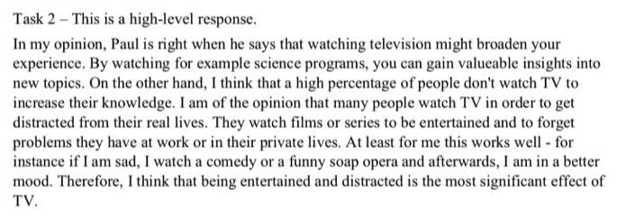
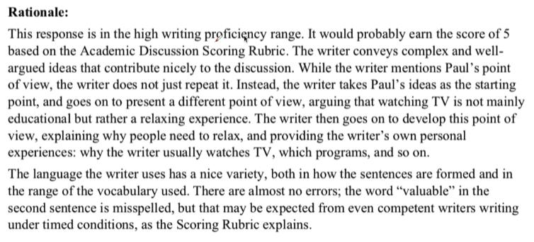

# 托福备考经验 + 改革

[一个视频搞懂托福备考](https://www.bilibili.com/video/BV1zu4y1477N/)

[官网写作新题型（最下面）](https://www.ets.org/toefl/test-takers/ibt/prepare/practice-tests.html)

阅读:35min 2篇
听力:36min 28题
口语:16min 4题
写作:30min 2篇

挡位

托福的口语写作相比雅思更有套路

备考资料
1. OG = official guide
   1. 官网链接 [TOEFL iBT® Test Content](https://www.ets.org/toefl/test-takers/ibt/about/content.html)
2. 词汇
3. 语法
4. TPO(40以后的，真实模拟) & 真题
   1. 新东方

# 改革后界面

[2023托福改革版新界面布局流出！超详细介绍来啦！](https://www.bilibili.com/video/BV1sV4y1r7zo/)

阅读
1. intro
2. 布局（左边文章段落、右边题目）
3. 不需要滑动浏览再做题
4. 可以根据文章段落直接读题目
5. 可以review，跳转做过的题

听力
1. 整体没变化
2. 点选项，点next
3. 不能回头改

口语
1. 试音
2. 总体变化不大

写作
1. 综合写作
   1. 三分钟阅读时间
2. 独立写作 -> discussion board

强度小，容错率比原来低

当场出分+确切出分日期

写作新题型(与原来的独立写作类似)

# 托福改革后托福考试详细流程及备考建议

[托福改革后托福考试详细流程及备考建议](https://www.bilibili.com/video/BV1jc411n793/)

阅读
1. 题型不变 - 复习仍可参考老版TPO
2. 题量减少 - 容错率降低

听力
1. 删去听力，其余保持不变

口语
1. 无变化

写作
1. 综合写作保持不变（听力、阅读、写作）
   1. 不是自由发挥
   2. 概括阅读中的主要观点
   3. **重点说明听力部分如何反驳阅读**
2. 独立写作变为**学术讨论**
   1. 模拟课堂讨论场景
   2. **十分钟**答题时间
   3. 先评价其他同学观点 - 同意/不同意
   4. 给出自己的观点，新的观点
   5. 只写段落，不需要构建完整篇章
   6. 需要思路的灵活度
   7. 100+单词

满分答案

评分理由

