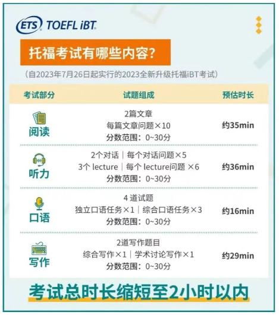
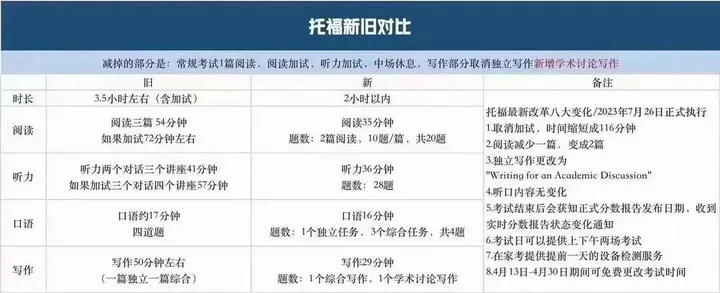
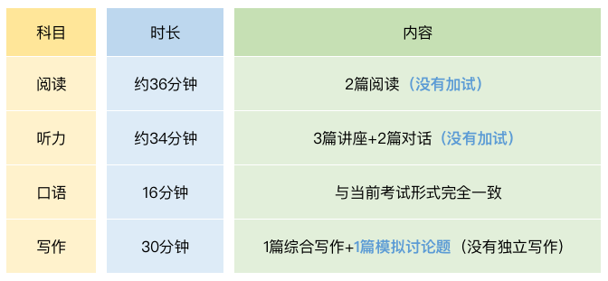
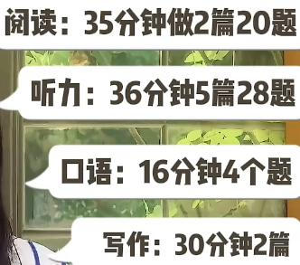
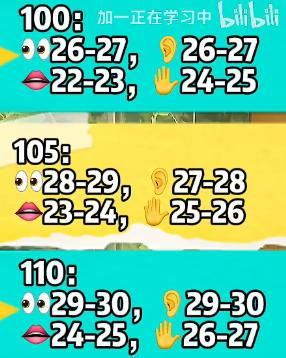
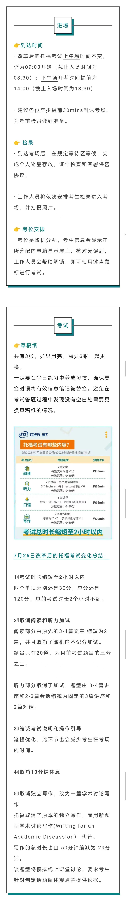

# 托福备考经验 - 加一正在学习中

[一个视频搞懂托福备考](https://www.bilibili.com/video/BV1zu4y1477N/)

阅读:35min 2篇
听力:36min 28题
口语:16min 4题
写作:30min 2篇

挡位

托福的口语写作相比雅思更有套路

备考资料
1. OG = official guide
   1. 官网链接 [TOEFL iBT® Test Content](https://www.ets.org/toefl/test-takers/ibt/about/content.html)
2. 词汇
3. 语法
4. TPO(40以后的，真实模拟) & 真题
   1. 新东方

