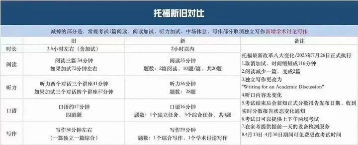

# 官网

[官网写作新题型（最下面）](https://www.ets.org/toefl/test-takers/ibt/prepare/practice-tests.html)

[官方视频 OG](https://www.ets.org/toefl/test-takers/ibt/about/content.html)

[考满分 备考指南](https://toefl.kmf.com/learn/beikao)

[Vince9120 - B站主页](https://space.bilibili.com/396671281/)

# 托福备考经验 + 改革

[一个视频搞懂托福备考](https://www.bilibili.com/video/BV1zu4y1477N/)

阅读:35min 2篇
听力:36min 28题
口语:16min 4题
写作:30min 2篇
1. 综合写作
   1. 阅读时间&字数：3分钟 & 230-300words
   2. 听力时长&与阅读的关系：2分钟左右 & 一一对应的反驳
   3. 写作时间&字数要求： **20分钟 & 150-225words**
2. 学术讨论 - **总计10分钟**，尽量在2分钟内完成材料阅读

**挡位**

托福的口语写作相比雅思更有套路

备考资料
1. OG = official guide
   1. 官网链接 [TOEFL iBT® Test Content](https://www.ets.org/toefl/test-takers/ibt/about/content.html)
2. 词汇
3. 语法
4. TPO(40以后的，真实模拟(前30太简单)) & 真题
   1. 新东方
   2. TPO - toefl practice online

# 改革后界面

[2023托福改革版新界面布局流出！超详细介绍来啦！](https://www.bilibili.com/video/BV1sV4y1r7zo/)

阅读
1. intro
2. 布局（左边文章段落、右边题目）
3. 不需要滑动浏览再做题
4. 可以根据文章段落直接读题目
5. 可以review，跳转做过的题

听力
1. 整体没变化
2. 点选项，点next
3. 不能回头改

口语
1. 试音
2. 总体变化不大

写作
1. 综合写作
   1. 三分钟阅读时间
2. 独立写作 -> discussion board

强度小，容错率比原来低

当场出分+确切出分日期

写作新题型(与原来的独立写作类似)

# 托福改革后托福考试详细流程及备考建议

[托福改革后托福考试详细流程及备考建议](https://www.bilibili.com/video/BV1jc411n793/)

阅读
1. 题型不变 - 复习仍可参考老版TPO
2. 题量减少 - 容错率降低

听力
1. 删去听力，其余保持不变

口语
1. 无变化

写作
1. 综合写作保持不变（听力、阅读、写作）
   1. 不是自由发挥
   2. 概括阅读中的主要观点
   3. **重点说明听力部分如何反驳阅读**，听力占比为阅读的1.5-2倍，听力更重要
   4. 250+词
   5. 20分钟
   6. Intro + 3 points
2. 独立写作变为**学术讨论**
   1. 模拟课堂讨论场景
   2. **十分钟**答题时间
   3. 先评价其他同学观点 - 同意/不同意
   4. 给出自己的观点，新的观点
   5. 只写段落，不需要构建完整篇章
   6. 需要思路的灵活度
   7. 100+单词(推荐的字数在 140-170 这个范围内，比较容易获得高分)

满分答案

评分理由

# 合集·托福学术讨论写作 | 思路解析与参考

[合集·托福学术讨论写作 | 思路解析与参考](https://space.bilibili.com/383680618/channel/collectiondetail?sid=1501162)

[免费 | 托福写作-2023学术讨论写作官方样题思路串讲（1-4题）](https://www.bilibili.com/video/BV13p4y1P7DS/)

[10min学术讨论写作 - 官方解读](https://www.bilibili.com/video/BV1Xw411F7YN/)

注意审题，注意教授问题的重点

在综合写作之后，一共十分钟（包含阅读时间），有倒计时

有字数统计

包含两部分
1. 自己立场
2. 参与讨论(至少回应一位同学的观点) - 同学观点其实是思路参考 - 有时候需要提出全新的观点

不建议举例

100词左右

引言部分需要简要介绍话题并引出主题，主体部分需要展开讨论并支持或反对某个观点，结论部分需要总结讨论并重申自己的观点。

# 合集·托福写作 | 备考方法论与资讯信息

[合集·托福写作 | 备考方法论与资讯信息](https://space.bilibili.com/383680618/channel/collectiondetail?sid=517481)

## 综合写作(无变化)

四不要
1. 不要照抄阅读原文
   1. 听力结束后，阅读原文会再次出现在屏幕左侧
   2. 不改变原文信息意思的前提下做形式上的改写和替换
   3. 换词(同义词、近义词)、换词性、换说法
2. 不要执着于改写听力原文
   1. 可以听到什么就写什么
   2. 考察能否听懂、与阅读信息关系的构建

# 写作

[托福写作（综合和独立），模板和建议](https://www.bilibili.com/video/BV1UE411E731/)

[托福写作新题型 | 学术讨论写作怎么分配考试时间？](https://www.bilibili.com/video/BV1Tr4y197Ms/)

[托福写作新题型 | 手把手教你写满分范文-学术讨论写作](https://www.bilibili.com/video/BV1hh4y1d73d/)

[托福写作 | 2023年12月托福综合写作考情汇总与分析](https://www.bilibili.com/video/BV1ei4y1a7ja/)

[【Vince】7节课突破30分托福写作 - 学术讨论](https://www.bilibili.com/video/BV1UJ411T7oN/)

句式变换
1. 形式主语
2. 动名词作主语
3. 被动语态(上帝视角)

同义词替换
1. 低级 - increase/enhance/improve/boost/decrease/reduce
2. 高级 - maximize/optimize/upgrade/amplify/economize/cut
3. paper book - traditional book
4. knowledge - expertise/insight/comprehension/familiarity/learning
5. more - extra/additional
6. can - be able to
   1. Have the ability/capacity/power/skill to
   2. Be capable of
   3. Be competent/qualified/equipped to
   4. Be proficient in
   5. Be skilled at

# 听力

听句子要抓重点

# 口语

[托福口语 TPO 1-75 Sample合集](https://www.bilibili.com/video/BV12P411U7Lc/)

[托福口语task1-4，模板和建议](https://www.bilibili.com/video/BV1b7411t7Vr/)

[TOEFL Practice Test](https://www.bilibili.com/video/BV11B4y197f5)

[托福口语真题专项精讲班（含讲义）TOEFL Speaking Practice - B站视频](https://www.bilibili.com/video/BV1ca4y1V7k8/)

[【晗啸托福口语全指南】导论-基础班](https://www.bilibili.com/video/BV1ju4y1n7k9/)

[【TOEFL118斯坦福学长】带你7节课突破托福口语！- Vince](https://www.bilibili.com/video/BV1zb4112737/)

[TPO30-托福口语范例 - 晗啸托福英语](https://www.bilibili.com/video/BV1eh4y1e7Er/)

[考满分 托福口语 知识点讲解](https://toefl.kmf.com/learn/speaking)

# 词汇

[精选100句记7000托福单词](https://www.bilibili.com/video/BV1Yu4y1a7uU/)
