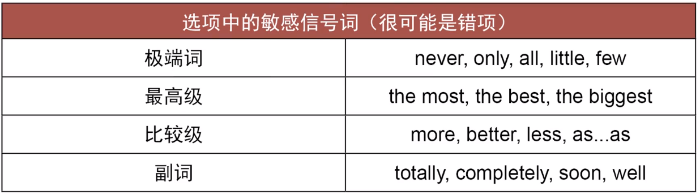
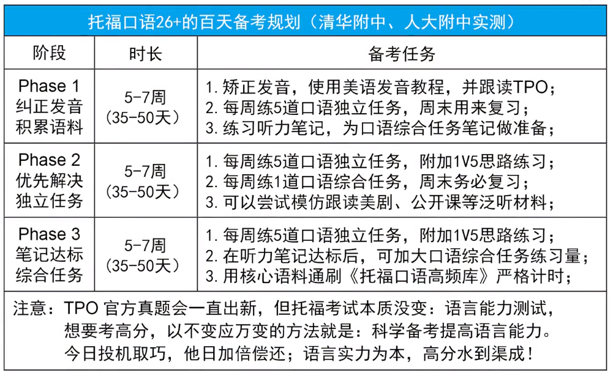
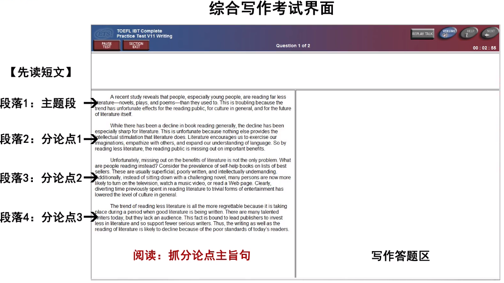
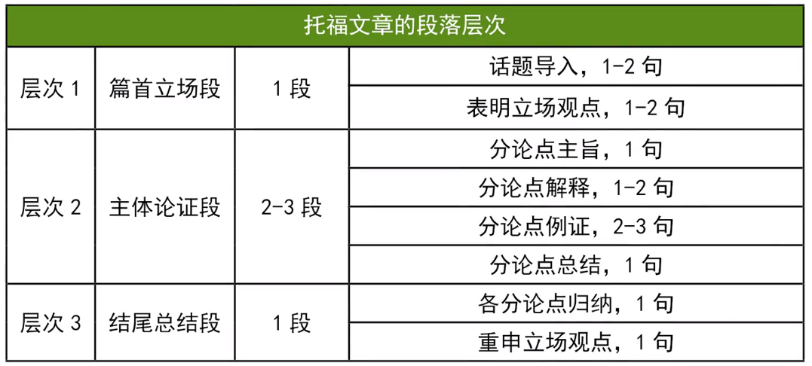

# 李文勍Richard

[toc]

[KMF考满分](https://toefl.kmf.com/)

[【清北托福备考慕课】2023-24新版: 考托人手必备](https://www.bilibili.com/video/BV1LW411v7Z6)

[【7天精通长难句】阅读秒懂省时间！李文勍托福](https://www.bilibili.com/video/BV1T4411V71S/)

[自学首战托福110+ ｜巨详细经验分享](https://www.bilibili.com/video/BV1jY411s7gv/)

可能双加试

# 阅读

屏读耐力

屏读适应问题

太难的专有名词不必要记忆
1. 上下文语境
2. 逻辑信号 larger/smaller
3. 词根词缀推导
4. 搞不懂的首字母缩写

[韦伯斯特在线词典](https://www.merriam-webster.com/)

[collins在线词典](https://www.collinsdictionary.com/)

四种篇章大纲结构
1. 分类 classification
2. 对比 comparison、contrast
3. 提问 problem、solution
4. 因果 cause、effect

**缩句&抓住干**

# 听力

对话：校园、学习
讲座：独白、对话

考场：头戴式耳机

听力无法返回上一题

注意：小黑板生词

[科学美国人官网](https://www.scientificamerican.com/podcasts/)

[网易公开课 国际名校公开课](https://open.163.com/ocw)

conversation一开始可能是开场白，和内容无关

听懂才是目的，笔记不强求

# 口语

10分钟休息

独立任务是根据提问，个性化的答题反馈。理由充分即可，没有标准答案

有准备时间和回答时间

综合任务 Task2 是校园类话题。先是一段文字背景，随后文字消失，出现一段对话。回答主角观点(支持或反对)并复述。

综合任务 Task3 是学术类话题。先是一段文字，说明学科的定义和梗概，随后文字消失，出现一段讲座听力。复述教授的细化解释。

综合任务 Task4 没有文字直接听力讲座，两分钟左右。复述归纳讲座内容。

**口语中，听力也是重点**，所以也应该作笔记

发音表达要清晰，同时尽量避免出错

[推荐视频](https://www.bilibili.com/video/BV1pp411f7Qr/)

榨干真题

TED，美剧，语伴等等

时间、地点、任务、起因、经过、结果

可以对比说明(赞一个、贬一个)，显得思考完整

加一些逻辑信号词

一般情况，对话内容会**反对**公告内容

注意时态问题

文字中的例子可以不重点关注，**讲座中的例子要关注**，讲座也会复述一下文字中的内容

如果有自问自答，要重点关注

可以通过复述之前的听力内容来训练和提升

一开始一定会说明主题，后续支撑的例子需要关注

# 写作

人工智能判分

[托福写作机器批改中的人工智能应用](https://zhuanlan.zhihu.com/p/129001134)

[7天精通语法句型】托福雅思造句无忧！](https://www.bilibili.com/video/BV13J411Y7vy/)

综合写作：读+听+写，有调节音量

独立写作：命题作文形式

这个小短文之后还会出现，先3min阅读时间，用于带入，没有听力重要

随后短文消失，开始听力。教授可以赞成或反对，关注为什么支持、反对(大概率是反对)，需要记笔记

没有 spell check ，不要有拼写错误

注意书面用语

注意修饰可数名词、不可数名词的搭配

[同义词在线词典](https://www.synonym.com/)

[英英解释词典](www.vocabulary.com/dictionary)

表达观点要言简意赅，举例论证需要详细一点

转述他人的话语时，用逗号隔开，加上引号，最后的句号也在引号内，一般不用冒号。

靠积累

需要举大量的例子，一定要切题

建议390+，字数

**不写标题，顶格写，段与段空一行**

综合写作注意记笔记，建议200+

需要作转述，不要照抄

建议不要复议，可能人工批改降分

篇首背景导入不要单独一段，表明立场也放在第一段中

