# Vince TOEFL

[Vince9120 B站首页](https://space.bilibili.com/396671281)

[toc]

# 资料下载

[资料下载](https://mp.weixin.qq.com/s/s3P9dmhc-kT7lbzJ9PyhzQ)

下载位置:/mnt/sda1/Lectures/English/Vince

语法课程幻灯片下载：
链接：https://pan.baidu.com/s/1xqyV9Gr2bnsR-mbRywb0gw
提取码：b7zn

托福阅读课程幻灯片下载：
链接：https://pan.baidu.com/s/1jSj6pXD-qFrE_ZTvNx4RVQ
提取码：cki0 

写作，口语课幻灯片，视频，题库，以及其他备考资料：
链接：https://pan.baidu.com/s/1CXXh9uUyxssLJ7BOPTu0uw
提取码：k0d1

申请资料，简历CV，推荐信样本下载链接：
链接：https://pan.baidu.com/s/15f4tYiD2UanNLH_d3Csl_A
提取码：g4t0

# 长难句分析和口语写作必备语法 - TOEFL, IELTS, GRE, GMAT 2h33min 2021-06-28

[长难句分析和口语写作必备语法](https://www.bilibili.com/video/BV12B4y1K75K/)

[7节课学会长难句分析和写作(deprecated)](https://www.bilibili.com/video/BV1L7411v7M7/)

**标点符号往往是标志**

## Sentence Structure

linking verb 系动词 主系表结构

predictive 表语 表达主语的一个属性

**祈使句**

clause : subjective + verb

**复合句 compound sentence**

**修饰成分** 可以被移除

**限定性和非限定性**

在分析长难句过程中，删去没用的，留下 sentence cores

## Practice

there be sth <=> sth be there

## Parts of Speech 词性

词性
1. 名词
2. 代词
3. 动词
4. 形容词
5. 副词
6. 连词
7. 介词
8. 感叹词

**名词**

使用不定冠词 a 更有指令感，更加具体

使用复数更加宽泛

使用定冠词 the 更加明确对象

**代词**

所有格

**动词**

be become 为系动词 leave write 为action

红色为 working verb 是由主语发起的动作 
listen 表示伴随状态

**形容词**

主系表结构，形容词作表语，表示主语的属性

**副词**

so 和 but 是连词，但是在口语中也可以这么用。在书面语中，还是应该使用副词。

**连词**

链接分句 不仅链接句子，而且可以表达逻辑上的关系

**介词**

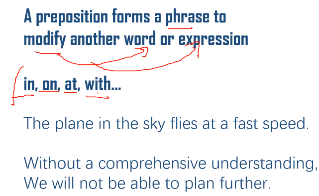

介词短语 可以修饰名词也可以修饰动词

**感叹词**

## Practice

## Noun Modifier

常见的名词修饰词
1. 形容词 new, great, selfless
2. 介词短语 of endeavor
3. 定语从句(完整的 clause) who are able ...
4. 分词 rising in 
5. 同位语和插入语(- 和 , 效果相同) a new field

插入语(一定是非限制性)

同位语和插入语的关系

第一句的 Lina 是限制性定语，不能去掉，所以不加逗号，也不是插入语，仅仅是同位语
## Practice

两个逗号间的定语从句是非限制性的，可以先跳过

## Adverb Modifier 状语

常见的类似副词修饰词用于修饰名词以外的内容
1. 副词 still, slowly, suddenly, inevitably
2. 介词短语 into space, of the space race
3. 状语从句 when the Cold War still slowly emerging
4. 分词 triggering the beginning of the space race (现在分词，当然也有过去分词) 
5. 插入语 

从句的都是有主从之分的

**定语从句**，修饰laptop，不是 compound sentence，因为是主从关系

**名词性从句**

**状语从句**

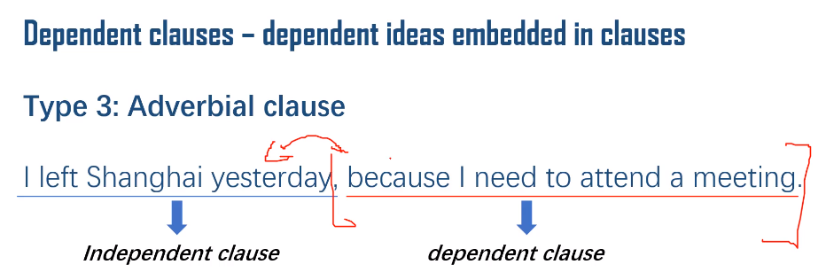

## Practice

## Tenses and moods 时态和语气

12种常用的时态

**一般时**

时态在主句和从句中可以混用

**进行时**

进行时表示此时此刻正在发生，并且会持续一段时间continuous (for a while)

**完成时**

过去完成时(过去的过去)

现在完成时(现在的过去)

将来完成时(将来的过去)

**完成进行时**

Done + For a while -> 已经开始并会持续

## Practice

托福口语对于时态的要求不是特别高(一般时即可)

在托福写作中，需要进行时、完成时、完成进行时

雅思口语对于时态的要求较高

# 7节课突破30分托福听力 - TOEFL Listening 4h16min 2022-04-23

[7节课突破30分托福听力 - TOEFL Listening](https://www.bilibili.com/video/BV1KA4y1X7aH/)

## Intro

不知道哪一套题目(1,3)是加试的

题材

打分机制

句子的架构和重点 语言熟练度 解题技巧 记笔记

## Vocab

## Practics 1

## Practics 2

# 单词

[托福雅思听力基础单词学习辨听 22h08min](https://www.bilibili.com/video/BV1A341147JS/)

[托福听力学科单词学习辨听 11h](https://www.bilibili.com/video/BV19P4y1E7bz/)

# 7节课突破30分托福阅读 - TOEFL Reading 5h21min 2021-04-06

## Intro

[7节课突破30分托福阅读 - TOEFL Reading](https://www.bilibili.com/video/BV18A41157gd/)

托福阅读量大，题干长

题型 主要分为两类
1. top down
2. bottom up

inference : 往深里思考 
factual info : 同义词替换

summary : 比 categorization 常见
categorization : 常常出现在对比的文章中

## Prep Plan

topics

准备方式 : reading -> listening -> speaking

学术单词 : study from passage

语法 : 

## Skimming

通读全文段落

找实义词 meaning-carrying words
以及 frequently-mentionned terms/expressions

仅仅读首句尾句是不够的

# 吴奇老师的托口秀 简单实用的答题模版

[吴奇老师的托口秀 简单实用的答题模版](https://www.bilibili.com/video/BV1Xy4y1m7qK/)

答题套话 语言简单 逻辑清晰 熟练掌握

**Task 01**

**Task 02**

**Task 03**

前两句表示阅读

后两句为文章

on top of that 除此以外

**Task 04**

# 突破托福口语！- 根据2019年8月改革更新 1h41min

[突破托福口语！- 根据2019年8月改革更新 1h41min](https://www.bilibili.com/video/BV16E411Y7mN/)

**目录**

## Session 1 Independent task

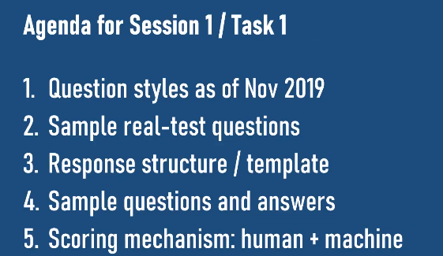

新旧题型

准备右边的为主，之前的视频:[带你7节课突破托福口语！](https://www.bilibili.com/video/BV1zb4112737/)也可以过一下

**模板** 解释+例子

elaboration 和 example 顺序不固定

提前热身、不要重复题目或之前自己的观点、用逻辑词和连接词(有逻辑性)、长短句配合

沟通越有效越好

也可以 brainstorm 结合 high-level point

**准备时间15秒**

synergy 协同工作

**打分方式**

机器&人 打分权重一致

## Session 2 Task2

阅读文字，关于变化，及其原因。随后有两个学生的对话听力，表达观点

**reading 只会出现一次，所以要记好笔记**

**模板**

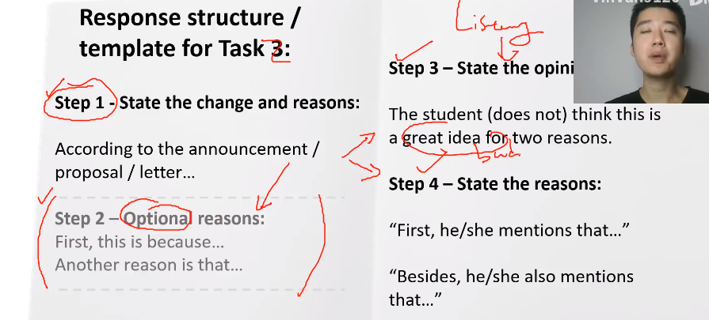

重点应该在听力部分的材料复述

用一些连接词

简单句和复合句结合

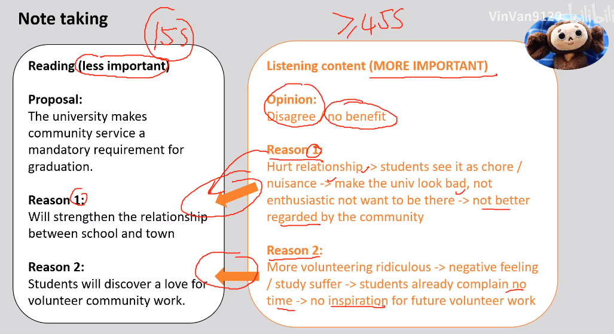

可能human rater 比重大一些

## Session 3 Task3(两种题型)

阅读:学术主题、学术概念
听力:1/2个例子

对于一个例子
1. cause-effect
2. before-after

**reading时，要抓住重点，词义解释**

**listening时，要抓住因果关系**

## Session 4 Task4

没有阅读部分，往往两个例子组成

往往是两个例子

也有可能一个例子，对于一个例子
1. cause-effect
2. before-after

**题干**
1. 上面的一般对应两个
2. 下面的一般对应一个例子

**所有口语题目都不需要conclusion**，summarize即可

用一般现在时不容易错

# 带你7节课突破托福口语！ 3h9min

[带你7节课突破托福口语！](https://www.bilibili.com/video/BV1zb4112737/)

# 7节课突破30分托福写作-独立写作 30min

[7节课突破30分托福写作-独立写作 2019-09-27](https://www.bilibili.com/video/BV1UJ411T7oN/)

[突破30分托福写作-独立写作-英语讲解和字幕 国际版](https://www.bilibili.com/video/BV1n7411S7mL/)

**独立部分的写作时间是30分钟**，综合部分的写作时间是20分钟
## Season 1

综合+独立

### Info

读+听+说+写(综+独)

**Agree/Disagree** 对立

**Prefer(Paired Views) -> Some people think** 不对立

**Multiple Choices**

**Good Idea**

打分标准
1. 切题
2. 文章具体：回答题干问题，具体的解释、例证、细节
3. 文章连贯，递进
4. 语言：模板&内容一直，多样性，词汇恰当&地道

题干变化

加了一些背景信息

判断两件事有无逻辑关联

模板是可以使用的，其他人的例子也可以

### The Structure

写作结构(五段式)

中间段(每一段都输出一个分论点)
1. 抽象说理
2. 例证
3. 让步

### Prompt Analysis & Brainstorming

宏观 可拓展 兼容性强

万精油

金字塔架构

high的部分宏观，且易于拓展

Agree/Disagree 以及 Paired View 都是做出直接的选择

三选一

不用囹圄在为什么是 best

选择有话说的方面

一开始建立一个大框架即可

建立自己的 high-level points

折中的观点比较少

### Grand Opening

公式 : hook + transition(过渡) + point

有吸引力+有连贯性+意思清晰

立场(Response) -> 观点(Points) -> 细节(Details)

同意 或 不同意

**与高层面观点有机结合**

可以先引入对立的观点

However, such a statement suffers from both logical and factual fallacies, and it should be examined meticulously.

开头可以引入对立的立场，并在后面进行concession进行攻击。而且有收尾呼应的效果

### Reasoning

呈现层次 + coherent & adequate(developed) & consistent

有充实的内容来解释观点

要仅仅结合主题，不要老是批判另一个

**如果要充实细节，可以向自己之前的观点提问，进行细节挖掘** why who how 

多种方式
1. follow **Futhermore**
   
2. fight **On the other hand**
   
3. hybrid
   

Optional filler
1. Summary
   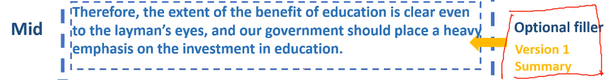
2. What if
   

不要滥用

### Exemplification

例子要有说服力

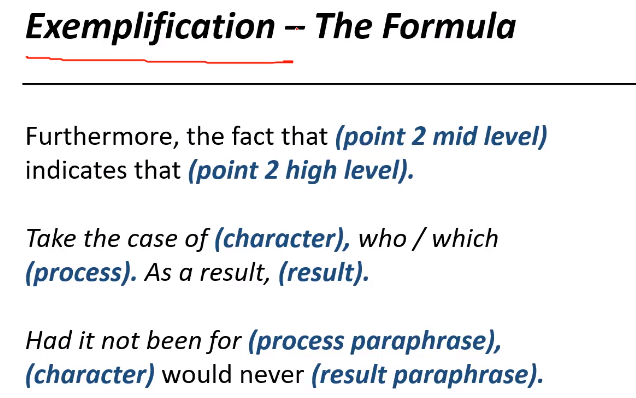

通过一个细节引出观点

将元素带入

此时还不够充分 adequate，仅仅是coherent

红字增加了代表性 **generality** 更有说服力

### Concession

让步拉回

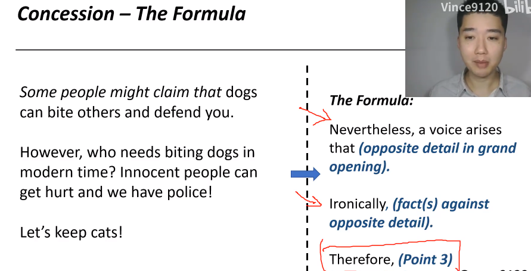

此时还不够 adequate

另一个方面的回答

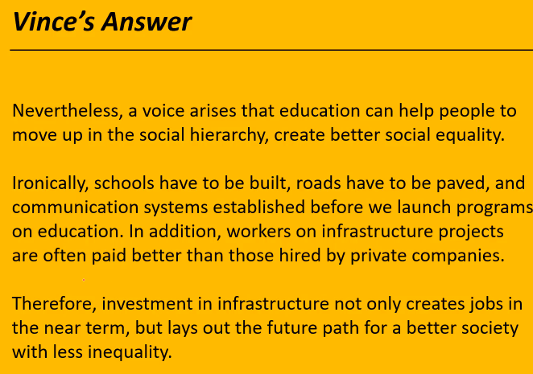

### Ending

ending 如果没有时间可以省略，考官更注重之前的论证

先对之前的观点进行复述，复述立场

引用名人名言

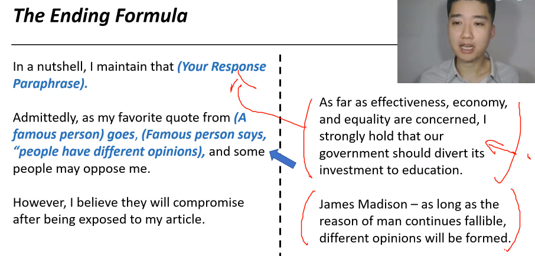

## Season 2

[9120 试听](https://m.lizhiweike.com/lecture2/27290518)

# 3节课突破30分托福写作-综合写作

[3节课突破30分托福写作-综合写作](https://www.bilibili.com/video/BV1hE411Z7jy/)

## Grading 、Structures & Reading Analysis(3min)

从听力和阅读中选取重要信息，写出 coherent accurate 的论文

不一样的题型(问法)
1. 听力材料和阅读材料观点相反
2. 阅读材料中提出三个问题，听力中解决这些问题
3. 阅读材料提出三个解决方法，听力中指出有些问题

**听力材料永远反对阅读材料，结构一一对应**

**草稿纸准备**，先看到3分钟阅读材料

重要性
1. main idea
2. summary
3. details

## Listening Analysis And Writing Structure

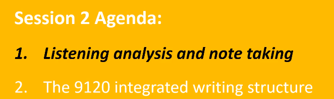

先有 expectation 不要记录每一个细节。
还是要抓住main idea，其次才是main idea
 

**写作结构**

cite 3 reasons to support the viewpoint that

reading/listening material
author - lecturer

argue
offer an opposite stand
cast doubt on
be counteracted by
oppose the point

## Putting Everthing Together

听力部分占比应该大一些

阅读部分会重新出现

不需要自己拓展，只需陈述事实观点即可

观点一一对立，听力是重点

# 7节课突破30分托福写作 - 学术讨论 Academic Discussion 独立写作 大作文

[【TOEFL119斯坦福学长】7节课突破30分托福写作 - 学术讨论](https://www.bilibili.com/video/BV1UJ411T7oN/)

