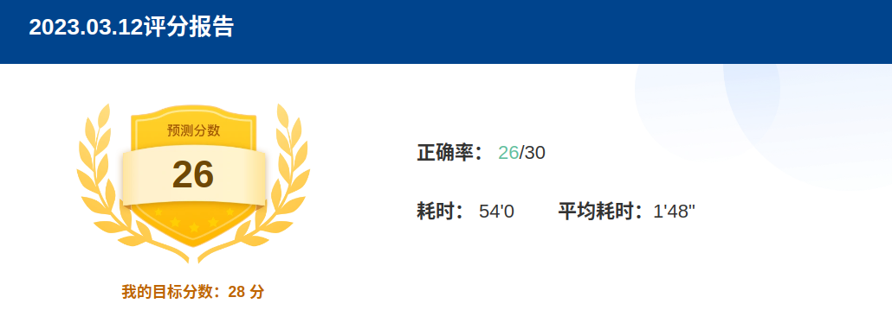
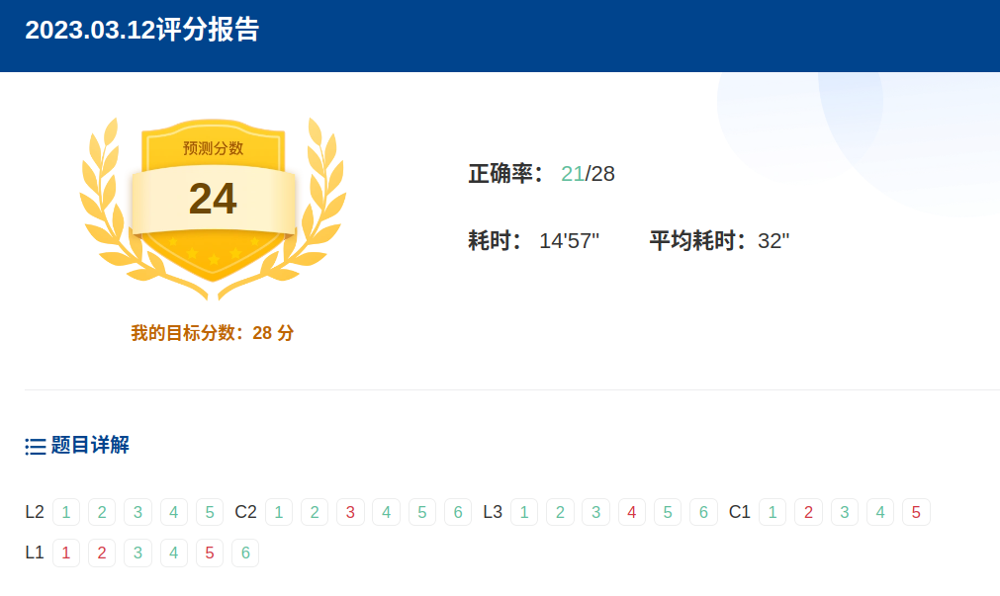
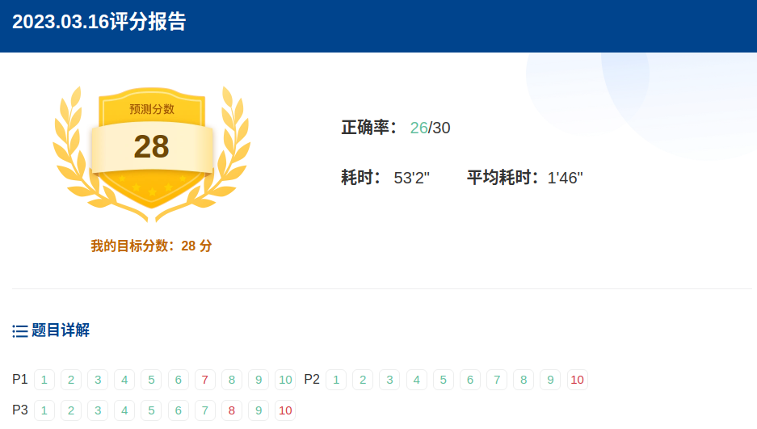
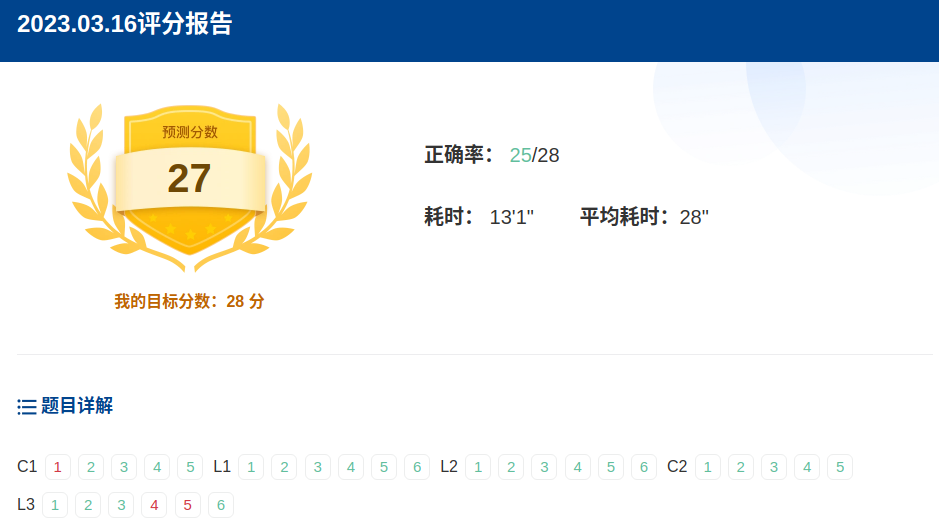

# 托福刷题记录

[toc]

## Portals

[KMF考满分 托福 官方真题](https://toefl.kmf.com/)
[KMF考满分 托福 官方真题 听力](https://toefl.kmf.com/practice/listening)
[KMF考满分 托福 官方真题 阅读](https://toefl.kmf.com/practice/reading)
[KMF考满分 托福 官方真题 口语](https://toefl.kmf.com/speak/ets/new-order/0)
[KMF考满分 托福 官方真题 写作](https://toefl.kmf.com/write/ets/order/0)

## Official 01

**阅读:** 于2023-02-03完成 
1. Passage1(自然科学): Groundwater 26min2s **12/14** **错:13,14**
2. Passage2(文化艺术): The Origins of Theater 22min **8/14** **错:1,2,8,10,13,14**
3. Passage3(自然科学): Timberline Vegetation on Mountains 21min44s **12/14** **错:9,14**

**听力:** 于2023-02-04完成并搞懂
1. Set1(校园生活): Student&Librarian 1min44s **5/5** **4题有猜的成分**
2. Set2(文化艺术): Rose Frantzen 1min42s **5/6** **错:2**
3. Set3(自然科学): Uranium-Lead Dating 1min44s **6/6**
4. Set4(课程学业): Student&Professor 1min4s **5/5**
5. Set5(社会科学): Archaeology Class 1min58s **5/6** **错:2**
6. Set6(生命科学): Biology Class 1min32s **5/5** **2题有猜的成分**
**口语:**
**写作:**

## Official 02

**阅读:** 于2023-02-0x完成 
1. Passage1(自然科学): Desert Formation 10min43s **13/14** **错:13**
2. Passage2(生命科学): The Origins of Cetaceans 16min34s **12/14** **错:11、13**
3. [Passage3(文化艺术)](https://toefl.kmf.com/reading/result/167560954062213684): Early Cinema 16min37s **8/13** **错:7、8、9、11、13**

**听力:** 于2023-02-09完成并搞懂
1. Set1(课程学业): Research Project 1min17s **5/5** **第2题有蒙的成分**
2. Set2(社会科学): Behaviorism 2min17s **6/6** **第3题有蒙的成分**
3. Set3(生命科学): Botany Class 1min42s **6/6** **第4、5题有蒙的成分**
4. Set4(校园生活): Studying To Be English Teachers 1min1s **5/5** **第2题有蒙的成分**
5. Set5(社会科学): Ethical Theory 2min35s **5/5** **第2、3题有蒙的成分**
6. Set6(自然科学): Biology Class 1min47s **6/6** **第3、4题有蒙的成分**

**口语:**
**写作:**

## Official 03

**阅读:** 于2023-02-0x完成 
1. Passage1(文化艺术): Architecture 20min30s **13/14** **错:14**
2. Passage2(自然科学): Depletion of the Ogallala Aquifer 20min **13/14** **错:13**
3. Passage3(自然科学): Timberline Vegetation on Mountains 22min29s **10/14** **错:3,7,13,14**

**听力:** 于2023-02-12完成并搞懂
1. Set1(校园生活): Student & Registrar 41s **5/5**
2. Set2(生命科学): Environmental Science 1min32s **5/6** **错:6**
3. Set3(文化艺术): Film History 1min53s **6/6** **第2题有蒙的成分**
4. Set4(校园生活): Archaeology Project 53s **4/5** **错:1**
5. Set5(文化艺术): Ethical TheoryArt History 1min55s **4/5** **错:3 整体没大懂(主要有一些名称词汇)**
6. Set6(自然科学): Astronomy Class 2min **6/6**

**口语:**
**写作:**

## Official 04

**阅读:** 于2023-02-0x完成 
1. Passage1(生命科学): Deer Populations 26min22s **9/14** **错:7,8,9,13,14** 没仔细做
2. Passage2(自然科学): Depletion of the Ogallala Aquifer 20min **13/14** **错:13**
3. Passage3(自然科学): Timberline Vegetation on Mountains 22min29s **10/14** **错:3,7,13,14**

**听力:** 于2023-02-12完成并搞懂
1. Set1(校园生活): Student & Librarian 2min10s **3/5** **错:2,5** 这篇就nm离谱
2. [Set2(生命科学)](https://toefl.kmf.com/listening/result/167629726141598557/114m3j): Biology Class 2min19s **6/6** **基本都有赌的成分**
3. Set3(文化艺术): Film History 1min53s **6/6** **第2题有蒙的成分**
4. Set4(课程学业): Archaeology Project 53s **4/5** **错:1**
5. Set5(自然科学): Ethical TheoryArt History 1min55s **4/5** **错:3 整体没大懂(主要有一些名称词汇)**
6. Set6(社会科学): Astronomy Class 2min **6/6**

**口语:**
**写作:**

## Official 05

**阅读:** 于2023-0x-xx完成 
1. Passage1():  mins **/** **错:**
2. Passage2():  mins **/** **错:**
3. Passage3():  mins **/** **错:**

**听力:** 于2023-03-13完成
1. Set1(校园生活): University Counseling Center 1min28s **5/5**
2. Set2(社会科学): Sociology Class 2min48s **4/6** **错:3、5** 没抓住重点
3. Set3(自然科学): Astronomy Class 2min58s **6/6** 崩溃重做，直接全对
4. Set4(课程学业): Film Class 1min25s **5/5**
5. Set5(自然科学): Laboratory 2min6s **6/6**
6. Set6(文化艺术): Folk Tale Fairy Tale 1min2s **4/6** **错:5、6**

**口语:**
task4 3.1 24-30
**写作:**

## Official 30

**阅读:** 于2023-0x-xx完成 
1. Passage1():  mins **/** **错:**
2. Passage2():  mins **/** **错:**
3. Passage3():  mins **/** **错:**

**听力:** 于2023-0x-xx完成
1. Set1():  mins **/** **错:**
2. Set2():  mins **/** **错:**
3. Set3():  mins **/** **错:**
4. Set4():  mins **/** **错:**
5. Set5():  mins **/** **错:**
6. Set6():  mins **/** **错:**

**口语:3.0 19-23**

task1 3.1
task2 3.1
task3 3.2
task4 2.7

**写作:**

## Official 46

**阅读:** 于2023-0x-xx完成 
1. Passage1():  mins **/** **错:**
2. Passage2():  mins **/** **错:**
3. Passage3():  mins **/** **错:**

**听力:** 于2023-0x-xx完成
1. Set1():  mins **/** **错:**
2. Set2():  mins **/** **错:**
3. Set3():  mins **/** **错:**
4. Set4():  mins **/** **错:**
5. Set5():  mins **/** **错:**
6. Set6():  mins **/** **错:**

**口语:**
**写作:**

## Official 47 (改革后)

**阅读:** 于2023-03-完成 
1. Passage1(社会科学): **9/10** **错:10**
2. Passage2(生命科学): **10/10**
3. Passage3(自然科学): **8/10** **错:3、10**

**听力:** 于2023-03-完成
1. Set1(校园生活): **4/5** **错:4** lyric还有歌词的意思
2. Set2(文化艺术): **5/6** **错:5**
3. Set3(生命科学): **6/6**
4. Set4(课程学业): **5/5**
5. Set5(自然科学): **6/6**

**口语:**
**写作:**

## Official 48 (改革后)

**阅读:** 于2023-03-11完成 
1. Passage1(社会科学): **10/10**
2. Passage2(生命科学): **10/10**
3. Passage3(自然科学): **9/10**

**听力:** 29分 于2023-03-11完成
1. Set1(校园生活):  **5/5**
2. Set2(文化艺术):  **5/6** **错:3**
3. Set3(自然科学):  **6/6** 有蒙的成分
4. Set4(课程学业):  **5/5**
5. Set5(生命科学):  **6/6**

**口语:**
**写作:**

## Official 49 (改革后)

**阅读:** 于2023-0x-xx完成 
1. Passage1():  mins **/** **错:**
2. Passage2():  mins **/** **错:**
3. Passage3():  mins **/** **错:**

**听力:** 25分 于2023-03-11完成
1. Set1(校园生活):  **3/5** **错:2、5**
2. Set2(自然科学):  **4/6** **错:2、3** 太难了
3. Set3(社会科学):  **4/6** **错:5、6** 听漏了一些
4. Set4(课程学业):  **5/5**
5. Set5(生命科学):  **6/6**

**口语:**
**写作:**

## Official 50

**阅读:26** 于2023-0x-xx完成 
1. Passage1(): **9/10** **错:4**
2. Passage2(): **6/10** **错:4、5、7、9**
3. Passage3(): **8/10** **错:7、10**

**听力:** 于2023-03-13完成
1. Set1(校园生活): Political Science 1min30s **5/5**
2. Set2(文化艺术): Ancient History mins **5/6** **错:2** 第5题有蒙的成分
3. Set3(校园生活): Building Maintenance 1min17s **5/5**
4. Set4(文化艺术): Realism 3min12s **3/6** **错:1、2、3** 没抓住重点
5. Set5(自然科学): Petroleum 1min49s **6/6**

**口语:19~23**

**写作:**

## Official 51

**阅读(改革后): 26分 做的太随便** 于2023-03-13完成 
1. Passage1(): **7/10** **错:5、7、9**
2. Passage2(): **8/10** **错:1、3**
3. Passage3(): **8/10** **错:2、10**

**听力:** 于2023-03-13完成
1. Set1(校园生活): Student Activities Center 1min45s **4/5** **错:3**
2. Set2(文化艺术): Illustrated Books 2min37s **5/6** **错:3**
3. Set3(自然科学):  2min56s **3/6** **错:2、3、6** 没抓住重点
4. Set4(课程学业): Camouflage Experiment 1min24s **3/5** **错:4、5** 仔细读题
5. Set5(社会科学): Cultural Diffusion mins **4/6** **错:4、5** go down in history 名垂青史

**口语:**
**写作:**

## Official 52

**阅读:** 于2023-03-05完成 并 搞懂
1. Passage1(自然科学): Stream Deposits 22min03s **11/14** **错:1、3、14**
2. Passage2(社会科学): Natufian Culture 20min **13/14** **错:14**
3. Passage3(自然科学): Early Food Production 30min12s **14/14**

**听力:** 于2023-0x-xx完成
1. Set1(课程学业): Creative Writing Professor 1min45s **2/5** **错:3、4、5**
2. Set2(文化艺术): Art Class 3min47s **5/6** **错:1**
3. Set3(生命科学): Environmental Science Class mins **4/6** **错:3、5**
4. Set4(校园生活): Campus Store 1min53s **4/5** **错:4**
5. Set5(自然科学): Chemistry Class 2min **5/6** **错:5**
6. Set6(社会科学): Archaeology Class 2min37s **5/6** **错:1**

**口语:**
**写作:**

## Official 53

**阅读:** 于2023-03-03完成 并 搞懂
1. Passage1(社会科学): Evidence of the Earliest Writing 25min22s **13/14** **错:11**
2. Passage2(自然科学): Rain Forest Soils 18min59s **14/14**
3. Passage3(文化艺术): Paleolithic Cave Painting 31min16s **11/14** **错:7、9、14**

**听力:** 于2023-03-02完成 并 搞懂
1. Set1(课程学业): Student and Drama Professor 2min13s **4/5** **错:1**
2. Set2(社会科学): World History Class 2min9s **6/6** 第六题有蒙的成分
3. Set3(文化艺术): Film Studies Class 2min39s **3/6** **错:1、3、4**
4. Set4(校园生活): Student and the Cafeteria Manager 1min51s **5/5**
5. Set5(自然科学): Environmental Science Class 1min33s **6/6** 第六题猜对了，没听到
6. Set6(自然科学): Astronomy Class 2min36s **5/6** **错:6**

**口语:**
ok

**写作:**

## Official 54

**阅读:** 于2023-03-02完成 并 搞懂 
1. Passage1(自然科学): Elements of Life 29min1s **12/14** **错:10、11**
2. Passage2(社会科学): Commercialization of Lumber 20min51s **14/14**
3. Passage3(生命科学): Overkill of the North American Megafauna 22min41s **12/14** **错:2、12**

**听力:** 于2023-02-28完成 并 搞懂
1. Set1(校园生活): Student and Librarian 1min20s **4/5** **错:2**
2. Set2(生命科学): Marine Biology Class 1min49s **5/6** **错:5**
3. Set3(自然科学): Geology Class 2min37s **6/6**
4. Set4(课程学业): Theater Class 1min43s **4/5** **错:2**
5. Set5(文化艺术): Theater History Class 4min7s **4/6** **错:2、5**
6. Set6(自然科学): Archaeology Class 2min12s **5/6** **错:2**

**口语:**
1. Q2 : **Some people say that childhood is the best time in a person’s life. Other people disagree. What is your opinion? Explain why.**

In my opinion, I disagree with this idea for the following 2 reasons. There's no denying that we have less pressure in our childhood, however, we have less freedom at the same time. We should behave what parents and teachers asked. And it's kind of boring, for lack of entertainment, we can only do our homework and watch TV at the spare time. However, when we grow up, we have more freedom. We are able to travel around the world and make friends with different kinds of people. What's more, we can learn more knowledge and know our world better. It is the variety of experiences that make our life a colorful and meaningful and better one.
2. 其他

**写作:**
1. 独立写作
    In the reading material, the author provides 3 methods to support the viewpoint in order to reduce the salinity level of the Salton Sea in California, without which the lake should become a dead zone. Nevertheless, the lecturer argues that these attempts are unrealistic and impossible for several reasons.

    First and foremost, the author suggests that we can use desalinity devices to remove the salt from the lake water. Through evaporating the water, salt and other chemicals can be extract and the water becomes fresh. However, the lecturer argues that some of these chemicals extracted from the lake water are toxic and danger, which may cause health problem if humans breath in.

    In addition, the lecturer also cast doubt on the second advice prompts by the author - diluting the lake water with ocean water transpoted by pipelines or canals which is 20% less salty. The lecturer analyzed that the local governement can not afford to build the pipelines or canals, for the ocean is 1000km away. This makes the idea an impractical one.

    Finally, the third way to stop the salt level from rising is seperating the lake in several parts by walls and allowing the small section's salt level to increase while direct freshwater from rivers to the main section. The lecturer holds the point that the walls will not be functional for a long time, for the walls can be easily damaged by earthquakes.
2. 综合写作

## 模拟考 03-12 雪崩

**阅读:26** 于2023-03-12完成 
1. Passage1(): **9/10** **错:6**
2. Passage2(): **10/10**
3. Passage3(): **7/10** **错:8、9、10** 时间不够

**听力:21** 于2023-03-12完成

## 模拟考 03-16

[2023.03.16 听力评分报告](https://toefl.kmf.com/exam/active/167893561203922354)

[2023.03.16 阅读评分报告](https://toefl.kmf.com/exam/active/167895000164331355)

**阅读:28** 于2023-03-16完成 

**听力:27** 于2023-03-16完成

## Official xx Template

**阅读:** 于2023-0x-xx完成 
1. Passage1():  mins **/** **错:**
2. Passage2():  mins **/** **错:**
3. Passage3():  mins **/** **错:**

**听力:** 于2023-0x-xx完成
1. Set1():  mins **/** **错:**
2. Set2():  mins **/** **错:**
3. Set3():  mins **/** **错:**
4. Set4():  mins **/** **错:**
5. Set5():  mins **/** **错:**
6. Set6():  mins **/** **错:**

**口语:**
**写作:**