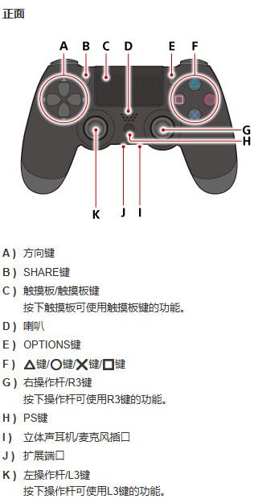
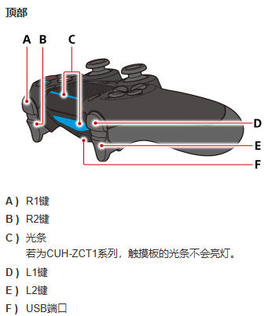
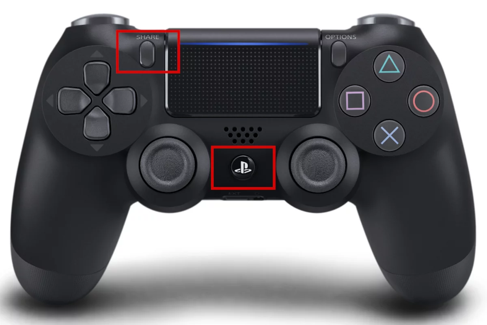

# PS4

[DUALSHOCK™4无线控制器](https://manuals.playstation.net/document/cs/ps4/basic/pn_controller.html)

[如何将DUALSHOCK 4无线控制器与个人电脑、Mac、Android和iOS设备搭配使用](https://www.playstation.com/zh-hans-cn/support/hardware/ps4-pair-dualshock-4-wireless-with-pc-or-mac/)

DUALSHOCK 4无线控制器兼容设备
1. Android™ 10
2. iOS 13
3. iPadOS 13
4. macOS Catalina
5. tvOS 13 

如何将DUALSHOCK 4无线控制器与受支持设备配对 
如果是首次使用蓝牙配对无线控制器与受支持的设备，请打开配对模式。
1. 确保控制器上的玩家指示灯已熄灭。如果玩家指示灯亮起，请长按PS键直到指示灯熄灭。如果控制器上已连接USB设备，请断开其连接。 
2. 在长按“分享”键的同时，长按PS键，直到光条闪烁。
3. 启用设备上的蓝牙，然后从蓝牙设备列表中选择控制器。配对完成后，光条会闪烁，随后玩家指示灯亮起。

