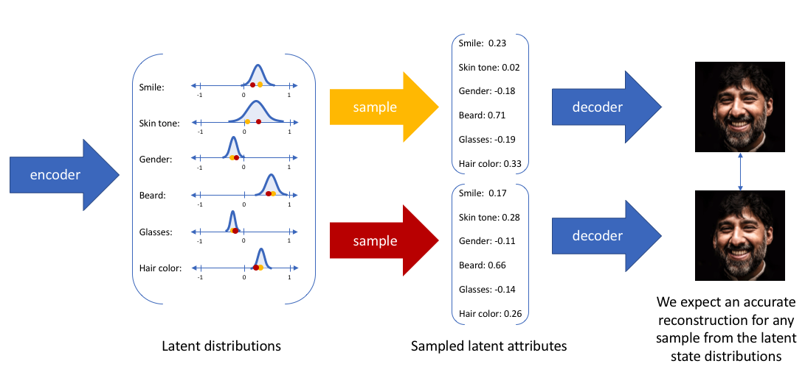

# VAE(Variational Auto-Encoder) - 变分自编码器

## Table & Contents

- [VAE(Variational Auto-Encoder) - 变分自编码器](#vaevariational-auto-encoder---变分自编码器)
  - [Table \& Contents](#table--contents)
- [VAE (Variational Auto-Encoder)](#vae-variational-auto-encoder)
  - [Blog (Jeremy Jordan)](#blog-jeremy-jordan)
  - [RethinkFun](#rethinkfun)
  - [YouTube](#youtube)
  - [ELBO(Evidence Lower Bound) - 证据下界、变分证据下界、变分下界](#elboevidence-lower-bound---证据下界变分证据下界变分下界)
    - [两种推导](#两种推导)
  - [Posterior Collapse - 后验坍塌](#posterior-collapse---后验坍塌)
- [β-VAE](#β-vae)
- [VQ-VAE](#vq-vae)
- [Denoising Auto-Encoder](#denoising-auto-encoder)

---

[Latent Space Visualization - 个人笔记](../../Math/DimensionReduction/DimensionReduction.md)

---

# VAE (Variational Auto-Encoder)

## Blog (Jeremy Jordan)

[Variational autoencoders - Blog (Jeremy Jordan)](https://www.jeremyjordan.me/variational-autoencoders/)

VAE formulate encoder to **describe a probability distribution** for each latent attribute, rather than AE which **outputs a single value**
1. 
2. 普通 AE
   1. 
3. VAE
   1. 
   2. 别称
      1. encoder 有时被称为 recognition model
      2. decoder 有时被称为 generative model
   3. constructing encoder model to output **a range of possible values(a statistical distribution)** 并喂给 decoder 模型 相当于 enforcing **continuous, smooth latent space representation**
   4. values which are nearby to one another in latent space should correspond with very similar reconstructions
      1. 逼迫解码器在邻域内都要工作
      2. KL 散度
   5. 

数据 x 可以看到，但是 隐变量 z 未知，希望通过 x 推断 z，即计算 $p(z|x) = \frac{p(x|z)p(z)}{p(x)}$，但是计算 $p(x)$ 困难

使用 **Variational Inference**

## RethinkFun

[VAE算法讲解 - B站(RethinkFun)](https://www.bilibili.com/video/BV1xFxMz1EMS)

原始 AE，latent space 中 大多数区域都是 无意义的点，只有少量确定的点能还原回 原始 输入图片

生成 正态分布(AE 是生成确定的值)，分散的 正态分布 虽然增加覆盖面积，但仍然不能覆盖 latent space

VAE，让所有样本，经过 Encoder 生成的多元正态分布 都接近 标准正态分布

**P.S.** : 让 所有样本的集合分布 符合 标准正态分布，但 单个样本的分布 在这个大分布内部 仍然 不同

VAE 训练时

符号定义
1. $x$ : input image
2. $z$ : 隐变量
3. $p(z)$ : 隐变量 分布，希望是 多元标准正态分布，生成时从中取样
4. $q_{\phi}(z|x)$ : encoder 映射 概率密度，以 $\phi$ 为参数
5. $q_{\theta}(x|z)$ : decoder 映射 概率密度，以 $\theta$ 为参数

## YouTube

[Variational Autoencoder - YouTube(Deepia)](https://www.youtube.com/watch?v=qJeaCHQ1k2w)

[Variational Autoencoder - Model, ELBO, loss function and maths explained easily! - YouTube(Umar Jamil)](https://www.youtube.com/watch?v=iwEzwTTalbg)

[Understanding Variational Autoencoders (VAEs) | Deep Learning - YouTube(DeepBean)](https://www.youtube.com/watch?v=HBYQvKlaE0A)

对于一个训练好的 autoencoder，生成新数据的方法是，从 latent space 中采样，并通过解码器解码

但大多数情况，只会产生杂乱的结果，因为 **latent space 无规则**，**大部分区域不会产生有意义的解码图像**

希望 latent space 中的采样点能够生成连贯的新图像

**Bayesian Statistics** 背景知识
1. 概率密度函数 Probability Density Function
2. 期望 Expectation $$\mathbb{E}[x] = \int_{-\infty}^{+\infty} x p(x) dx$$
3. 联合概率分布 Joint Probability Distribution
4. 边缘概率分布 Marginal Probability Distribution，联合概率对于其他变量进行积分
5. 条件概率 Conditional Probability，联合概率 ÷ 边缘概率 (可以理解为切片并重新归一化)

从给定的  **Data Distribution** $p_{data}(x)$ 中生成新数据，但是不知道 p 的确切形状和属性，只能通过访问样本

**Latent Distribution** 隐分布 $p(z)$，维度较低，捕捉数据 core feature

需要 Mapping 连接 **Data Distribution** 和 **Latent Distribution**

**概念**
1. **prior distribution 先验分布** $p(z) \sim \mathcal{N}(0,1)$，训练前就 人工固定为 **标准正态分布**，给潜空间一个统一、易采样的 "参考坐标"
2. **posterior distribution 后验分布** $p(z|x)$ (latent 由 data 生成 的概率，值大 代表 latent 很有可能 来源于 data distribution 生成，重构为图像 能够得到新样本)
3. 近似后验 $q(z|x) \sim \mathcal{N}(0,1)$，编码器输出(预测 $\mu$ & $\sigma$)，KL散度 将其 拉近 先验 $p(z)$ (ELBO)
4. **likelihood distribution 似然分布** $p(x|z)$ (从 latent 重建 data 的概率)

由于不知道 latent distribution，因此 假设为 **标准正态分布**，从而可以计算 likelihood (**其实可以是任何分布**)

使用 **另一个** 高斯分布 **$q_{\phi}(z|x)$** **近似** 后验 **$p_{\theta}(z|x)$**，其中 $\mu$ & $\sigma$ 是可学习参数

优化过程被称为 **变分贝叶斯**

训练一个 编码器 从图像中 估计 $\mu$ & $\sigma$，使用 解码器 从 后验分布中 采样的 潜变量 重建图像

先验 $p(z)$，后验 $p(z|x)$，近似后验 $q_{\phi}(z|x)$

训练目标 **ELBO** (需要 **最大化**)
1. $$\mathcal{L}(x)=
      \underbrace{\mathbb{E}_{q(z|x)}[\log p(x\,|\,z)]}_{\text{Data Consistency}} - \underbrace{\operatorname{KL}[q(z|x)\|p(z)]}_{\text{Regularization}}$$
2. 重建项 : 让 Decoder 用采样到的 z 能重建 x，**数据一致性** (解码器能否从潜在表示还原出原始数据)
   1. 可简化为 L2 Loss，即 MSE(mean square error)，用 解码器 对 latent vector 重构，并测量与原始图像的 L2 距离
3. 正则项 : Encoder 输出的 $q_{\phi}(z|x)$ 应该和先验基本类似，不要偏离预先定义的 标准正态分布太多
   1. 衡量了 近似后验 $q(z|x)$ 和 先验 $p(z)$ 的 接近程度，假设 先验服从 正态分布，因此 约束 近似后验 也 呈 正态分布形状

相比普通 AutoEncoder，编码器 不是将输入映射到单个点，而是转化为 高斯分布的概率分布(**编码器将数据转化为高斯分布的 $\mu$ & $\sigma$**)

在潜在分布中，随机采样点，解码器将其转换回 高维空间

计算 ELBO 并 反向传播，这里是需要 **最小化**

使用 Reparameterization Trick 重参数化技巧，解决 从近似后验中 采样操作 **无法反向传播**

不直接从 近似分布 中 采样，而是 从固定标准正态分布中 采样 $\epsilon$ (**辅助独立随机变量**) (requires_grad=False，无需计算梯度，作为常值使用)，$\mu + \sigma · \epsilon$ 相当于 调整回近似分布

抽样动作只发生在 $\epsilon$，不含 $\phi$ 无需梯度(requires_grad=False)

对于 两个 高斯分布，KL散度 有 闭式表达式

$$D_{\mathrm{KL}}(\mathcal N_0 \,\|\, \mathcal N_1)
= \log\frac{\sigma_1}{\sigma_0} + \frac{\sigma_0^{2} + (\mu_0 - \mu_1)^{2}}{2\sigma_1^{2}} - \frac{1}{2}$$

优势
1. 允许生成完全新的手写数字，采样向量越接近参考向量，生成的图像就越相似
   1. 
2. 可以融合图像，将两张图像编码为 latent representation，插值，表明 VAE 学到的 latent space 有一定的 连续性

劣势
1. 产生模糊的图像，由于正则项产生的
   1. 
2. 缺乏对生成数据施加特定的约束的能力，无法生成特定的图像

## ELBO(Evidence Lower Bound) - 证据下界、变分证据下界、变分下界

ELBO ((Variational) Evidence Lower Bound)

$\theta$ : 解码器 Decoder 参数 (生成网络) $p_{\theta}(x | z)$

$\phi$   : 编码器 Encoder 参数 (推断网络) $q_{\phi}(z | x)$

变分推断(Variational Inference) 将难以直接求解的后验分布 转为 优化问题，在候选分布$q(z|x)$ 中 找到最接近 真实后验$p(z|x)$ 的分布

evidence 就是指 $$

**推导**

$$
\begin{align*}
\log p_{\theta}(x)
&= \log \int p_{\theta}(x,z)\,dz \\
&= \log \int \frac{q_{\phi}(z \mid x)}{q_{\phi}(z \mid x)} \, p_{\theta}(x,z)\,dz \\
&= \log \, \mathbb{E}_{q_{\phi}(z \mid x)}\!\left[ \frac{p_{\theta}(x,z)}{q_{\phi}(z \mid x)} \right] \\
&\ge \mathbb{E}_{q_{\phi}(z \mid x)}\!\left[ \log p_{\theta}(x,z) - \log q_{\phi}(z \mid x) \right]
\end{align*}
$$

Jensen 不等式 : 若 f 是 凸函数，则 函数的期望 大于等于 期望的函数，若为 凹函数，则不等号方向相反 ($\log$ 为 凹函数)

**需要最大化 ELBO**，==实践中 取反然后 最小化==

$$
\begin{align*}
\mathcal{L}_{\text{ELBO}}(x;\theta,\phi)
&= \mathbb{E}_{q_{\phi}(z \mid x)}\![\log p_{\theta}(x, z) - \log q_{\phi}(z \mid x)] \\
&= \mathbb{E}_{q_{\phi}(z \mid x)}\![\log p_{\theta}(x \mid z) + \log p(z) - \log q_{\phi}(z \mid x)] \\
&= \mathbb{E}_{q_{\phi}(z \mid x)}\![\log p_{\theta}(x \mid z)] - \mathrm{KL}\!(q_{\phi}(z \mid x)\,\|\,p(z))
\end{align*}
$$

P.S. : $D_{KL}(p||q) = \mathbb{E}_p[log\frac{p}{q}] = \sum p \log \frac{p}{q}$

如果要 最大化 evidence，可以最大化 ELBO

拆分联合概率，ELBO 可以拆分为两个部分
1. 似然函数 在 近似后验分布 的 期望
2. 后验分布 和 先验分布 间的 KL散度

### 两种推导

**使用 KL 散度**
1. 
2. 移项
3. 由于 KL-Divergece 非负
4. 

**使用 Jensen's 不等式**
1. 

---

## Posterior Collapse - 后验坍塌

近似后验分布 $q_\phi(z|x)$ 变得与先验分布 $p(z)$ 几乎相同，编码器失去了从输入数据中提取有用信息的能力

具体表现
1. 正常情况 : $q(z|x1) ≠ q(z|x2)$，不同输入产生不同后验
2. 后验坍塌 : $q(z|x1) ≈ q(z|x2) ≈ p(z)$，所有输入都产生相似后验
3. 潜在变量z变成与输入x无关的噪声

产生原因
1. KL散度项过强 : 当 β 过大时，模型过度关注让 $q(z|x)$ 接近 $p(z)$，忽略了重构质量
2. 解码器过于强大 : 解码器能从噪声z生成合理输出，编码器偷懒
3. 信息瓶颈 : 潜在空间维度不足，无法编码复杂的数据信息

涵盖Scale-VAE放大隐变量
CR-VAE对比学习增强互信息
逆Lipschitz约束Decoder
动态β调度与层次化上下文增强等有效方法

---

# β-VAE

[Disentanglement with beta-VAEs - YouTube(DeepBean)](https://www.youtube.com/watch?v=RNAZA7iytNQ)

参考
1. [beta-VAE](./beta-VAE.pdf)
2. [Understanding disentangling in β-VAE.pdf](./Understanding%20disentangling%20in%20β-VAE.pdf)
3. [Isolating Sources of Disentanglement in VAEs.pdf](./Isolating%20Sources%20of%20Disentanglement%20in%20VAEs.pdf)

beta-VAE 擅长 feature disentanglement，**特征解耦**

review 普通 VAE
1. 
2. 对于 binary-valued 的 数据空间，输出分布 是 Bernoulli 分布，对于 real-valued 的 数据空间，输出分布 是 高斯分布
   1. 
3. Loss Balance/Weight (重建项 & KL项)
   1. 
   2. 
   3. KL项 weight 太大
      1. 信息丢失 : 强制潜在空间过于 规整，丢失数据中的重要细节和变化，生成的样本缺乏多样性
      2. 欠拟合 : 模型过于简化(重合)，无法捕捉数据复杂性，生成质量下降，样本模糊
      3. 后验坍塌 : 近似后验 过度接近 先验，潜在变量失去表达能力，变成无意义的噪声
   4. 重建项 weight 太大
      1. 过度专注于重构，重构效果确实可以，但是忽略了潜在空间的整体结构
      2. 忽略潜在空间的连续性，生成能力受限，容易产生无意义样本
      3. 过拟合风险，模型记忆训练数据而非学习通用表示，泛化能力差，对新数据表现不佳
4. **Side Effect** : 优先考虑 KL-Divergence 项，可以实现 feature disentanglement
   1. 标准正态分布 每个维度都是独立的
   2. **强 KL 约束** 迫使 Encoder 学习到的每个隐变量维度 尽可能独立
   3. 增大 β 相当于 增加 信息瓶颈的强度(标准正态分布的信息容量是有限)，编码器被迫用最少的、最独立的信息来重构输入

从 **信息论** 角度理解
1. VAE 可以被视作 通信设备
   1. 
   2. encoder & sampler 可以被视为 **communication channel**
   3. 输入 是 信号x，通过  encoder & sampler ，生成 latent z(通过信道 接收到的信号)
   4. Noise Source 相当于是从 Gaussian 中随机采样 latent
2. 信道容量(Channel Capacity) : maximum rate of information transmission，互信的上限(对互信息再取最优)
3. 互信息 Mutual Information
   1. 相关性越强，互信息越大
   2. input/output 能够提供关于 output/input 是怎样的信息 的程度
   3. 互信息是对称的
   4. $$I(X;Y)=D_{\text{KL}}(P(X,Y) || P(X)P(Y))=I(Y;X)$$
      1. 联合分布 & 边缘分布 的 KL散度
4. VAE 可以 间接控制 信道容量，通过调整 2个 loss 的权重
   1. 
   2. 考虑(增大对应项的权重，然后强制该项变小)
   3. 考虑 reconstruction 项，减小 overlap，均值相差大，方差减小，增大互信息
   4. 考虑 KL 散度 项，均值坍缩到近似(0)，**单个样本的方差变大**(从小尖峰 到 标准正态分布，不确定性增加)，x & z 相互难以辨别，减小互信息
      1. 极端情况，所有 input 映射到 先验分布，信道容量为 0
5. KL 散度高，容量大

Low Encoder Capacity 会促进 latent space 的 Disentanglement
1. data point x 由 distinct generative factors 决定
2. factors 重要性有所不同

在 容量受限的情况下，只能 编码 少部分 factors，只能选择最重要的，随着容量增加，逐渐恢复越来越多的 factors
1. 

模型将 feature 分配给不同 latent dimension，更好控制 per-feature 方差
1. 
2. 重要的特征 需要 更大的容量 & 更小的方差
3. beta 增大，KL散度项 权重增大，模型更强制让 KL散度 变小，近似后验接近先验，跨样本分散变小，方差小

**Trade-Off** : 增加 beta，可以增强 disentanglement，但是 reconstruction 能力变弱

在训练迭代中，逐渐增加 通道 容量，直到最大值
1. 
2. 相当于 早期鼓励 disentanglement，后期改进 reconstruction
3. 后期 不太会 完全重新分配 前期 得到的 解缠特征，因此可以 保持解缠 & 改进重建
4. 通过调整 Loss Function 来实现

可以从 KL=Divergence 本身 数学推导出 解耦
1. 扩展模型，增加 离散 均匀 随机变量 $n$，表示 训练数据集 中 样本的选择
   1. 
2. 添项 + 组合
   1. 
3. 每项有各自含义
   1. data_index($n$) & latent($z$) 的 互信息
   2. ☆ 潜变量的 广义多变量互信息，Total Correlation
   3. dimension-wise KL 散度
   4. 
   5. 直观上说的 解缠，指的就是 Total Correlation 项
      1. 如果低，说明知道某个 latent 的值，几乎不能得知其他 latent

新方案 β-TCVAE (TC - total correlation)，给3项分别增加权重
1. 

Disentanglement Metrics
1. β-VAE
   1. 
   2. 通过 调整 generative factors(已知 ground truth factors) 得到 L对 数据
   3. 每个 pair 中，单个 factor 保持不变，其他 factors 随机化
   4. 计算 每个 pair 的 average difference
   5. 训练一个 线性分类器 预测 ground truth factor($v$) 和 特定 latent variable
   6. 如果能准确预测，则解缠性能好
   7. 需要提前知道 ground truth factor
2. β-TCVAE
   1. 
   2. 不需要另外的模型，而是使用 mutual-information
   3. ground truth factor($v_k$)
   4. 计算 $v_k$ 和所有 latent variables 的 互信息
   5. 希望 互信息 高度集中在 某个 latent variable
   6. 计算 最高 & 第二高 的 互信息 gap
   7. 通过 $v_k$ 的 熵 进行归一化，并对所有因子进行平均
   1. 也 需要提前知道 ground truth factor
3. ground truth factor 一般 由人类选择，有可解释性，语义上无关

---

# VQ-VAE

[Vector-Quantized Variational Autoencoders (VQ-VAEs) - YouTube(DeepBean)](https://www.youtube.com/watch?v=yQvELPjmyn0)

latent representation 是 离散化的/量化的

没有 无限多的 latent vector，需要从有限的集合(code book) 选取

review 普通 VAE
1. 
2. 

整个模型有 3个 可训练 part
1. Encoder
2. Decoder
3. CodeBook : 2个 超参
   1. D : Latent Space Dimension
   2. K : Num of Latent Vectors

Quantization
1. Encoding Latent $Z_e$，被 CodeBook 中的 最接近的 替换，得到 Quantized Latent $Z_q$
2. 接近程度 可以用 L2/欧氏距离 衡量

VQ-VAE 针对 VAE 的 component 都进行 调整
1. 
2. Discrete Latent Encoding
3. VQ-VAE 前向传播，没有随机采样，而是 确定性的 deterministic (近邻查找 是 确定性的)
4. 不再使用 Gaussian 作为 先验/后验，而是使用 类别分布(Categorical Distribution)，K 个选择
   1. VAE 中，预先定义 先验 Prior $p_{\theta}(z)$，然后 尝试将 data space 和 latent space 进行 match
   2. 由于 KL 散度项 $D_{KL}(q_{\phi}(z|x) || p_{\theta}(z))$，先验分布 会对 latent后验 分布产生 影响
   3. 都是 Gaussian，因此 最终使得，mean 接近 0，var 接近 1
   4. VQ-VAE 使用 近邻搜索，后验概率 **posterior** probability $q(e_k | x)$ = 1
      1. 
   5. 训练时，不希望模型在 选择 索引上产生偏差(防止出现 ELBO 中的 KL 惩罚使用低先验概率的索引)，因此 **prior** 是 均匀类别分布
      1. 
   6. 即使训练的时候 不希望 bias CodeWord 选择，但是 最终 数据集的 CodeWord 并不会是 均匀分布，CodeWord 之间可能相互影响，真实先验 不一定要与 均匀先验 一致
      1. 
      2. 类似于 NLP 中，后续 token 依赖于 之前 token
         1. 
   7. VAE 中的 prior 预定义 & 固定，VQ-VAE 中的 真实 prior 可以在 训练过程中 学习(隐式，并不知道实际是什么)
   8. Auto-Regressive 模型 来学习 CodeWords，通过 Ancestral Sampling
      1. 
      2. 逐步 光栅化的 扫描，最终 decoder
      3. 
      4. 原文使用 PixelCNN + WaveNet for Audio，也可以使用 Transformer
5. Loss Function
   1. 
   2. sg : stop-gradient operator
   3. KL Loss
      1. 有了 prior & posterior 就 可以计算 KL Loss，基本是个 **constant** $\log K$(仅取决于 CodeBook 大小 K)
      2. **不会出现在 训练目标 training objective 中**
      3. 
   4. Reconstruct Loss
      1. 计算 取决于 全部的 3个 部分
         1. Encoder 参数是 $\phi$
         2. Decoder 参数是 $\theta$
         3. CodeBook $C$
      2. 不需要 后验 posterior $q(e_k|x)$，因为是 确定的
      3. Quantization 步骤 不可微，直接复制(Straight-Through Estimation)
         1. 
      4. 但是 梯度没有 给 CodeBook(随机初始化的)
   5. CodeBook Loss : 使得 $z_q \approx z_e$
      1. 每个 vector 和 关联编码向量的 平方距离
      2. 通过 sg operator 不向 Encoder 提供任何 梯度
      3. 没有匹配的 CodeWord 就不做任何操作，没有更新
      4. 算是 sparse loss，只对子集
   6. Commitment Loss : 用于解决下面的 2个问题
      1. 可能遇到的问题
         1. encode vector fluctuate between code vectors，如果 encoder 参数训练的 比 codebook 快很多，导致训练不稳定 & codebook 冗余
            1. 
            2. z 来回震荡，e 相互靠近
         2. encoder vector arbitrary growth，导致数值不稳定，产生原因是 codebook loss 不惩罚 encoder，所以只是单方向跟随，而非双向奔赴
            1. 
            2. e 和 z 同方向 扩大，e 会跟随 z

Discrete/Quantization 的好处
1. discrete representation 是 natural (NLP)
2. Data Compression (JPG图像压缩)
   1. 
3. 可用于 Tokenization，CodeBook 是学习出来的，可以学下游任务的 token，也更好使用 Transformer

---

# Denoising Auto-Encoder

[Denoising Autoencoders - YouTube(Deepia)](https://www.youtube.com/watch?v=0V96wE7lY4w)

