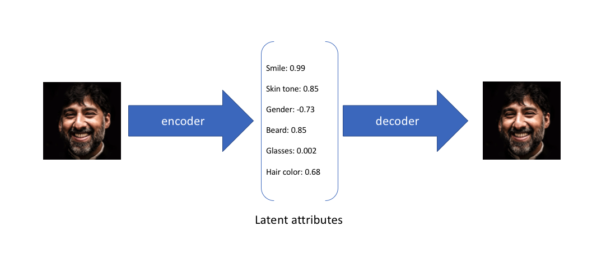
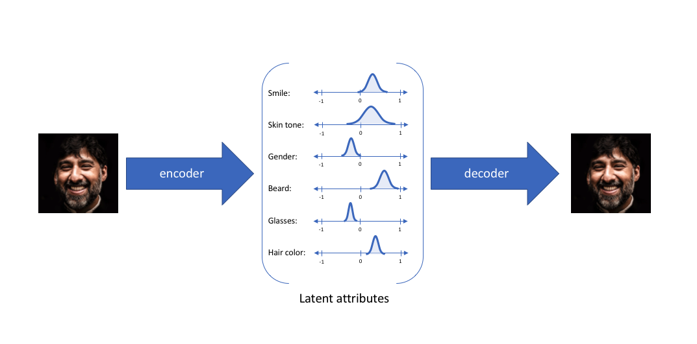

# VAE(Variational Auto-Encoder) - 变分自编码器

## Table & Contents

- [VAE(Variational Auto-Encoder) - 变分自编码器](#vaevariational-auto-encoder---变分自编码器)
  - [Table \& Contents](#table--contents)
- [VAE (Variational Auto-Encoder)](#vae-variational-auto-encoder)
  - [Blog (Jeremy Jordan)](#blog-jeremy-jordan)
  - [VAE - RethinkFun](#vae---rethinkfun)
  - [YouTube](#youtube)
  - [ELBO(Evidence Lower Bound) - 证据下界、变分证据下界、变分下界](#elboevidence-lower-bound---证据下界变分证据下界变分下界)
    - [两种推导](#两种推导)
  - [Posterior Collapse - 后验坍塌](#posterior-collapse---后验坍塌)
- [Denoising Auto-Encoder](#denoising-auto-encoder)

---

[Latent Space Visualization - 个人笔记](../../Math/DimensionReduction/DimensionReduction.md)

---

# VAE (Variational Auto-Encoder)

## Blog (Jeremy Jordan)

[Variational autoencoders - Blog (Jeremy Jordan)](https://www.jeremyjordan.me/variational-autoencoders/)

VAE formulate encoder to **describe a probability distribution** for each latent attribute, rather than AE which **outputs a single value**
1. 
2. 普通 AE
   1. 
3. VAE
   1. 
   2. 别称
      1. encoder 有时被称为 recognition model
      2. decoder 有时被称为 generative model
   3. constructing encoder model to output **a range of possible values(a statistical distribution)** 并喂给 decoder 模型 相当于 enforcing **continuous, smooth latent space representation**
   4. values which are nearby to one another in latent space should correspond with very similar reconstructions
      1. 逼迫解码器在邻域内都要工作
      2. KL 散度
   5. 

数据 x 可以看到，但是 隐变量 z 未知，希望通过 x 推断 z，即计算 $p(z|x) = \frac{p(x|z)p(z)}{p(x)}$，但是计算 $p(x)$ 困难

使用 **Variational Inference**

---

## VAE - RethinkFun

[VAE算法讲解 - B站(RethinkFun)](https://www.bilibili.com/video/BV1xFxMz1EMS)

**非隐变量方法** : 图片 每个 pixel 可以看作 随机变量，整个照片是 pixel 随机变量的 联合分布，空间中 几乎所有点都是噪声，但是 难以得到准确的 概率密度函数 $P(x)$，也不方便采样

**latent 隐变量方法** : 降低维度，并且让隐变量服从简单的分布，方便采样

**原始 AE** : latent space 中 大多数区域都是 无意义的点，只有 少量 **确定的点** 能还原回 原始 输入图片
1. 
2. encoder 的 输出 就是 decoder 的 输入
3. Loss : input/output image 的 MSE Loss，反向传播

**改进 AE** : 生成 正态分布(AE 是生成确定的值)，分散的 正态分布 虽然增加覆盖面积，每个样本的 mean 和 variance 都不同，覆盖面积不同，仍然不能覆盖 大多数 latent space
1. 

**VAE** : 进一步改进，让所有样本，经过 Encoder 生成的 多元正态分布，都接近 **多元标准正态分布**，各个维度相互独立

encoder 只生成 mean & variance 两个 参数
1. mean 可正可负
2. variance 必须为正，$e^\alpha = \sigma^2$，即 $\alpha = \log \sigma^2$

**VAE 训练后**
1. 各个样本的分布 都 更靠近 多元标准正态分布，后续采样更方便
2. 
3. 在 VAE 训练完成之后，进行 重构(Reconstruction) / 评估(Evaluation) 时，没有必要再从正态分布中采样，可以直接使用 Encoder 输出的 均值 $\mu$ 作为隐变量 $\mathbf{z}$ 送入 Decoder

**VAE 训练**
1. 
2. **符号定义**
   1. $x$ : input image
   2. $z$ : 隐变量
   3. $p(z)$ : 隐变量 分布，希望是 多元标准正态分布，生成时从中取样
   4. $q_{\phi}(z|x)$ : encoder 映射 概率密度，以 $\phi$ 为参数
   5. $q_{\theta}(x|z)$ : decoder 映射 概率密度，以 $\theta$ 为参数
3. 训练时，必须使用 **重参数化技巧(Reparameterization Trick)**，从 encoder 输出的 分布中 **采样** (不同于 Inference/Generation)
   1. 原因
      1. 引入随机性，使得 Decoder 必须学习 从分布中的任何一个点(不仅 是 均值点)重建原始输入
      2. 平滑隐空间，使 VAE 具备生成能力
      3. 避免坍塌，防止退化为 传统AE
   2. 直接的采样操作 $\mathbf{z} \sim \mathcal{N}(\mu, \Sigma)$ 不可导，无法通过反向传播进行训练
   3. 每次训练迭代时，从 **标准正态分布** 中采样 **辅助噪声** $\mathbf{\epsilon} \sim \mathcal{N}(\mathbf{0}, \mathbf{I})$，不需要学习
   4. $$\mathbf{z} = \mu + \sigma \odot \epsilon$$
   5. 辅助噪声 $\epsilon$ **必须** 从标准正态分布 $\mathcal{N}(\mathbf{0}, \mathbf{I})$ 中采样，保证隐变量 $z$ 的分布是可控的(正态分布)，简化 KL 散度计算
   6. 随机性 存在于 辅助噪声 $\epsilon$ 中
4. Loss 计算 $L_{VAE}$
   1. 
   2. **重构损失** $L_{REC}$ : 拉开不同 $\mathbf{x}$ 的 $\mu_{\mathbf{x}}$，确保了可区分性
   3. **KL 损失** $L_{KL}$ : 推着所有的 $\mu_{\mathbf{x}}$ 靠近中心 $\mathbf{0}$，确保了隐空间的连续性和可采样性
   4. 两个 loss 相互博弈

**数学推导**
1. 
2. 
3. 最终结果
   1. 第一项 : KL Loss
      1. $\mathbf{p(z)}$ : 理想中的那个标准正态分布
      2. 希望 通过 encoder，可以将 input 映射到的 latent 分布 和 理想分布 接近
   2. 第二项 : Reconstruction Loss
      1. 有个负号，因此 本体越大越好
      2. $\log$ 不影响单调性，可以转化为 $\mathbb{E}_{q_\phi(z|x)}[p_{\theta}(x|z)]$
      3. 对于 给定的 x，通过 encoder 网络 得到 分布 z，并且 要让该分布内的任意值 通过 decoder 网络 还原回 x 的概率 最大
4. Rec Loss 直接使用 MSE 即可
5. KL  Loss 实际计算
   1. 
   2. 随机变量 **相互独立** 时，它们的 联合概率密度函数 = $\prod$ 各个边缘概率密度函数
   3. $d$ 是 空间维度
   4. 
   5. 将上图结果带入，抵消常数项 + 移项
   6. 
   7. 分别求解
      1. 第1项 利用 平方的期望 公式
         1. 
         2. 
      2. 第2项 常数的期望还是期望
         1. 
      3. 第3项 累加的积分 = 积分的累加
         1. 
         2. 随机变量 减去均值 的平方 的期望 就是 方差
      4. 最后 $\sum$ 求和符号 可以合并
6. 最终结果
   1. 

模型架构
1. 
2. encoder 使用 卷积，下采样 长宽减半，通道数翻倍，最后一个特征拉平，全连接层得到 均值 & 方差 (维度 = 隐空间 维度)，在 隐空间的 正态分布 中采样 隐变量
   1. Conv2d
   2. ReLU
   3. BatchNorm
3. decoder 使用 反卷积(转置卷积)，隐变量 通过 线性层，改变维度，转为 特征图形状

训练数据 Kaggle地址 : https://www.kaggle.com/datasets/jessicali9530/celeba-dataset
训练数据百度网盘地址 : https://pan.baidu.com/s/1hT-FUWm_fuVJQiGT5-HvrA?pwd=5rpm
代码地址 : https://github.com/RethinkFun/VAE/blob/main/vae.py

---

## YouTube

[Variational Autoencoder - YouTube(Deepia)](https://www.youtube.com/watch?v=qJeaCHQ1k2w)

[Variational Autoencoder - Model, ELBO, loss function and maths explained easily! - YouTube(Umar Jamil)](https://www.youtube.com/watch?v=iwEzwTTalbg)

[Understanding Variational Autoencoders (VAEs) | Deep Learning - YouTube(DeepBean)](https://www.youtube.com/watch?v=HBYQvKlaE0A)

对于一个训练好的 autoencoder，生成新数据的方法是，从 latent space 中采样，并通过解码器解码

但大多数情况，只会产生杂乱的结果，因为 **latent space 无规则**，**大部分区域不会产生有意义的解码图像**

希望 latent space 中的采样点能够生成连贯的新图像

**Bayesian Statistics** 背景知识
1. 概率密度函数 Probability Density Function
2. 期望 Expectation $$\mathbb{E}[x] = \int_{-\infty}^{+\infty} x p(x) dx$$
3. 联合概率分布 Joint Probability Distribution
4. 边缘概率分布 Marginal Probability Distribution，联合概率对于其他变量进行积分
5. 条件概率 Conditional Probability，联合概率 ÷ 边缘概率 (可以理解为切片并重新归一化)

从给定的  **Data Distribution** $p_{data}(x)$ 中生成新数据，但是不知道 p 的确切形状和属性，只能通过访问样本

**Latent Distribution** 隐分布 $p(z)$，维度较低，捕捉数据 core feature

需要 Mapping 连接 **Data Distribution** 和 **Latent Distribution**

**概念**
1. **prior distribution 先验分布** $p(z) \sim \mathcal{N}(0,1)$，训练前就 人工固定为 **标准正态分布**，给潜空间一个统一、易采样的 "参考坐标"
2. **posterior distribution 后验分布** $p(z|x)$ (latent 由 data 生成 的概率，值大 代表 latent 很有可能 来源于 data distribution 生成，重构为图像 能够得到新样本)
3. 近似后验 $q(z|x) \sim \mathcal{N}(0,1)$，编码器输出(预测 $\mu$ & $\sigma$)，KL散度 将其 拉近 先验 $p(z)$ (ELBO)
4. **likelihood distribution 似然分布** $p(x|z)$ (从 latent 重建 data 的概率)

由于不知道 latent distribution，因此 假设为 **标准正态分布**，从而可以计算 likelihood (**其实可以是任何分布**)

使用 **另一个** 高斯分布 **$q_{\phi}(z|x)$** **近似** 后验 **$p_{\theta}(z|x)$**，其中 $\mu$ & $\sigma$ 是可学习参数

优化过程被称为 **变分贝叶斯**

训练一个 编码器 从图像中 估计 $\mu$ & $\sigma$，使用 解码器 从 后验分布中 采样的 潜变量 重建图像

先验 $p(z)$，后验 $p(z|x)$，近似后验 $q_{\phi}(z|x)$

训练目标 **ELBO** (需要 **最大化**)
1. $$\mathcal{L}(x)=
      \underbrace{\mathbb{E}_{q(z|x)}[\log p(x\,|\,z)]}_{\text{Data Consistency}} - \underbrace{\operatorname{KL}[q(z|x)\|p(z)]}_{\text{Regularization}}$$
2. 重建项 : 让 Decoder 用采样到的 z 能重建 x，**数据一致性** (解码器能否从潜在表示还原出原始数据)
   1. 可简化为 L2 Loss，即 MSE(mean square error)，用 解码器 对 latent vector 重构，并测量与原始图像的 L2 距离
3. 正则项 : Encoder 输出的 $q_{\phi}(z|x)$ 应该和先验基本类似，不要偏离预先定义的 标准正态分布太多
   1. 衡量了 近似后验 $q(z|x)$ 和 先验 $p(z)$ 的 接近程度，假设 先验服从 正态分布，因此 约束 近似后验 也 呈 正态分布形状

相比普通 AutoEncoder，编码器 不是将输入映射到单个点，而是转化为 高斯分布的概率分布(**编码器将数据转化为高斯分布的 $\mu$ & $\sigma$**)

在潜在分布中，随机采样点，解码器将其转换回 高维空间

计算 ELBO 并 反向传播，这里是需要 **最小化**

使用 Reparameterization Trick 重参数化技巧，解决 从近似后验中 采样操作 **无法反向传播**

不直接从 近似分布 中 采样，而是 从固定标准正态分布中 采样 $\epsilon$ (**辅助独立随机变量**) (requires_grad=False，无需计算梯度，作为常值使用)，$\mu + \sigma · \epsilon$ 相当于 调整回近似分布

抽样动作只发生在 $\epsilon$，不含 $\phi$ 无需梯度(requires_grad=False)

对于 两个 高斯分布，KL散度 有 闭式表达式

$$D_{\mathrm{KL}}(\mathcal N_0 \,\|\, \mathcal N_1)
= \log\frac{\sigma_1}{\sigma_0} + \frac{\sigma_0^{2} + (\mu_0 - \mu_1)^{2}}{2\sigma_1^{2}} - \frac{1}{2}$$

优势
1. 允许生成完全新的手写数字，采样向量越接近参考向量，生成的图像就越相似
   1. 
2. 可以融合图像，将两张图像编码为 latent representation，插值，表明 VAE 学到的 latent space 有一定的 连续性

劣势
1. 产生模糊的图像，由于正则项产生的
   1. 
2. 缺乏对生成数据施加特定的约束的能力，无法生成特定的图像

## ELBO(Evidence Lower Bound) - 证据下界、变分证据下界、变分下界

ELBO ((Variational) Evidence Lower Bound)

$\theta$ : 解码器 Decoder 参数 (生成网络) $p_{\theta}(x | z)$

$\phi$   : 编码器 Encoder 参数 (推断网络) $q_{\phi}(z | x)$

变分推断(Variational Inference) 将难以直接求解的后验分布 转为 优化问题，在候选分布$q(z|x)$ 中 找到最接近 真实后验$p(z|x)$ 的分布

evidence 就是指 $$

**推导**

$$
\begin{align*}
\log p_{\theta}(x)
&= \log \int p_{\theta}(x,z)\,dz \\
&= \log \int \frac{q_{\phi}(z \mid x)}{q_{\phi}(z \mid x)} \, p_{\theta}(x,z)\,dz \\
&= \log \, \mathbb{E}_{q_{\phi}(z \mid x)}\!\left[ \frac{p_{\theta}(x,z)}{q_{\phi}(z \mid x)} \right] \\
&\ge \mathbb{E}_{q_{\phi}(z \mid x)}\!\left[ \log p_{\theta}(x,z) - \log q_{\phi}(z \mid x) \right]
\end{align*}
$$

Jensen 不等式 : 若 f 是 凸函数，则 函数的期望 大于等于 期望的函数，若为 凹函数，则不等号方向相反 ($\log$ 为 凹函数)

**需要最大化 ELBO**，==实践中 取反然后 最小化==

$$
\begin{align*}
\mathcal{L}_{\text{ELBO}}(x;\theta,\phi)
&= \mathbb{E}_{q_{\phi}(z \mid x)}\![\log p_{\theta}(x, z) - \log q_{\phi}(z \mid x)] \\
&= \mathbb{E}_{q_{\phi}(z \mid x)}\![\log p_{\theta}(x \mid z) + \log p(z) - \log q_{\phi}(z \mid x)] \\
&= \mathbb{E}_{q_{\phi}(z \mid x)}\![\log p_{\theta}(x \mid z)] - \mathrm{KL}\!(q_{\phi}(z \mid x)\,\|\,p(z))
\end{align*}
$$

P.S. : $D_{KL}(p||q) = \mathbb{E}_p[log\frac{p}{q}] = \sum p \log \frac{p}{q}$

如果要 最大化 evidence，可以最大化 ELBO

拆分联合概率，ELBO 可以拆分为两个部分
1. 似然函数 在 近似后验分布 的 期望
2. 后验分布 和 先验分布 间的 KL散度

### 两种推导

**使用 KL 散度**
1. 
2. 移项
3. 由于 KL-Divergece 非负
4. 

**使用 Jensen's 不等式**
1. 

---

## Posterior Collapse - 后验坍塌

近似后验分布 $q_\phi(z|x)$ 变得与先验分布 $p(z)$ 几乎相同，编码器失去了从输入数据中提取有用信息的能力

具体表现
1. 正常情况 : $q(z|x1) ≠ q(z|x2)$，不同输入产生不同后验
2. 后验坍塌 : $q(z|x1) ≈ q(z|x2) ≈ p(z)$，所有输入都产生相似后验
3. 潜在变量z变成与输入x无关的噪声

产生原因
1. KL散度项过强 : 当 β 过大时，模型过度关注让 $q(z|x)$ 接近 $p(z)$，忽略了重构质量
2. 解码器过于强大 : 解码器能从噪声z生成合理输出，编码器偷懒
3. 信息瓶颈 : 潜在空间维度不足，无法编码复杂的数据信息

涵盖Scale-VAE放大隐变量
CR-VAE对比学习增强互信息
逆Lipschitz约束Decoder
动态β调度与层次化上下文增强等有效方法

---

# Denoising Auto-Encoder

[Denoising Autoencoders - YouTube(Deepia)](https://www.youtube.com/watch?v=0V96wE7lY4w)

