# VQ-VAE : Vector-Quantized Variational AutoEncoder

[Vector-Quantized Variational Autoencoders (VQ-VAEs) - YouTube(DeepBean)](https://www.youtube.com/watch?v=yQvELPjmyn0)

---

representation learning 的目标是 efficient(高效的) representation

motivation : continuous latent space -> discrete latent space

没有 无限多的 latent vector，需要从有限的集合(**code book**) 选取，constrain 了 latent space

vanilla VAE
1. 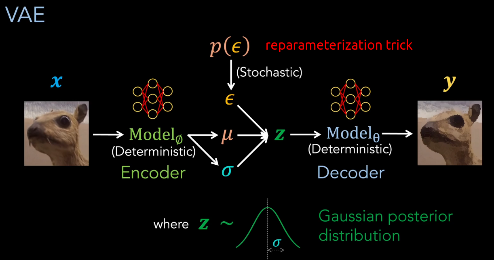
2. 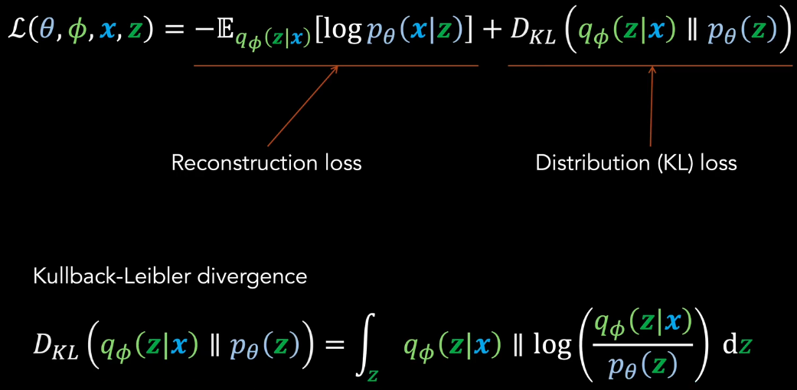
3. 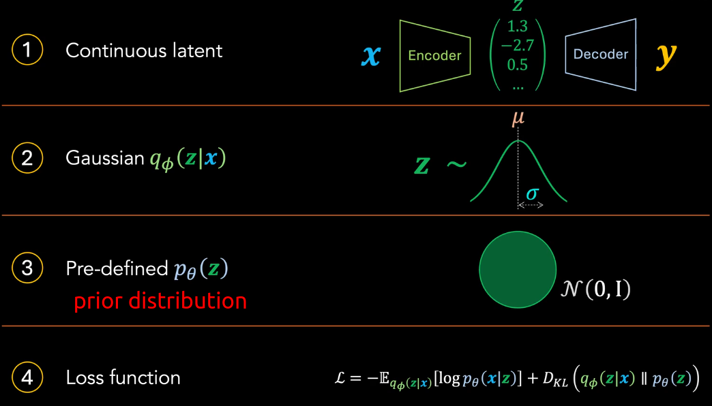

VQ-VAE 针对 VAE 的 component 都进行 调整
1. 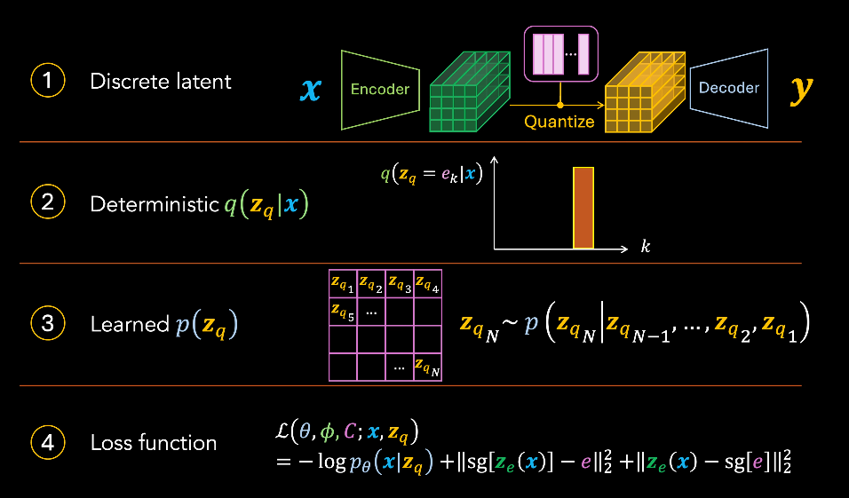

VQ-VAE architecture
1. 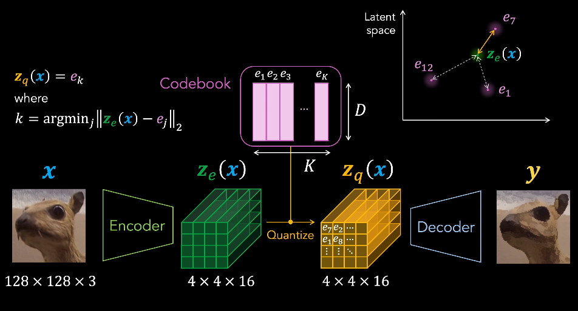
2. 3个 **trainable components**
   1. **Encoder**
   2. **Decoder**
   3. **CodeBook** : 2个 hyper-parameters
      1. **D** : Latent Space Dimension
      2. **K** : Num of Latent Vectors (codebook size)
3. **Quantization**
   1. Encoding Latent $z_e$，被 CodeBook 中的 最接近的 CodeWord 替换，得到 Quantized Latent $z_q$
   2. distance 可以用 L2-Norm/Euclidean 衡量
   3. 保证所有 输入 decoder 的 latent vector 都是来自 **有限的 CodeBook**
4. VQ-VAE 前向传播中，没有 **随机采样**
   1. 没有 VAE 的 mean + var & reparameterization trick
   2. 后验分布 是 确定性的 deterministic (近邻查找 是 **确定性的**)
5. Prior Distribution 区别 (pre-defined -> learned)
   1. VAE
      1. 使用 pre-defined 的 Gaussian 作为先验分布
      2. 本质是 将 data space 的 target distribution 映射到 latent space 的 prior distribution
      3. 通过 KL divergence，prior 使得 latent posterior 被 bias，变成 和 prior 一样的
   2. VQ-VAE
      1. 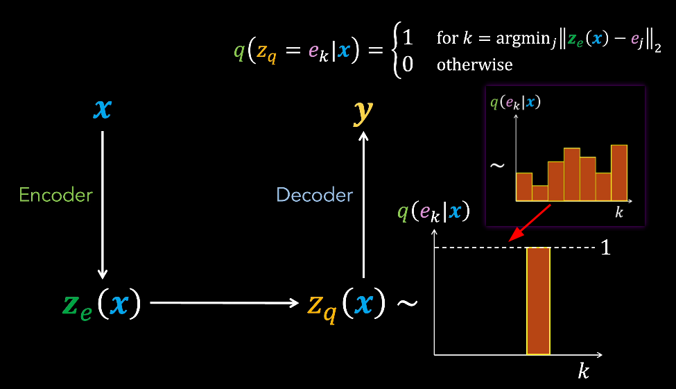
      2. 不使用 Gaussian Distribution，而是 **==Categorical Distribution==**(类别分布)，**K(codebook size) 个选择**
      3. 近邻查找是 deterministic 的
      4. 对于最近 neighbour index，后验概率 **posterior probability**$q(e_k | x)$ 为 1，其他位置 为 0
   3. Distribution Bias 问题
      1. **训练时**，不希望模型在 选择 索引上产生偏差(防止出现 ELBO 中的 KL惩罚 使用 低先验概率的索引)
         1. 因此 **prior** 是 **均匀的 类别分布**，概率都是 $\frac{1}{K}$，不会 bias 选择
         2. 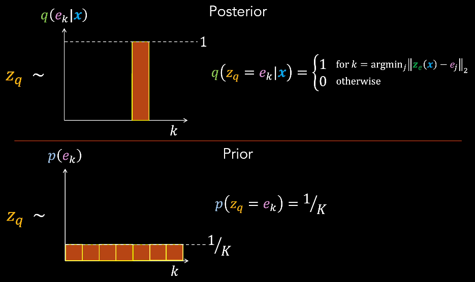
      2. 即使训练时 不希望 bias CodeWord 选择，但 最终 数据集的 CodeWord 并不会是 均匀分布
      3. CodeWord 之间相互影响，不相互独立，**真实先验 不一定是 均匀分布**
         1. 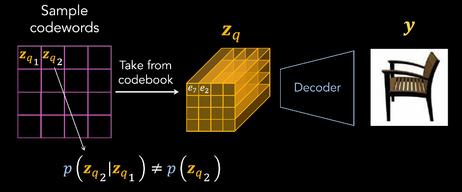
         2. 类似于 NLP 中，后续 token 依赖于 之前 token
            1. 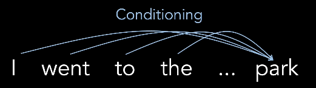
      4. 因此 **不能各个位置独立随机采样 CodeWord**，违背了这些空间关联(stray from this distribution)，大概率生成 不合理的样本
      5. VAE 中的 prior 预定义 & 固定，VQ-VAE 中的 **真实 prior** 需要在 训练过程中 学习(**隐式**)
      6. **Auto-Regressive** 模型 **建模整张码字网格的联合分布**
         1. 通过 **Ancestral(祖先的) Sampling** 构建 codeword 选择过程
            1. 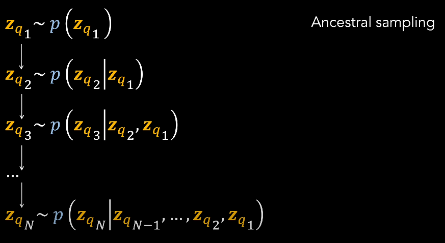
         2. 逐步 光栅化的 扫描，选出所有 codeword，最终一起 decode
            1. 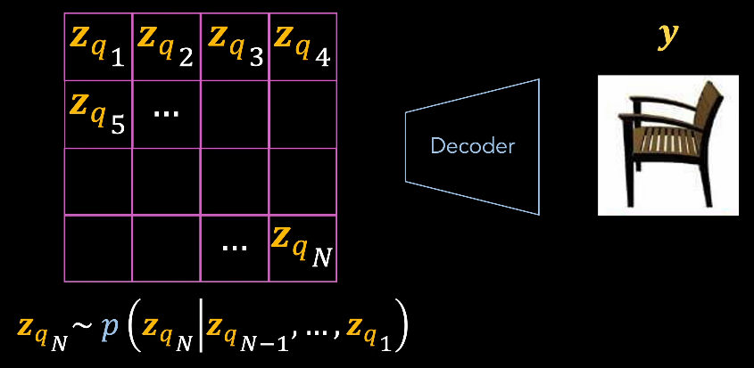
         3. 原文使用
            1. PixelCNN for images
            2. WaveNet for audio
            3. 也可以使用 Transformer for images/audio/text
6. Loss Function
   1. 只包含 **Reconstruction Loss** + **CodeBook Loss** + **Commitment Loss**
      1. 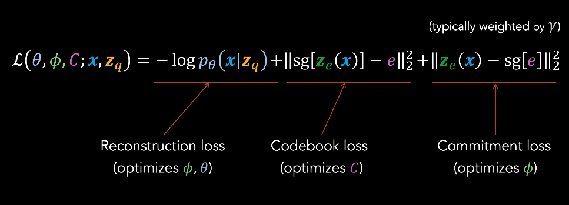
      2. ==sg== : stop-gradient operator
   2. 没有 KL Loss
      1. 有 **prior**(均匀 类别分布) & **posterior**(单值 类别分布) 可以计算 KL Loss
      2. 退化为 **constant** $\log K$，仅取决于 CodeBook size K
      3. **不会出现在 训练目标 training objective 中**
      4. 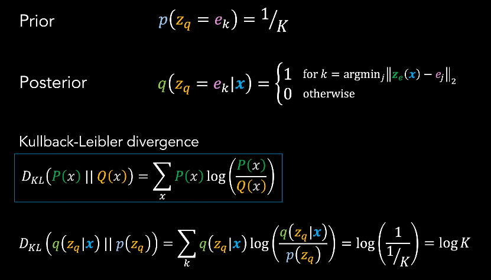
   3. **Reconstruct Loss**
      1. 计算 取决于 全部的 3个 部分
         1. Encoder 参数 : $\phi$
         2. Decoder 参数 : $\theta$
         3. CodeBook $C$
      2. 不需要 后验 posterior $q(e_k|x)$，因为是 确定的
      3. **Quantization 步骤 不可微**
         1. 直接==复制(Straight-Through Estimation)== $z_q$ 给 $z_e$，梯度直接传给 encoder
         2. 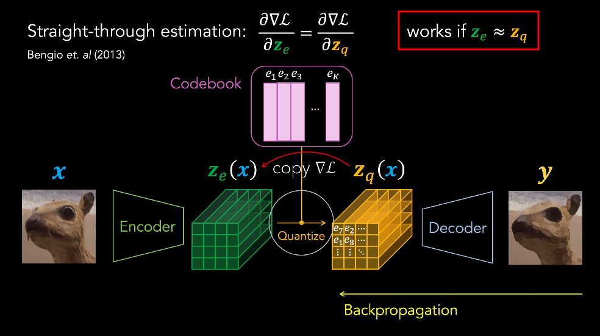
         3. 如果 $z_q$ 是对 $z_e$ 的 good estimation，STE 很有效
         4. 但是 梯度没有 给 CodeBook
   4. **CodeBook Loss / VQ Loss / Dictionary Learning Loss** : 使得 $z_q \approx z_e$
      1. CodeBook 随机初始化
      2. 每个 vector 和 关联编码向量的 平方距离
      3. 通过 **stop-gradient operator**，不向 Encoder 提供任何 梯度，仅对 CodeBook 更新
      4. $e$ : $z_e(x)$ 最近邻查表选中的那个码本向量($=z_q(x)$)，码本 $C$ 里被激活的那一项，loss 把它拉向 encoder 输出
      5. **sparse loss** : 没被选中的 codeword 不会被更新
   5. **Commitment Loss** : 用于解决下面的 2个问题
      1. 可能遇到的 undesirable behaviors
         1. encode vector **fluctuate** between codebook vectors
            1. 当 encoder 参数训练的 比 codebook 快很多，容易发生
            2. 导致 训练不稳定 & codebook 冗余
            3. 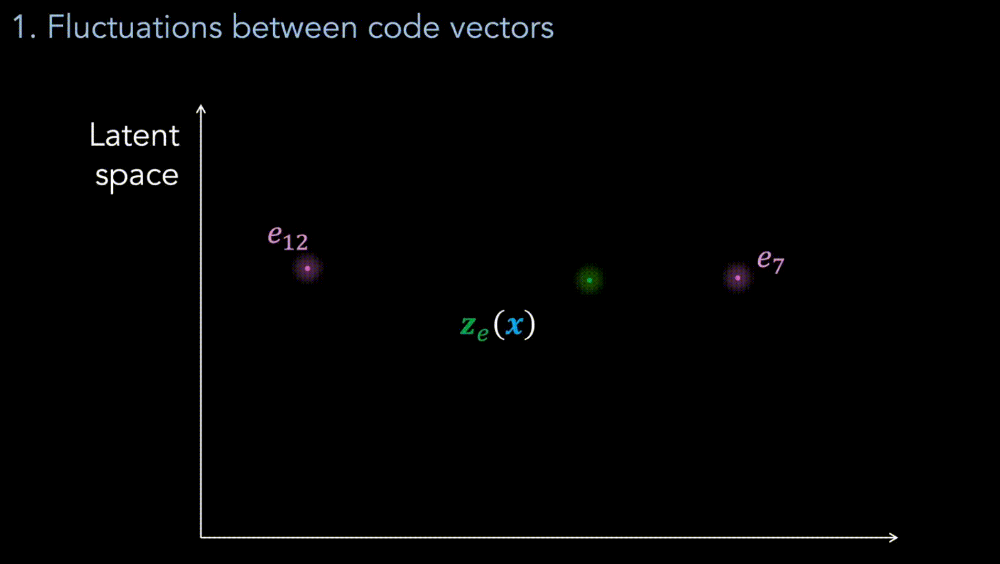
            4. z 来回震荡，e 相互靠近
         2. encoder vectors grow arbitrarily large
            1. codebook loss 不惩罚 encoder，所以只是 codeword 单方向跟随，而非双向奔赴
            2. 导致数值不稳定
            3. 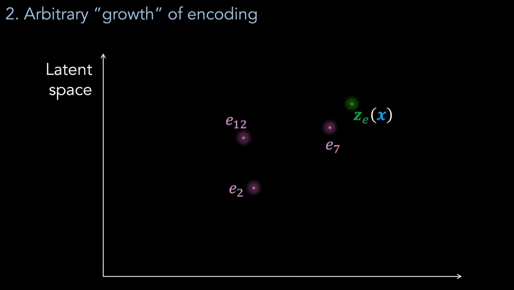
            4. e 和 z 同方向 扩大，e 会跟随 z
      2. 只更新 encoder 而非 codebook
      3. 主要作用 : 惩罚 偏离 codeword 过远的 encoder vector

Discrete/Quantization 的好处
1. 有些 modality 天然适合 discrete representation，eg : audio & text
2. Data Compression
   1. 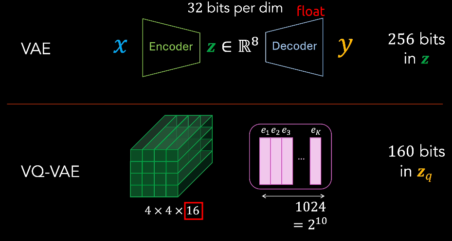
3. 可用于 Tokenization
   1. CodeBook 是学习出来的，可以学下游任务的 token，也更好使用 Transformer

⚠️ 但"生成新数据"时,还是要 sample 的

这是最容易被"近邻是 deterministic 所以不用 sample"这句话带偏的地方:

- 重建(encode→quantize→decode):给定 x,全程确定,不 sample。✅ 你说的对。
- 生成全新样本:VQ-VAE 本体只是个"离散自编码器",它不能直接从先验凭空生成。要在第二阶段单独训一个 autoregressive prior(图像用 PixelCNN、音频用 WaveNet)去建模那些离散 code 索引的分布。生成时,是从这个先验里逐个 categorical 采样出 token 序列,再查表成 $z_q$ 送进 decoder。

