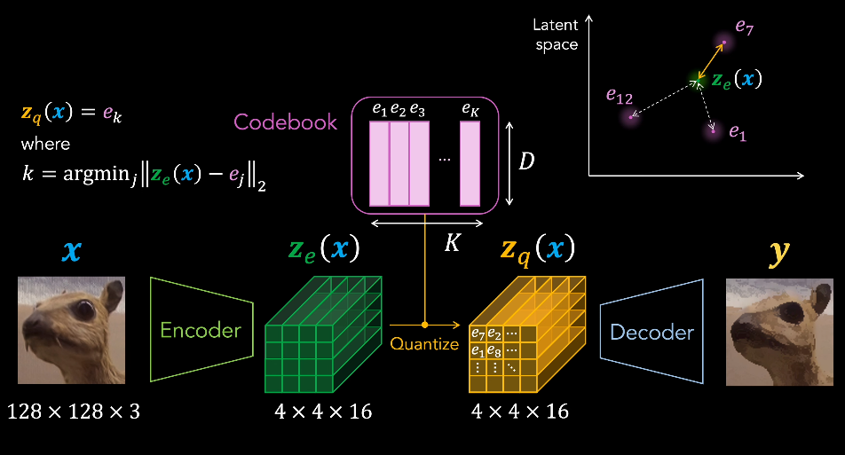
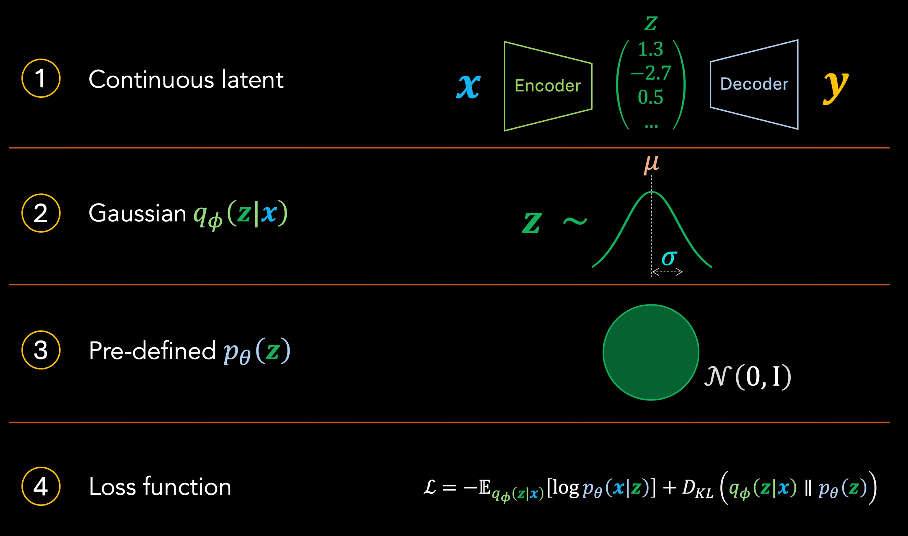
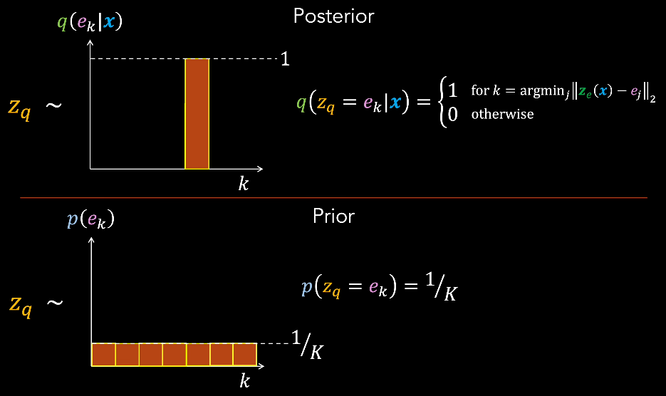
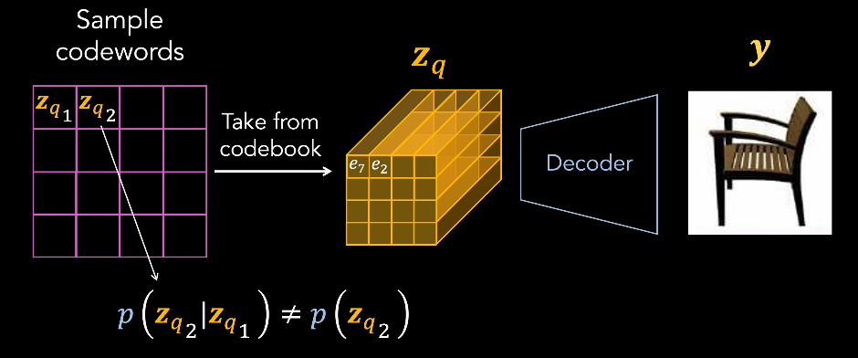
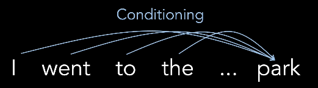
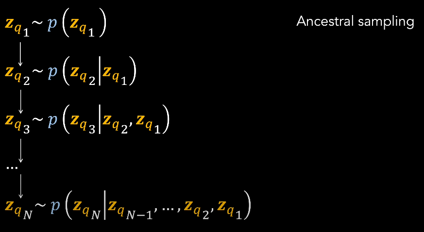
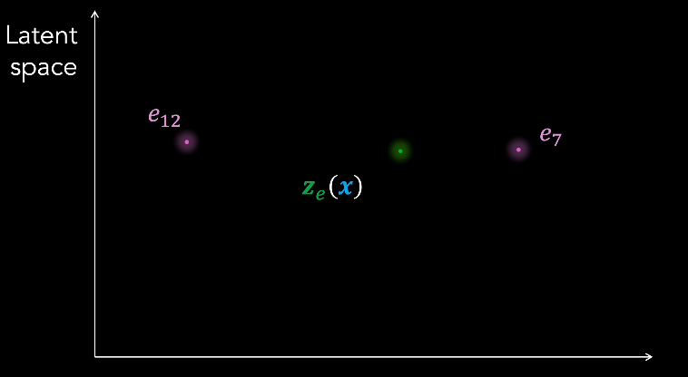

# VQ-VAE

[Vector-Quantized Variational Autoencoders (VQ-VAEs) - YouTube(DeepBean)](https://www.youtube.com/watch?v=yQvELPjmyn0)

latent representation 是 离散化的/量化的

没有 无限多的 latent vector，需要从有限的集合(code book) 选取

review 普通 VAE
1. 
2. 

整个模型有 3个 可训练 part
1. Encoder
2. Decoder
3. CodeBook : 2个 超参
   1. D : Latent Space Dimension
   2. K : Num of Latent Vectors

Quantization
1. Encoding Latent $Z_e$，被 CodeBook 中的 最接近的 替换，得到 Quantized Latent $Z_q$
2. 接近程度 可以用 L2/欧氏距离 衡量

VQ-VAE 针对 VAE 的 component 都进行 调整
1. 
2. Discrete Latent Encoding
3. VQ-VAE 前向传播，没有随机采样，而是 确定性的 deterministic (近邻查找 是 确定性的)
4. 不再使用 Gaussian 作为 先验/后验，而是使用 类别分布(Categorical Distribution)，K 个选择
   1. VAE 中，预先定义 先验 Prior $p_{\theta}(z)$，然后 尝试将 data space 和 latent space 进行 match
   2. 由于 KL 散度项 $D_{KL}(q_{\phi}(z|x) || p_{\theta}(z))$，先验分布 会对 latent后验 分布产生 影响
   3. 都是 Gaussian，因此 最终使得，mean 接近 0，var 接近 1
   4. VQ-VAE 使用 近邻搜索，后验概率 **posterior** probability $q(e_k | x)$ = 1
      1. 
   5. 训练时，不希望模型在 选择 索引上产生偏差(防止出现 ELBO 中的 KL 惩罚使用低先验概率的索引)，因此 **prior** 是 均匀类别分布
      1. 
   6. 即使训练的时候 不希望 bias CodeWord 选择，但是 最终 数据集的 CodeWord 并不会是 均匀分布，CodeWord 之间可能相互影响，真实先验 不一定要与 均匀先验 一致
      1. 
      2. 类似于 NLP 中，后续 token 依赖于 之前 token
         1. 
   7. VAE 中的 prior 预定义 & 固定，VQ-VAE 中的 真实 prior 可以在 训练过程中 学习(隐式，并不知道实际是什么)
   8. Auto-Regressive 模型 来学习 CodeWords，通过 Ancestral Sampling
      1. 
      2. 逐步 光栅化的 扫描，最终 decoder
      3. 
      4. 原文使用 PixelCNN + WaveNet for Audio，也可以使用 Transformer
5. Loss Function
   1. 
   2. sg : stop-gradient operator
   3. KL Loss
      1. 有了 prior & posterior 就 可以计算 KL Loss，基本是个 **constant** $\log K$(仅取决于 CodeBook 大小 K)
      2. **不会出现在 训练目标 training objective 中**
      3. 
   4. Reconstruct Loss
      1. 计算 取决于 全部的 3个 部分
         1. Encoder 参数是 $\phi$
         2. Decoder 参数是 $\theta$
         3. CodeBook $C$
      2. 不需要 后验 posterior $q(e_k|x)$，因为是 确定的
      3. Quantization 步骤 不可微，直接复制(Straight-Through Estimation)
         1. 
      4. 但是 梯度没有 给 CodeBook(随机初始化的)
   5. CodeBook Loss : 使得 $z_q \approx z_e$
      1. 每个 vector 和 关联编码向量的 平方距离
      2. 通过 sg operator 不向 Encoder 提供任何 梯度
      3. 没有匹配的 CodeWord 就不做任何操作，没有更新
      4. 算是 sparse loss，只对子集
   6. Commitment Loss : 用于解决下面的 2个问题
      1. 可能遇到的问题
         1. encode vector fluctuate between code vectors，如果 encoder 参数训练的 比 codebook 快很多，导致训练不稳定 & codebook 冗余
            1. 
            2. z 来回震荡，e 相互靠近
         2. encoder vector arbitrary growth，导致数值不稳定，产生原因是 codebook loss 不惩罚 encoder，所以只是单方向跟随，而非双向奔赴
            1. 
            2. e 和 z 同方向 扩大，e 会跟随 z

Discrete/Quantization 的好处
1. discrete representation 是 natural (NLP)
2. Data Compression (JPG图像压缩)
   1. 
3. 可用于 Tokenization，CodeBook 是学习出来的，可以学下游任务的 token，也更好使用 Transformer

