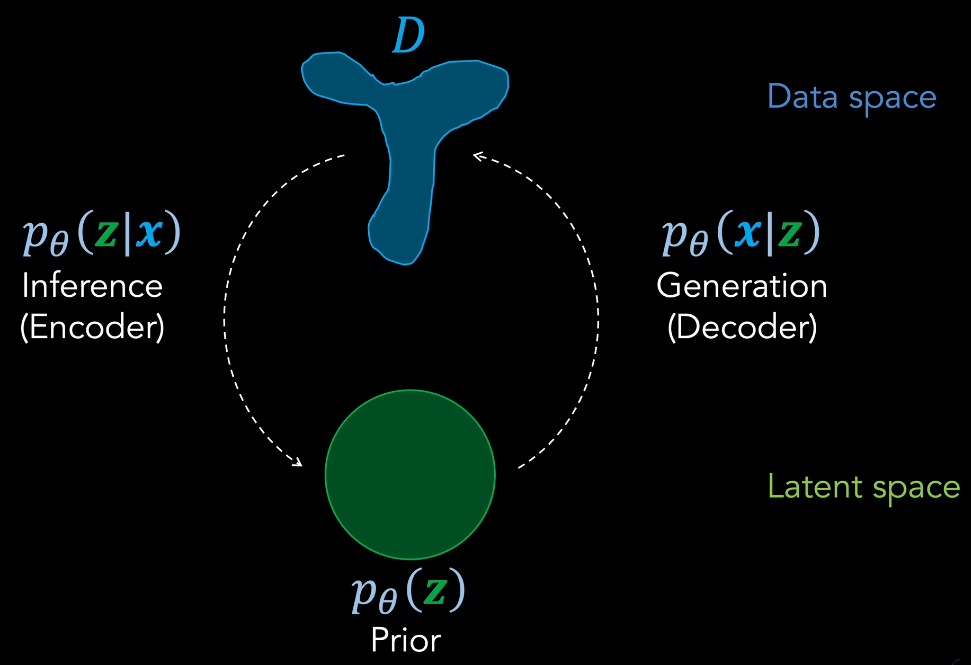
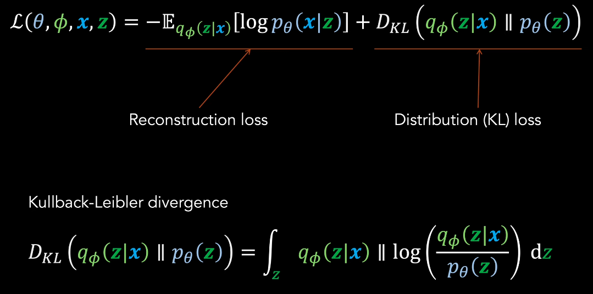
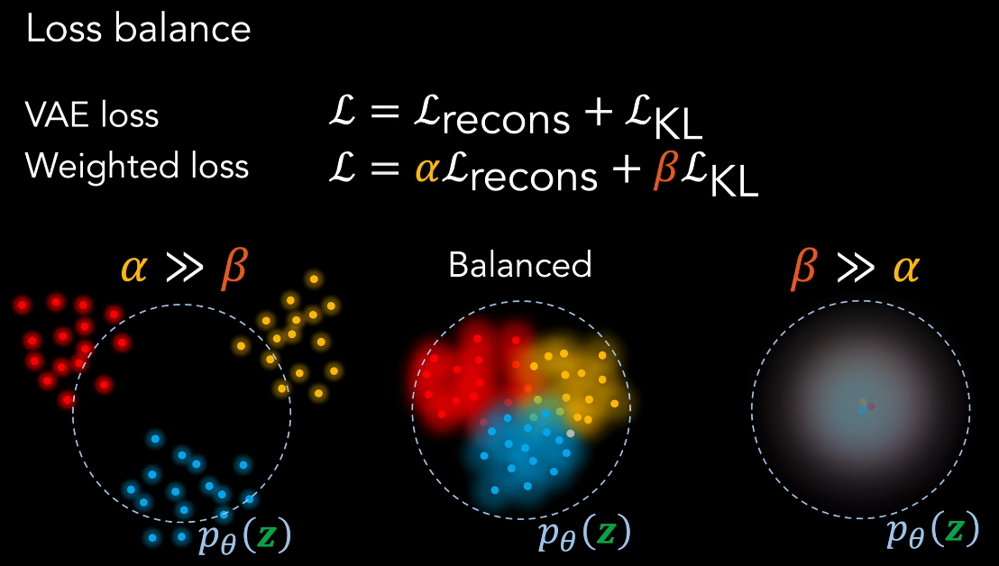
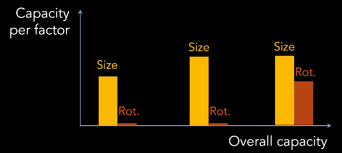
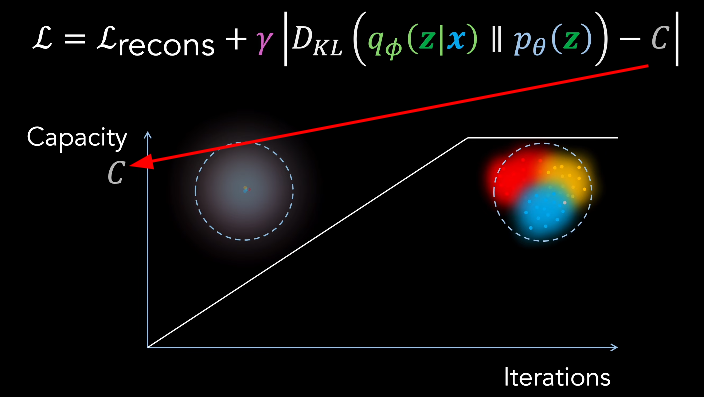
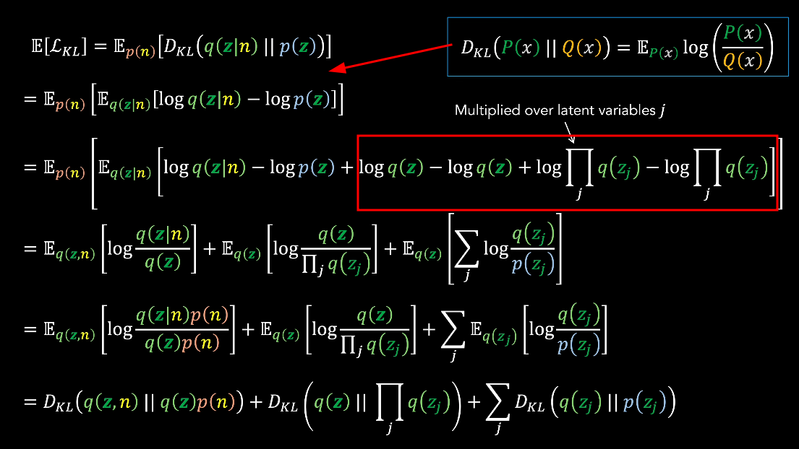

# β-VAE

[Disentanglement with beta-VAEs - YouTube(DeepBean)](https://www.youtube.com/watch?v=RNAZA7iytNQ)

参考
1. [beta-VAE](./beta-VAE.pdf)
2. [Understanding disentangling in β-VAE.pdf](./Understanding%20disentangling%20in%20β-VAE.pdf)
3. [Isolating Sources of Disentanglement in VAEs.pdf](./Isolating%20Sources%20of%20Disentanglement%20in%20VAEs.pdf)

beta-VAE 擅长 feature disentanglement，**特征解耦**

review 普通 VAE
1. 
2. 对于 binary-valued 的 数据空间，输出分布 是 Bernoulli 分布，对于 real-valued 的 数据空间，输出分布 是 高斯分布
   1. 
3. Loss Balance/Weight (重建项 & KL项)
   1. 
   2. 
   3. KL项 weight 太大
      1. 信息丢失 : 强制潜在空间过于 规整，丢失数据中的重要细节和变化，生成的样本缺乏多样性
      2. 欠拟合 : 模型过于简化(重合)，无法捕捉数据复杂性，生成质量下降，样本模糊
      3. 后验坍塌 : 近似后验 过度接近 先验，潜在变量失去表达能力，变成无意义的噪声
   4. 重建项 weight 太大
      1. 过度专注于重构，重构效果确实可以，但是忽略了潜在空间的整体结构
      2. 忽略潜在空间的连续性，生成能力受限，容易产生无意义样本
      3. 过拟合风险，模型记忆训练数据而非学习通用表示，泛化能力差，对新数据表现不佳
4. **Side Effect** : 优先考虑 KL-Divergence 项，可以实现 feature disentanglement
   1. 标准正态分布 每个维度都是独立的
   2. **强 KL 约束** 迫使 Encoder 学习到的每个隐变量维度 尽可能独立
   3. 增大 β 相当于 增加 信息瓶颈的强度(标准正态分布的信息容量是有限)，编码器被迫用最少的、最独立的信息来重构输入

从 **信息论** 角度理解
1. VAE 可以被视作 通信设备
   1. 
   2. encoder & sampler 可以被视为 **communication channel**
   3. 输入 是 信号x，通过  encoder & sampler ，生成 latent z(通过信道 接收到的信号)
   4. Noise Source 相当于是从 Gaussian 中随机采样 latent
2. 信道容量(Channel Capacity) : maximum rate of information transmission，互信的上限(对互信息再取最优)
3. 互信息 Mutual Information
   1. 相关性越强，互信息越大
   2. input/output 能够提供关于 output/input 是怎样的信息 的程度
   3. 互信息是对称的
   4. $$I(X;Y)=D_{\text{KL}}(P(X,Y) || P(X)P(Y))=I(Y;X)$$
      1. 联合分布 & 边缘分布 的 KL散度
4. VAE 可以 间接控制 信道容量，通过调整 2个 loss 的权重
   1. 
   2. 考虑(增大对应项的权重，然后强制该项变小)
   3. 考虑 reconstruction 项，减小 overlap，均值相差大，方差减小，增大互信息
   4. 考虑 KL 散度 项，均值坍缩到近似(0)，**单个样本的方差变大**(从小尖峰 到 标准正态分布，不确定性增加)，x & z 相互难以辨别，减小互信息
      1. 极端情况，所有 input 映射到 先验分布，信道容量为 0
5. KL 散度高，容量大

Low Encoder Capacity 会促进 latent space 的 Disentanglement
1. data point x 由 distinct generative factors 决定
2. factors 重要性有所不同

在 容量受限的情况下，只能 编码 少部分 factors，只能选择最重要的，随着容量增加，逐渐恢复越来越多的 factors
1. 

模型将 feature 分配给不同 latent dimension，更好控制 per-feature 方差
1. 
2. 重要的特征 需要 更大的容量 & 更小的方差
3. beta 增大，KL散度项 权重增大，模型更强制让 KL散度 变小，近似后验接近先验，跨样本分散变小，方差小

**Trade-Off** : 增加 beta，可以增强 disentanglement，但是 reconstruction 能力变弱

在训练迭代中，逐渐增加 通道 容量，直到最大值
1. 
2. 相当于 早期鼓励 disentanglement，后期改进 reconstruction
3. 后期 不太会 完全重新分配 前期 得到的 解缠特征，因此可以 保持解缠 & 改进重建
4. 通过调整 Loss Function 来实现

可以从 KL=Divergence 本身 数学推导出 解耦
1. 扩展模型，增加 离散 均匀 随机变量 $n$，表示 训练数据集 中 样本的选择
   1. 
2. 添项 + 组合
   1. 
3. 每项有各自含义
   1. data_index($n$) & latent($z$) 的 互信息
   2. ☆ 潜变量的 广义多变量互信息，Total Correlation
   3. dimension-wise KL 散度
   4. 
   5. 直观上说的 解缠，指的就是 Total Correlation 项
      1. 如果低，说明知道某个 latent 的值，几乎不能得知其他 latent

新方案 β-TCVAE (TC - total correlation)，给3项分别增加权重
1. 

Disentanglement Metrics
1. β-VAE
   1. 
   2. 通过 调整 generative factors(已知 ground truth factors) 得到 L对 数据
   3. 每个 pair 中，单个 factor 保持不变，其他 factors 随机化
   4. 计算 每个 pair 的 average difference
   5. 训练一个 线性分类器 预测 ground truth factor($v$) 和 特定 latent variable
   6. 如果能准确预测，则解缠性能好
   7. 需要提前知道 ground truth factor
2. β-TCVAE
   1. 
   2. 不需要另外的模型，而是使用 mutual-information
   3. ground truth factor($v_k$)
   4. 计算 $v_k$ 和所有 latent variables 的 互信息
   5. 希望 互信息 高度集中在 某个 latent variable
   6. 计算 最高 & 第二高 的 互信息 gap
   7. 通过 $v_k$ 的 熵 进行归一化，并对所有因子进行平均
   1. 也 需要提前知道 ground truth factor
3. ground truth factor 一般 由人类选择，有可解释性，语义上无关

