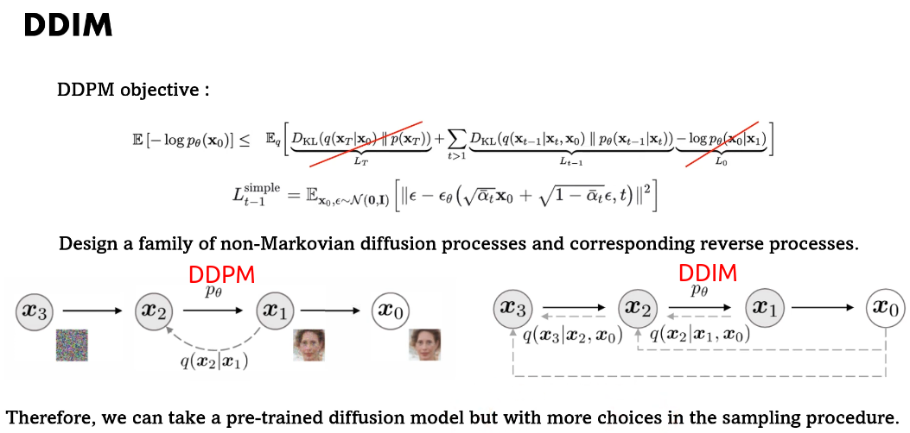
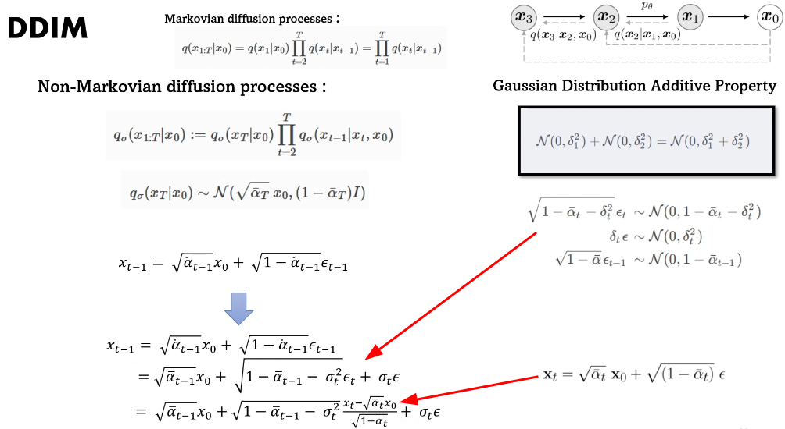

# DDIM : Denoising Diffusion Implicit Models

- [DDIM : Denoising Diffusion Implicit Models](#ddim--denoising-diffusion-implicit-models)

---

[DDIM介紹 換個推導方式大加速 - YouTube](https://www.youtube.com/watch?v=swUoNBpHRpY)

Diffusion Model / VAE / GAN 优劣对比

是的 DDPM 的变种，解决 DDPM 反向过程 Markov sampling 时间消耗大的问题

Non-Markovian Diffusion Processes

DDPM 用 $x_t$ 表示 $x_0$

替换 $x_0$

DDPM 反向过程添加噪声，同一个 sample 的 noise 得到不同结果

DDIM 反向过程不加噪声(没有随机性，implicit)，sample 的 noise 会得到相同结果

实验
1. CIFAR10 (32×32)
2. CelebA  (64×64)