# DDPM : Denoising Diffusion Probabilistic Model

- [DDPM : Denoising Diffusion Probabilistic Model](#ddpm--denoising-diffusion-probabilistic-model)
- [DDPM - RethinkFun](#ddpm---rethinkfun)
  - [直观理解](#直观理解)
  - [技术细节](#技术细节)
- [DDPM - YouTube](#ddpm---youtube)
- [Diffusion Model - 李宏毅](#diffusion-model---李宏毅)
  - [浅谈 生成模型 Diffusion Model 原理](#浅谈-生成模型-diffusion-model-原理)
  - [Stable Diffusion、DALL-E、Imagen 背后共同的套路](#stable-diffusiondall-eimagen-背后共同的套路)
  - [Diffusion Model 原理剖析](#diffusion-model-原理剖析)
- [简介](#简介)
- [原理](#原理)
- [Denoising Diffusion Probabilistic Models(DDPM)](#denoising-diffusion-probabilistic-modelsddpm)
- [对比](#对比)

[信息量 + 香农熵 + 交叉熵 + KL散度 - 个人笔记](../../Math/Entropy&Divergence/EntropyDivergence.md)

---

# DDPM - RethinkFun

## 直观理解

[图像生成 扩散模型 DDPM算法讲解 1 : 直观理解 - B站(RethinkFun)](https://www.bilibili.com/video/BV16ZsPz4ECF)

整体过程
1. 
2. $x_0$ : 原始&清晰的 图片
3. $x_T$ : 完全变为噪声的 图片
4. 希望 网络学习 一步步 去噪声 denoising 过程
5. 训练好网络后，可以 随机生成 噪声数据，让模型 逐步去噪，生成清晰的图片

正向加噪
1. 
2. **目标** : 使得 每个pixel的值 像是从 标准正态分布 中 抽取
3. ==加噪过程中，每个像素值都是独立的==，生成多维度噪声(形状和图片一致)
4. **单步加噪**
   1. 从 标准正态分布中 采样 $\epsilon$，乘以 噪声强度 $\beta$，再加回 $x_0$ 得到 $x_1$，完成加噪过程
   2. 相当于从 以 $x_0$ 为均值 $\beta$ 为标准差 的正态分布 中 采样
   3. 可以 继续根据上述步骤 单步加噪
5. 其实也可以 多步加噪
6. 目前 加噪过程 存在问题
   1. 
   2. 均值一直为 $x_0$，方差一直增大，无法实现最终 $x_T \sim \mathcal{N}(0,1)$
   3. 后期，图像逐渐杂乱，如果希望达到同样的破坏效果，应该加更大噪声，而现在的噪声强度不变
7. DDPM 改进
   1. 

## 技术细节

[图像生成 扩散模型 DDPM算法讲解 2 : 数学推导和代码实现 - B站(RethinkFun)](https://www.bilibili.com/video/BV11KsPzwE2m)

---

# DDPM - YouTube

[Diffusion Models: DDPM - YouTube(Deepia)](https://www.youtube.com/watch?v=EhndHhIvWWw)

[DDPM介紹 Diffusion 開山之祖 - YouTube](https://www.youtube.com/watch?v=6qR-BapJn-g)

常用 Generative Model 对比
1. 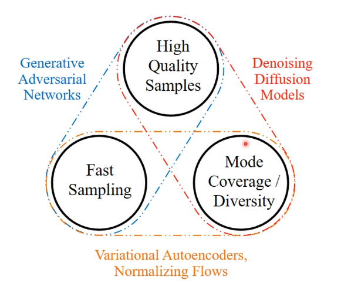

DDPM : Denoising Diffusion Probabilistic Models

思想
1. 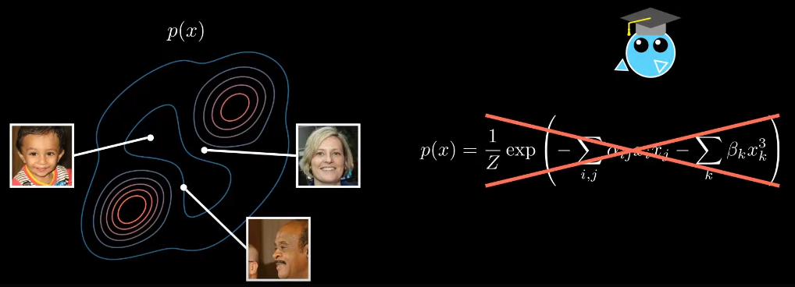
2. **训练数据** $p(x)$ 概率分布 复杂 无法使用单一的表达式完整描述
3. 但仍希望生成新图像，从未知分布中，抽取新的样本点，通过 从 图像中去除 Gaussian Noise 解决问题
4. 
5. 如果模型有效，应该能够从随机噪声(标准正态分布)开始，逐步转化为有意义的图像
   1. 绝大多数标准形式的扩散模型中(eg: DDPM、Stable Diffusion 等)，用于前向过程(加噪) 和 作为反向过程(去噪) **起点的** 随机噪声，就是从标准正态分布(Standard Normal Distribution，标准高斯分布)中采样的

**前向过程** ($q(x_t | x_{t-1})$)
1. 前向过程，所有参数 fixed
2. 单步
   1. 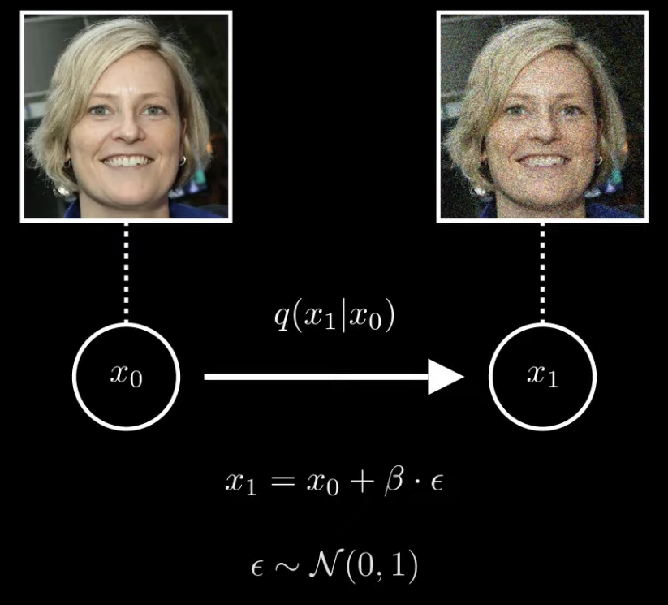
   2. 原始图像 $x_0$，无 noise
   3. 使用 条件分布 $q(x_1 | x_0)$ 生成下一个图像
   4. 添加 高斯噪声 $x_1 = x_0 + \beta · \epsilon$ 得到 $x_1$，标量 $\beta$(控制噪声的量)，**$\epsilon \sim \mathcal{N}(0, 1)$**
   5. $q(x_1 | x_0) = \mathcal{N}(x_0, \beta)$，可以理解为 从 以 $x_0$ 为中心，方差 为 $\beta$ 的 高斯分布中抽取样本
3. 两步
   1. 独立地叠加 $\beta$ 方差，等价于 一次性叠加 $2\beta$ 方差的高斯噪声
   2. **独立的高斯分布** 相加时，**均值相加，方差相加**
   3. 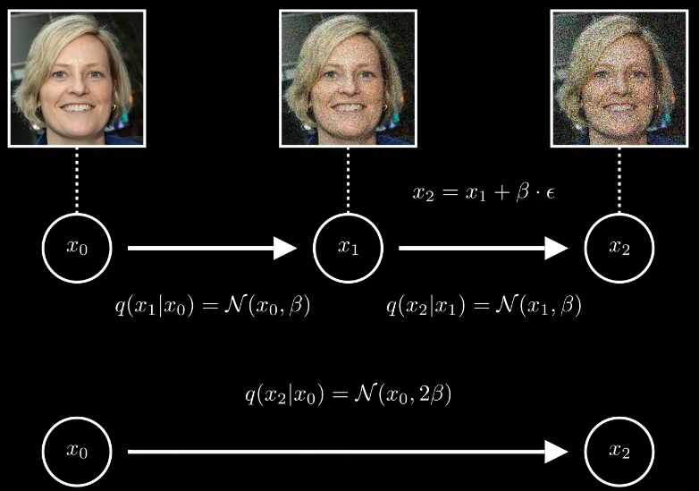
4. 多步
   1. 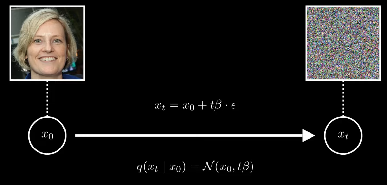
   2. **Variance Explode 问题** : 希望 加噪的最终结果 $x_t$ 是 标准正态分布，但是 目前 均值固定是 $x_0$ & 方差是 $t\beta$ 无限变大，扩散过程不会收敛到 标准正态分布
   3. 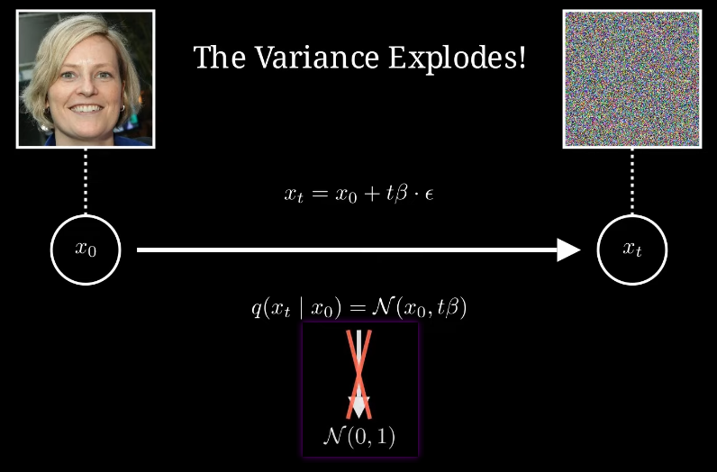

需要切实可行的 Diffusion Process，能够让数据最终转为 **标准正态分布**
1. Objective : $q(x_t|x_0) \xrightarrow[]{t \to \infty} \mathcal{N}(0,1)$
2. 每个 step 需要改变 mean，加上一个系数 $\sqrt{1 - \beta}$ (for simplicity)，使其减小到 0，$\bar{\alpha}_t = (1 - \beta)^t \to 0$，随着时间增加，均值 趋于 0，方差 趋于 1
3. 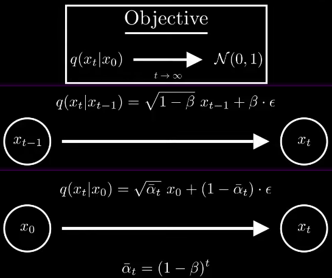
4. 最终的效果就是，当 t 趋于无穷大时(一直加噪)，分布 $q(x_t|x_0)$ 与初始值 $x_0$ 无关
5. 实际上 **每次增加不同程度的噪声** (**noise/variance schedule**)，而非使用 固定的 $\beta$
   1. 使用不同的 $\beta$ 那么 $\bar{\alpha}_t$ 就变成了 $\prod_{i=1}^t (1 - \beta_i)$
   2. 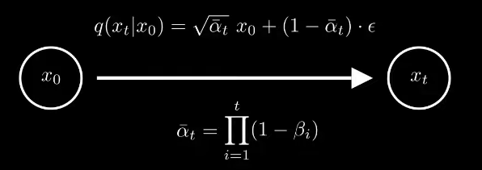
6. 可以直接 从 输入 **跳步** 任意时间，而无需 依次遍历 所有之前的步骤
   1. **跳步 只是 保证 概率分布 一样**
7. ==暂时跳过推导==

正向过程 所有参数固定，反向过程 目标是找到最佳参数 $\theta$(网络权重)，有效去除噪声
1. 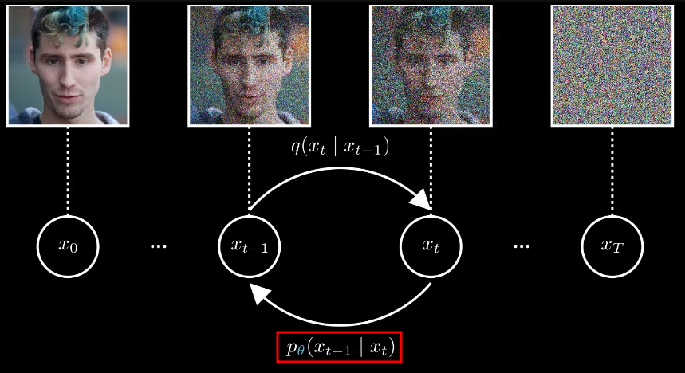
2. 正向过程 $q(x_t | x_{t-1})$
3. 反向过程 $p_\theta(x_{t-1} | x_t)$

**符号定义**
1. 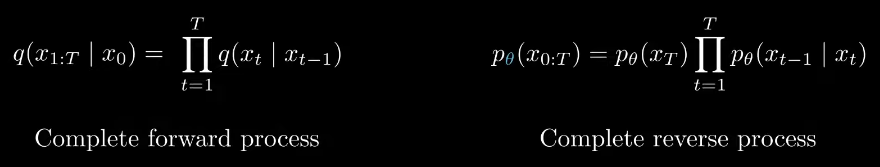
2. **Complete Forward Process**(联合概率分布)
   1. $$q(x_1, \cdots, x_T | x_0) = q(x_1 | x_0) q(x_2 | x_1, x_0) \cdots q(x_T | x_{T - 1}, \cdots, x_0)$$
      1. 左右 同 $× x_0$
   2. 前向过程 是 **Markov Chain**，每次的噪声处理仅仅取决于前一步，简化条件概率
   3. $$q(x_1, \cdots, x_T | x_0) = q(x_1 | x_0) q(x_2 | x_1) \cdots q(x_T | x_{T - 1})$$
   4. $$q(x_{1:T} | x_0) = \prod_{t=1}^{T} q(x_t | x_{t-1})$$
3. **Complete Reverse Process**
   1. $$p_{\theta}(x_{0:T}) = p_{\theta}(x_T) \prod_{t=1}^{T} p_{\theta}(x_{t-1} | x_t)$$
   2. 反向过程 **不受任何条件限制**(所以是 无条件生成)，从 pure gaussian noise 开始，不带任何 先验知识
   3. 前向过程 需要 输入图形 $x_0$

**反向过程** ($p_{\theta}(x_{t-1} | x_t)$)
1. 反向过程，参数不固定，需要找到最佳参数 $\theta$(网络权重)，需要有效去除噪声(使得 使用 神经网络 从 数据分布中 生成 真实样本 $x_0$ 的可能性最大)
2. 网络训练 : 利用 Bayesian Statistics 中的，**minimize negative log-likelihood**，最小化负对数似然，**$- \log p_{\theta}(x_0)$**
3. 负对数 表达式 $$- \log p_{\theta}(x_0) = - \log \int p_{\theta}(x_{0:T}) dx_{1:T}$$ 计算
   1. 无法直接计算
      1. 处理联合概率 : 针对其他 变量分布 边缘化(marginalize)
      2. 此时还不能直接计算，需要对所有能生成 它 的可能路径 进行积分 (**intractable**)
      3. 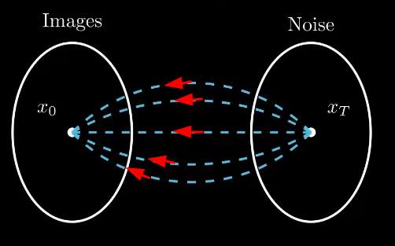
   2. 需要使用技巧 : 同 $× q(x_{1:T} | x_0)$(前向过程) + Jensen's Inequality($- \log$ 是 凸函数，期望的函数值 < 函数的期望值) + ELBO(Evidence Lower BOund)
      1. 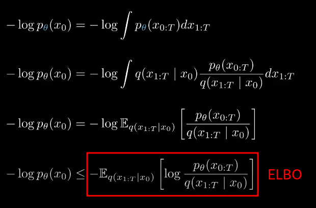
4. ELBO 改写 & 化简
   1. 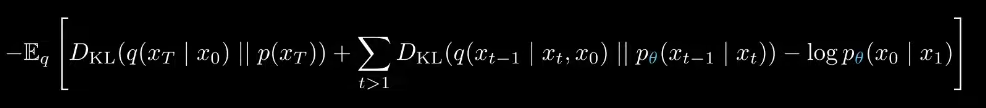
   2. 第1项 : 与模型参数 $\theta$ 无关
   3. 第3项 : 与模型参数 有关，衡量 从 slight noise image($x_1$) 重建 clean image($x_0$) 的可能性，届时没有什么 noise，因此是一个很小的值，没有很多 learning signal
   4. 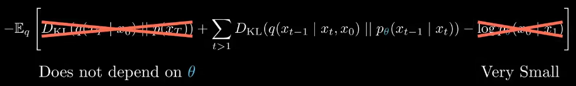
   5. 最终只剩 第2项 : 众多分布之间的 KL散度 之和

推导 **Final Loss Function**
1. 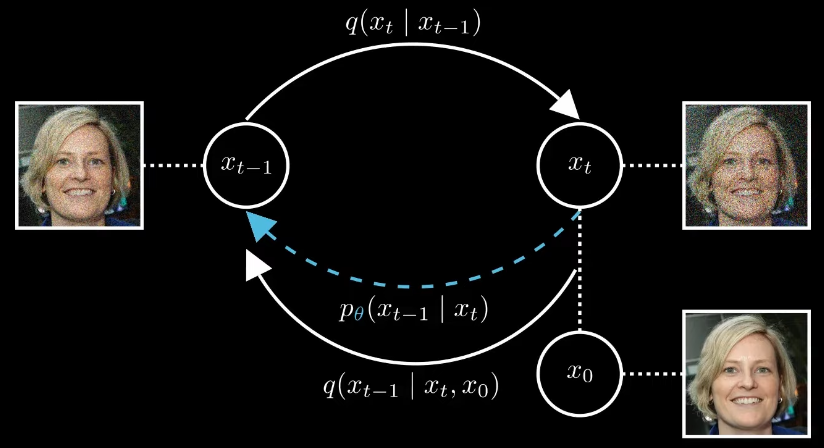
2. $p_{\theta}(x_{t-1} | x_t)$ : 反向扩散 的 **近似后验**
   1. 通常 **假设为 高斯分布** : $p_{\theta}(x_{t-1} | x_t) = \mathcal{N}(\mu_\theta, \sigma_\theta)$
   2. 原因
      1. **正向过程是 线性-高斯马尔可夫过程** 且 **初始分布为 高斯** 条件下，时间反向的 马尔可夫链(**反向条件分布**)仍为高斯
      2. 更加简单，只需要预测 **均值$\mu_\theta$** & **方差$\sigma_\theta$**
      3. 为了进一步简化问题，文中将 近似后验分布的 方差 固定为 **常数 $\sigma_t$**，不进行学习，只学习 **均值$\mu_\theta$**
3. $q{(x_{t-1} | x_t, x_0)} = \mathcal{N}(\tilde{\mu_t}, \tilde{\beta_t})$ : **真实后验 True Posterior (True Reverse)**
   1. ==推导省略==
   2. 有 closed-form expression
   3. 实际的推理过程是 从 纯噪声 开始 生成 $x_0$
   4. 训练时候可以使用 $x_0$
   5. 类似于 Teacher-Student Distillation (除了 teacher 不是训练出来的 network)
      1. Teacher : 全知的 真实后验概率，有 特权信息 $x_0$
      2. Student : 正在训练的 对过去一无所知的 network
4. 目的就是训练网络 匹配 真实后验概率，由于简化了问题，只能调整 **均值$\mu_\theta$**，因此 就是让两者的 均值 距离减小
5. 用于衡量 两个概率分布之间 差异的 KL散度，可以被简化为一个简单的 **均方误差** 损失函数
   1. 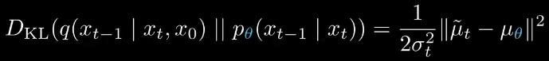
   2. 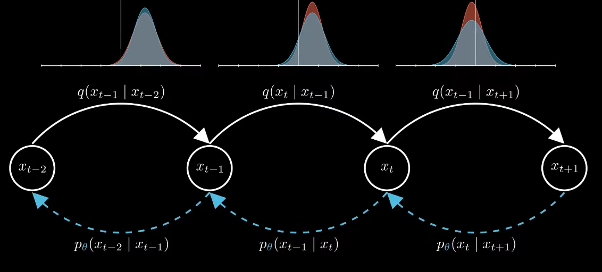
   3. 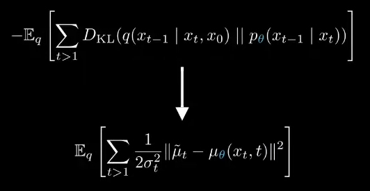
6. 进一步 简化 $\tilde{\mu_t}$ & $\mu_\theta$
   1. 有 $\tilde{\mu_t}$ 的 闭式表达式 (closed-form expression)，但是比较复杂
      1. 是 $x_0$ & $x_t$ 的 weighted combination
      2. 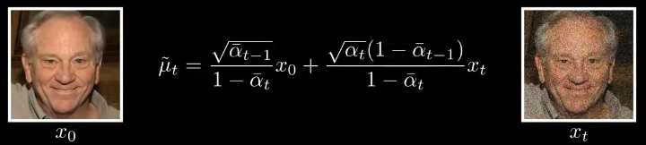
   2. 使用 **重参数化技巧** (reparameterization trick)，将 $x_0$ 去除，仅剩 $x_t$ & $\epsilon$
      1. 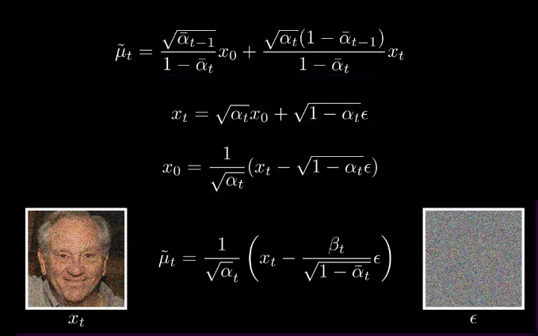
   3. 同样的可以也对 $\mu_\theta$ 化简，因为也可以得到 $x_t$，所以也可以同样化简，变为 $\epsilon_\theta$ 的函数
      1. 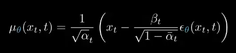
7. 将化简结果 同时 带回 Loss(KL -> MSE)，$x_t$ 抵消，得到 **Final Loss Function**
   1. 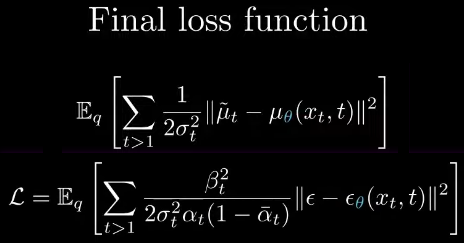
   2. 变成 $\epsilon$ & $\epsilon_\theta$ 的 平方距离
   3. **$\epsilon_\theta$** 是 网络 对 **为生成 $x_t$ 而 添加到 $x_0$ 的** 噪声的估计值
   4. 最小化损失，意味着要让这个 预测尽可能 准确
8. 还可以将 $\sum$ 化简掉，不是 对于每个样本所有时间步求和(很耗费资源)，而是 为每个样本随机选取一个 时间步长 t，由于有大量样本，因此可以趋近最初目标
   1. 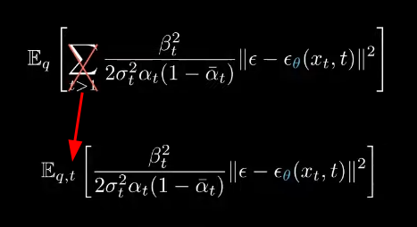

**==Recap==** 如何 推导到最终 **Final Loss Function**
1. 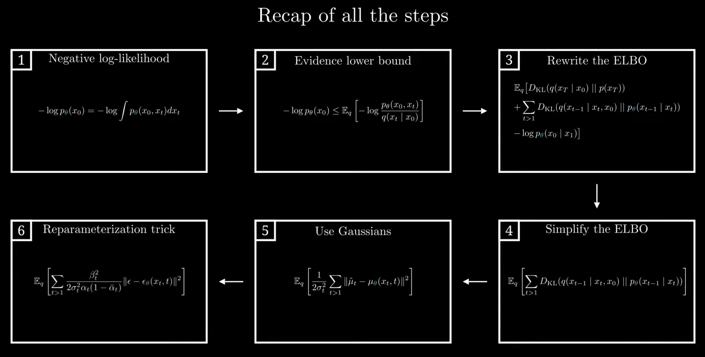

实际实现
1. $\beta$ 初始较小，插值到 最终的 $\beta$ 大值 ($\beta$ 值决定 在每一步正向过程中，向图像中添加的 高斯噪声的方差)
   1. 逐步且温和 添加噪声
      1. **初始阶段**( $t$ 小，$\beta_t$ 小 ) : 模型向原始图像中添加的噪声量非常小，保证了在扩散过程的早期，图像的主要结构和细节不会被立即破坏
      2. **后期阶段**( $t$ 大，$\beta_t$ 大 ) : 随着时间步的增加，图像变得越来越模糊，越来越像纯噪声，添加足够多的噪声，使其在最后一步完全接近一个标准正态分布
   2. 平衡去噪的难易度
      1. **早期去噪**(宏观) : 在噪声较少时，去噪任务相对容易
         1. 图像的信噪比(Signal-to-Noise Ratio, SNR)非常**低**
         2. 主要任务是学习一个宏观的、大致的去噪操作，不需要处理复杂的细节或纹理
         3. 只要能将一个高斯噪声分布转化为一个更具结构性的、但仍然模糊的分布即可
      2. **后期去噪**(微观) : 在噪声较多时，去噪任务变得非常困难
         1. 已经包含了大部分清晰的结构和细节，只剩下微小的噪声
         2. 图像的信噪比(Signal-to-Noise Ratio, SNR)非常**高**
         3. 网络需要预测并去除的噪声，是让图像从一个略带模糊的状态，恢复出精细的纹理和高频细节
2. 在损失函数中，**对 所有步长 分配相等的 权重 1**(抛弃了系数)，让模型在所有阶段都努力学习去噪，无论是简单的还是复杂的
   1. 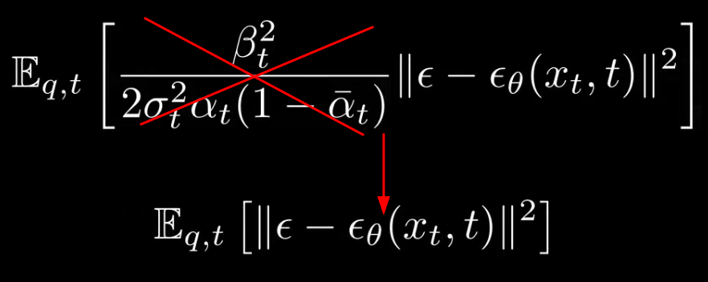
3. 训练 Train
   1. 设定常量
      1. beta_start, beta_end, timesteps
      2. betas : 向量，$\beta$ 从 小 插值到 大，可以是 线性插值(DDPM 原文)，也可以是 余弦 schedule
      3. alphas : 向量，1 - betas
      4. alphas_cumprod, sqrt_alphas_cumprod,sqrt_one_minus_alphas_cumprod : 各种累乘
   2. 训练循环
      1. batch imgs($x_0$) + 同尺寸 noises($\epsilon$)
      2. 每个 image-noise pair 的 随机 t(时间步)，为了 高效训练
      3. 根据公式生成带噪声的图像 noised_imgs
      4. 将带噪图像 noised_imgs 和时间步 t 输入模型，让它预测噪声 estimated_noise，是要 **计算 模型预测的噪声 和 真实噪声 间的均方误差**
      5. 固定套路
         1. `optimizer.zero_grad`
         2. `loss = MSE(estimated_noise, noises)`(化简版本，减少权重系数，$\mathbb{E}_{q, t} [|| \epsilon - \epsilon_\theta(x_t, t)|| ^2]$)
         3. `loss.backward`
         4. `optimizer.step`
   3. 训练中可以查看效果 : noised image 减去 estimated noise
4. 推理 Inference (生成新样本)
   1. 设定常量，**需要 和 Train阶段 保持一致**
      1. 推理过程 是 训练过程 的逆向重现，从纯噪声开始，一步步反转训练时所用的扩散过程
      2. 否则 模型学习到的 去噪模式 将无法正确应用，导致生成的图像会完全失败
   2. `with torch.no_grad()` : 禁用梯度计算，推理时我们不需要反向传播，这能节省内存和计算资源
   3. 用一个标准的高斯噪声张量初始化 $x_T$，这就是生成过程的起点
   4. 反向过程 `for t in reversed(range(timesteps))`
   5. t_tensor : 为当前批次的所有图像创建一个统一的时间步张量
   6. 使用 Train 保存的模型得到 predicted_noises
   7. 在每一步(除了最后一步)，添加一些随机噪声，使得反向过程具有一定的随机性，生成多样的图像，在最后一步 t=0 时，不再添加噪声
   8. 在经过系数缩放后，去噪操作本身就是逐像素(element-wise)的相减

相比 VAE，代价是 用更多计算换取更好生成质量

后续有对 DDPM 的改进，只需几次 推理步骤就能实现 : DDIM

[Score-based Diffusion Models | Generative AI Animated - YouTube(Deepia)](https://www.youtube.com/watch?v=lUljxdkolK8&t=10s)

[Why Does Diffusion Work Better than Auto-Regression?](https://www.youtube.com/watch?v=zc5NTeJbk-k)

---

# Diffusion Model - 李宏毅

[Diffusion Model - 李宏毅 - YouTube](https://www.youtube.com/playlist?list=PLJV_el3uVTsNi7PgekEUFsyVllAJXRsP-)

## 浅谈 生成模型 Diffusion Model 原理

Denoising Diffusion Probabilistic Models(DDPM)

最开始，从 高维标准高斯噪声，生成样本，再逐步去噪

反复使用 同一个 denoise model，输入 **step** (denoise 到第几步，noise 的严重程度)

denoise model
1. 
2. input 有 noise 的图片，预测 noise，减去 noise (可能 predict noise 简单)

**Forward/Diffusion Process** (加噪声)
1. input image + 从 gaussian distribution 中 sample 的 noise
2. 对于 noise predictor
   1. 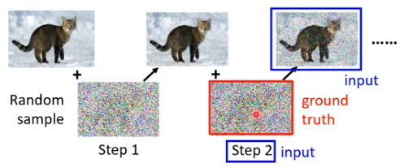
   2. 加入 noise 的 `image` & `step步骤数` 是 input (对于 text2image 还需 文字描述)
   3. noise 是 GroundTruth output

Text-to-Image
1. 需要 Text-Image Pair
2. [LAION-5B: A NEW ERA OF OPEN LARGE-SCALE MULTI-MODAL DATASETS](https://laion.ai/blog/laion-5b)
3. 在 denoise 的 各个 step 中 input 相同的 text
   1. 
4. Predictor 中 加入 text(额外输入)
   1. 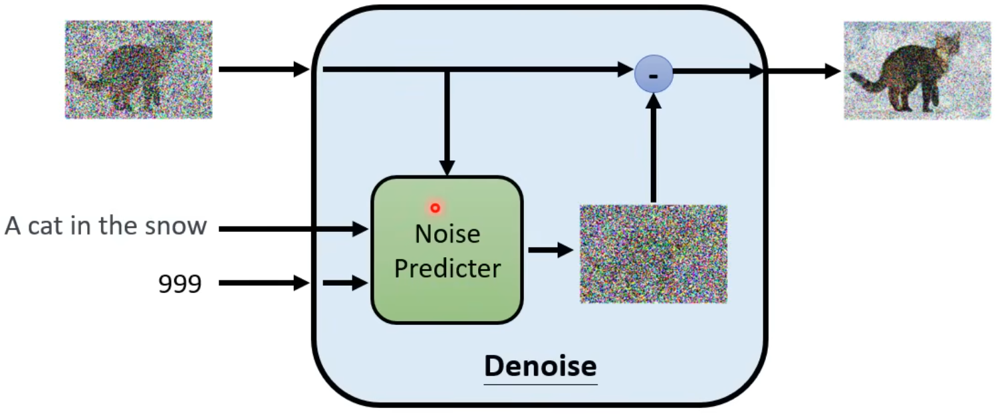

## Stable Diffusion、DALL-E、Imagen 背后共同的套路

Stable Diffusion、DALL-E、Imagen 背后共同的套路
1. 结构 (3模块 分开训练 再组合)
   1. 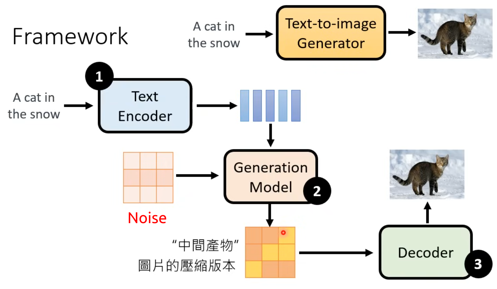
   2. **Text Encoder** (GPT/BERT)
      1. text encoder 对结果 影响大，很重要，相比之下 diffusion model 影响小
      2. 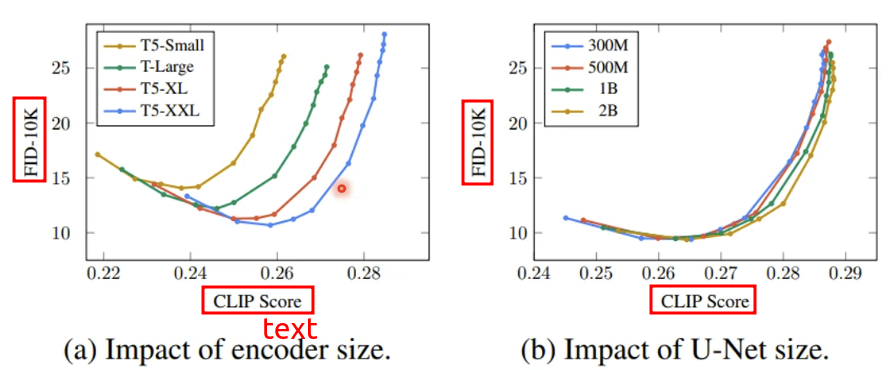
      3. 指标
         1. **FID** (Fréchet Inception Distance)
            1. 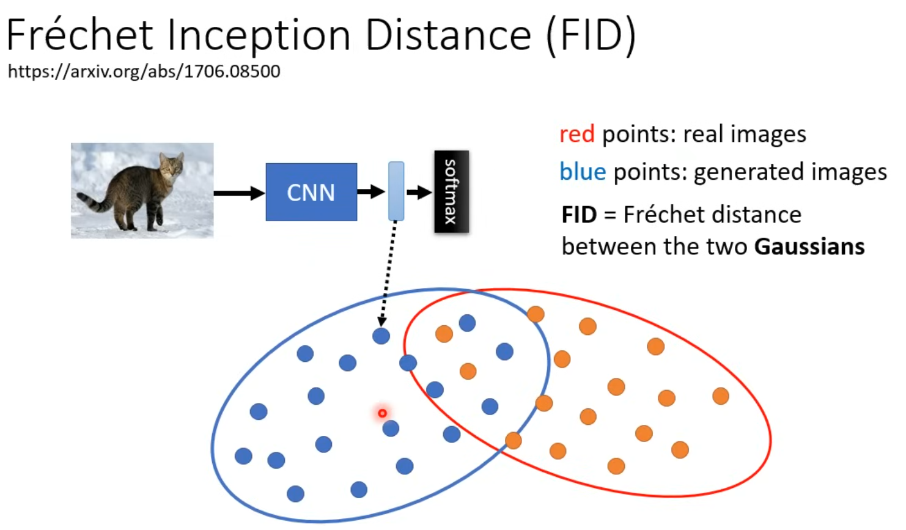
            2. 越小越好
            3. 使用 pre-trained 的 CNN (ImageNet 上预训练的 Inception‑V3 网络) 输出的 latent representation
            4. **需要 sample 大量 images**，对两批图像(生成的、真实的) 分别提取特征
            5. 假设采样的 2组 representation 符合 多元 gaussian 分布，计算 Fréchet 距离
         2. **CLIP Score** (Contrastive Language-Image Pre-Training)
            1. Image Encoder & Text Encoder
            2. [CLIP - 个人笔记](../../LargeModel/CLIP/CLIP.md)
   3. **Generation Model**
      1. 需要 image-text pair
      2. 可以和 diffusion model 不同，noise 不是加在图片上，而是加在 中间产物上，**好处**:
         1. 计算 & 存储 成本大幅下降 (latent space 空间小)
         2. 可分模块训练，相互独立
         3. 表达能力更强，训练更稳定 : 把高频纹理、噪点等难以建模的细节 甩锅 给解码器，扩散模型 只需聚焦语义、布局
      3. 依然是 predict noise
      4. 
      5. 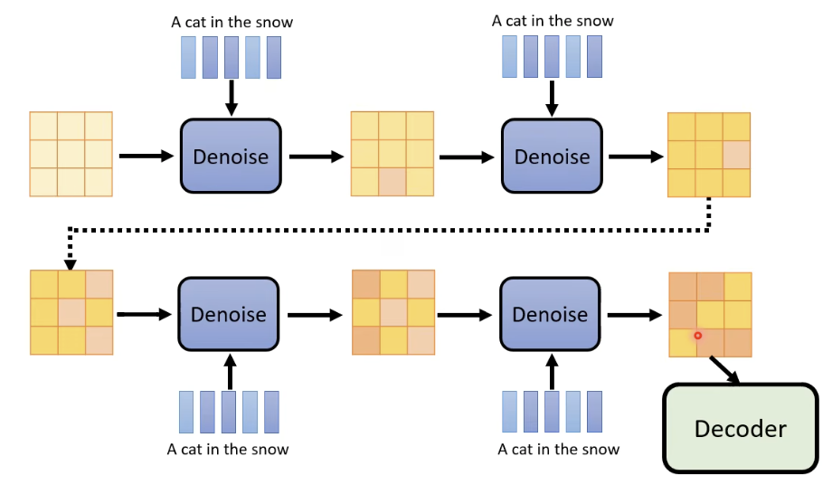
      6. 为了可视化方便，可以将每个中间结果(latent representation) 都交给 decoder 进行展示
   4. **Decoder** (还原)
      1. 一般 不需要 文字 信息
      2. 训练，根据中间产物划分
         1. 小图 : 使用 原图 & down-sampling 作为数据集
         2. latent representation(人类看不懂的小图) : 需要 训练 auto-encoder，将 input 转为 latent
            1. 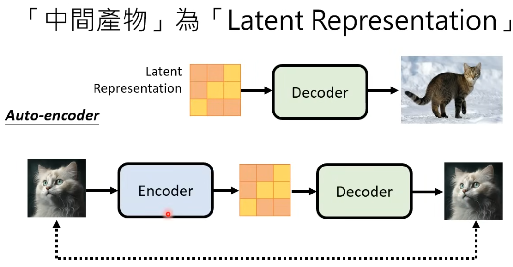
2. 3个 Module 分开训练，再组合
3. eg :
   1. Stable Diffusion
      1. 
   2. DALL-E (生成模型 : Auto-Regressive / Diffusion)
      1. 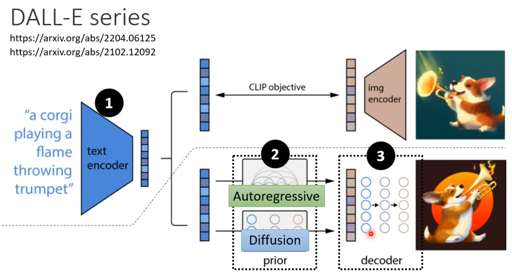
      2. autoregressive 只适用于 图片的压缩版本
      3. 完整图片 autoregressive 运算量太大
   3. Imagen
      1. 

## Diffusion Model 原理剖析

公式推导论文 - [Understanding Diffusion Models: A Unified Perspective](https://arxiv.org/pdf/2208.11970)

Forward Process (add noise)

Reverse Process (denoise)

**VAE** vs **Diffusion Model**
1. 

<!-- 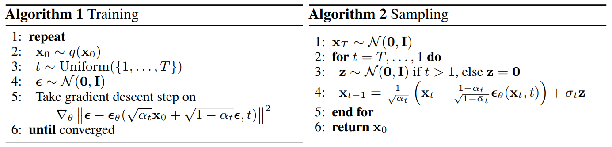 -->

**Training**
1. 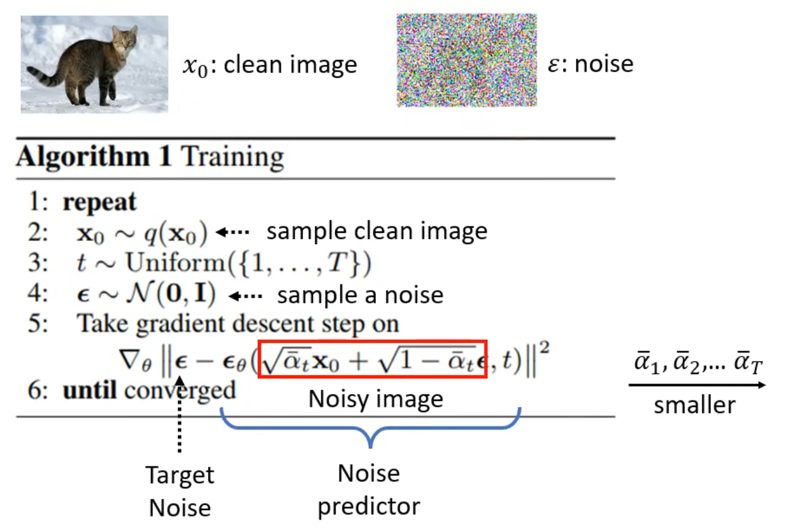
2. $x_0$ 表示从 数据集里面 sample 一个 没有加噪的图片
3. t 是从 1 ~ T(扩散/去噪过程 总 离散时间步) 中，随机抽取一个数字
4. $\epsilon$ 从 高维正态分布中 sample noise
5. **weighted sum** $\bar{α}_1, ..., \bar{α}_T$ (事先定好的数值)
   1. t 越大 $α$ 越小 (原图比例少，噪声比例大)
6. **目标** : noise predictor 能预测 先前 sample 的 noise
7. 想象中是逐步加入 noise，预测混入的 noise，而实际上 是一步到位，一次加好，一次预测
   1. 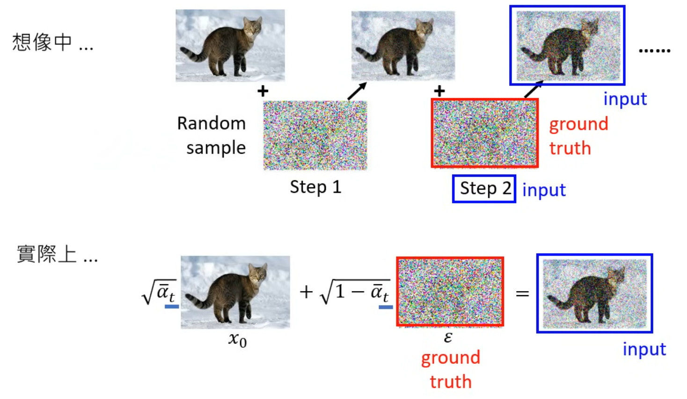

**Sampling** (产生图的过程)
1. sample 一个 全是噪音的 图 $x_T$
2. z 也是从 高维正态分布中采样出来的，把理论上的高斯分布真正落到随机样本上，而非均值，保证生成多样性
3. 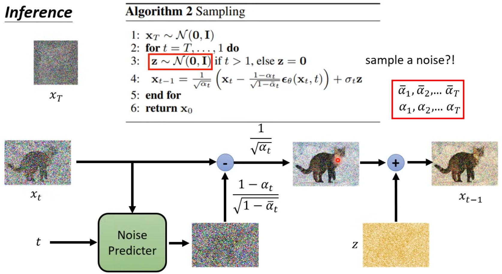

图像生成model本质的**共同目标**
1. 
2. input处 从 简单的 distribution(知道如何 sample，通常为 Gaussian) sample 出 vector (latent variable)
3. 通过 network $G(z) = x$，可能加入 condition(文本信息 等)，得到 Image
4. 生成的图片会组成一个复杂的 distribution (即使是 简单的分部，但是通过 network)
5. 希望 生成图片的distribution 和 真实图片的distribution 接近
6. 输入文字，获得一个 distribution
   1. 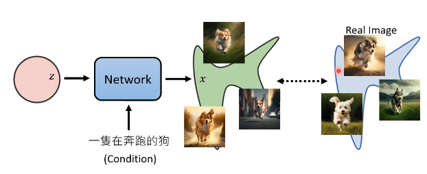

Maximum Likelihood Estimation (衡量 distribution 接近程度)
1. 
2. Network 参数 为 $\theta$
3. $P_{\theta}(x)$ : 通过 network $\theta$ 产生的 distribution
4. $P_{data}(x)$ : 真实 数据分布 distribution
5. 真实图像 $x_i$ 通过 $\theta$ 网络 生成的 概率值 $P_{\theta}(x_i)$ **难以计算**，先假设可以计算出来，用此计算 极大似然，求解最合适的 $\theta^*$

**Maximum Likelihood** 相当于 **Minimize KL-Divergence**
1. 
2. 单调函数 取 log 不影响
3. 采样足够多 可以 近似 真实图像 分布 的期望 (≈处，省略乘以 $\frac{1}{m}$)
4. 由于是 负的 KL散度，因此 argmax 转为 argmin

**VAE** : Compute $P_\theta(x)$
1. [VAE - 个人笔记](../VAE/VAE.md)
2. 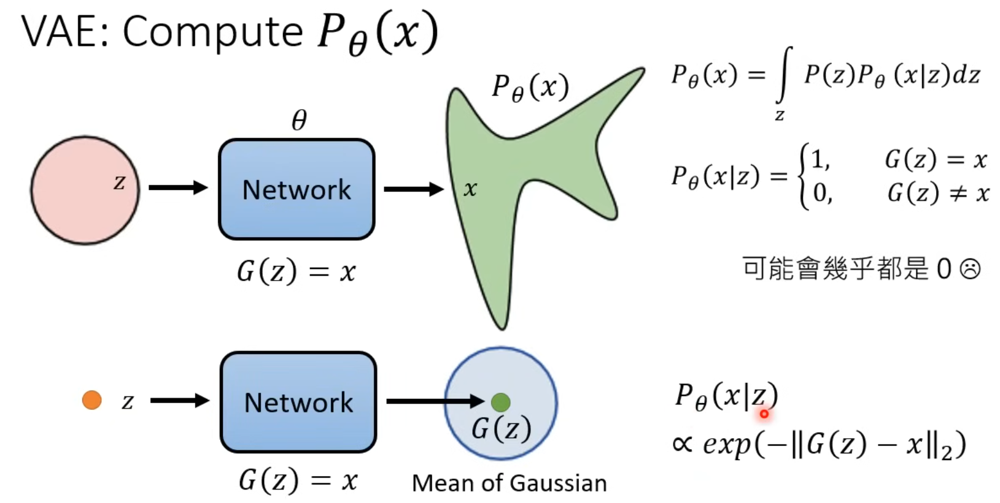
3. 大多数情况很难通过给定的 latent $z$ 得到 与原图 $x_i$(从 dataset 中 sample 出) 完全一致的 输出 $G(x)$
4. 即 大部分的条件概率 $P_\theta(x|z)$ 的值 都是 0
5. 解决方案 : $G(z)$ 代表 Mean of Gaussian (联想二维高斯分布)
   1. $$p(x) = \frac{1}{\sqrt{2\pi\sigma^2}} \exp\left(-\frac{(x - \mu)^2}{2\sigma^2}\right)$$
   2. 显然 正比于 距离的平方
6. Lower Bound of $\log P(x)$ - 通过 最大化 Lower Bound 来 最大化 原函数
   1. 使用 KL散度 恒非负 性质
   2. 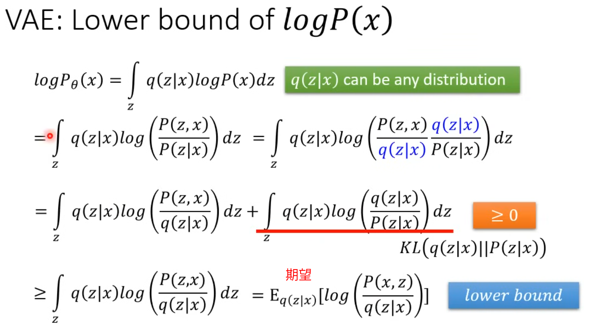

z 的 引入 可能需要查看 VAE encoder-decoder - TODO

**DDPM** : Compute $P_\theta(x)$
1. 
2. 起始点是一个完全由噪声构成的图像，模型通过多个去噪步骤还原图像
3. 每一步的去噪由模型参数化的条件概率 $P_\theta(x_{t-1} | x_t)$ 控制
4. 对 $x_1 ~ x_T$ 进行多元积分 得到 $P_\theta(x_0)$

Lower Bound (DDPM 和 VAE 中的推导类似)
1. 

q 是 概率分布

$q(x_t |x_{t-1})$
1. $\beta _1 : \beta _T$ 是事先定义的
2. 

$q(x_t | x_0)$
1. 不需要逐步加噪 得到 $x_t$，可以直接得到
2. 一次性加噪
   1. 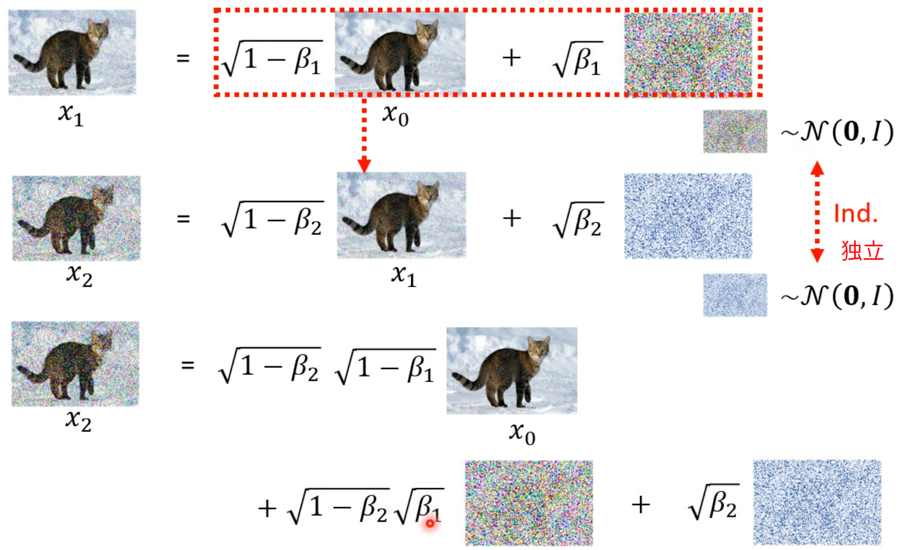
   2. 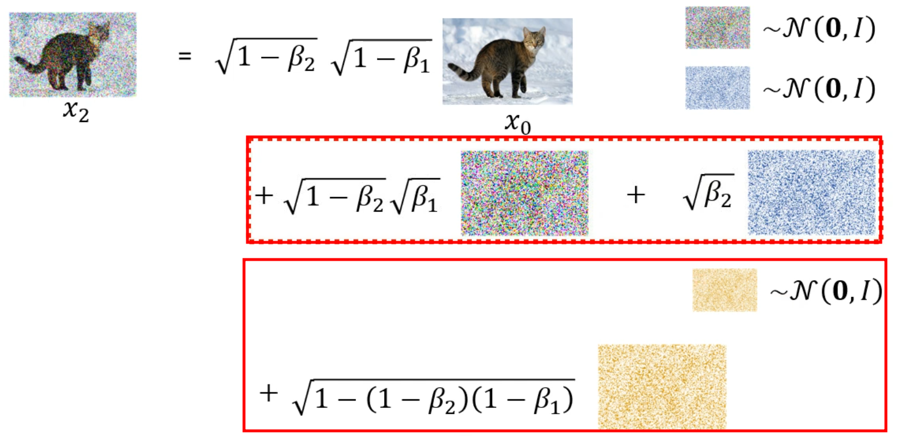
   3. 红框内 二者等价
      1. 考虑独立高斯分布特性
      2. $a \epsilon_1 + b \epsilon_2 \sim \mathcal{N}(0, a^2 \sigma_1^2 + b^2 \sigma_2^2)$
      3. $ (1 - \beta_2) \beta_1 + \beta_2 = 1 - (1 - \beta_1)(1 - \beta_2)$
   4. 
   5. 
   6. 
   7. 相当于是 train 的时候 输入 $t$ & $x_t$

可以计算
1. $q(x_t | x_0)$
2. $q(x_{t-1} | x_0)$
3. $q(x_t | x_{t-1})$
4. **链式法则** : $q(a,b,c) = q(a | b, c) q(b, c) = q(a | b, c) q(b | c) q(c)$

**DDPM** : Lower Bound of $\log P(x)$ (需要 **maximize**)
1. 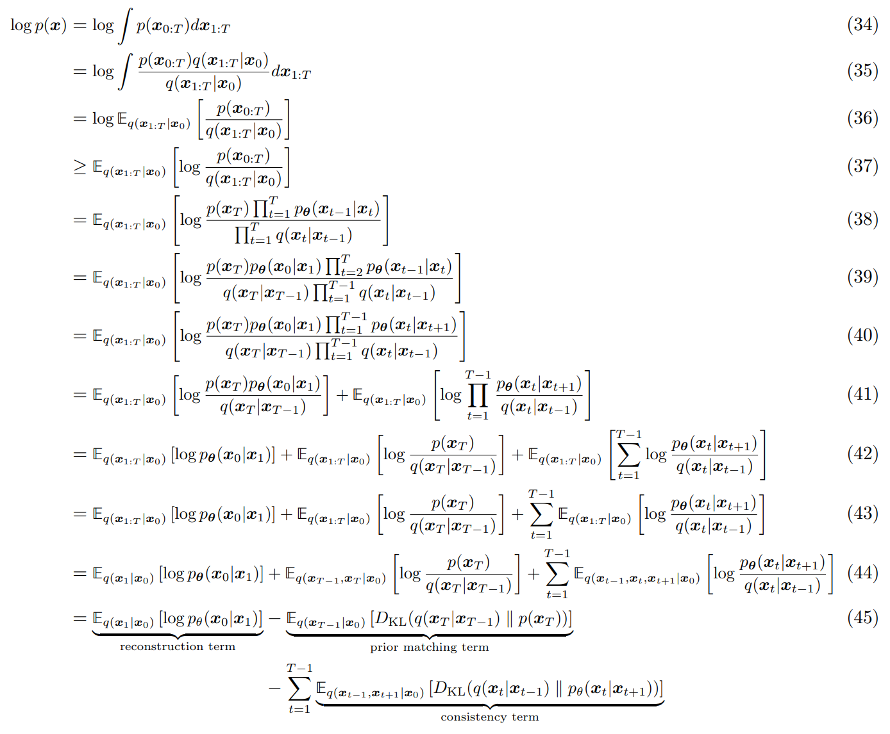
2. KL散度 项 (第2项) 与 Network 无关
   1. $P(x_T)$ 是从 Gaussian Distribution 中 sample
   2. $q(x_T|x_0)$ 是 diffusion process/forward process，是人工定义的
3. $P(x_{t-1} | x_t)$ 是模型可以控制的 (denoise process)
4. $q(x_{t-1} | x_t, x_0)$ : 有 $x_0$ 和 进行t次加噪的结果 $x_t$，但不知道中间过程，求 $x_{t-1}$ 的分布
5. 第3项 (整体需要 maximum 则 第3项本身因为有符号，所以需要最小)
   1. 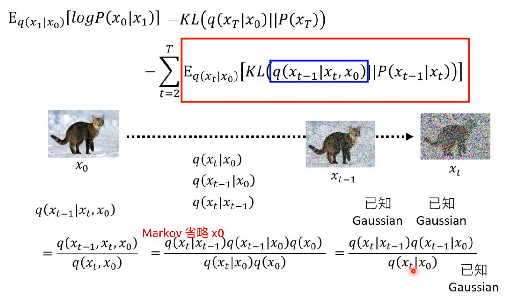
   2. 计算 $q(x_{t-1} | x_t, x_0)$ 时，使用了 Markov 假设
   3. 经过下图推导可以知道，$q(x_{t-1} | x_t, x_0)$ 仍然是一个 gaussian distribution
      1. 
   4. mean & variance
      1. 
   5. 两个 Gaussian Distribution 的 KL Divergence 公式
      1. 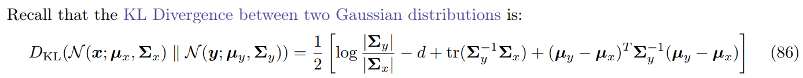
   6. 捷径 : 想要 minimize
      1. $q(x_{t-1} | x_t, x_0)$ : gaussian distribution，并且 mean & variance 固定，与 network 无关(人工设定的 diffusion process)
      2. $P_\theta(x_{t-1} | x_t)$ : 由 denoise model 的 network 决定，variance 固定(不考虑，都是定值)，只剩 mean 不固定
      3. 因此想要使得 两者的 KL散度 最小，需要 让 二者的 mean 接近 (denoise model 和 理论 denoise 结果)
         1. 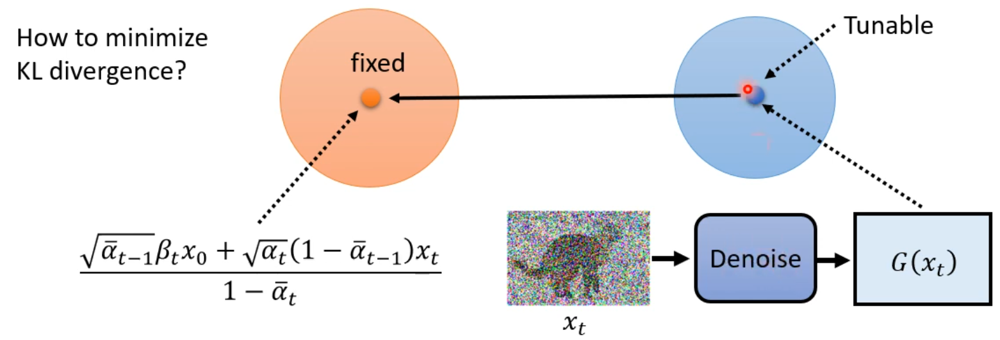
   7. 首先从 database 取 $x_0$，使用 该 $x_0$ sample 出 $x_t$ (本身 $x_t$ 服从正态分布)
   8. denoise model 输入 t & $x_t$，希望 输出的 mean 和 $q(x_{t-1} | x_t, x_0)$ 的 mean 接近
      1. 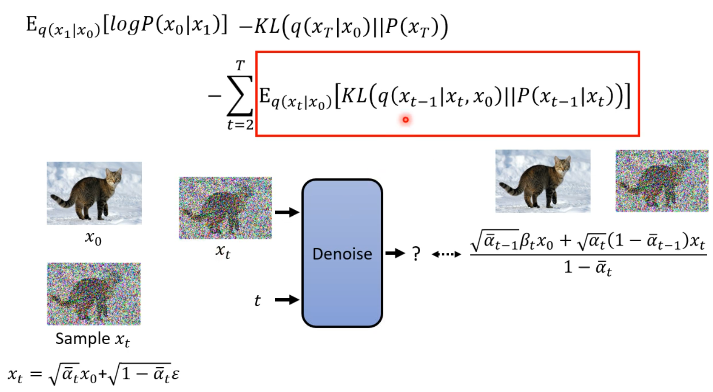
   9. mean 还可以继续化简，使用 $x_t$ 表示 $x_0$
      1. 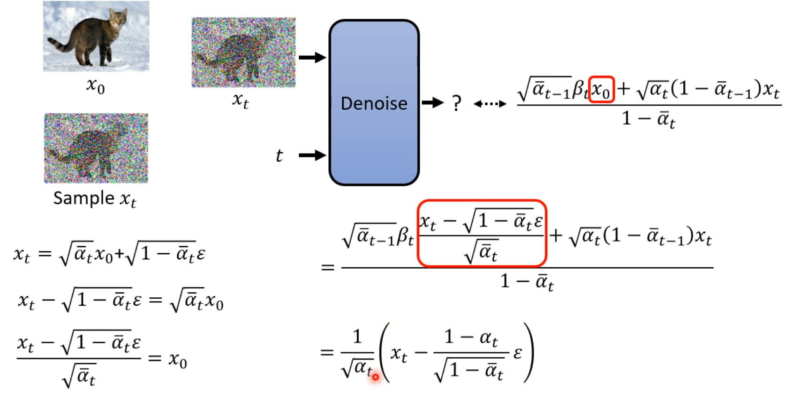
      2. 实际需要 output(network predict) 其实只有 $\epsilon$ ($\alpha$ 是常数 Hyper-Parameter)
      3. 
      4. 显然，在得到 mean of gaussian 后，又添加了 noise/variance，达到 sample 效果
         1. 如果 选择 mean of gaussian 相当于 选择 概率密度 最大的可能
         2. 猜测 : 对于 LLM，如果下一词 只选择 概率最大的，则会导致反复说同样的语段
         3. diffusion model 相当于是 多步的 Auto-Regressive，Auto-Regressive 本身会加 noise/variance

Diffusion Model 用于 语音合成
1. 相当于 2d -> 1d，从完全随机的序列中 denoise
2. WaveGrad

Diffusion Model 用于 Text
1. Difficulty : 文字离散，因此 难以 加噪 & 去噪
2. Solution
   1. 在 word embedding / latent representation 加 noise
      1. Diffusion-LM, DiffuSeq
   2. 不加 Gaussian Noise
      1. DiffusER : Diffusion via Edit-based Reconstruction

为什么 Diffusion Model 有效
1. 一步到位 -> 查分多步
2. Mask-Predict 思想 : 使用 mask 替代 部分位置(低分位置)，再进行 predict

---

# 简介

功能
1. 文生图
2. 模仿
3. 抠图填充
4. 图像扩展

模仿 物理(热力学) 扩散现象(熵增，混乱)

inspired by non-equilibrium thermodynamics

给图片增加噪声(正向扩散)，变的混乱(图像收敛于噪声的分布，即高斯分布)

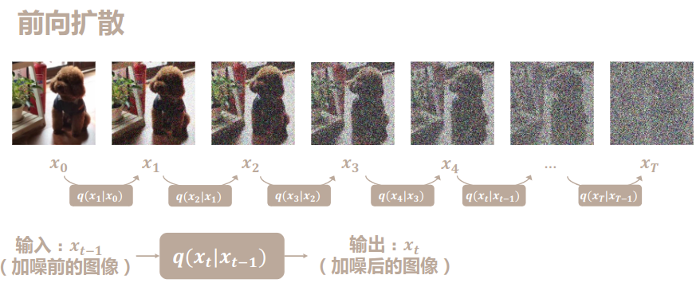

训练模型将其变为有序的样子(逆向扩散)

将 逐渐变的混乱的过程 分解为 多个状态

使用 **马尔科夫链(Markov Chain)** 描述整个加噪声过程(无记忆性)，后一个图片仅依赖前一个图片

使用 信息熵(Information Entropy) 衡量 图片混乱程度
1. $$\mathbf{H}(\mathbf{U})=-\sum_{i=1}^{n} p_{i} \log _{2} p_{i}$$
2. 信息熵可以理解为一个 随机变量的平均信息量，也被称为香农熵
3. 在 不确定性较高的 系统中，信息熵较高，因为需要更多的信息来确定系统的状态
4. 在 确定性较高的 系统中，信息熵较低
5. 指导 神经网络 将混乱图片 变得有序

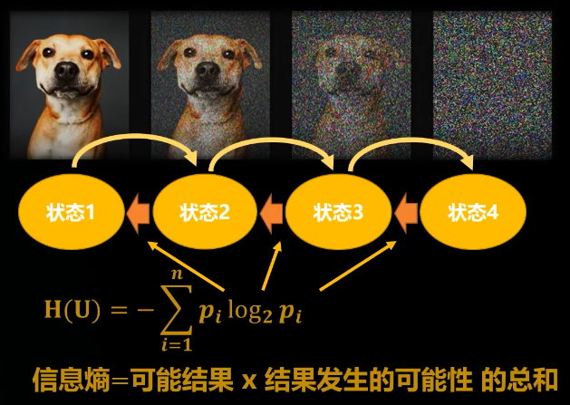

给图像去噪的过程

扩散模型 相比 变分自编码器 可以将图片更好的打乱，避免过拟合现象

# 原理

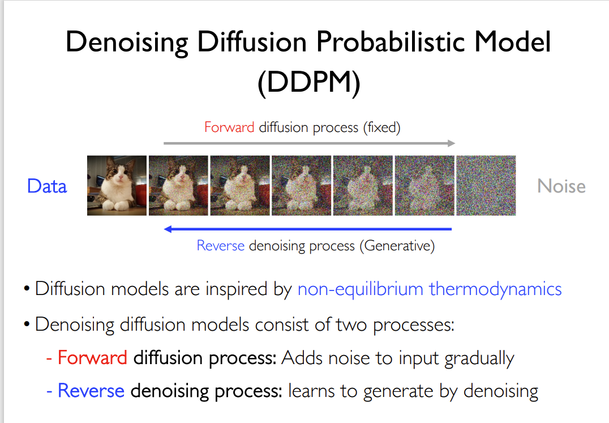

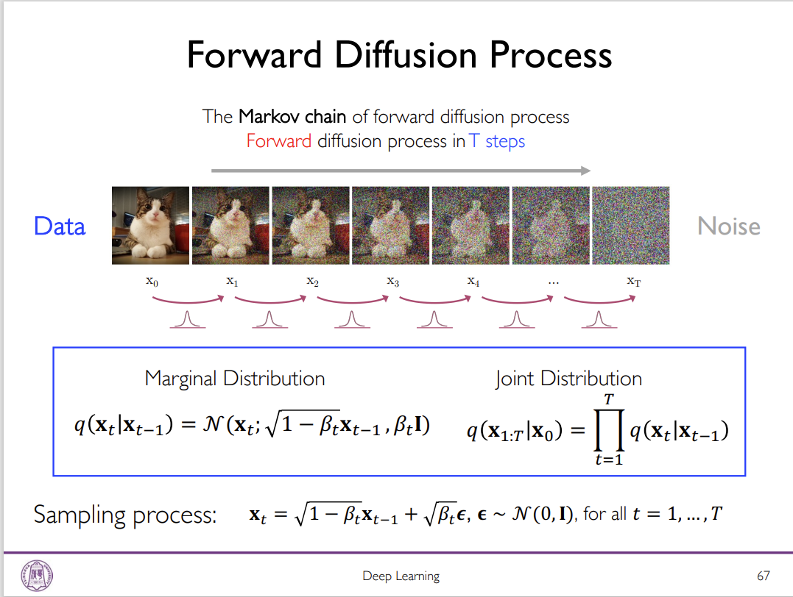

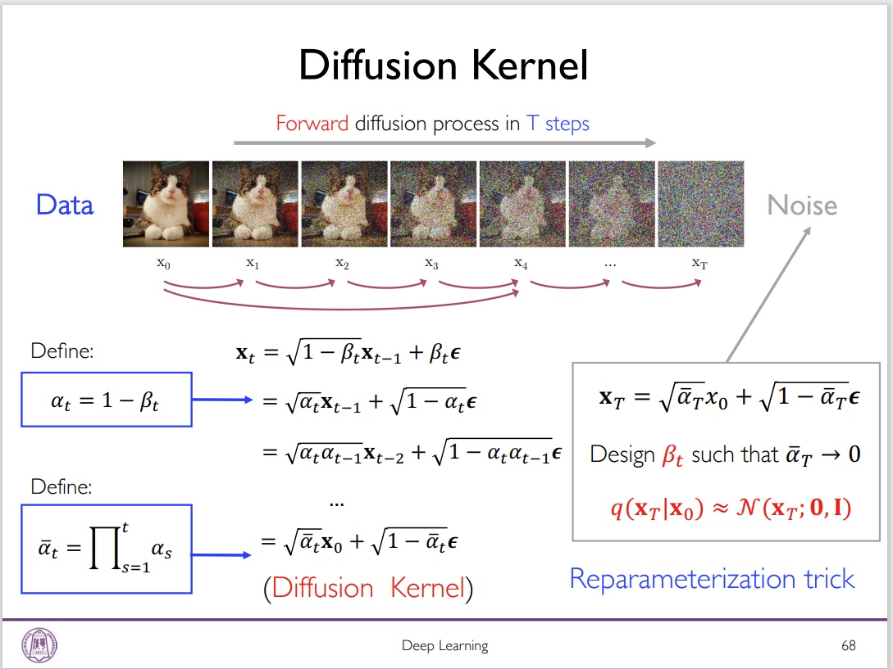

单步加噪公式

可以逐层展开，推导 多步等效 公式

$\beta$ 为 预定义的超参数(随 t 增加 而 增大)

# Denoising Diffusion Probabilistic Models(DDPM)

[【较真系列】讲人话-Diffusion Model全解 - B站视频](https://www.bilibili.com/video/BV19H4y1G73r/)

[【大白话01】一文理清 Diffusion Model 扩散模型 | 原理图解+公式推导](https://www.bilibili.com/video/BV1xih7ecEMb/?vd_source=d5863bac06474ffc8562eab966db3af7)
1. [配套PDF](./DDPM_tutorial_by_ZhangXin.pdf)

前向过程，向图像加噪，

---

# 对比

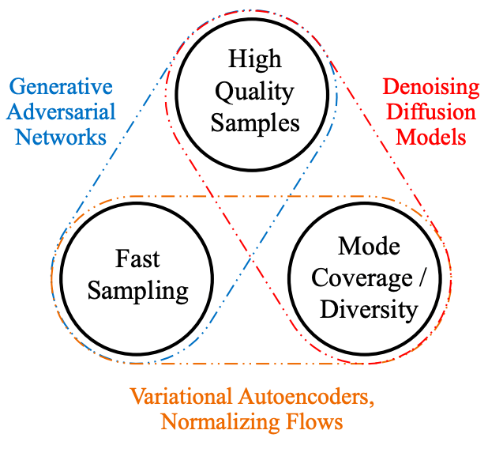

VAE : 训练容易，但是输出模糊

