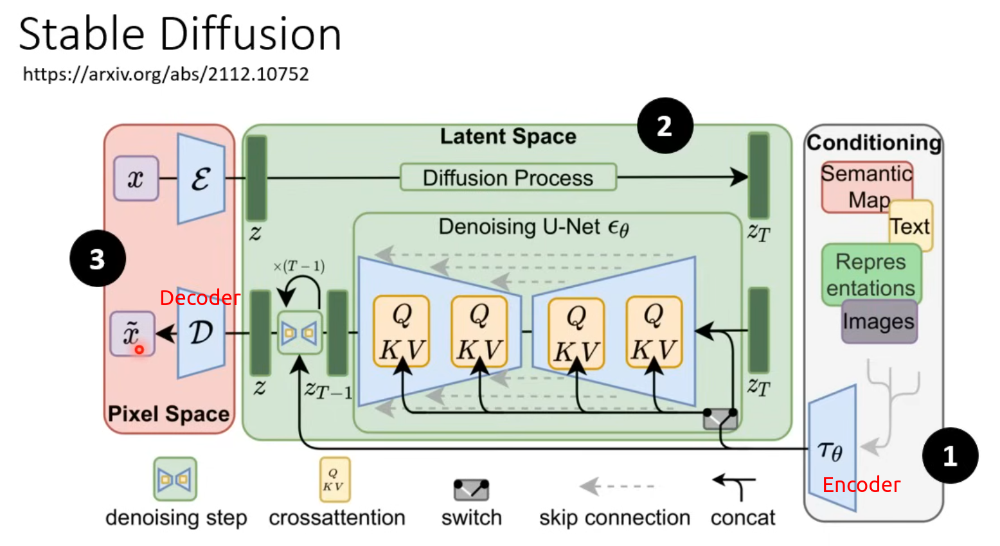
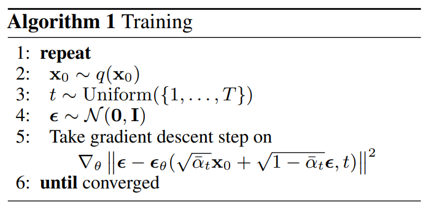
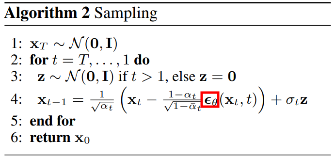

# Diffusion Model 扩散模型

- [Diffusion Model 扩散模型](#diffusion-model-扩散模型)
- [Diffusion Model - YouTube](#diffusion-model---youtube)
- [Diffusion Model - 李宏毅](#diffusion-model---李宏毅)
  - [浅谈 生成模型 Diffusion Model 原理](#浅谈-生成模型-diffusion-model-原理)
  - [Stable Diffusion、DALL-E、Imagen 背后共同的套路](#stable-diffusiondall-eimagen-背后共同的套路)
  - [Diffusion Model 原理剖析](#diffusion-model-原理剖析)
- [简介](#简介)
- [原理](#原理)
- [Denoising Diffusion Probabilistic Models(DDPM)](#denoising-diffusion-probabilistic-modelsddpm)
- [对比](#对比)
- [Link : 信息量 + 香农熵 + 交叉熵 + KL散度](#link--信息量--香农熵--交叉熵--kl散度)

---

# Diffusion Model - YouTube

[Diffusion Models: DDPM - YouTube](https://www.youtube.com/watch?v=EhndHhIvWWw)

DDPM : Denoising Diffusion Probabilistic Models

$p(x)$ 概率分布，复杂，无法使用单一的表达式完整描述，但仍希望生成芯图像，从分布中抽取新的样本点(从未知分布中，抽取新的样本点)

如果模型有效，应该能够从随机噪声开始，逐步转化为有意义的图像

原始图像 $x_0$

使用 条件分布 $q(x_1 | x_0)$ 生成下一个图像

添加 高斯噪声 $x_1 = x_0 + \beta · \epsilon$，标量 $\beta$，$\epsilon \sim \mathcal{N}(0, 1)$

$q(x_1 | x_0) = \mathcal{N}(x_0, \beta)$，可以理解为以 $x_0$ 为中心，标准差 为 $\beta$ 的 高斯分布中抽取样本

---

# Diffusion Model - 李宏毅

[Diffusion Model - 李宏毅 - YouTube](https://www.youtube.com/playlist?list=PLJV_el3uVTsNi7PgekEUFsyVllAJXRsP-)

## 浅谈 生成模型 Diffusion Model 原理

Denoising Diffusion Probabilistic Models(DDPM)

反复使用 同一个 denoise model，输入 step (denoise 到第几步)

denoise model
1. 
2. input 有 noise 的图片，预测 noise，减去 noise (可能 predict noise 简单)

Forward Process (Diffusion Process)
1. input image + 从 gaussian distribution 中 sample 的 noise
2. 对于 noise predictor
   1. 加入 noise 的 image & step步骤数 是 input (对于 text2image 还需 文字描述)
   2. noise 是 GroundTruth output

Text-to-Image
1. 需要 文字&图片 成对资料
2. [LAION-5B: A NEW ERA OF OPEN LARGE-SCALE MULTI-MODAL DATASETS](https://laion.ai/blog/laion-5b)
3. 在 denoise 的 各个 step 中 input 相同的 text
   1. 
4. Predictor 中 加入 text
   1. 

## Stable Diffusion、DALL-E、Imagen 背后共同的套路

Stable Diffusion、DALL-E、Imagen 背后共同的套路
1. 结构
   1. 
   2. Text Encoder (GPT/BERT)
      1. text encoder 对结果 影响大，很重要，相比之下 diffusion model 的大小 影响小
      2. 指标
         1. FID(Fréchet Inception Distance)
            1. 
            2. 越小越好，smaller is better
            3. 使用 CNN 模型 输出的 representation
            4. 需要 sample 很多 image
         2. CLIP Score (Contrastive Language-Image Pre-Training)
            1. Image Encoder & Text Encoder
   3. Generation Model
      1. 和 diffusion model 不同，noise 不是加在图片上，而是加在 中间产物上
      2. 依然是 predict noise
      3. 
   4. Decoder
      1. 一般不需要 文字 信息
      2. 训练，根据中间产物划分
         1. 小图 : 使用 原图 & down-sampling 作为数据集
         2. latent representation(人类看不懂的小图) : 需要 训练 auto-encoder，将 input 转为 latent
            1. 
2. 3个 Module 分开训练，再组合
3. eg :
   1. Stable Diffusion
      1. 
   2. DALL-E (生成模型 : Auto-Regressive / Diffusion)
      1. 
   3. Imagen
      1. 

## Diffusion Model 原理剖析

公式推导论文 - [Understanding Diffusion Models: A Unified Perspective](https://arxiv.org/pdf/2208.11970)

Forward Process (add noise)

Reverse Process (denoise)

**VAE** vs **Diffusion Model**

<!--  -->

**Training**
1. 
2. $x_0$ sample clean image
3. $\epsilon$ sample a noise
4. weighted sum $\bar{α}_1, ..., \bar{α}_T$
   1. t 越大 $α$ 越小 (原图比例少，噪声比例大)
5. 想象中是逐步加入 noise，而实际上 是一步到位，一次加好
   1. 

**Sampling**
1. sample 一个 全是噪音的 图 $x_T$
2. 

图像生成model本质的共同目标
1. 
2. 从 简单的 distribution sample 出 vector (latent variable)
3. 通过 network $G(z) = x$，可能加入 condition(text 等)
4. 得到 Image

Maximum Likelihood Estimation
1. 
2. Network 参数 为 $\theta$
3. $P_{\theta}(x)$ : Network $\theta$ 的 distribution
   1. 具体图像 $x_i$ 的 概率值 $P_{\theta}(x_i)$ 难以计算
4. $P_{data}(x)$ : 真实 数据分布 distribution

Maximum Likelihood 相当于 Minimize KL Divergence
1. 

**VAE** : Compute $P_\theta(x)$
1. 
2. 大多数情况很难通过给定的 latent $z$ 得到 与原图 $x_i$(从 dataset 中 sample 出) 完全一致的 输出 $G(x)$
3. 即 大部分的条件概率 $P_\theta(x|z)$ 的值 都是 0
4. 解决方案 : $G(z)$ 代表 Mean of Gaussian (联想二维高斯分布)
   1. $$p(x) = \frac{1}{\sqrt{2\pi\sigma^2}} \exp\left(-\frac{(x - \mu)^2}{2\sigma^2}\right)$$
   2. 显然 正比于 距离的平方
5. Lower Bound of $\log P(x)$ - 通过 最大化 Lower Bound 来 最大化 原函数
   1. 使用 KL散度 恒非负 性质
   2. 

z 的 引入 可能需要查看 VAE encoder-decoder - TODO

**DDPM** : Compute $P_\theta(x)$
1. 
2. 起始点是一个完全由噪声构成的图像，模型通过多个去噪步骤还原图像
3. 每一步的去噪由模型参数化的条件概率 $P_\theta(x_{t-1} | x_t)$ 控制
4. 对 $x_1 ~ x_T$ 进行多元积分 得到 $P_\theta(x_0)$

Lower Bound (DDPM 和 VAE 中的推导类似)
1. 

q 是 概率分布

$q(x_t |x_{t-1})$
1. $\beta _1 : \beta _T$ 是事先定义的
2. 

$q(x_t | x_0)$
1. 不需要逐步加噪 得到 $x_t$，可以直接得到
2. 一次性加噪
   1. 
   2. 
   3. 红框内 二者等价
      1. 考虑独立高斯分布特性
      2. $a \epsilon_1 + b \epsilon_2 \sim \mathcal{N}(0, a^2 \sigma_1^2 + b^2 \sigma_2^2)$
      3. $ (1 - \beta_2) \beta_1 + \beta_2 = 1 - (1 - \beta_1)(1 - \beta_2)$
   4. 
   5. 
   6. 
   7. 相当于是 train 的时候 输入 $t$ & $x_t$

可以计算
1. $q(x_t | x_0)$
2. $q(x_{t-1} | x_0)$
3. $q(x_t | x_{t-1})$
4. **链式法则** : $q(a,b,c) = q(a | b, c) q(b, c) = q(a | b, c) q(b | c) q(c)$

**DDPM** : Lower Bound of $\log P(x)$ (需要 **maximize**)
1. 
2. KL散度 项 (第2项) 与 Network 无关
   1. $P(x_T)$ 是从 Gaussian Distribution 中 sample
   2. $q(x_T|x_0)$ 是 diffusion process/forward process，是人工定义的
3. $P(x_{t-1} | x_t)$ 是模型可以控制的 (denoise process)
4. $q(x_{t-1} | x_t, x_0)$ : 有 $x_0$ 和 进行t次加噪的结果 $x_t$，但不知道中间过程，求 $x_{t-1}$ 的分布
5. 第3项 (整体需要 maximum 则 第3项本身因为有符号，所以需要最小)
   1. 
   2. 计算 $q(x_{t-1} | x_t, x_0)$ 时，使用了 Markov 假设
   3. 经过下图推导可以知道，$q(x_{t-1} | x_t, x_0)$ 仍然是一个 gaussian distribution
      1. 
   4. mean & variance
      1. 
   5. 两个 Gaussian Distribution 的 KL Divergence 公式
      1. 
   6. 捷径 : 想要 minimize
      1. $q(x_{t-1} | x_t, x_0)$ : gaussian distribution，并且 mean & variance 固定，与 network 无关(人工设定的 diffusion process)
      2. $P_\theta(x_{t-1} | x_t)$ : 由 denoise model 的 network 决定，variance 固定(不考虑，都是定值)，只剩 mean 不固定
      3. 因此想要使得 两者的 KL散度 最小，需要 让 二者的 mean 接近 (denoise model 和 理论 denoise 结果)
         1. 
   7. 首先从 database 取 $x_0$，使用 该 $x_0$ sample 出 $x_t$ (本身 $x_t$ 服从正态分布)
   8. denoise model 输入 t & $x_t$，希望 输出的 mean 和 $q(x_{t-1} | x_t, x_0)$ 的 mean 接近
      1. 
   9. mean 还可以继续化简，使用 $x_t$ 表示 $x_0$
      1. 
      2. 实际需要 output(network predict) 其实只有 $\epsilon$ ($\alpha$ 是常数 Hyper-Parameter)
      3. 
      4. 显然，在得到 mean of gaussian 后，又添加了 noise/variance，达到 sample 效果
         1. 如果 选择 mean of gaussian 相当于 选择 概率密度 最大的可能
         2. 猜测 : 对于 LLM，如果下一词 只选择 概率最大的，则会导致反复说同样的语段
         3. diffusion model 相当于是 多步的 Auto-Regressive，Auto-Regressive 本身会加 noise/variance

Diffusion Model 用于 语音合成
1. 相当于 2d -> 1d，从完全随机的序列中 denoise
2. WaveGrad

Diffusion Model 用于 Text
1. Difficulty : 文字离散，因此 难以 加噪 & 去噪
2. Solution
   1. 在 word embedding / latent representation 加 noise
      1. Diffusion-LM, DiffuSeq
   2. 不加 Gaussian Noise
      1. DiffusER : Diffusion via Edit-based Reconstruction

为什么 Diffusion Model 有效
1. 一步到位 -> 查分多步
2. Mask-Predict 思想 : 使用 mask 替代 部分位置(低分位置)，再进行 predict

---

# 简介

功能
1. 文生图
2. 模仿
3. 抠图填充
4. 图像扩展

模仿 物理(热力学) 扩散现象(熵增，混乱)

inspired by non-equilibrium thermodynamics

给图片增加噪声(正向扩散)，变的混乱(图像收敛于噪声的分布，即高斯分布)

训练模型将其变为有序的样子(逆向扩散)

将 逐渐变的混乱的过程 分解为 多个状态

使用 **马尔科夫链(Markov Chain)** 描述整个加噪声过程(无记忆性)，后一个图片仅依赖前一个图片

使用 信息熵(Information Entropy) 衡量 图片混乱程度
1. $$\mathbf{H}(\mathbf{U})=-\sum_{i=1}^{n} p_{i} \log _{2} p_{i}$$
2. 信息熵可以理解为一个 随机变量的平均信息量，也被称为香农熵
3. 在 不确定性较高的 系统中，信息熵较高，因为需要更多的信息来确定系统的状态
4. 在 确定性较高的 系统中，信息熵较低
5. 指导 神经网络 将混乱图片 变得有序

给图像去噪的过程

扩散模型 相比 变分自编码器 可以将图片更好的打乱，避免过拟合现象

# 原理

单步加噪公式

可以逐层展开，推导 多步等效 公式

$\beta$ 为 预定义的超参数(随 t 增加 而 增大)

# Denoising Diffusion Probabilistic Models(DDPM)

[【较真系列】讲人话-Diffusion Model全解 - B站视频](https://www.bilibili.com/video/BV19H4y1G73r/)

[【大白话01】一文理清 Diffusion Model 扩散模型 | 原理图解+公式推导](https://www.bilibili.com/video/BV1xih7ecEMb/?vd_source=d5863bac06474ffc8562eab966db3af7)
1. [配套PDF](./DDPM_tutorial_by_ZhangXin.pdf)

前向过程，向图像加噪，

---

# 对比

VAE : 训练容易，但是输出模糊

---

# Link : 信息量 + 香农熵 + 交叉熵 + KL散度

[信息量 + 香农熵 + 交叉熵 + KL散度 - 个人笔记](../../Math/Entropy&Divergence/EntropyDivergence.md)

