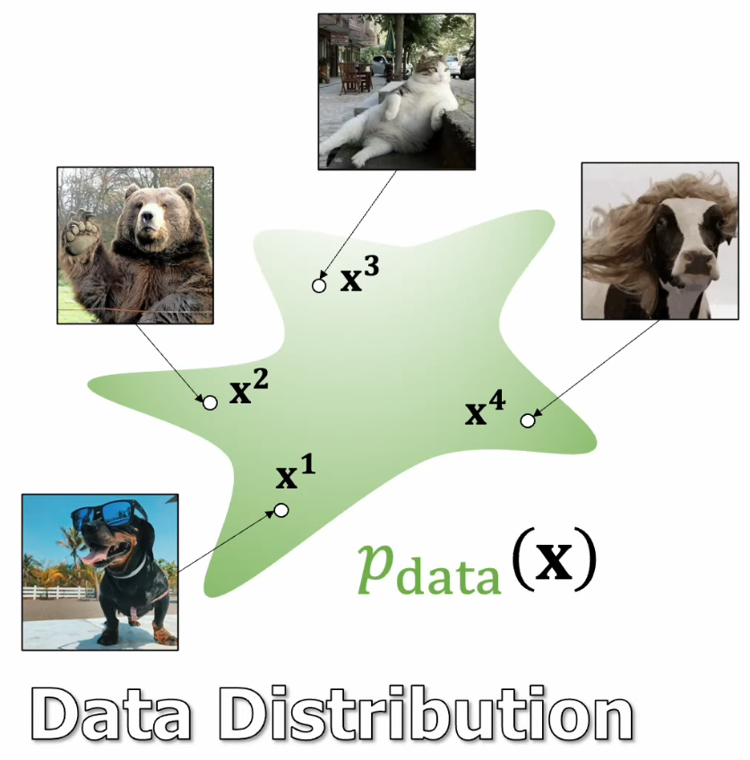
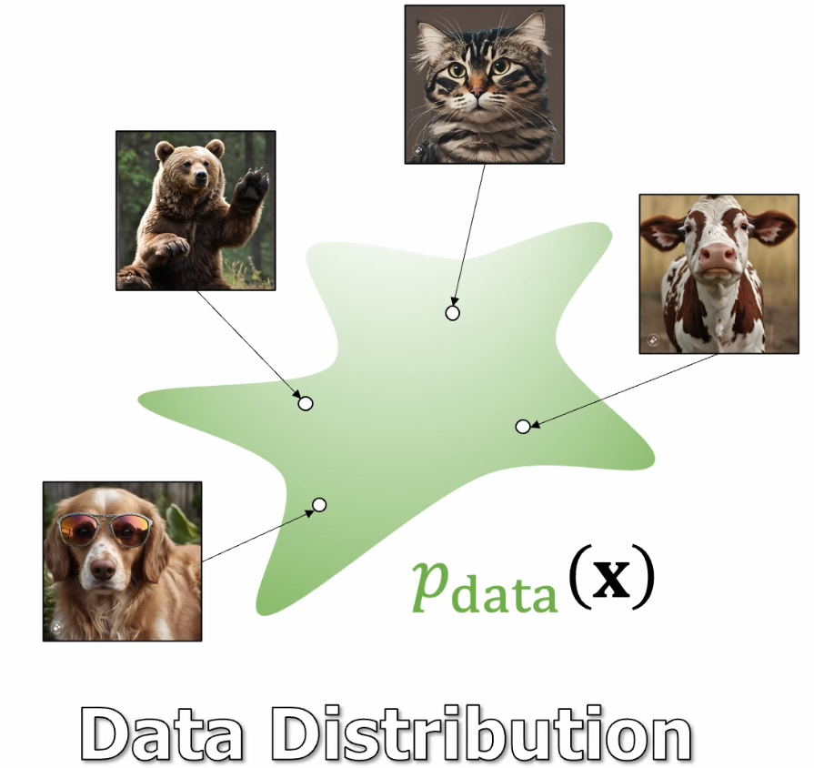
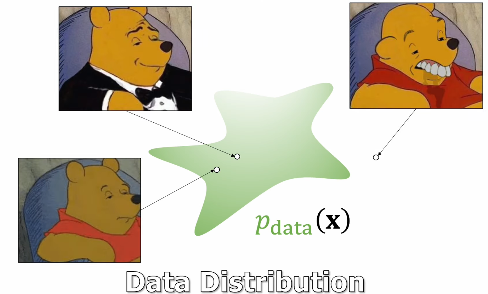
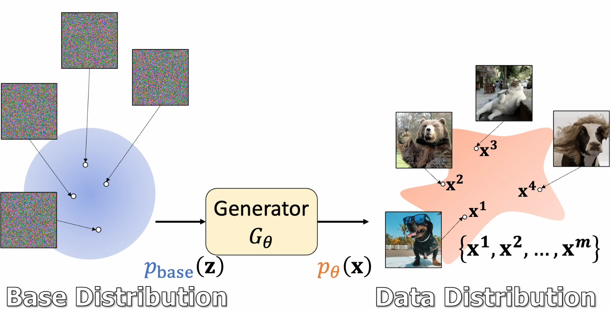
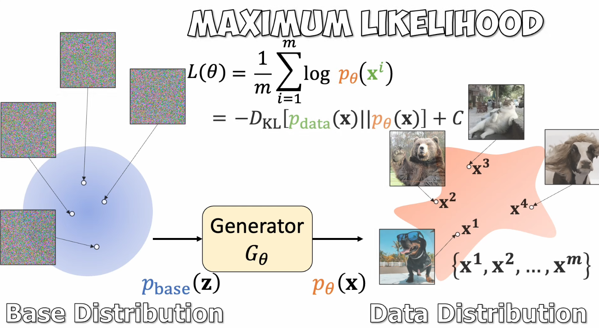

# Flow Matching for Generative Modeling

## Normalizing Flows

最好可以对数据分布进行建模

可以从分布中 创建新图像，或者 评估样本的 可能性

但是 不知道 真正的 数据分布，只有 samples

同时 有 可以轻松采样 的 base distribution

希望 训练一个 Generator 可以

## Continuous Normalizing Flows

## Flow Matching

## Scaling up Training

