# Flow Matching for Generative Modeling

---

# Flow Matching - RethinkFun

学习一个 **向量场 (vector field / velocity field)**，使得粒子沿着该向量场流动，将 简单分布 (如高斯) 平滑变为 复杂数据分布

用 **ODE(确定性)** 代替 Diffusion 的 **SDE(随机过程)**，轨迹更直，采样步骤大幅减少

训练目标是 **确定性的速度向量**，而非 Diffusion 中的随机噪声预测，训练更稳定

| 对比维度 | Diffusion Models      | Flow Matching        |
|---------|-----------------------|----------------------|
| 训练目标 | 预测噪声 ε (随机，不稳定) | 预测速度 v (确定，稳定) |
| 路径类型 | SDE，弯曲随机轨迹       | ODE，接近直线轨迹       |
| 采样步骤 | 通常需要 50~1000 步    | 通常 10~20 步即可      |
| 训练方式 | 需要模拟扩散过程        | 无需模拟 ODE，直接回归   |

## 直观理解

[Flow Matching 的 直观理解 - B站视频(RethinkFun)](https://www.bilibili.com/video/BV142C2BSEbm/)

`已知分布/初始分布`($p_{\text{init}}$) 转化为 `真实数据分布/目标分布`($p_{\text{data}}$)

初始分布 使用 标准正态分布($\mathcal{N}(0, I)$)

**Trajectory (轨迹)**
1. 记录 粒子 在不同时刻的 位置信息
2. $x_t$ : $t$ 时刻(**$t \in [0, 1]$，连续的**)，粒子 $x$ 在高维空间中的位置，轨迹 $X$ 在 $t$ 时刻的位置
3. 轨迹 $X : \{x_0, \cdots, x_1 \}$，每个时间点都有确定的位置

**Vector Field (向量场/速度场)**
1. 定义**空间的运动规则**，即 **多维空间的 每个位置 在 每个时刻的 速度向量/流动方向**
2. $u_t(x_t) = v$
3. $$\frac{d x_t}{dt} = u_t(x_t)$$
   1. ==ODE(Ordinary Differential Equation)，常微分方程==
   2. 下标 $t$ 一致，才有物理意义
4. 在一个多维空间中，给定 初始位置$x_0$ 和 向量场$u$，则 轨迹$X$ 是确定的

**Flow (流 $\psi$)**
1. 一系列 轨迹的集合，每个轨迹都按照 同一个 向量场$u$ 运动
2. 给定 初始位置$x_0$，时刻$t$，流$\psi$ 可以给出 位置$x_t$
   1. $x_t = \psi_t(x_0)$ & $\frac{d x_t}{d t} = u_t(x_t)$
   2. $$\frac{d \psi_t(x_0)}{d t} = u_t(\psi_t(x_0))$$

核心想法
1. 用 神经网络 学习 向量场 $u_t^\theta$
2. 从 已知分布$p_{\text{init}}$ 采样 $x_0$
3. 根据 $u_t^\theta$ 计算 轨迹 $X$，得到 $x_1$
   1. 欧拉法(Euler Method)，工程实现中，时间 $t$ 没法真正做到 连续推演
   2. 把连续的时间 $[0, 1]$ 切分成 离散的小片段$h = \frac{1}{n}$ 来进行计算
   3. $$x_{t+h} = x_t + h u_t^\theta(x_t)$$
   4. 下一个位置 = 当前位置 + 时间间隔 × 当前瞬时速度
   5. 理论上，时间间隔越小，轨迹越接近连续；实际中，通常取 10~20 步，效果已经很好
4. 流$\psi$ : 初始点$x_0$ 满足 $p_{\text{init}}$ & 终点$x_1$ 满足 $p_{\text{data}}$

## 公式推导 & 源码实现

[Flow Matching 的 公式推导 & 源码实现 - B站视频(RethinkFun)](https://www.bilibili.com/video/BV1K2C2BSEZB/)

训练目标
1. 用 神经网络 学习 向量场 $u_t^\theta$
   1. Input  : 位置 $x_t$ 和 时间 $t$
   2. Output : 速度向量，**维度(dim) 和 图片像素数相同**，对多维向量的每个维度进行调整
2. 只需要有 训练 label $u_t^\text{target}(x_t)$，就可用 MSE Loss 训练
   1. $$L(\theta) = || u_t^\theta(x_t) - u_t^\text{target}(x_t) ||^2$$
3. 自己构建一个 Flow，得到 向量场 label 值

条件概率路径
1. 目标是 **固定点**，剧透 终点是 $z$
2. 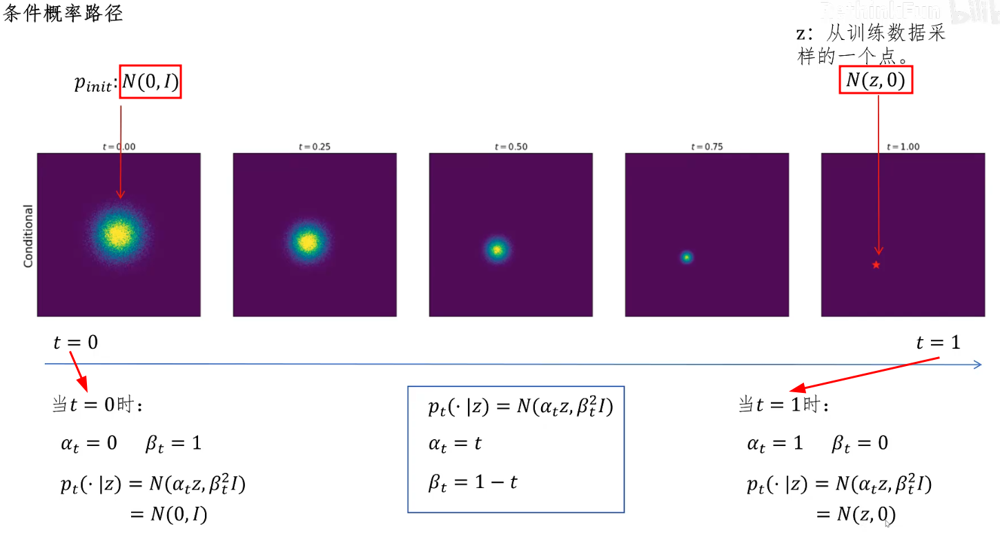

边缘概率路径
1. 目标是 **分布**，把所有可能的 终点$z$的轨迹 全部混合在一起看
2. 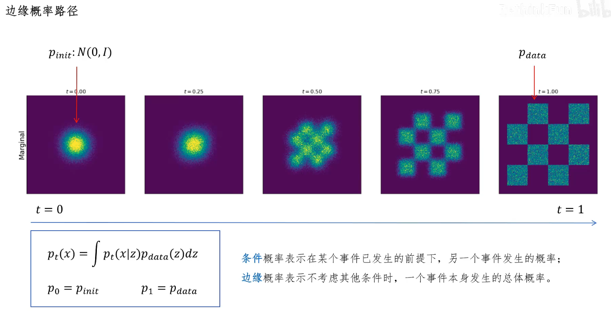
3. **全概率公式**，对所有可能的目标点 求和/叠加
4. $$p_t(x) = \int p_t(x|z) p_{data}(z) dz$$
5. 个人理解 : 每条轨迹都有一定概率，目标点概率高的，对应的轨迹概率高

**宏观的流 是由 无数个 条件概率路径(小云团) 叠加而成的**

定义一个 Flow
1. 构造 & 验证 Flow
2. 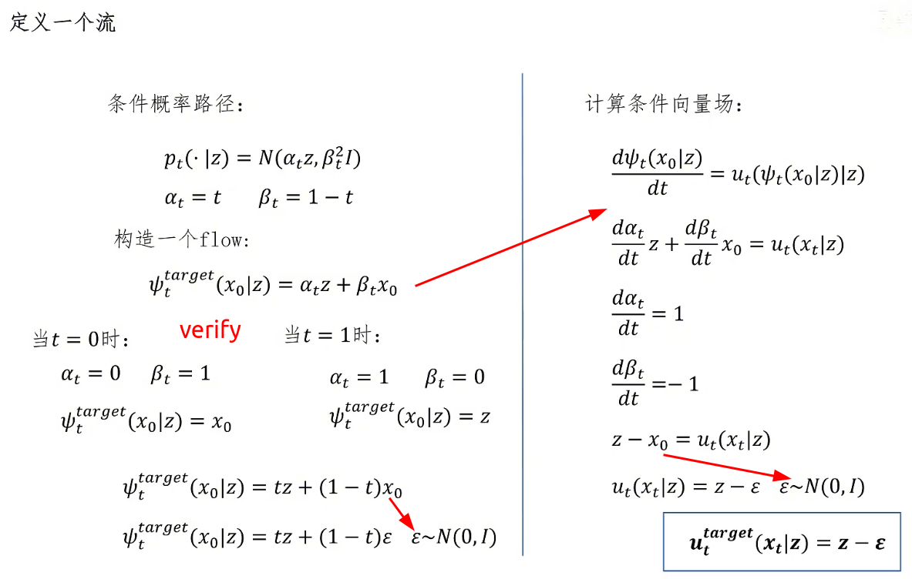
3. $x_0$ 是从 标准正态分布 采样得到的，替换为 $\epsilon$
4. 可以根据 Flow，计算 向量场(给定 $z$ 的 条件向量场)
5. 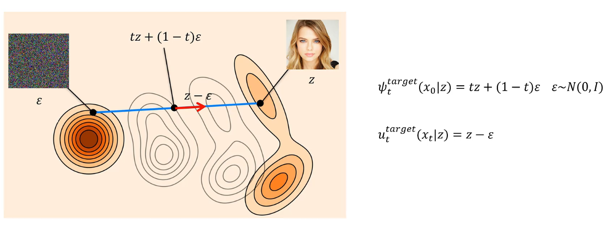
6. 选取 训练数据$z$ & 采样一个噪声点$\epsilon$，可以确定速度向量，在整个路径都不变(因为 构造的 Flow 是比较简单)

**问题**
1. ==目标== : 神经网络学习出 **==边缘向量场$u_t^\theta$==**，不依赖 任何训练数据
2. 期望的 MSE Loss($L(\theta) = ||u_t^\theta(x_t) - u_t^\text{target}(x_t)||^2$)，不依赖 目标数据点$z$
3. 是否可以用 条件向量场计算出的速度 作为 训练 label 来训练 边缘向量场？
4. 即 是否可以 用 $L(\theta) = ||u_t^\theta(x_t) - u_t^\text{target}(x_t|z)||^2$ 近似上面的 期望的 MSE Loss
5. 答案是可以的

需要证明 : **可以用 条件向量场 计算出的速度 作为 训练 label 来训练 边缘向量场**

**边缘向量场**
1. **边缘向量场公式 & 边缘概率路径公式 不一样**，不是概率值，==不能直接套用 全概率公式==
2. ==错误的==
   1. $$u_t^{target}(x) = \int u_t^{target}(x|z)p_{data}(z)dz$$
3. 需要引入 **==后验概率==**
4. ==正确的==
   1. $$u_t^{target}(x) = \int u_t^{target}(x|z) p_t(z|x) dz$$
   2. $p_t(z|x)$ : 已经在了 $x$ 这个位置，终点是 $z$ 的概率
5. 引入 **贝叶斯公式**
   1. $$p_t(z|x) = \frac{p_t(x|z)p_{data}(z)}{p_t(x)}$$
6. 最终表达式
   1. $$u_t^{target}(x) = \int u_t^{target}(x|z)\frac{p_t(x|z)p_{data}(z)}{p_t(x)}dz$$

**连续方程/质量守恒方程** (流体力学)
1. $\frac{\partial \rho}{\partial t} + div (\rho \mathbf{u}) = 0$
2. $div (\rho \mathbf{u})$ **散度算子**，表示 单位体积内的 质量流出速率 (密度 * 速度)
3. $\mathbf{u} = (u,v,w)$ , $div(\rho \mathbf{u}) = \frac{\partial (\rho u)}{\partial x} + \frac{\partial (\rho v)}{\partial y} + \frac{\partial (\rho w)}{\partial z}$
4. **物理含义** : 某点密度随时间的变化 = **负的**质量净流出

**类比**
1. 对于 流体，需要保证整体质量不变，只是在不同位置流动
2. 对于 向量场，需要保证任意时刻，概率密度流动 但总量不变
   1. 对整个概率流增加了一个 **质量守恒** 的约束

**验证 边缘向量场公式 满足 连续方程**(即验证 边缘向量场公式 是一个合法的 flow)
1. $div$ 操作是 对 $x$ 的偏导数，而不是 $z$ 的偏导数，可以提取到积分外面
2. 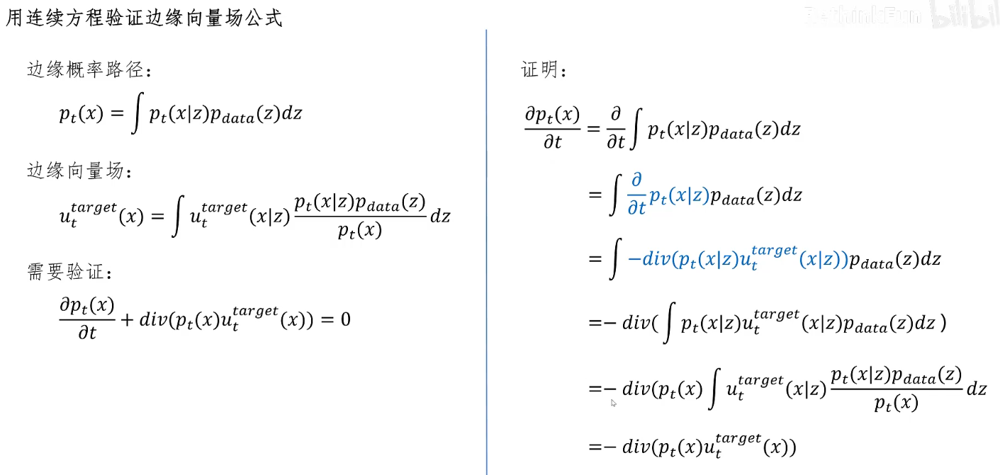

证明 两种 Loss 等价，即 **可以用 条件向量场 计算出的速度 作为 训练 label 来训练 边缘向量场**
1. $L_{\text{FM}}$ : 理想的 Loss，训练边缘向量场的目标
   1. $x$ 服从 边缘概率路径 $p_t(x)$
   2. 训练 label 是 **边缘向量场** $u_t^{target}(x)$
2. $L_{\text{CFM}}$ : conditional flow matching loss
   1. $x$ 服从 条件概率路径 $p_t(x|z)$
   2. 训练 label 是 **条件向量场** $u_t^{target}(x|z)$
3. 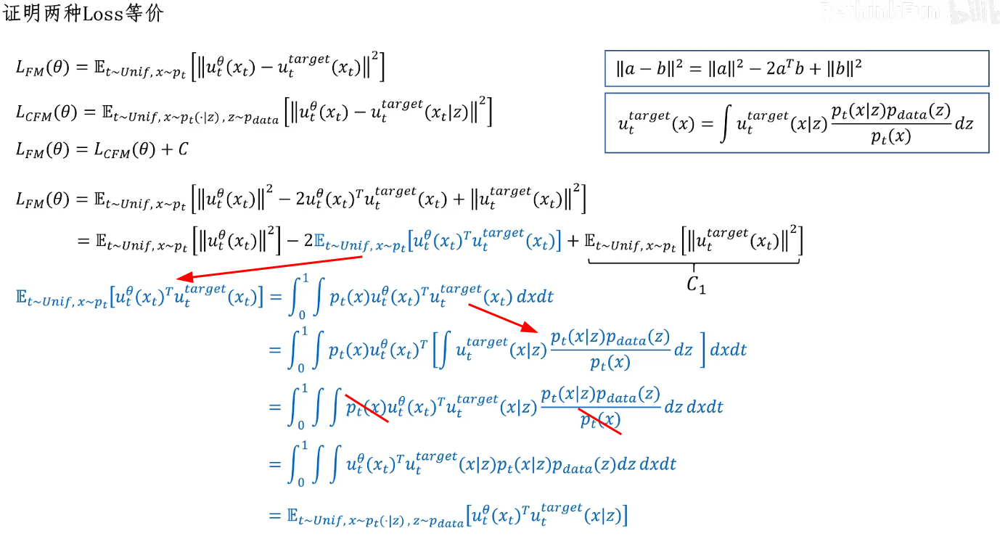
4. 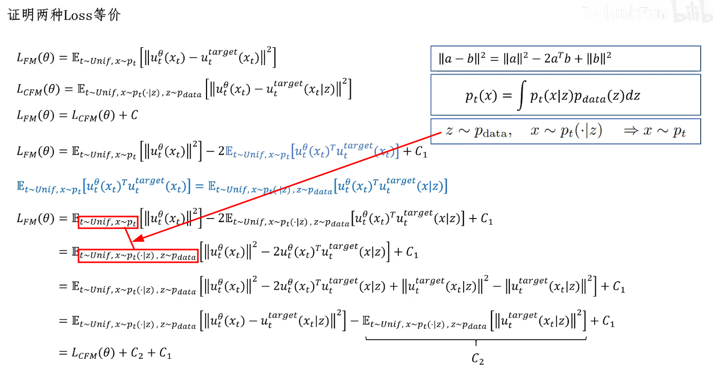

训练 Training
1. 从 训练数据 随机获取 图片$z$
2. 随机获取 时间 $t \in [0, 1]$
3. 随机获取 多维噪声 $\epsilon$，作为 $x_0$，$\epsilon \sim \mathcal{N}(0, I)$
4. 根据 流公式，计算 $x_t = tz + (1-t)\epsilon$
5. 对神经网络传入 $x_t$ 和 $t$，得到 预测的速度向量 $u_t^\theta(x_t)$
6. 用条件向量场公式 $z-\epsilon$ 作为 训练 label，计算 MSE Loss，更新网络参数 $\theta$
   1. 显然 label 依赖 $z$，而 最终得到的 边缘向量场 不依赖 $z$

生成/推理 Inference
1. 步数$n$ (远少于 DDPM)，时间间隔 $h = \frac{1}{n}$，边缘向量场 $u_t^\theta$
2. 从 $p_\text{data}$ 采样一个样本 $x_0$
3. 循环 迭代 $n$ 步
   1. 计算 $t = t + h$
   2. 根据 边缘向量场，计算 $x_{t+h} = x_t + h u_t^\theta(x_t)$

---

关键在于 : 设计 团云从 噪声 到 目标图片 的轨迹

主流方法
1. 最优传输流 (Optimal Transport Flow / Rectified Flow)
   1. 设计思路 : 两点之间，直线最短
   2. 数学表达 : 给定 初始噪声$x_0$ & 目标图像$x_1$ 的情况下，强行规定路径是一条匀速直线，$x_t = (1-t)x_0 + t x_1$
   3. 速度场 : 匀速直线运动，瞬时速度是恒定的，即 $u_t = x_1 - x_0$
   4. 优势(轨迹是笔直的)
      1. 神经网络学起来就极其容易(目标速度不随时间突变)
      2. 在推理时，用欧拉法 迈大步 也不会产生太大的截断误差，适合 少步数(Few-step) 甚至 单步生成
2. 扩散流 (Diffusion-like Flow)
   1. 设计思路 : 模仿自然界的 物理扩散过程
   2. 数学表达 : 路径不是直线，而是一条非线性的曲线
      1. $$x_t = \cos(\frac{\pi}{2}t)x_0 + \sin(\frac{\pi}{2}t)x_1$$
   3. 速度场 : 速度 $u_t$ 会随着时间 $t$ 发生复杂的 非线性变化
   4. 轨迹是弯曲的，用欧拉法 步子迈大 很容易 偏离轨道
3. 薛定谔桥 (Schrödinger Bridge)
   1. 更高级、更复杂
   2. 设计思路 : 不仅要求从噪声变到图像，还允许在路径中加入随机性(布朗运动)，寻找在这两端点之间、满足某些能量最小化条件的最优随机路径
   3. 通常用在 需要做非常复杂的 图像到图像(Image-to-Image) 转换

Flow Matching（特别是 OT-Flow Matching）致力于让轨迹变得像直线一样。如果真实的轨迹本身就是一条直线，那么无论你的步长 $h$ 有多大，甚至直接设 $n=1$ （一步登天），都不会产生拟合误差！这就是为什么 Flow Matching 可以做到极少步数（Few-step）甚至单步生成的原因

最简单的线性 Flow Matching，通常叫 Optimal Transport

---

## Normalizing Flows

最好可以对数据分布进行建模

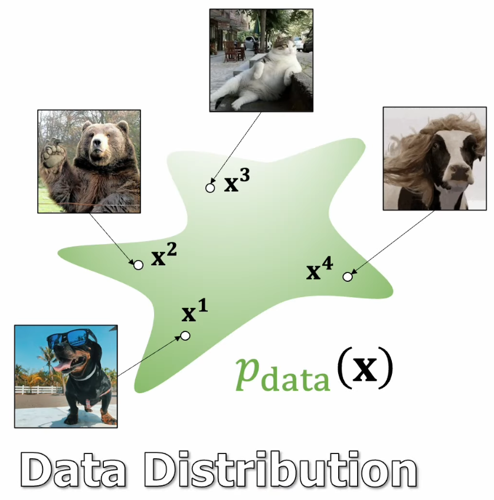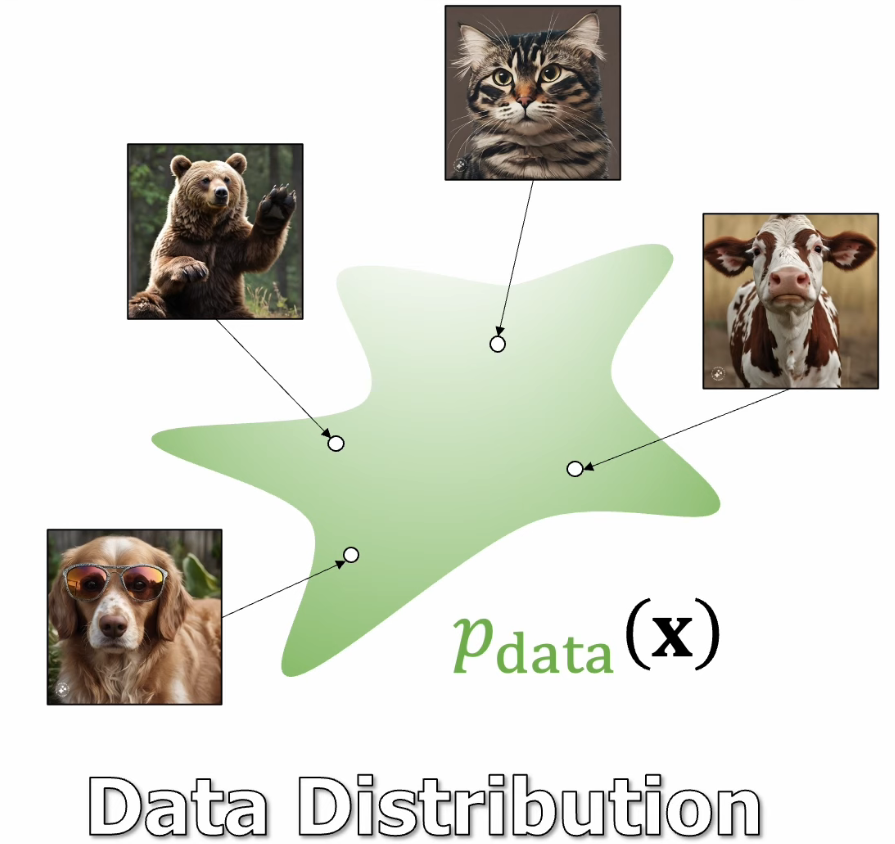

可以从分布中 创建新图像，或者 评估样本的 可能性

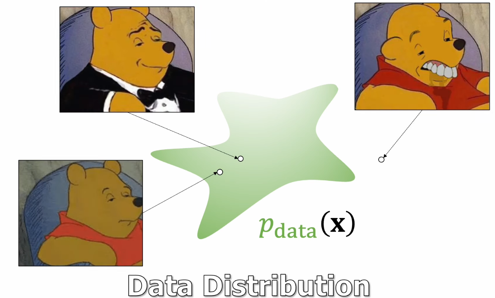

但是 不知道 真正的 数据分布，只有 samples

同时 有 可以轻松采样 的 base distribution

希望 训练一个 Generator 可以

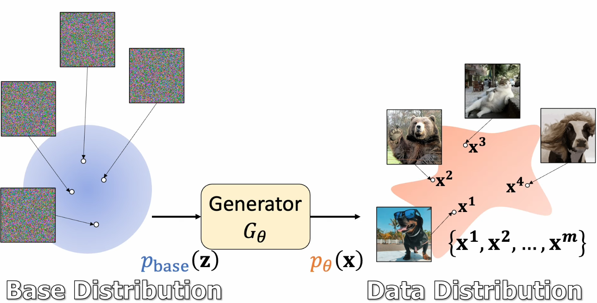

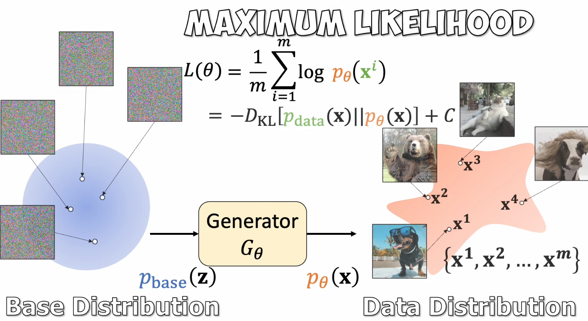

## Continuous Normalizing Flows

Normalizing Flows 用 **离散** 的可逆变换叠加，CNF 将其推广为 **连续** 的 ODE 过程

$$\frac{dx}{dt} = v_\theta(x, t), \quad t \in [0, 1]$$

- $x_0 \sim p_0$（简单分布，如高斯），$x_1 \sim p_1$（数据分布）
- 神经网络 $v_\theta$ 定义了每个时刻粒子的运动方向和速度
- 前向：从噪声积分到数据；反向：从数据积分回噪声（用于计算 likelihood）

**核心问题：** 训练时需要反复 **模拟 ODE**（adjoint method），计算代价极高，难以扩展

Flow Matching 正是为了解决这个训练瓶颈而提出的

## Flow Matching

**核心思路：** 不模拟 ODE，直接对向量场做 **回归监督**

### Marginal Flow Matching (MFM)

理想目标：学习边际向量场 $u_t(x)$，满足 $\frac{dx}{dt} = u_t(x)$ 可以将 $p_0$ 变为 $p_1$

但 $u_t(x)$ 无法直接计算（需要对所有路径积分）

### Conditional Flow Matching (CFM)

**关键洞察：** 给定一对端点 $(x_0, x_1)$，条件向量场是 **可解析计算的**

取线性插值路径：

$$x_t = (1-t) x_0 + t x_1$$

对应的条件速度（常数向量！）：

$$u_t(x_t \mid x_0, x_1) = x_1 - x_0$$

**CFM 训练目标：**

$$\mathcal{L}_\text{CFM} = \mathbb{E}_{t, x_0 \sim p_0, x_1 \sim p_1} \left\| v_\theta(x_t, t) - (x_1 - x_0) \right\|^2$$

可以证明：最小化 $\mathcal{L}_\text{CFM}$ 等价于学习真实的边际向量场，**无需模拟 ODE**

### 采样（推理）

训练好后，用 ODE solver（如 Euler、RK4）积分：

$$x_{t+\Delta t} = x_t + v_\theta(x_t, t) \cdot \Delta t$$

由于路径接近直线，用少量步骤（10~20）即可得到高质量样本

## Scaling up Training

### Optimal Transport (OT) Path

线性插值路径可能出现 **路径交叉** 问题，OT 通过最优配对 $(x_0, x_1)$ 使路径更短更直

- 减少路径交叉 → 向量场更简单 → 网络更容易拟合
- 采样步骤进一步减少，质量更高

### 工业应用

Flow Matching 已成为大规模生成模型的主流训练框架：

| 模型 | 说明 |
|---|---|
| Stable Diffusion 3 | 首个大规模采用 Flow Matching 的图像生成模型 |
| FLUX | 基于 Flow Matching + DiT 架构 |
| Movie Gen (Meta) | 视频生成，使用 Flow Matching |
| Sora (OpenAI) | 推测使用 Flow Matching 类方法 |

### 与 Diffusion 的统一视角

Diffusion 可以看作 Flow Matching 的特殊情况：

- Diffusion：SDE 路径，随机弯曲
- Flow Matching：ODE 路径，确定直线
- DDIM（Diffusion 的确定性采样）在极限情况下趋近于 Flow Matching

