# GAN - Generative Adversarial Network

[Understanding GANs (Generative Adversarial Networks) - YouTube(DeepBean)](https://www.youtube.com/watch?v=RAa55G-oEuk)

类似 counterfeiter(伪造文件的人) & police(警察)
1. 前者 : Generative Model
2. 后者 : Discriminator

对抗学习框架 Adversarial Learning Framework
1. 
2. Discriminator 区分 Real/Generated Samples
3. Generator 试图 欺骗 Discriminator，最终实现 生成真实图像，得到 Generative Model

Motivation
1. 对于 输入数据 x，希望训练模型，获取 data space 中的 target distribution
   1. 
   2. generative model 能够，通过 从 learned distribution 中 采样，生成 novel sample
2. 
3. Dataset D : data space 中的 点集，是从 **underlying distribution** $p^*(x)$  中进行抽取
   1. 这样的 sample 是 Ground Truth Generative Procedure，产生数据集中的样本，但是 该 Procedure 是未知的
   2. 只能使用 $p(\theta)$ 来近似 $p^*(x)$
4. Generative Model 的目的就是 优化 $\theta$，使得 **model distribution** & **target distribution** 能够 closely align
5. 有限制 : 需要保证 输出是 probability distribution
   1. sum = 1 (normalization)   : 可以计算 sum 然后 normalize，但是 积分是 intractable 的 (高维度、且没有解析式)
   2. 概率值 >0 (non-negativity) : 相对好解决
6. GAN 通过重构 来回避该问题，通过 latent distribution $z \sim p_z(z)$(遵循已知的 概率分布，满足 归一 & 非负) 来 间接学习
   1. 将 $p_z$ 称为 Noise Distribution
   2. 通过 latent space & data space 之间的 映射，implicitly 学习 target distribution $p^*$
   3. 挑战 : 保证 mapping 确实从 $p^*$ 产生点(有意义的图像)

GAN 工作原理
1. 2个模型(都是 deep neural network) : Generator & Discriminator
2. **Generator**
   1. 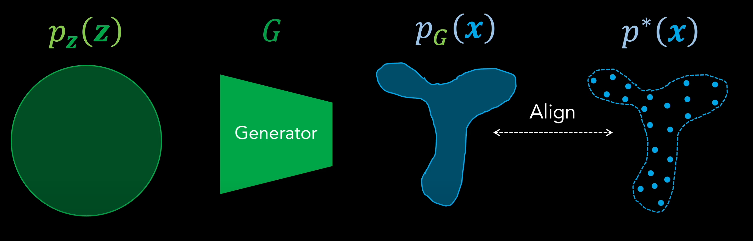
   2. 将 latent space 中的 noise distribution $p_Z(z)$ 映射到 data space 中的 generator distribution $p_G(x)$
   3. generator distribution 需要和 target distribution 尽量 align
   4. align 就是让 generated sample 和 real sample 难以区分(indistinguishable)
3. **Discriminator**
   1. 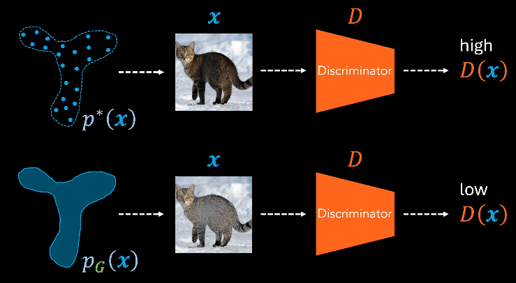
   2. 需要区分 real/generated input
   3. 输出 标量 scalar(是真实样本的概率)，范围 0~1，二分类问题
   4. 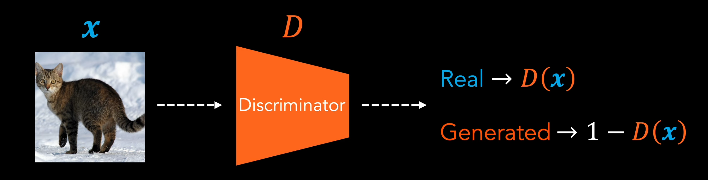
4. 二分类任务 binary classification task
   1. `discriminator output` & `ground truth` 可以理解为 2个类别的 categorical distribution
   2. 需要使用 loss function 对齐 distribution
   3. 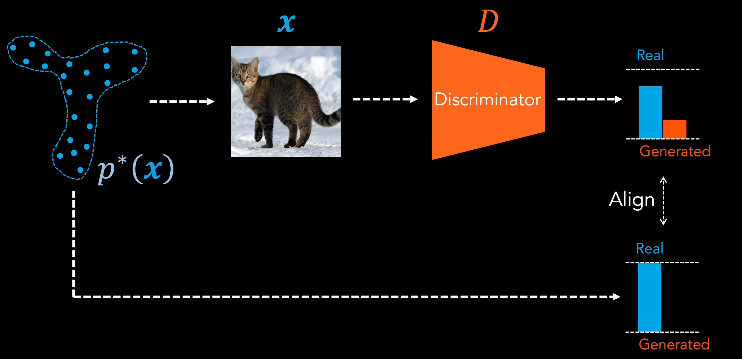
   4. **分类讨论** : 对于判断结果 y 是 real 的，希望 $D(x)$ 尽量大，反之，对于判断结果 y 是 generated 的，希望 $1-D(x)$ 尽量大 ($D(x)$ 尽量小)
   5. 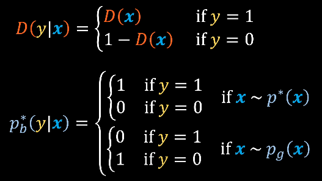
   6. align distribution 需要 **KL-Divergence** 衡量 distribution 的 closeness
      1. **没有对称性** : $$D_{KL}(p^*_b || D) \neq D_{KL}(D || p^*_b)$$
      2. **连续公式** : $$D_{KL}(p_b^{\star}\|D)=\mathbb{E}_{y \sim p_b^*(y | x)}\left[\log (\frac{p_b^* (y | x)}{D(y |x)})\right]$$
      3. **离散公式** : $$D_{KL}(p_b^{\star}\|D)=\sum_y p_b^*(y | x) \log (\frac{p_b^* (y | x)}{D(y |x)})$$
5. Loss Function
   1. log 相除 可以 拆分为 相减，然后 左半边项 是常数，可以忽略
   2. KL 变为了 $D$ & $p^*_b$ 的 Cross-Entropy
   3. 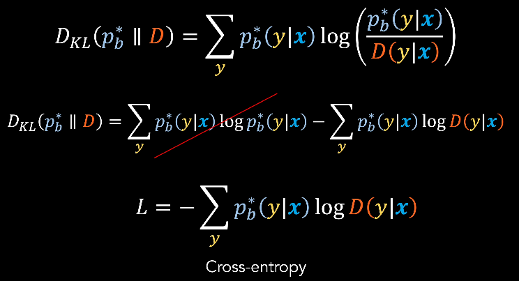
   4. y 只有 0 & 1 两种可能，可以展开，并且所有分布都是 Bernoulli Distribution，结合之前的 **分类讨论** 可以进一步化简为 Binary Cross-Entropy
   5. 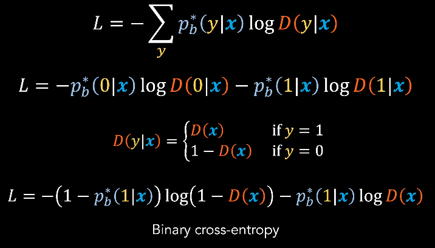
   6. 个人理解，对于 $p_b^*$ 的 分类讨论 需要 结合 数据集，涉及到 样本 real/generated
   7. **Final Discriminator Loss**
      1. 结合 real/generated 分类 & 之前的分类讨论，可以进一步化简 Discriminator Loss
      2. 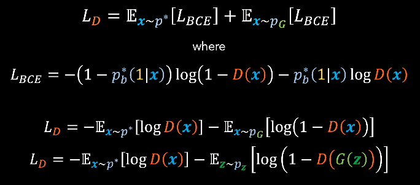
   8. **Final Generator Loss**
      1. 目的是 $p_G(x)$ & $p^*(x)$ 对齐，也可以相当于 降低 Discriminator 的 能力 (中间目标)
      2. 因此 Generator Loss 是 Discriminator Loss 的相反数，并且第一项也可以略去 (不受 Generator 影响)
      3. 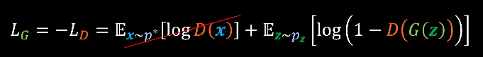
6. Train
   1. 训练 需要使用 mixed real-generated dataset
   2. 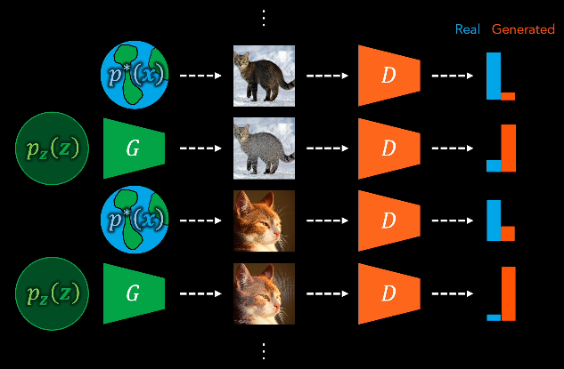
   3. 希望 Discriminator 能够学到 表明 input 不是 real 的 features
   4. 通过 Loss 可以看出，Generator & Discriminator 正在接收 矛盾的训练
   5. 从 博弈论 Game Theory 中，可以将表达式 视作 Value Function，Training 可以视为 G & D 的 MiniMax Game，玩家的回报 与 另一玩家的 相反，各自希望最大化自己的回报
      1. 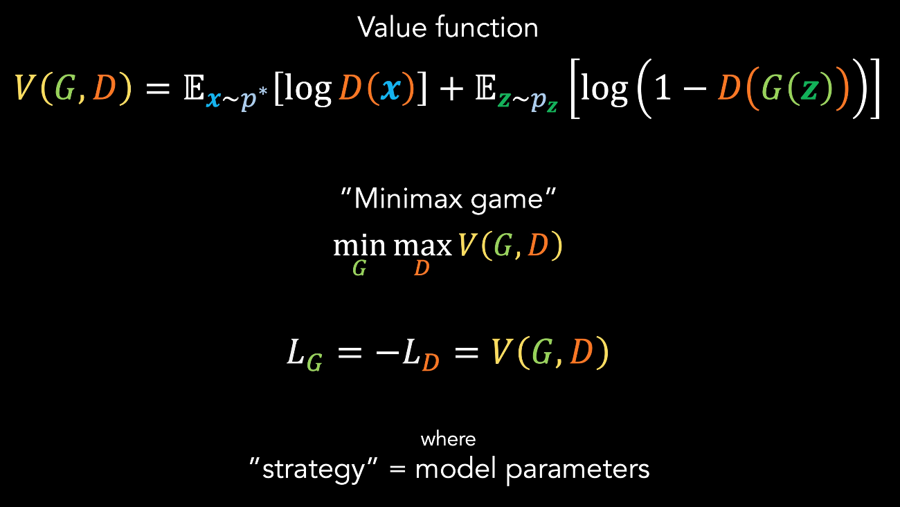
      2. Generator 希望 minimize Value Function
      3. Discriminator 希望 maximize Value Function
   6. 训练 GAN 相当于找到 博弈的 Nash Equilibrium (纳什均衡)，模型参数稳定，任一方在固定对手参数时，都无法单独进一步改进 各自的目标函数值
      1. 达到均衡的策略
         1. 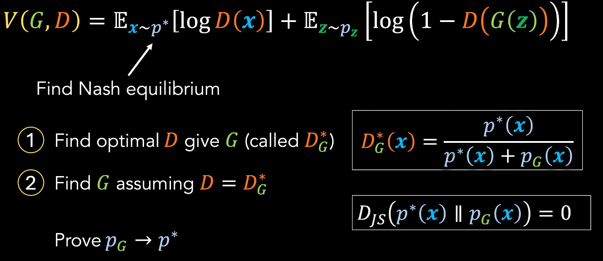
         2. 先 给定 任何 $G$，找到 最优 $D^*$
         3. 假设 $D=D_G^*$ 始终保持最佳，找到 最优 $G$
         4. 如果将两个模型都训练到最优，$p_G$ 就会 align $p^*$
         5. 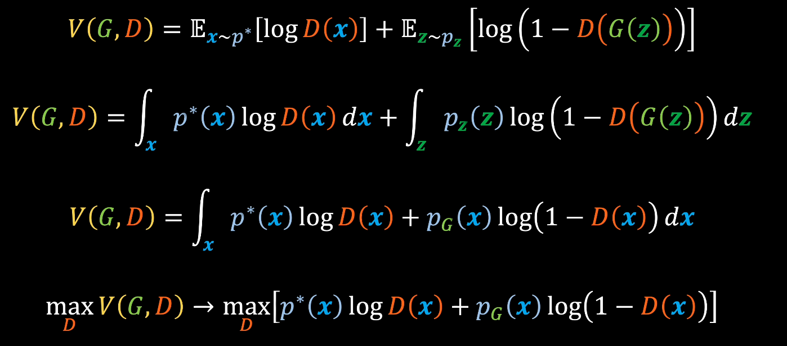
         6. 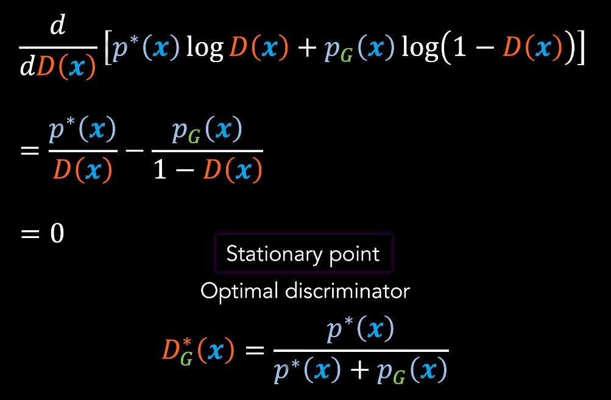
         7. 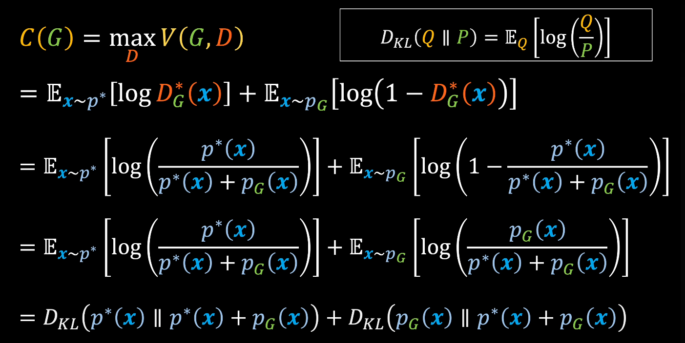
         8. 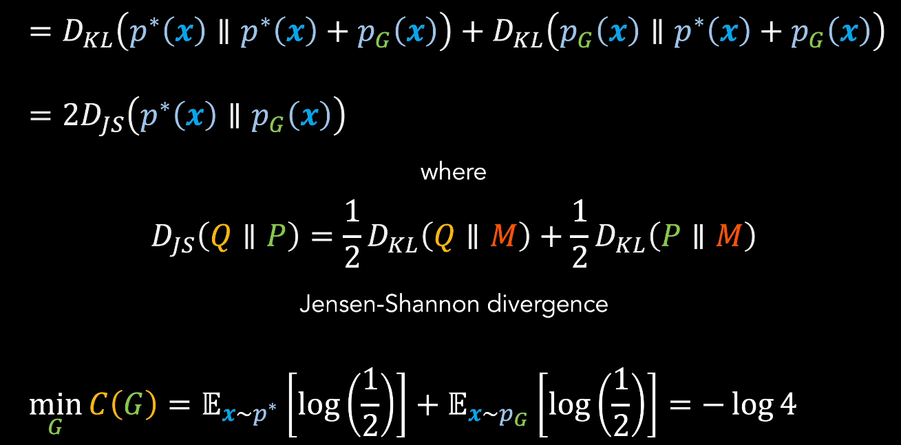
         9. TODO

