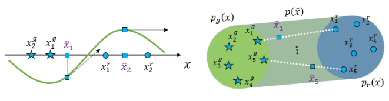

# GAN - Generative Adversarial Network - 生成式对抗网

---

## Table of Contents

- [GAN - Generative Adversarial Network - 生成式对抗网](#gan---generative-adversarial-network---生成式对抗网)
  - [Table of Contents](#table-of-contents)
- [Understanding GANs - YouTube(DeepBean)](#understanding-gans---youtubedeepbean)
- [W-GAN](#w-gan)
- [Gradient Penalty (梯度惩罚)](#gradient-penalty-梯度惩罚)
  - [$K$-Lipschitz Continuity](#k-lipschitz-continuity)

---

# Understanding GANs - YouTube(DeepBean)

[Understanding GANs (Generative Adversarial Networks) - YouTube(DeepBean)](https://www.youtube.com/watch?v=RAa55G-oEuk)

类似 counterfeiter(伪造文件的人) & police(警察)
1. 前者 : Generative Model
2. 后者 : Discriminator

对抗学习框架 Adversarial Learning Framework
1. 
2. Discriminator 区分 Real/Generated Samples
3. Generator 试图 欺骗 Discriminator，最终实现 生成真实图像，得到 Generative Model

Motivation
1. 对于 输入数据 x，希望训练模型，获取 data space 中的 target distribution
   1. 
   2. generative model 能够，通过 从 learned distribution 中 采样，生成 novel sample
2. 
3. Dataset D : data space 中的 点集，是从 **underlying distribution** $p^*(x)$  中进行抽取
   1. 这样的 sample 是 Ground Truth Generative Procedure，产生数据集中的样本，但是 该 Procedure 是未知的
   2. 只能使用 $p(\theta)$ 来近似 $p^*(x)$
4. Generative Model 的目的就是 优化 $\theta$，使得 **model distribution** & **target distribution** 能够 closely align
5. 有限制 : 需要保证 输出是 probability distribution
   1. sum = 1 (normalization)   : 可以计算 sum 然后 normalize，但是 积分是 intractable 的 (高维度、且没有解析式)
   2. 概率值 >0 (non-negativity) : 相对好解决
6. GAN 通过重构 来回避该问题，通过 latent distribution $z \sim p_z(z)$(遵循已知的 概率分布，满足 归一 & 非负) 来 间接学习
   1. 将 $p_z$ 称为 Noise Distribution
   2. 通过 latent space & data space 之间的 映射，implicitly 学习 target distribution $p^*$
   3. 挑战 : 保证 mapping 确实从 $p^*$ 产生点(有意义的图像)

GAN 工作原理
1. 2个模型(都是 deep neural network) : Generator & Discriminator
2. **Generator**
   1. 
   2. 将 latent space 中的 noise distribution $p_Z(z)$ 映射到 data space 中的 generator distribution $p_G(x)$
   3. generator distribution 需要和 target distribution 尽量 align
   4. align 就是让 generated sample 和 real sample 难以区分(indistinguishable)
3. **Discriminator**
   1. 
   2. 需要区分 real/generated input
   3. 输出 标量 scalar(是真实样本的概率)，范围 0~1，二分类问题
   4. 
4. 二分类任务 binary classification task
   1. `discriminator output` & `ground truth` 可以理解为 2个类别的 categorical distribution
   2. 需要使用 loss function 对齐 distribution
   3. 
   4. **分类讨论** : 对于判断结果 y 是 real 的，希望 $D(x)$ 尽量大，反之，对于判断结果 y 是 generated 的，希望 $1-D(x)$ 尽量大 ($D(x)$ 尽量小)
   5. 
   6. align distribution 需要 **KL-Divergence** 衡量 distribution 的 closeness
      1. **没有对称性** : $$D_{KL}(p^*_b || D) \neq D_{KL}(D || p^*_b)$$
      2. **连续公式** : $$D_{KL}(p_b^{\star}\|D)=\mathbb{E}_{y \sim p_b^*(y | x)}\left[\log (\frac{p_b^* (y | x)}{D(y |x)})\right]$$
      3. **离散公式** : $$D_{KL}(p_b^{\star}\|D)=\sum_y p_b^*(y | x) \log (\frac{p_b^* (y | x)}{D(y |x)})$$
5. Loss Function
   1. log 相除 可以 拆分为 相减，然后 左半边项 是常数，可以忽略
   2. KL 变为了 $D$ & $p^*_b$ 的 Cross-Entropy
   3. 
   4. y 只有 0 & 1 两种可能，可以展开，并且所有分布都是 Bernoulli Distribution，结合之前的 **分类讨论** 可以进一步化简为 Binary Cross-Entropy
   5. 
   6. 个人理解，对于 $p_b^*$ 的 分类讨论 需要 结合 数据集，涉及到 样本 real/generated
   7. **Final Discriminator Loss**
      1. 结合 real/generated 分类 & 之前的分类讨论，可以进一步化简 Discriminator Loss
      2. 
   8. **Final Generator Loss**
      1. 目的是 $p_G(x)$ & $p^*(x)$ 对齐，也可以相当于 降低 Discriminator 的 能力 (中间目标)
      2. 因此 Generator Loss 是 Discriminator Loss 的相反数，并且第一项也可以略去 (不受 Generator 影响)
      3. 
6. Train
   1. 训练 需要使用 mixed real-generated dataset
   2. 
   3. 希望 Discriminator 能够学到 表明 input 不是 real 的 features
   4. 通过 Loss 可以看出，Generator & Discriminator 正在接收 矛盾的训练
   5. 从 博弈论 Game Theory 中，可以将表达式 视作 Value Function，Training 可以视为 G & D 的 MiniMax Game，玩家的回报 与 另一玩家的 相反，各自希望最大化自己的回报
      1. 
      2. Generator 希望 minimize Value Function
      3. Discriminator 希望 maximize Value Function
   6. 训练 GAN 相当于找到 博弈的 Nash Equilibrium (纳什均衡)，模型参数稳定，任一方在固定对手参数时，都无法单独进一步改进 各自的目标函数值
      1. 达到均衡的策略
         1. 
         2. 先 给定 任何 $G$，找到 最优 $D^*$
         3. 假设 $D=D_G^*$ 始终保持最佳，找到 最优 $G$
         4. 如果将两个模型都训练到最优，$p_G$ 就会 align $p^*$
         5. 
         6. 
         7. 
         8. 
         9. TODO

---

# W-GAN

W-GAN (Wasserstein GAN) 的目标函数基于 Wasserstein 距离(也称 Earth-Mover 距离)

与 原始 GAN 的 Jensen-Shannon (JS) 散度目标函数有显著不同

W-GAN 的核心在于它不再将 判别器(Discriminator) 视为 二分类器，而是将其视为 评论家(Critic)，输出 标量分数 衡量样本的 真实程度

W-GAN 的 Min-Max 目标函数
1. $$\min_G \max_{D \in \mathcal{L}_1} \underset{x \sim \mathbb{P}_r}{\mathbb{E}}[D(x)] - \underset{\tilde{x} \sim \mathbb{P}_g}{\mathbb{E}}[D(\tilde{x})]$$

$$w^* = \argmin_w \mathbb{E}_{x\sim p_r(x)} [ f_w(x) ] - \mathbb{E}_{x\sim p_g(x)} [ f_w(x) ]$$
1. 第1项 $\mathbb{E}_{x\sim p_r(x)} [ f_w(x) ]$ : 判别器(Critic) 给 真实样本 (Real Data) 打分的平均值
2. 第2项 $\mathbb{E}_{x\sim p_g(x)} [ f_w(x) ]$ : 判别器(Critic) 给 生成样本 (Fake Data) 打分的平均值

---

# Gradient Penalty (梯度惩罚)

对 原始 W-GAN(Wasserstein GAN) 的一种改进方案

原始 W-GAN 使用 **权重剪裁(Weight Clipping)** 来满足 数学上的 **Lipschitz 连续性约束**，但会导致 **训练不稳定**

W-GAN-GP 提出了用 Gradient Penalty 来替代剪裁，效果更好

要求 判别器函数 $f_w(x)$ 的变化不能太剧烈

Gradient Penalty 实现
1. W-GAN 中的 Lipschitz 条件 只是要求 **函数的梯度有界**，具体多少 其实无所谓
2. 整个 Loss 由 原始 W-GAN 损失 & 梯度惩罚(GP) 共同构成
3. **单侧惩罚**
   1. $$w^* = \argmin_w \mathbb{E}_{x\sim p_r(x)} [ f_w(x) ] - \mathbb{E}_{x\sim p_g(x)} [ f_w(x) ] + \lambda \max(\|\nabla_x f_w(x)\|, 1)$$
   2. $\|\nabla_x f_w(x)\| > 1$ 就惩罚，将梯度限制在 1 之内
      1. $\|\nabla_x f_w(x)\| \ge 1$ 时，惩罚项 为 常数项 $\lambda$，求 $\argmin$ 时 可忽略
      2. $\|\nabla_x f_w(x)\| < 1$   时，惩罚项 为 $\lambda · \|\nabla_x f_w(x)\|$，求 $\argmin$ 时 梯度越大 惩罚越大
4. **双侧惩罚** (标准 W-GAN-GP)
   1. $$w^* = \argmin_w \mathbb{E}_{x\sim p_r(x)} [ f_w(x) ] - \mathbb{E}_{x\sim p_g(x)} [ f_w(x) ] + \lambda (\|\nabla_x f_w(x)\| - 1)^2$$
   2. $\|\nabla_x f_w(x)\| \ne 1$ 就惩罚，且 距离 1 越远 惩罚越大
5. 单侧惩罚项中 的 $\max$ **不可微**，所以 双侧惩罚 更加合理

具体实现
1. **Lipschitz 连续性约束** 要求 函数 在任意位置的 $\hat{x}$ 梯度范数 不能超过一个定值，即要求处处成立
2. 实际上 很难 遍历 无穷多点，只有 有限的 样本点
3. $\hat{x}$ 取自 训练小批次(mini-batch)中 全部 $x_{gen}$ & $x_{real}$ 的 随机混合 $\hat{x} = \epsilon x_{real} + (1-\epsilon)x_{gen}$，$\epsilon \sim \mathcal{U}(0, 1)$
4. 

## $K$-Lipschitz Continuity

衡量函数 平滑程度/变化速度，给函数的变化率(斜率/梯度)设了一个上限

数学公式
1. 如果一个函数 $f(x)$ 满足 **$K$**-Lipschitz 连续，那么 对于 **定义域内** 任意 2点 $x_1$ & $x_2$，必须满足
   1. $$|f(x_1) - f(x_2)| \le K \cdot ||x_1 - x_2||$$
   2. $$\frac{|f(x_1) - f(x_2)|}{||x_1 - x_2||} \le K$$
2. 对于 **可导函数**(eg : 神经网络中常用的函数)，==Lipschitz 连续性== **等价于** ==梯度的范数 有上界==
   1. $$||\nabla_x f(x)|| \le K$$
   2. 梯度的 L2 范数 : 求 output($y = D(x)$) 对 input($x$) 每一位 的 偏导数(partial derivative)，平方，求和，开根号
      1. $$||\nabla_x D(x)||_2 = \sqrt{ \sum_{i=1}^{n} \left( \frac{\partial D(x)}{\partial x_i} \right)^2 }$$

