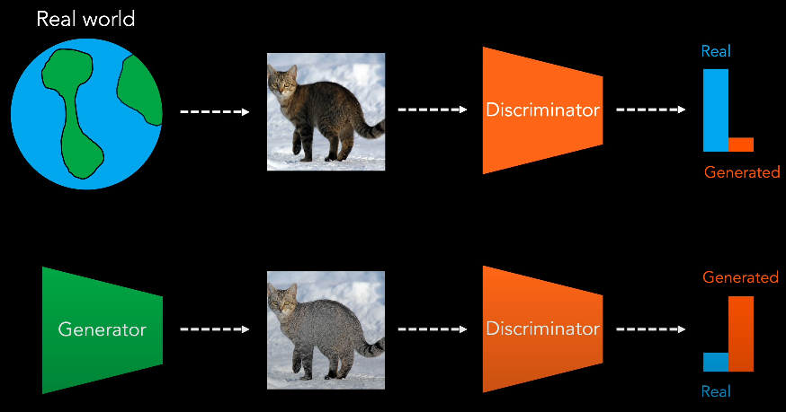
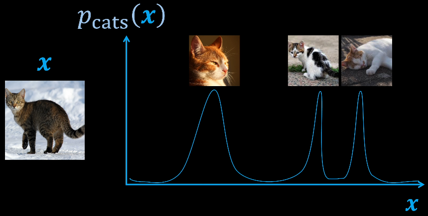
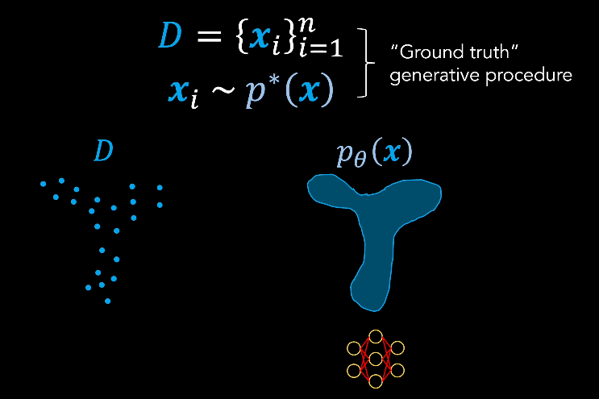

# GAN - Generative Adversarial Network

[Understanding GANs (Generative Adversarial Networks) - YouTube(DeepBean)](https://www.youtube.com/watch?v=RAa55G-oEuk)

类似 counterfeiter(伪造文件的人) & police(警察)
1. 前者 : Generative Model
2. 后者 : Discriminator

对抗学习框架 Adversarial Learning Framework
1. 
2. Discriminator 区分 Real/Generated Samples
3. Generator 试图 欺骗 Discriminator，最终实现 生成真实图像，得到 Generative Model

Motivation
1. 对于 输入数据 x，希望训练模型，获取 data space 中的 target distribution
   1. 
   2. generative model 能够，通过 从 learned distribution 中 采样，生成 novel sample
2. 
3. Dataset D : data space 中的 点集，是从 **underlying distribution** $p^*(x)$  中进行抽取
   1. 这样的 sample 是 Ground Truth Generative Procedure，产生数据集中的样本，但是 该 Procedure 是未知的
   2. 只能使用 $p(\theta)$ 来近似 $p^*(x)$
4. Generative Model 的目的就是 优化 $\theta$，使得 **model distribution** & **target distribution** 能够 closely align
5. 有限制 : 需要保证 输出是 probability distribution
   1. sum = 1 (normalization)   : 可以计算 sum 然后 normalize，但是 积分是 intractable 的 (高维度、且没有解析式)
   2. 概率值 >0 (non-negativity) : 相对好解决
6. GAN 通过重构 来回避该问题，通过 latent distribution $z \sim p_z(z)$(遵循已知的 概率分布，满足 归一 & 非负) 来 间接学习
   1. 将 $p_z$ 称为 Noise Distribution
   2. 通过 latent space & data space 之间的 映射，implicitly 学习 target distribution $p^*$
   3. 挑战 : 保证 mapping 确实从 $p^*$ 产生图像

