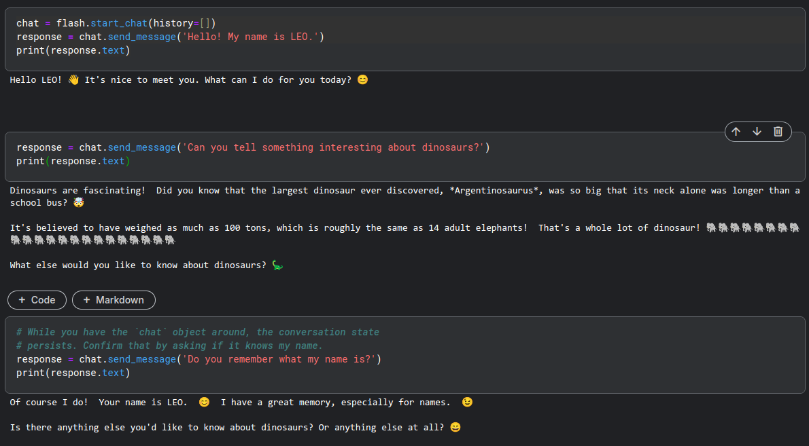

# 5-Day Gen AI Intensive Course

## Day 1 - Foundation Models and Prompt Engineering

[Day 1 Livestream – 5-Day Gen AI Intensive Course | Kaggle](https://www.youtube.com/watch?v=kpRyiJUUFxY)

[Foundational Large Language Models & Text Generation](./Newwhitepaper_Foundational%20Large%20Language%20models%20&%20text%20generation.pdf)

[Prompt Engineering](./Newwhitepaper_Prompt%20Engineering_v4.pdf)

```
🎒 Day 1 Assignments

Complete the Intro Unit - “Foundational Large Language Models & Text Generation”, which is:
1. [Optional] Listen to the summary podcast episode (https://youtu.be/mQDlCZZsOyo) for this unit (created by NotebookLM, https://notebooklm.google.com/).
2. Read the “Foundational Large Language Models & Text Generation” whitepaper (https://www.kaggle.com/whitepaper-foundational-llm-and-text-generation).

Complete Unit 1 - “Prompt Engineering”, which is:
1. [Optional] Listen to the summary podcast episode (https://youtu.be/F_hJ2Ey4BNc) for this unit (created by NotebookLM).
2. Read the “Prompt Engineering” whitepaper (https://www.kaggle.com/whitepaper-prompt-engineering).
3. Complete this code lab (https://www.kaggle.com/code/markishere/day-1-prompting) on Kaggle where you’ll learn prompting fundamentals. Make sure you phone verify (https://www.kaggle.com/settings) your account before starting, it's necessary for the code labs.


The code lab will walk you through getting started with the Gemini API and cover several prompt techniques and how different parameters impact the prompts.
```

[Google AI Studio 获取 API Key](https://aistudio.google.com/apikey)


```Python
import google.generativeai as genai
from IPython.display import HTML, Markdown, display

flash = genai.GenerativeModel('gemini-1.5-flash')

latest = genai.GenerativeModel(
    'gemini-1.5-flash-latest',
    generation_config=genai.GenerationConfig(
        temperature=1,
        top_p=1,
        max_output_tokens=1024,
    ))
```

单轮应答 - generate_content
```python
response = flash.generate_content("Explain AI to me like I'm an expert. in text format please")
print(response.text)
Markdown(response.text)  # render
```

多轮对话 - start_chat
```python
chat = flash.start_chat(history=[])
response = chat.send_message('Hello! My name is LEO.')
print(response.text)
# While you have the `chat` object around, the conversation state persists. Confirm that by asking if it knows my name.
response = chat.send_message('Do you remember what my name is?')
print(response.text)
```



查看 model 列表

```python
for model in genai.list_models():
    print(model.name)

'''
models/chat-bison-001
models/text-bison-001
models/embedding-gecko-001
models/gemini-1.0-pro-latest
models/gemini-1.0-pro
models/gemini-pro
models/gemini-1.0-pro-001
models/gemini-1.0-pro-vision-latest
models/gemini-pro-vision
models/gemini-1.5-pro-latest
models/gemini-1.5-pro-001
models/gemini-1.5-pro-002
models/gemini-1.5-pro
models/gemini-1.5-pro-exp-0801
models/gemini-1.5-pro-exp-0827
models/gemini-1.5-flash-latest
models/gemini-1.5-flash-001
models/gemini-1.5-flash-001-tuning
models/gemini-1.5-flash
models/gemini-1.5-flash-exp-0827
models/gemini-1.5-flash-002
models/gemini-1.5-flash-8b
models/gemini-1.5-flash-8b-001
models/gemini-1.5-flash-8b-latest
models/gemini-1.5-flash-8b-exp-0827
models/gemini-1.5-flash-8b-exp-0924
models/embedding-001
models/text-embedding-004
models/aqa
'''
```


查看详细信息

```python
for model in genai.list_models():
    if model.name == 'models/gemini-1.5-flash':
        print(model)
        break
'''
Model(name='models/gemini-1.5-flash',
      base_model_id='',
      version='001',
      display_name='Gemini 1.5 Flash',
      description='Fast and versatile multimodal model for scaling across diverse tasks',
      input_token_limit=1000000,
      output_token_limit=8192,
      supported_generation_methods=['generateContent', 'countTokens'],
      temperature=1.0,
      max_temperature=2.0,
      top_p=0.95,
      top_k=40)
'''
```

模型属性
1. Output length
   1. `generation_config=genai.GenerationConfig(max_output_tokens=20)`
   2. affects cost and performance
   3. specify the `max_output_tokens` parameter
   4. stop generating tokens once the specified length is reached
   5. 不会影响生成的内容，到长度自动停止
2. Temperature
   1. `generation_config=genai.GenerationConfig(temperature=2.0)`
   2. controls the degree of randomness in token selection
   3. higher temperatures result in a higher number of candidate tokens & produce more diverse results
   4. lower temperatures have the opposite effect
   5. temperature of 0 results in **greedy decoding**(select the most probable token at each step)
3. Top-K & Top-P
   1. `generation_config=genai.GenerationConfig(temperature=1.0,top_k=64,top_p=0.95,)` (default values for gemini-1.5-flash-001)
   2. also used to control the diversity of the model's output
   3. 都是 根据候选单词的 概率 排序来筛选最终的候选词
   4. 在 Top-K 或 Top-P 筛选出候选词之后，Temperature 还会进一步控制从这些候选词中选取最终单词的随机性
   5. **Top-K** is a **positive integer**, defines the number of most probable tokens from which to select the output token
      1. top-K of 1 selects a single token, performing **greedy decoding**
   6. **Top-P** defines the probability threshold that, once cumulatively exceeded, tokens stop being selected as candidates
      1. 基于概率的总和，而不是单纯的前 K 个单词
      2. top-P of 1 typically selects every token in the model's vocabulary

Retry Policy : When running lots of queries, it's a good practice to use a retry policy so your code automatically retries when hitting Resource Exhausted (quota limit) errors.
```python
retry_policy = {
    "retry": retry.Retry(
        predicate=retry.if_transient_error,  # 错误类型判断条件
        initial=10,  # 初始重试等待时间(秒)
        multiplier=1.5,  # 每次重试间隔的乘数(渐增加重试间隔)
        timeout=300  # 最大的重试总时长(seconds)
    )
}
```


Zero-Shot Prompt : 无需做特定训练的情况下依然可以完成一些简单的任务(翻译、分类)，得到不错的效果(泛化)
1. example
    ```python
    zero_shot_prompt = """Classify movie reviews as POSITIVE, NEUTRAL or NEGATIVE.
    Review: "Her" is a disturbing study revealing the direction humanity is headed if AI is allowed to keep evolving, unchecked. I wish there were more movies like this masterpiece.
    Sentiment:"""
    # Sentiment: **POSITIVE**
    ```

One-Shot and Few-Shot
1. example
    ```python
    few_shot_prompt = """Parse a customer's pizza order into valid JSON:

    EXAMPLE:
    I want a small pizza with cheese, tomato sauce, and pepperoni.
    JSON Response:
    #```
    {
    "size": "small",
    "type": "normal",
    "ingredients": ["cheese", "tomato sauce", "peperoni"]
    }
    #```

    EXAMPLE:
    Can I get a large pizza with tomato sauce, basil and mozzarella
    JSON Response:
    #```
    {
    "size": "large",
    "type": "normal",
    "ingredients": ["tomato sauce", "basil", "mozzarella"]
    }

    ORDER:
    """
    response = model.generate_content([few_shot_prompt, customer_order], request_options=retry_policy)
    ```

Chain of Thoughts (CoT):
1. instruct the model to output intermediate reasoning steps
2. enhance the LLM's reasoning abilities by prompting it to produce intermediate reasoning steps
3. typically gets better results, especially when combined with few-shot examples
4. prompt 末尾添加 `Let's think step by step.`
5. eg :
    ```python
    prompt = """When I was 4 years old, my partner was 3 times my age. Now, I am 20 years old. How old is my partner? Let's think step by step."""

    response = model.generate_content(prompt, request_options=retry_policy)
    print(response.text)
    ```

ReAct: Reason and Act
1. [ReAct Prompting](https://github.com/ysymyth/ReAct/)
2. 基本流程是
   1. 推理 (Reasoning) :    模型首先分析当前的问题或情境，进行推理，思考下一步该如何行动
   2. 行动 (Acting) :       基于推理的结果，模型执行某种行动，比如查询信息、进行计算、执行操作等
   3. 观察 (Observation) :  模型在行动后观察到的结果
   4. 循环 (Loop) :         模型根据观察到的结果进行新的推理，调整行动策略，直到任务完成。

Code Prompting/Execution/Explaining
1. Gemini family of models can be used to generate code, configuration and scripts
    ```python
    code_prompt = """
    Write a Python function to calculate the factorial of a number. No explanation, provide only the code.
    """
    ```
2. Gemini API can automatically run generated code, and will return the output
    ```python
    model = genai.GenerativeModel(
    'gemini-1.5-flash-latest',
    tools='code_execution',)

    code_exec_prompt = """
    Calculate the sum of the first 14 prime numbers. Only consider the odd primes, and make sure you count them all.
    """
    for part in response.candidates[0].content.parts:
        print(part)

    '''
    text: "I will calculate the sum of the first 14 odd prime numbers. \n\nFirst, I need to determine the first 14 odd primes. \n\n"
    '''

    '''
    executable_code {
    language: PYTHON
    code: "\nimport sympy\n\nprimes = list(sympy.primerange(1, 50)) # check primes up to 50\nodd_primes = [prime for prime in primes if prime % 2 != 0] # filter odd primes\nprint(f\'{odd_primes[:14]=}\') # print first 14 odd primes\n"
    }
    '''

    '''
    code_execution_result {
    outcome: OUTCOME_OK
    output: "odd_primes[:14]=[3, 5, 7, 11, 13, 17, 19, 23, 29, 31, 37, 41, 43, 47]\n"
    }
    '''
    ```
3. Gemini family of models can explain code to you
    ```python
    file_contents = !curl https://xxx.com/xxx.sh
    explain_prompt = f"""
    Please explain what this file does at a very high level. What is it, and why would I use it?
    {file_contents}
    """
    ```


输出形式 - 在创建 model 时候指定
1. JSON
    ```python
    import typing_extensions as typing

    class PizzaOrder(typing.TypedDict):
        size: str
        ingredients: list[str]
        type: str

    model = genai.GenerativeModel(
        'gemini-1.5-flash-latest',
        generation_config=genai.GenerationConfig(
            temperature=0.1,
            response_mime_type="application/json",  # 生成的响应应该是 JSON 格式的
            response_schema=PizzaOrder,  # 指定模型生成的输出应该符合 PizzaOrder 类型的结构
        ))
    ```
2. enum - 明确 输出的 选项选择
    ```python
    import enum

    class Sentiment(enum.Enum):
        POSITIVE = "positive"
        NEUTRAL = "neutral"
        NEGATIVE = "negative"

    model = genai.GenerativeModel(
        'gemini-1.5-flash-001',
        generation_config=genai.GenerationConfig(
            response_mime_type="text/x.enum",
            response_schema=Sentiment
    ))
    ```


## Day 2 - Embeddings and Vector Databases

```
🎒 Day 2 Assignments

Complete Unit 2: “Embeddings and Vector Stores/Databases”, which is:
1. [Optional] Listen to the summary podcast episode (https://youtube.com/watch?v=1CC39K76Nqs) for this unit (created by NotebookLM, https://notebooklm.google.com/).
2. Read the “Embeddings and Vector Stores/Databases” whitepaper (https://kaggle.com/whitepaper-embeddings-and-vector-stores).
3. Complete these code labs on Kaggle:
4. Build a RAG question-answering system over custom documents - https://www.kaggle.com/code/markishere/day-2-document-q-a-with-rag
5. Explore text similarity with embeddings - https://www.kaggle.com/code/markishere/day-2-embeddings-and-similarity-scores
6. Build a neural classification network with Keras using embeddings - https://www.kaggle.com/code/markishere/day-2-classifying-embeddings-with-keras

Here is the recording (https://www.youtube.com/watch?v=kpRyiJUUFxY) from this morning’s livestream. We apologize for the live technical issues today! Fortunately our recording did not have the same errors.
```


## Day 3 - AI Agents

## Day 4 - Domain-Specific Models

## Day 5 - MLOps for Generative AI


