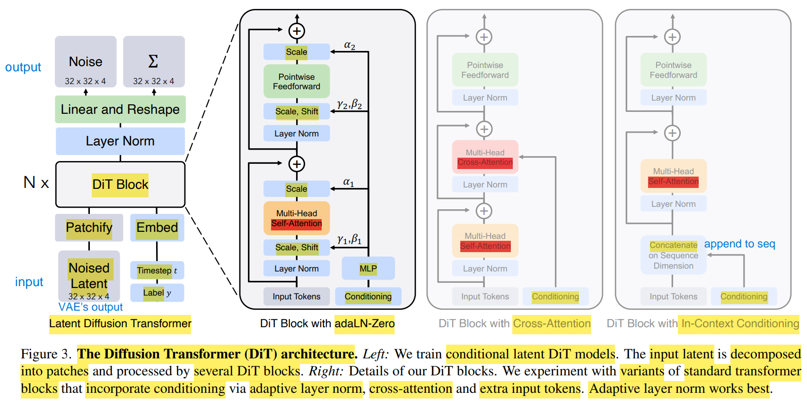

# DiT : Scalable Diffusion Models with Transformers

https://zhuanlan.zhihu.com/p/599887666

https://zhuanlan.zhihu.com/p/590840909

https://cs.uwaterloo.ca/~ppoupart/teaching/cs480-winter23/slides/

https://cvpr2022-tutorial-diffusion-models.github.io/
1. https://drive.google.com/file/d/1DYHDbt1tSl9oqm3O333biRYzSCOtdtmn/view?usp=sharing
2. https://www.youtube.com/watch?v=cS6JQpEY9cs

---

用 DiT 替代 LDM(latent diffusion model) 中的 U-Net 结构

DiT 不是 在原始的像素空间 上 扩散&去噪

借用了 Stable Diffusion(LDM) 预训练好的 VAE

latent 是 VAE 的输出

原始的 RGB 3个 颜色通道，经过特征提取(eg : CNN, ViT, MAE)，被映射到隐变量空间，通道数 4

重参数化技巧(Reparameterization)，Encoder 的真实输出其实是 8 个通道
1. 前 4个 channels : 均值 $\mu$
2. 后 4个 channels : 对数方差 $\log \sigma^2$

**Train**
1. 目的 : 教会 DiT 在 VAE latent space 里建模去噪过程。
2. 流程
   1. Latent Encoding : 真实图像 $x_0 \in \mathbb{R}^{256 \times 256 \times 3}$ 经过 frozen VAE Encoder，得到干净 latent $z_0 \in \mathbb{R}^{32 \times 32 \times 4}$
   2. 前向加噪 : 在 latent space 中采样噪声 $\epsilon$，得到 $z_t$
   3. 模型预测 : 将 $z_t$ patchify 成 token sequence，并结合 时间步$t$ & 条件$c$，输入 DiT，预测噪声 $\epsilon_\theta(z_t, t, c)$
   4. Loss & 反向传播 : 计算预测噪声与真实噪声之间的 MSE，只更新 DiT 参数，VAE 保持冻结

**Inference**
1. 目的 : 从随机 latent 噪声中逐步生成有意义的 latent，再解码成图像
2. 流程
   1. 初始化噪声 : 在 latent 维度采样纯高斯噪声 $z_T \in \mathbb{R}^{32 \times 32 \times 4}$
   2. 迭代去噪 : 反复将当前 $z_t$ 输入 DiT，预测噪声，并通过 sampler 更新到 $z_{t-1}$，直到得到生成的 latent $z_0$
   3. 图像解码 : 将生成的 $z_0$ 输入 frozen VAE Decoder，还原为图像

额外信息 timestep($t$) & label($y$) 经过 Embedding 输入 DiT

文章 尝试的 Conditioning 方式
1. **In-Context**
   1. 朴素/直接
   2. condition embedding 直接 **append** 到 noise tokens 的 sequence 后面
   3. 类似于 ViT 的 `[CLS]` token
   4. 基本不增加计算复杂度
2. **Cross Attention**
   1. Stable Diffusion 中的方式，condition embedding 作为 cross attention 的 KV
   2. 增加最多的计算复杂度
3. **adaLN-Zero**(Adaptive LayerNorm)
   1. standard LayerNorm
      1. Normalize : 把输入特征 $x$ 强行拉到一个均值为 0，方差为 1 的标准分布，防止梯度爆炸或消失
      2. Scale & Shift : normalize 会破坏 representation 能力，通过 : 乘以 缩放系数$\gamma$，加上平移系数$\beta$，恢复特征的表达能力
      3.  $\gamma$ 和 $\beta$ 是全局可学习的固定参数，与输入(图片/条件)无关
   2. adaLN
      1. 把 时间步$t$ & 标签$y$ 的 Embedding 拼接起来，送进 MLP，直接输出 LayerNorm 的 $\gamma$ & $\beta$
   3. adaLN-Zero
      1. MLP 不仅输出了 LayerNorm 的 $\gamma$ 和 $\beta$，还输出 2个额外参数 $\alpha_1$ 和 $\alpha_2$
      2. $\alpha_1$ 和 $\alpha_2$ 被乘在 注意力机制 & 前馈网络的 **残差连接** 处
      3. 初始化权重时，强制把 生成 $(\gamma, \beta, \alpha)$ 的 **MLP 的 最后一层权重 全部设为 0**
         1. MLP 输出全为 0，所以 $\gamma = 0, \beta = 0, \alpha_1 = \alpha_2 = 0$
         2. attention block & FFN 的 输出 直接被乘以 0
         3. DiT Block 内部的那些复杂计算全被无效化了，输入$x$ 顺着最外面的残差旁路传递
         4. 在训练最开始的时候，每一个 DiT Block 都变成 恒等映射(Identity Map)

Patch Size($p$) 会让处理的 Token 数量成倍增加，从而导致计算量(GFLOPs) & 显存(VRAM) 爆炸，但几乎不会改变模型的参数量(Model Size)

---

FID(Fréchet Inception Distance)
1. 无法通过 pixel level 的指标(eg : MSE)，评估一个模型生成的好坏，无法捕捉图像的语义信息
2. 找个 分类网络 **Inception-v3** 来当裁判，有一定的语义理解能力
3. 步骤
   1. 特征提取 : 大量的 真实图片 & 生成图片 都 喂给 Inception-v3，所有图片 提取 倒数第二层 输出的 特征向量(两堆 generated & real)
   2. Fréchet 距离 : 衡量 generated & real 的 特征向量 相似度
      1. **假设** : 这些特征向量在 2048 维空间中服从多元高斯分布
      2. 用 均值(mean) & 协方差矩阵(covariance) 描述分布
      3. 计算 两个高斯分布之间的 Fréchet 距离 (Wasserstein-2 距离)
         1. $$FID = ||\mu_r - \mu_g||^2 + Tr(\Sigma_r + \Sigma_g - 2(\Sigma_r \Sigma_g)^{1/2})$$
         2. 基于 **两个分布都是多元高斯分布** 假设下，推导出来的闭式解
         3. 对称，不像 KL-Divergence，适合做客观裁判
         4. 基于 最优传输/推土机距离，不会数值爆炸，KL散度 可能会因为分布不重叠而数值爆炸
      4. 分数越低越好
4. FID 仅仅作为 Benchmark 评测指标，不会作为 Loss 函数
   1. 为了算出一个准确的 FID，官方标准是需要生成 50,000 张图片
   2. Inception 网络的开销大
   3. FID 有 矩阵的平方根 $(\Sigma_r \Sigma_g)^{1/2}$ 计算，对一个高维协方差矩阵求平方根，然后再参与反向传播求梯度，不仅慢，而且容易数值不稳定

---

技术演化 & $\Sigma$
1. DDPM -> Improved DDPM
   1. $\Sigma$ 代表的是反向去噪过程的 **方差**(Variance)
   2. 标准 DDPM : 反向去噪时，只让神经网络预测均值，方差 $\sigma_t^2$ 是人为写死的常数
   3. Improved DDPM : 把方差也当作一个变量，让神经网络自己去学习并预测，在使用较少的采样步数时效果大幅提升
      1. DiT论文 采用 Improved DDPM 的做法，不仅 预测当前的 噪声是什么，还要预测 当前这一步 不确定性大小
      2. 通道翻倍 : 最后的 Linear 层直接把输出通道数乘以 2
         1. 前 4个 channels : 预测的噪声(Noise)
         2. 后 4个 channels : 预测的方差($\Sigma$)
2. Diffusion -> Flow Matching
   1. Flow Matching，不需要 $\Sigma$

---

无条件生成 (Unconditional Generation) : 从纯噪声开始，逐步去噪生成图像，可能会生成符合数据分布的任意图像

类别条件生成 (Class-Conditional Generation) : 定向命题，在生成过程中，模型接收类别作为条件输入，使得生成的图像属于指定类别

https://www.bilibili.com/video/BV1ce46ziEJr/?spm_id_from=333.337.search-card.all.click&vd_source=d5863bac06474ffc8562eab966db3af7

