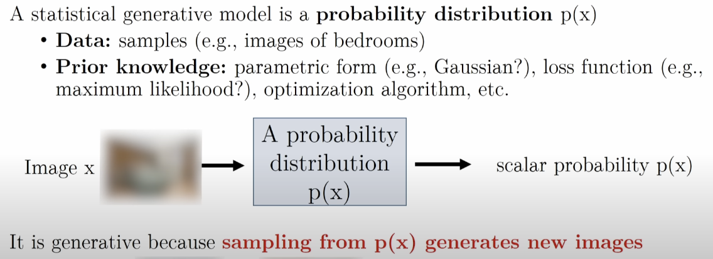

# CS236 - Deep Generative Models

[CS236 - Deep Generative Models - Fall 2023](https://deepgenerativemodels.github.io/syllabus.html)

## Table of Contents

- [CS236 - Deep Generative Models](#cs236---deep-generative-models)
  - [Table of Contents](#table-of-contents)
- [Lecture 01 - Introduction](#lecture-01---introduction)
- [Lecture 02 - Background](#lecture-02---background)

---

# Lecture 01 - Introduction

challenge : understand complex & unstructed inputs

**Computer Graphics** : High Level Description (eg : red cube/blue sphere)

**Statistical Generative Models** : learned from data, a probability distribution
1. data : samples (images)
2. prior knowledge : parametric form(Gaussian), loss function(极大似然), optimization algorithms, (physics/material)
3. 理解为 一个 函数，接受 图片输入，输出为 标量概率值
4. 
5. input : potential datapoints -> probability values
6. input : control signal -> output : new datapoints

Inverse Problems

Imitation Learning : ====**P(actions | past observations)**

---

# Lecture 02 - Background

---

