# VAE(Variational Auto-Encoder) - 变分自编码器

## Table & Contents

- [VAE(Variational Auto-Encoder) - 变分自编码器](#vaevariational-auto-encoder---变分自编码器)
  - [Table \& Contents](#table--contents)
- [Autoencoders](#autoencoders)
- [VAE (Variational Auto-Encoder)](#vae-variational-auto-encoder)
  - [Blog (Jeremy Jordan)](#blog-jeremy-jordan)
  - [YouTube](#youtube)
  - [ELBO(Evidence Lower Bound) - 证据下界、变分证据下界、变分下界](#elboevidence-lower-bound---证据下界变分证据下界变分下界)
- [β-VAE](#β-vae)

---

# Autoencoders

[Autoencoders | Deep Learning Animated - YouTube(Deepia)](https://www.youtube.com/watch?v=hZ4a4NgM3u0)

Gen AI，不处理数据，而是从头创建

一种生成模型，目标是从数据中学习一个潜在的 **压缩表示**(latent representation)，用该 representation 生成类似的数据

AE(Auto-Encoder) 自编码器
1. 获取数据，压缩compact 成低维表示(latent space)，再进行重建
2. **自** 表示 自训练
3. 组成
   1. Encoder : compress input data
   2. BottleNeck (Latent Space) : low-dimensional space, capture essential features, **smallest**
   3. Decoder : reconstruct input data
4. 训练
   1. minimize the **difference** between **original** & **reconstructed**
      1. encoder's ability to compress info and preserve critial information
      2. decoder's ability to reconstruct from compressed representation
   2. 衡量 difference
      1. MSE
5. 隐藏层 神经元数量少，过滤输入，特征提取，高度压缩
   1. 
6. 可以配合聚类算法 在 低维空间(latent space) 进行 clustering，不同类型样本应该分离
   1. 
7. 虽然只需要一个比较好的 latent space，但仍需关心 reconstruct quality
8. 优势 : Dimensionality Reduction，**非线性**映射降维，可以在 latent space 中进行 聚类
9. 劣势 : 学习无关特征(噪声敏感)，不支持插值，相比聚类算法不会给出标签/簇中心
   1.  解决方法 : 对 latent space 进行 **regularize 正则化** (eg : **VAE**)

相关改进
1. Denoising AE : 输入先加噪声，仍要求复原原图，学到对噪声鲁棒的特征
2. Variational AE (VAE) : 潜变量分布化、加 KL，可随机采样生成新样本，生成模型、数据增强
3. Sparse AE / β-VAE : 加稀疏或 KL 正则，逼迫每维潜变量独立、**可解释**
4. VAE-GMM / DEC : 再加聚类损失或混合先验，同时给出簇标签
5. Conditional AE : 把类别/文本…拼进潜变量，条件生成、风格迁移
6. Autoencoder + 监督头	: 共享 Encoder 学到的通用特征，预训练 -> 微调

**降维重构** 是 基座 : 确保信息保真

**正则和任务损失** 决定了 能学到什么性质、服务什么下游任务

---

[Latent Space Visualization - 个人笔记](../../Math/DimensionReduction/DimensionReduction.md)

---

# VAE (Variational Auto-Encoder)

## Blog (Jeremy Jordan)

[Variational autoencoders - Blog (Jeremy Jordan)](https://www.jeremyjordan.me/variational-autoencoders/)

VAE formulate encoder to **describe a probability distribution** for each latent attribute, rather than AE which **outputs a single value**
1. 
2. 普通 AE
   1. 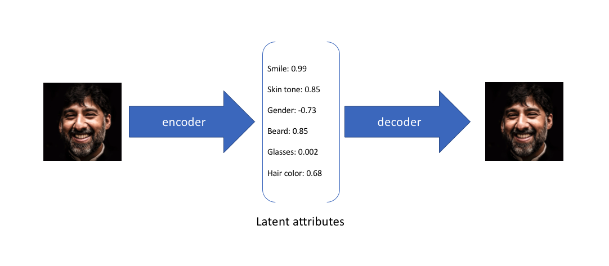
3. VAE
   1. 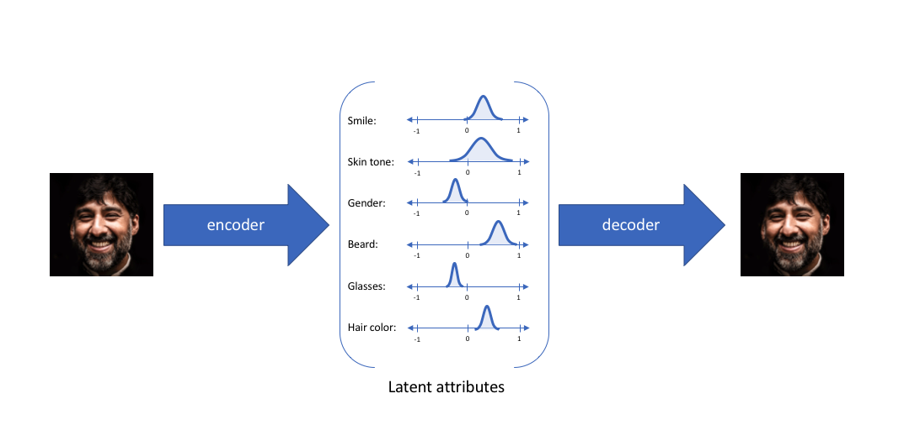
   2. 别称
      1. encoder 有时被称为 recognition model
      2. decoder 有时被称为 generative model
   3. constructing encoder model to output **a range of possible values(a statistical distribution)** 并喂给 decoder 模型 相当于 enforcing **continuous, smooth latent space representation**
   4. values which are nearby to one another in latent space should correspond with very similar reconstructions
      1. 逼迫解码器在邻域内都要工作
      2. KL 散度
   5. 

数据 x 可以看到，但是 隐变量 z 未知，希望通过 x 推断 z，即计算 $p(z|x) = \frac{p(x|z)p(z)}{p(x)}$，但是计算 $p(x)$ 困难

使用 **Variational Inference**

## YouTube

[Variational Autoencoder - YouTube(Deepia)](https://www.youtube.com/watch?v=qJeaCHQ1k2w)

[Variational Autoencoder - Model, ELBO, loss function and maths explained easily! - YouTube(Umar Jamil)](https://www.youtube.com/watch?v=iwEzwTTalbg)

[Understanding Variational Autoencoders (VAEs) | Deep Learning - YouTube(DeepBean)](https://www.youtube.com/watch?v=HBYQvKlaE0A)

对于一个训练好的 autoencoder，生成新数据的方法是，从 latent space 中采样，并通过解码器解码

但大多数情况，只会产生杂乱的结果，因为 **latent space 无规则**，**大部分区域不会产生有意义的解码图像**

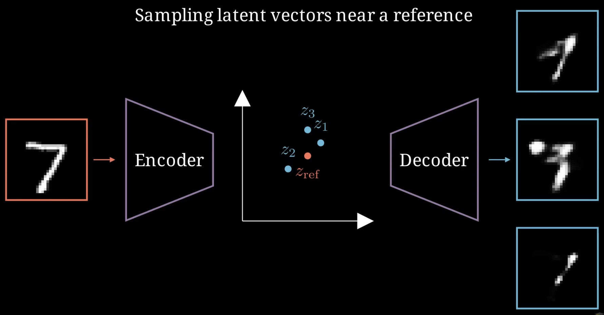

希望 latent space 中的采样点能够生成连贯的新图像

**Bayesian Statistics** 背景知识
1. 概率密度函数 Probability Density Function
2. 期望 Expectation $$\mathbb{E}[x] = \int_{-\infty}^{+\infty} x p(x) dx$$
3. 联合概率分布 Joint Probability Distribution
4. 边缘概率分布 Marginal Probability Distribution，联合概率对于其他变量进行积分
5. 条件概率 Conditional Probability，联合概率 ÷ 边缘概率 (可以理解为切片并重新归一化)

从给定的  **Data Distribution** $p_{data}(x)$ 中生成新数据，但是不知道 p 的确切形状和属性，只能通过访问样本

**Latent Distribution** 隐分布 $p(z)$，维度较低，捕捉数据 core feature

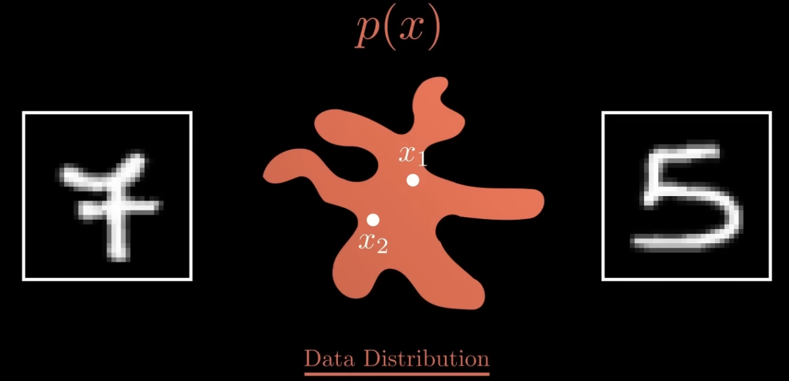

需要 Mapping 连接 **Data Distribution** 和 **Latent Distribution**

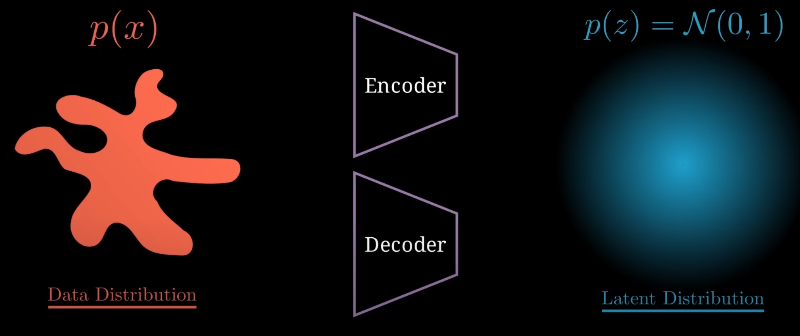

**概念**
1. **prior distribution 先验分布** $p(z) \sim \mathcal{N}(0,1)$，训练前就 人工固定为 **标准正态分布**，给潜空间一个统一、易采样的 "参考坐标"
2. **posterior distribution 后验分布** $p(z|x)$ (latent 由 data 生成 的概率，值大 代表 latent 很有可能 来源于 data distribution 生成，重构为图像 能够得到新样本)
3. 近似后验 $q(z|x) \sim \mathcal{N}(0,1)$，编码器输出(预测 $\mu$ & $\sigma$)，KL散度 将其 拉近 先验 $p(z)$ (ELBO)
4. **likelihood distribution 似然分布** $p(x|z)$ (从 latent 重建 data 的概率)

由于不知道 latent distribution，因此 假设为 **正态分布**，从而可以计算 likelihood

使用 高斯分布 **$q(z|x)$** **近似** 后验 **$p(z|x)$**，其中 $\mu$ & $\sigma$ 是可学习参数

优化过程被称为 **变分贝叶斯**

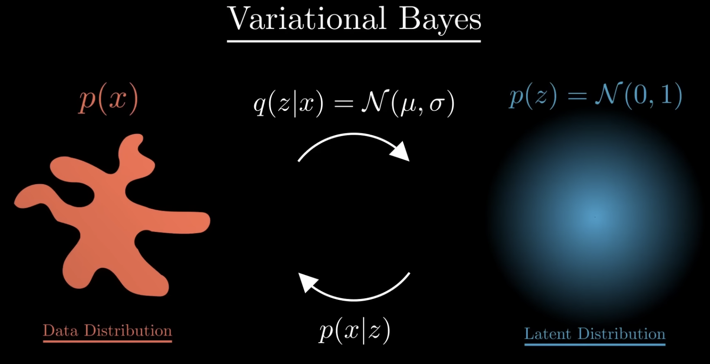

训练一个 编码器 从图像中 估计 $\mu$ & $\sigma$，使用 解码器 从 后验分布中 采样的 潜变量 重建图像

先验 $p(z)$，后验 $p(z|x)$，近似后验 $q_{\phi}(z|x)$

训练目标 **ELBO** (需要 **最大化**)
1. $$\mathcal{L}(x)=
      \underbrace{\mathbb{E}_{q(z|x)}[\log p(x\,|\,z)]}_{\text{Data Consistency}} - \underbrace{\operatorname{KL}[q(z|x)\|p(z)]}_{\text{Regularization}}$$
2. 重建项 : 让 Decoder 用采样到的 z 能重建 x，**数据一致性** (解码器能否从潜在表示还原出原始数据)
   1. 可简化为 L2 Loss，即 MSE(mean square error)，用 解码器 对 latent vector 重构，并测量与原始图像的 L2 距离
3. 正则项 : Encoder 输出的 $q_{\phi}(z|x)$ 应该和先验基本类似，不要偏离预先定义的 标准正态分布太多
   1. 衡量了 近似后验 $q(z|x)$ 和 先验 $p(z)$ 的 接近程度，假设 先验服从 正态分布，因此 约束 近似后验 也 呈 正态分布形状

相比普通 AutoEncoder，编码器 不是将输入映射到单个点，而是转化为 高斯分布的概率分布(**编码器将数据转化为高斯分布的 $\mu$ & $\sigma$**)

在潜在分布中，随机采样点，解码器将其转换回 高维空间

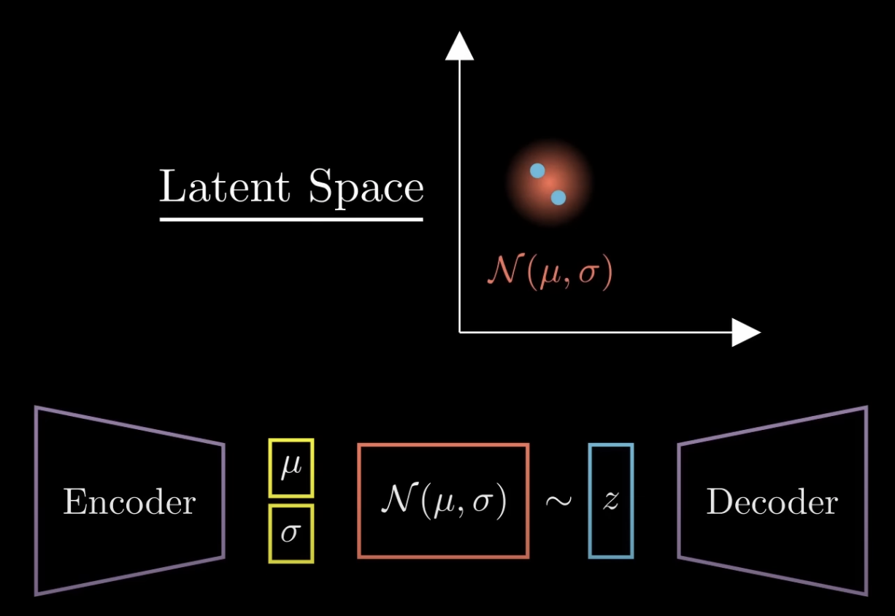

计算 ELBO 并 反向传播，这里是需要 **最小化**

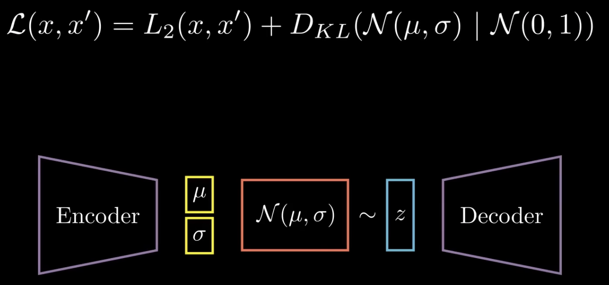

使用 Reparameterization Trick 重参数化技巧，解决 从近似后验中 采样操作 **无法反向传播**

不直接从 近似分布 中 采样，而是 从固定标准正态分布中 采样 $\epsilon$ (**辅助独立随机变量**) (requires_grad=False，无需计算梯度，作为常值使用)，$\mu + \sigma · \epsilon$ 相当于 调整回近似分布

抽样动作只发生在 $\epsilon$，不含 $\phi$ 无需梯度(requires_grad=False)

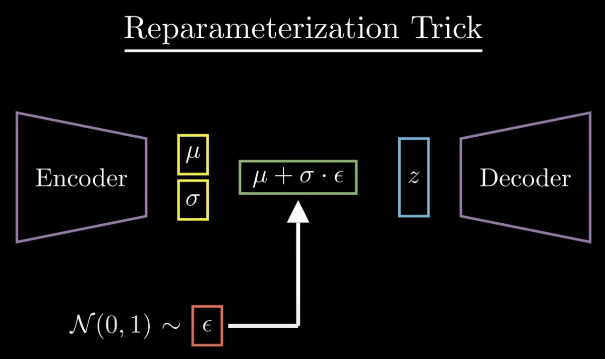

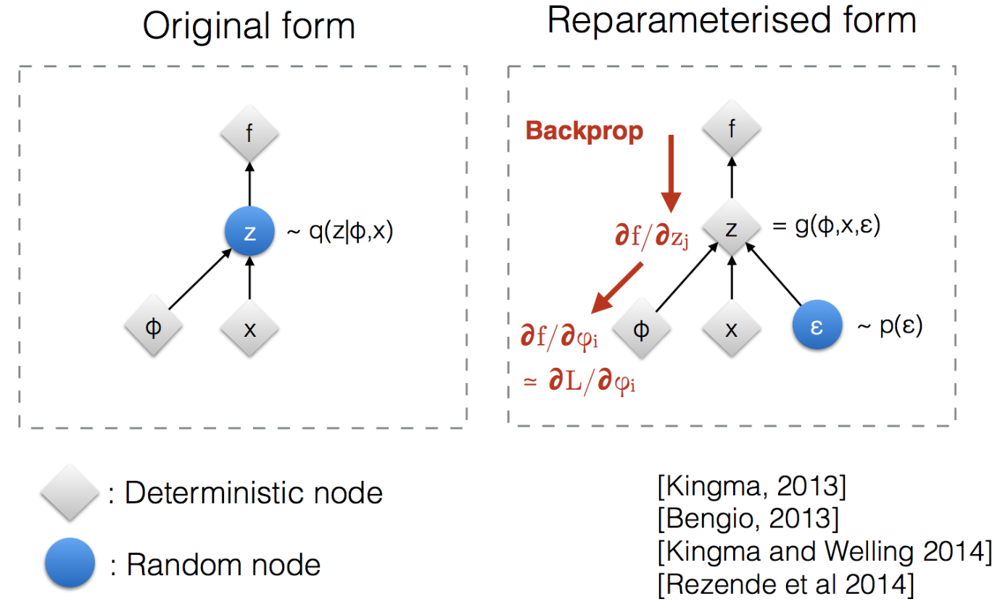

对于 两个 高斯分布，KL散度 有 闭式表达式

$$D_{\mathrm{KL}}\!\bigl(\mathcal N_0 \,\|\, \mathcal N_1\bigr)
= \log\frac{\sigma_1}{\sigma_0} + \frac{\sigma_0^{2} + (\mu_0 - \mu_1)^{2}}{2\sigma_1^{2}} - \frac{1}{2}$$

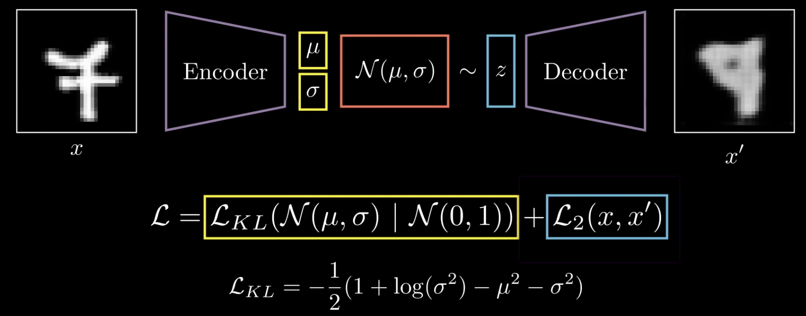

优势
1. 允许生成完全新的手写数字，采样向量越接近参考向量，生成的图像就越相似
   1. 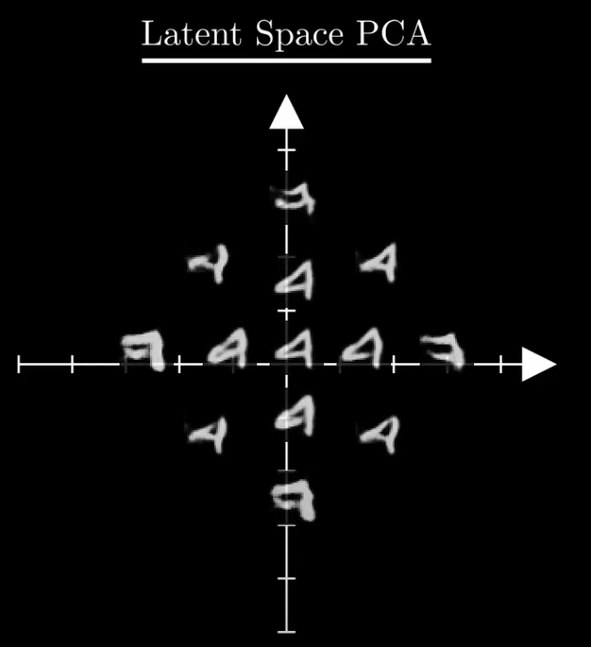
2. 可以融合图像，将两张图像编码为 latent representation，插值，表明 VAE 学到的 latent space 有一定的 连续性

劣势
1. 产生模糊的图像，由于正则项产生的
   1. 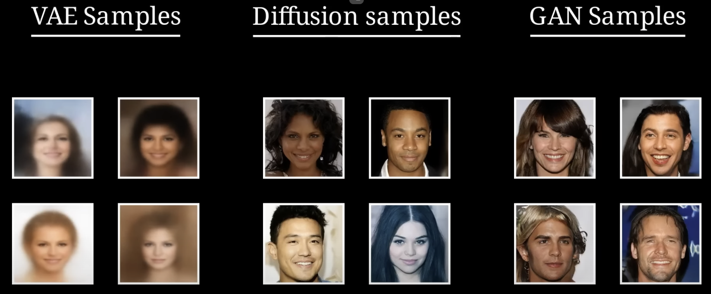
2. 缺乏对生成数据施加特定的约束的能力，无法生成特定的图像

## ELBO(Evidence Lower Bound) - 证据下界、变分证据下界、变分下界

ELBO ((Variational) Evidence Lower Bound)

$\theta$ : 解码器 Decoder 参数 (生成网络) $p_{\theta}(x | z)$

$\phi$   : 编码器 Encoder 参数 (推断网络) $q_{\phi}(z | x)$

变分推断(Variational Inference) 将难以直接求解的后验分布 转为 优化问题，在候选分布$q(z|x)$ 中 找到最接近 真实后验$p(z|x)$ 的分布

**需要最大化 ELBO**，实践中 取反然后 最小化

$$\begin{align}
\mathcal{L}_{\text{ELBO}}(x)
& = \mathbb{E}_q [\log p(x, z) - \log q(z | x)] \\
& = \mathbb{E}_q [\log p(x | z) + \log p(z) - \log q(z | x)] \\
& = \mathbb{E}_q (\log p(x | z)) - \mathbb{E}_q (\log \frac{q(z | x)}{p(z)})  \\
& = \mathbb{E}_q (\log p(x | z)) - KL(q(z | x) || {p(z)})
\end{align}$$

P.S. : $D_{KL}(p||q) = \mathbb{E}_p[log\frac{p}{q}] = \sum p \log \frac{p}{q}$

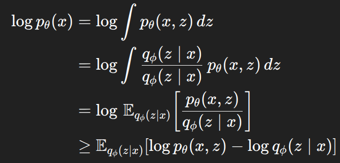

Jensen 不等式 : 若 f 是 凸函数，则 函数的期望 大于等于 期望的函数，若为 凹函数，则不等号方向相反

$\log$ 为 凹函数

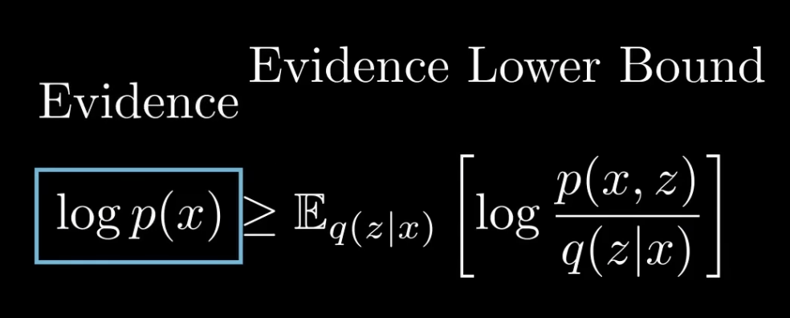

如果要 最大化 evidence，可以最大化 ELBO

拆分联合概率，ELBO 可以拆分为两个部分
1. 似然函数 在 近似后验分布 的 期望
2. 后验分布 和 先验分布 间的 KL散度

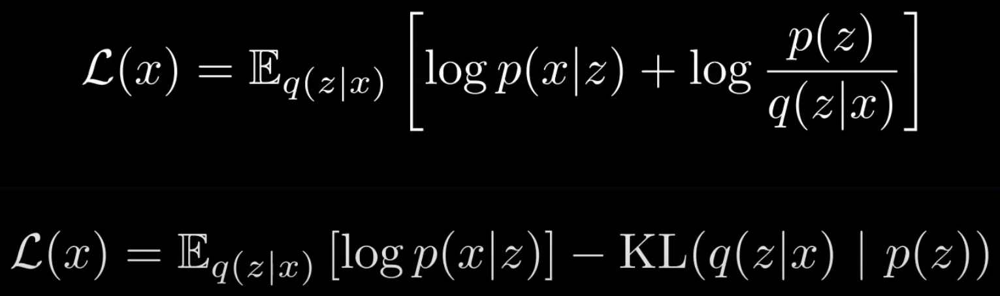

---

variation 就是分布 (将输入映射到一个分布上，而非固定变量)

bottle neck 被分解为两个向量
1. 均值向量
2. 方差向量

损失函数
1. 
2. 重建损失 : 与 AE 的 Loss 一致
3. KL 散度 ： 描述 学习的分布 & 高斯分布 的 相似性

与强化学习结合，进行环境的潜在空间表示

GMM - TODO

# β-VAE

[Disentanglement with beta-VAEs | Deep Learning - YouTube(DeepBean)](https://www.youtube.com/watch?v=RNAZA7iytNQ)

beta-VAE 擅长 feature disentanglement，特征解耦

review 普通 VAE
1. 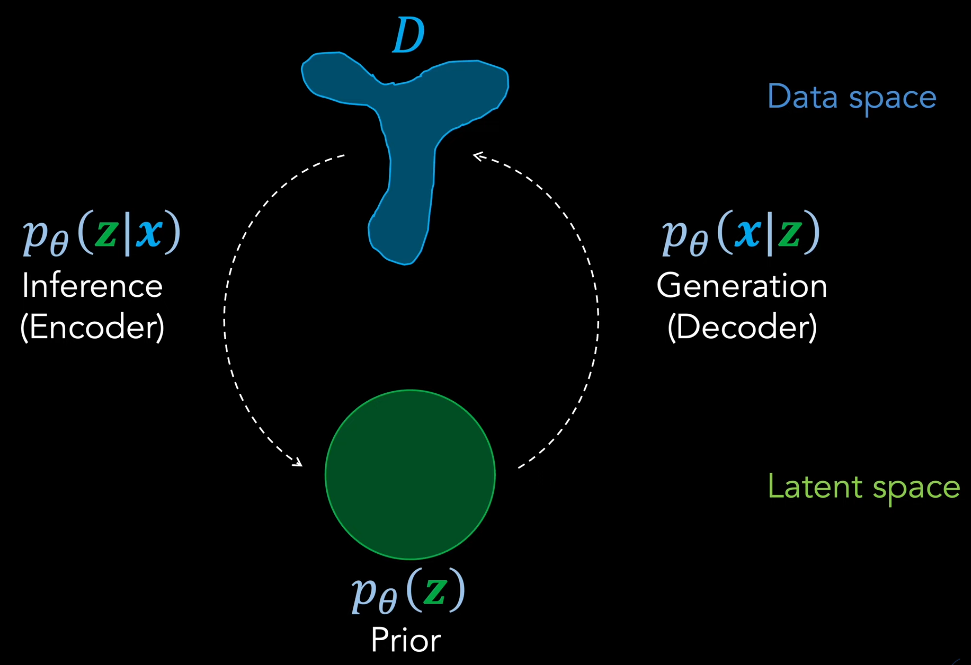
2. 对于 binary-valued 的 数据空间，输出分布 是 Bernoulli 分布，对于 real-valued 的 数据空间，输出分布 是 高斯分布
   1. 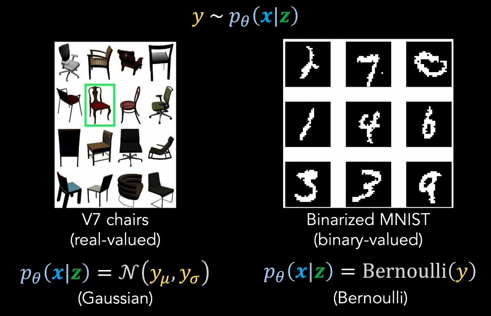
3. Loss Balance/Weight (重建项 & KL项)
   1. 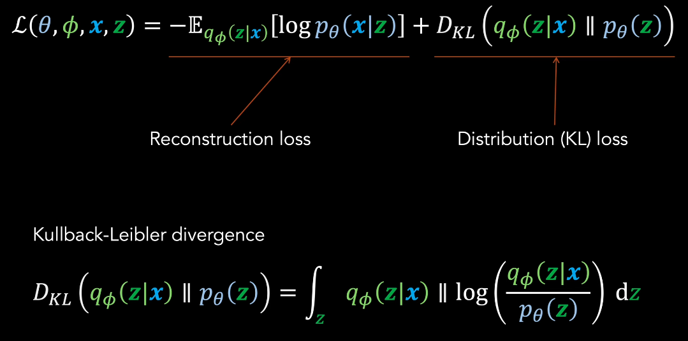
   2. 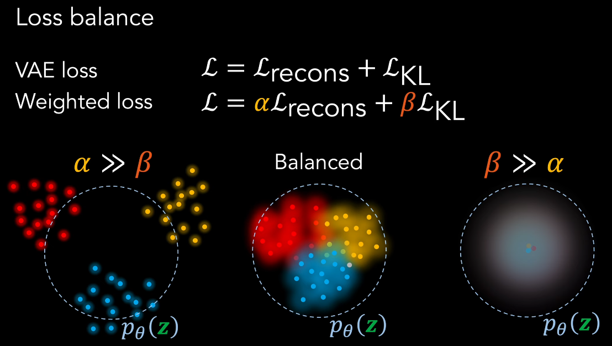
   3. KL项 weight 太大
      1. 信息丢失 : 强制潜在空间过于 规整，丢失数据中的重要细节和变化，生成的样本缺乏多样性
      2. 欠拟合 : 模型过于简化(重合)，无法捕捉数据复杂性，生成质量下降，样本模糊
      3. 后验坍塌 : 近似后验 过度接近 先验，潜在变量失去表达能力，变成无意义的噪声
   4. 重建项 weight 太大
      1. 过度专注于重构，重构效果确实可以，但是忽略了潜在空间的整体结构
      2. 忽略潜在空间的连续性，生成能力受限，容易产生无意义样本
      3. 过拟合风险，模型记忆训练数据而非学习通用表示，泛化能力差，对新数据表现不佳

标准VAE : `loss = reconstruction_loss - kl_loss`

β-VAE : `loss = reconstruction_loss - beta * kl_loss`

