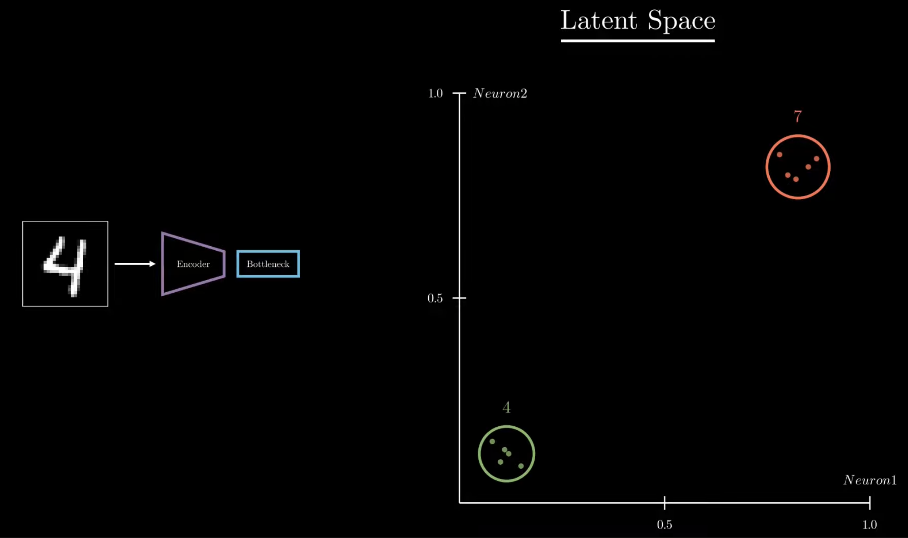
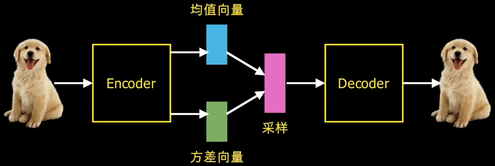
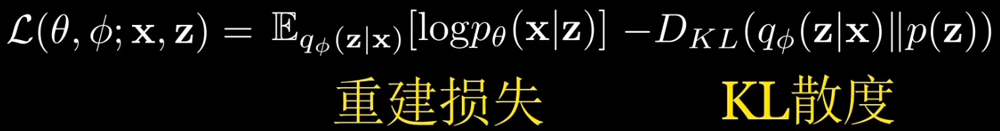

# VAE(Variational Auto-Encoder) - 变分自编码器

## Table & Contents

- [VAE(Variational Auto-Encoder) - 变分自编码器](#vaevariational-auto-encoder---变分自编码器)
  - [Table \& Contents](#table--contents)
- [Autoencoders](#autoencoders)
- [VAE](#vae)

---

# Autoencoders

[Autoencoders | Deep Learning Animated - YouTube](https://www.youtube.com/watch?v=hZ4a4NgM3u0)

Gen AI，不处理数据，而是从头创建

一种生成模型，目标是从数据中学习一个潜在的 **压缩表示**(latent representation)，用该 representation 生成类似的数据

AE(Auto-Encoder) 自编码器
1. 获取数据，压缩compact 成低维表示(latent space)，再进行重建
2. **自** 表示 自训练
3. 组成
   1. Encoder : compress input data
   2. BottleNeck (Latent Space) : low-dimensional space, capture essential features, **smallest**
   3. Decoder : reconstruct input data
4. 训练
   1. minimize the **difference** between **original** & **reconstructed**
      1. encoder's ability to compress info and preserve critial information
      2. decoder's ability to reconstruct from compressed representation
   2. 衡量 difference
      1. MSE
5. 隐藏层 神经元数量少，过滤输入，特征提取，高度压缩
   1. 
6. 可以配合聚类算法 在 低维空间(latent space) 进行 clustering，不同类型样本应该分离
   1. 
7. 虽然只需要一个比较好的 latent space，但仍需关心 reconstruct quality
8. 优势 : Dimensionality Reduction，**非线性**映射降维，可以在 latent space 中进行 聚类
9. 劣势 : 学习无关特征(噪声敏感)，不支持插值，相比聚类算法不会给出标签/簇中心
   1.  解决方法 : 对 latent space 进行 **regularize 正则化** (eg : **VAE**)

相关改进
1. Denoising AE : 输入先加噪声，仍要求复原原图，学到对噪声鲁棒的特征
2. Variational AE (VAE) : 潜变量分布化、加 KL，可随机采样生成新样本，生成模型、数据增强
3. Sparse AE / β-VAE : 加稀疏或 KL 正则，逼迫每维潜变量独立、**可解释**
4. VAE-GMM / DEC : 再加聚类损失或混合先验，同时给出簇标签
5. Conditional AE : 把类别/文本…拼进潜变量，条件生成、风格迁移
6. Autoencoder + 监督头	: 共享 Encoder 学到的通用特征，预训练 -> 微调

**降维重构** 是 基座 : 确保信息保真

**正则和任务损失** 决定了 能学到什么性质、服务什么下游任务

---

[Latent Space Visualization - 个人笔记](../../Math/DimensionReduction/DimensionReduction.md)

---

# VAE

VAE(Variational Auto-Encoder)
1. variation 就是分布 (将输入映射到一个分布上，而非固定变量)
2. 
3. bottle neck 被分解为两个向量
   1. 均值向量
   2. 方差向量
4. 损失函数
   1. 
   2. 重建损失 : 与 AE 的 Loss 一致
   3. KL 散度 ： 描述 学习的分布 & 高斯分布 的 相似性
5. 与强化学习结合，进行环境的潜在空间表示

GMM - TODO