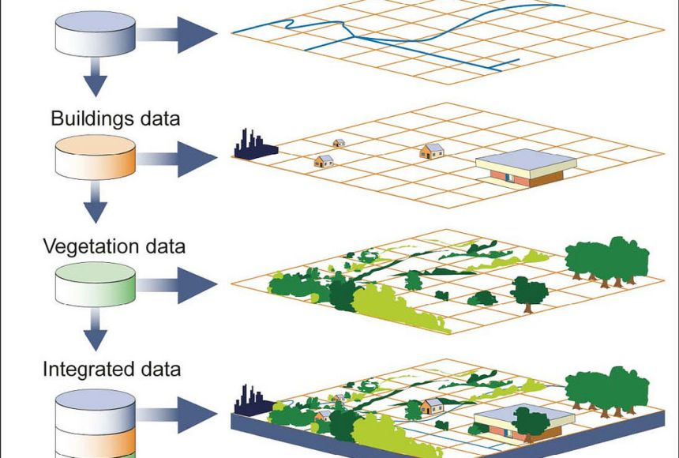
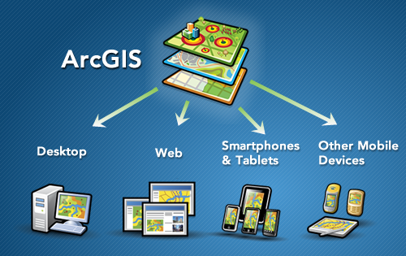

# GIS

[GIS (Geographic Information System) - National Geographic](https://education.nationalgeographic.org/resource/geographic-information-system-gis/)

A geographic information system (GIS) is a computer system for capturing, storing, checking, and displaying data related to positions on Earth’s surface.

GIS can show many different kinds of data on one map, such as streets, buildings, and vegetation. This enables people to more easily see, analyze, and understand patterns and relationships.

GIS的关键功能包括
1. **数据捕获**：从各种来源（如卫星图像、地图、调查数据）收集地理信息
2. **数据管理**：存储和组织空间数据以及与之相关的属性数据
3. **数据分析**：进行空间分析，比如查找特定地点、分析地理模式、进行地理统计等
4. **可视化**：将地理数据以地图形式展示，帮助用户理解和解释空间信息

# ArcGIS

[ArcGIS 简介 - 什么是 ArcGIS？](https://resources.arcgis.com/zh-cn/help/getting-started/articles/026n00000014000000.htm)

ArcGIS是由美国环境系统研究所(ESRI)开发的一套GIS**软件产品**，是应用最广泛的GIS软件之一，**提供了丰富的工具和功能**，用于收集、组织、管理、分析、交流和发布地理信息

可以将 ArcGIS 系统视为一个绘制地图和地理信息的基础架构，包括多个组件
1. **ArcMap**：用于地图制作、空间分析和编辑地理数据
2. **ArcCatalog**：用于数据管理和组织
3. **ArcGIS Pro**：是ESRI推出的新一代GIS软件，具有更先进的分析工具、3D地图制作能力和更高的性能
4. **ArcGIS Online**：提供云端地理信息服务，允许用户在线创建、管理和共享地图
5. **其他扩展和工具**：ESRI还提供了许多专业扩展，如用于高级空间分析、网络分析和三维可视化的工具

