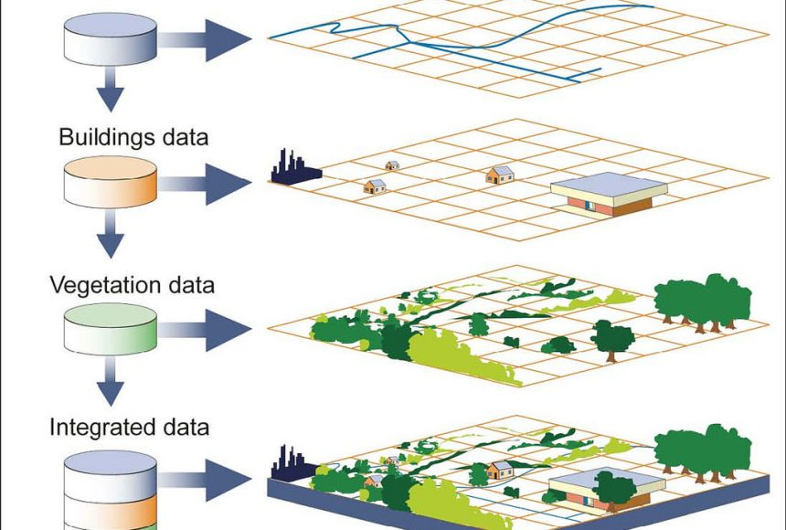

# GIS

# National Geographic - GIS

[GIS (Geographic Information System)](https://education.nationalgeographic.org/resource/geographic-information-system-gis/)

A geographic information system (GIS) is a computer system for capturing, storing, checking, and displaying data related to positions on Earth’s surface.

GIS can show many different kinds of data on one map, such as streets, buildings, and vegetation. This enables people to more easily see, analyze, and understand patterns and relationships.

