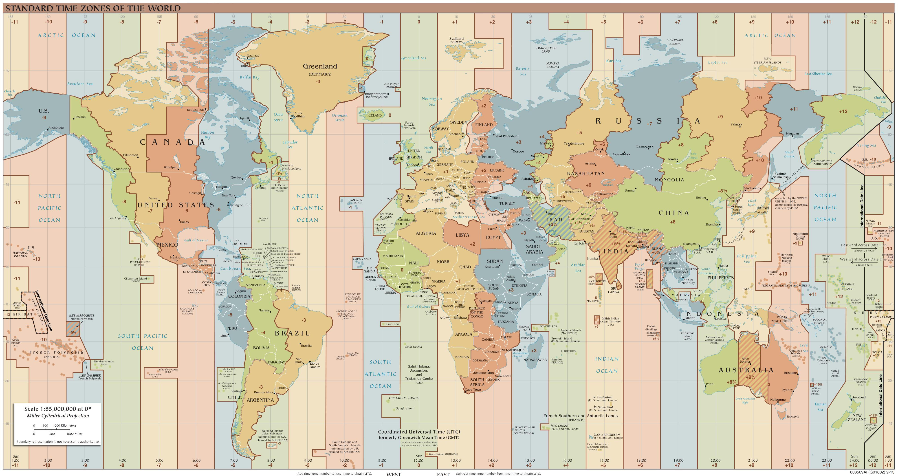
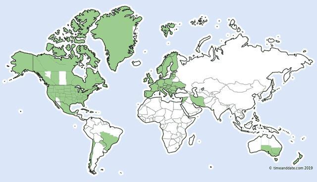
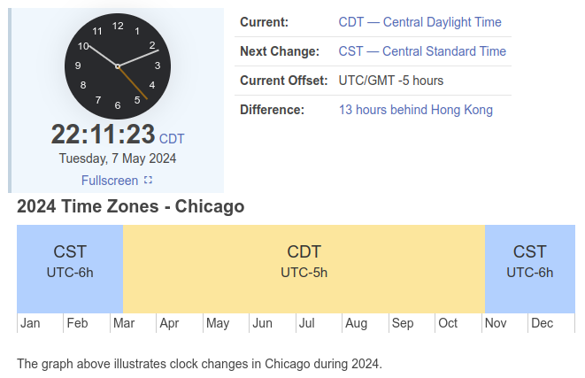

# Time Zone

[Time Zone Map](https://www.timeanddate.com/time/map/)

## GMT

**前世界标准时**，1972年被替代

GMT - Greenwich Mean Time - 格林威治平时

太阳经过 英国伦敦郊区的皇家格林威治天文台 的时间为 中午12点

格林威治子午线 Greenwich Meridian 和本初子午线 Prime Meridian 是相同的概念，国际上公认的经度零度线

## UTC

**现世界标准时**

UTC - Coodinated Universal Time - 协调世界时(世界统一时间、世界标准时间、国际协调时间)

UTC 是现在全球通用的时间标准，全球各地都同意将各自的时间进行同步协调

UTC 时间是经过平均太阳时（以格林威治时间GMT为准）、地轴运动修正后的新时标以及以秒为单位的国际原子时所综合精算而成

UTC 构成
1. 原子时间 - TAI, International Atomic Time
   1. 利用 铯-133原子 的 电磁辐射频率 计时
   2. 独立于地球自转，不会因地球自转的不规则性而受到影响
2. 世界时间 - UT, Universal Time
   1. 天文时间(太阳时)，他的依据是地球的自转
   2. 平均太阳时(格林威治时间GMT) + 地轴运动修正
   3. 基于地球自转的观测来计算的时间，会随着地球自转速度的微小变化而变化

国际单位制SI 中的一秒定义为 铯-133原子基态的两个超精细能级之间跃迁所对应的辐射周期的 9,192,631,770个 周期

本地时间 - 由 UTC & 偏移量来定义，可表示为 UTC- 或 UTC+，后面接上偏移的小时和分钟数

## Time Zone 时区

从 **格林威治本初子午线** 起，经度 每向东或者向西 间隔 **15°**，就划分一个时区，区域内，大家使用同样的标准时间

全球共分为 24个标准时区，相邻时区的时间相差 1小时

时区并不严格按南北直线来划分，而是按自然条件来划分，常将1个国家或1个省份划在一起

### 中国时区

中国地理上跨越 5个时区，但自1949年以来，全国统一使用 **北京时间** - **东八区，UTC+8** 作为官方标准时间

### 美国时区

主要时区
1. 东部时区     - (Eastern Time Zone, ET)   - 包括纽约、佛罗里达、佐治亚等州
2. 中部时区     - (Central Time Zone, CT)   - 包括德克萨斯、伊利诺伊、明尼苏达等州
3. 山地时区     - (Mountain Time Zone, MT)  - 包括科罗拉多、亚利桑那(大部分不实行夏令时)、新墨西哥等州
4. 太平洋时区   - (Pacific Time Zone, PT)       - 包括加利福尼亚、华盛顿、内华达等州
5. 阿拉斯加时区     - (Alaska Time Zone, AKT)   - 主要覆盖阿拉斯加州
6. 夏威夷-阿留申时区    - (Hawaii-Aleutian Time Zone, HAT) - 主要用于夏威夷和阿留申群岛，而夏威夷则全年不变

## 夏令时 & 冬令时

DST - Daylight Saving Time - 夏令时

**夏令时**
1. **北半球** 通常在每年的  3月 开始，并在同年的 11月 结束(南半球冬季)
2. **南半球** 通常在每年的 10月 开始，并在次年的  4月 结束(北半球冬季)

**冬令时** - 称为 **标准时间**，是在夏令时结束后恢复的时间设置，时钟回拨至标准时间

**实行国家**
1. 北半球 - 美国、加拿大、欧洲、中东
2. 南北球 - 澳大利亚、新西兰、南美

大部分美国地区都会在每年的 **3月第2个星期日** 开始实施夏令时，将时钟拨快一小时(时钟往后拨，相当于提前一个小时)，在每年的 **11月第1个星期日**，美国会结束夏令时，将时钟拨回一小时，恢复到标准时间

每年有2天很特殊 一天只有23个小时(开始夏令时，时钟拨快，时间提前，时区+1)，另一天有25个小时(结束夏令时，时钟拨慢，时间恢复正常)

通过调整时钟，可以使得人们在傍晚时分利用更多自然光，从而减少电力的使用，特别是照明的电力消耗(最开始是战争期间，节省能源)

以芝加哥为例(正常是CST(UTC-6)，夏令时是CDT(UTC-5)) - **S ↔ Standard** & **D ↔ Daylight**

北京时间在夏令时 比芝加哥时间提前 +8-(-5) = 13 小时

北京时间在正常时 比芝加哥时间提前 +8-(-6) = 14 小时

