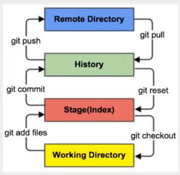

# Learn Git

[toc]

## Portals

[狂神说 Git](https://www.bilibili.com/video/BV1FE411P7B3)

[廖雪峰 Git教程](https://www.liaoxuefeng.com/wiki/896043488029600)

[尚硅谷 Git入门到精通](https://www.bilibili.com/video/BV1vy4y1s7k6)

[猴子都能懂的git入门](https://backlog.com/git-tutorial/cn/)

# 廖雪峰

## Git 简介

&emsp;&emsp;Git是目前世界上最先进的分布式版本控制系统。

### Git 诞生

&emsp;&emsp;Linus花了两周时间自己用C写了一个分布式版本控制系统，这就是Git！

### 集中式VS分布式

&emsp;&emsp;分布式版本控制系统根本没有“中央服务器”，每个人的电脑上都是一个完整的版本库，这样，你工作的时候，就不需要联网了，因为版本库就在你自己的电脑上。既然每个人电脑上都有一个完整的版本库，那多个人如何协作呢？比方说你在自己电脑上改了文件A，你的同事也在他的电脑上改了文件A，这时，你们俩之间只需把各自的修改推送给对方，就可以互相看到对方的修改了。

&emsp;&emsp;和集中式版本控制系统相比，分布式版本控制系统的安全性要高很多，因为每个人电脑里都有完整的版本库，某一个人的电脑坏掉了不要紧，随便从其他人那里复制一个就可以了。而集中式版本控制系统的中央服务器要是出了问题，所有人都没法干活了。

## Git安装

<br>

## 创建仓库(Repository)

```cpp
mkdir <DirName>
cd <DirName>

git init //把这个目录变成Git可以管理的仓库

git add <FileName> //告诉Git，把文件添加到仓库
git commit -m <comments> //告诉Git，把文件提交到仓库

//也可以一次提交多个文件


```

# 狂神说

## 版本控制分类

本地版本控制

集中版本控制：所有的版本数据保存在服务器上，开发者从服务器同步更新或上传自己的修改。用户本地只有子集以前同步的版本。不联网无法看到历史版本，也无法切换版本验证问题，或在不同分支工作。版本库在中央服务器。（SVN、CVS、VSS）

分布式版本控制：每个用户拥有全部代码（安全隐患）。所有版本信息仓库全部同步到本地的每一个用户，这样可以在本地查看所有的版本历史（增加了本地存储空间的占用）。可以离线在本地提交，只需在联网时push到相应的服务器或其他用户即可。Git可以直接看到更新了哪些代码和文件。（Git）

## 基本的Linux命令

1. cd 改变目录（直接cd进入默认目录）
2. cd .. 回退上一个目录
3. pwd 查看当前目录
4. ls 列出当前目录的文件
5. ll 更详细的列出目录
6. touch 新建一个文件
7. rm 删除文件
8. mkdir 新疆文件夹
9. rm -r 移除文件夹
10. mv 移动文件
11. reset 重新初始化中断，清屏
12. clear 清屏
13. history 查看历史命令
14. help 帮助
15. exit 退出
16. #表示注释

## Git配置

系统配置文件保存在本地： D:\Git\etc\gitconfig       （与system list内容对应）
用户配置文件保存在本地： C:\Users\35058\.gitconfig  （与global list内容对应）

```git
查看配置       -l 表示list
git config -l 

查看系统配置的信息
git config --system --list

查看用户配置的信息（用户名和邮箱） 必须配置 向git服务器
git config --global --list

git config --global user.name "[user_name]"

git config --global user.email "[user_email]"
```

环境变量自动配置了

安装时记得先卸载（包括清理旧的环境变量）

## Git的工作原理

Git的3个本地工作区域+1个远程仓库：
1. 工作目录(Working Directory)：存放项目代码的地方
2. 暂存区(Stage/Index)：暂存区，用于临时存放改动（只是一个文件，保存即将提交的文件列表信息）
3. 资源库(Repository/Git Directory)：安全存放数据的位置，这里面有提交到所有版本的数据。HEAD指向最新存放入仓库的版本
4. 
5. 远程Git仓库(Remote Directory)：远程仓库，托管代码的服务器，用于远程数据交换



本地的add进暂存区，commit提交的本地仓库，push到远程目录

远程的pull到本地仓库，reset回滚回暂存区，最后

.git隐藏文件夹

**工作流程**
1. 在工作目录中，添加、修改文件
2. 将需要进行版本管理的文件放入暂存区（git add）
3. 将暂存区的文件提交到git仓库（git commit）
4. 推送到远程（git push）

## Git项目创建及克隆

git创建目录方式：
```
初始化仓库（出现.git隐藏文件）
git init


克隆仓库
git clone [url]


撤销所有本地修改
git reset --hard
```

## Git的基本操作命令

**文件4种状态**

Untracked：未跟踪。没有加入到git库种，不参与版本控制。通过git add 变为Staged状态。

Unmodify：文件已入库，未修改，即版本库种文件快照内容与文件夹中的完全一致。两种去处：①被修改变为Modified状态；②git rm拜纳姆Untracked状态。

Modified：文件已修改。两个去处：①git add进入staged状态；②git checkout则丢弃修改，返回unmodify状态。

Staged：暂存状态。git commit命令将修改同步到库中，使得库文件和本地文件抑制。


```

查看文件状态
git status [filename]

查看所有文件状态
git status

添加所有文件到暂存区
git add .

提交暂存区内容到本地仓库  -m 表示提交信息
git commit -m ""
注意这里要不要使用中文引号，否则没用
```


**忽略文件**

.gitignore

文件指明忽略哪些文件

使用#进行注释

可以使用Linux通配符

```
*.txt       忽略所有.txt结尾的文件

!lib.txt    感叹号表示例外

/temp       匹配项目根目录

build/      忽略build下的所有文件

doc/*.txt   忽略文件夹中的某个文件
```


## 配置SSH公钥及创建远程仓库

免密登录

注意可能之前配置了Clash代理，所以上传时需要打开Clash（Gitee和Github）


## IDEA集成Git


## Git中分支说明


## Git后续操作说明


# 报错及解决

## 

```
error: failed to push some refs to ‘xxx’
hint: Updates were rejected because a pushed branch tip is behind its remote
hint: counterpart. Check out this branch and integrate the remote changes
hint: (e.g. ‘git pull …’) before pushing again.
hint: See the ‘Note about fast-forwards’ in ‘git push --help’ for details.
```

git pull --rebase origin master

git push -u origin master


[git push 的 -u 参数含义](https://blog.csdn.net/Lakers2015/article/details/111318801)
