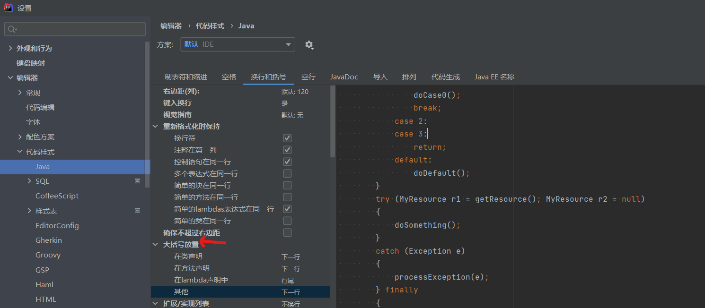

# IDEA配置

## IDEA优化

[IDEA的常见的设置和优化(功能)](https://blog.csdn.net/zeal9s/article/details/83544074)

## 大括号自动换行

# 教程

[Intellij IDEA教程](http://www.javatiku.cn/ideaguide.html)

# 破解 intellij

[Intellij idea史上最简单的教程之Linux下安装与破解Intellij idea2017](https://www.cnblogs.com/marsitman/p/7420925.html)

[IDEA永久破解教程最新2023.2版本](http://www.javatiku.cn/idea/4443.html)

