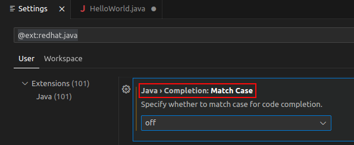
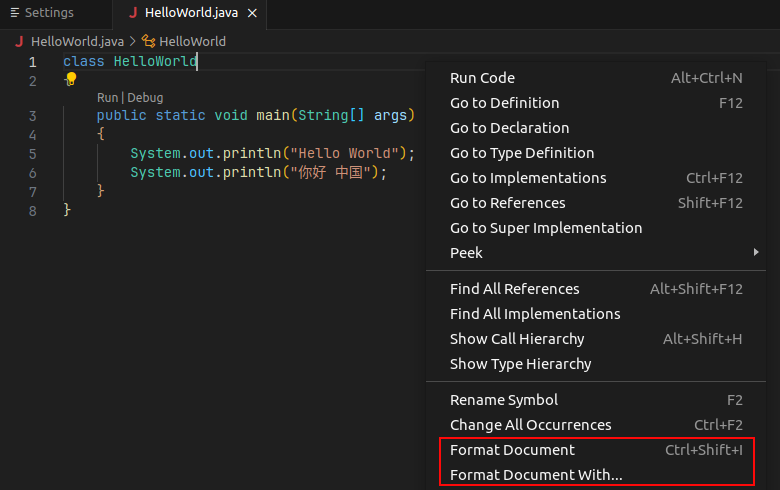
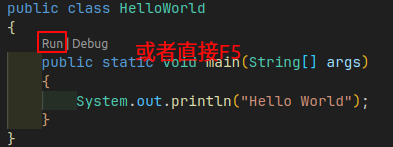

# vscode Java 插件配置

**目录**
[toc]

# Language Support for Java(TM) by Red Hat

## 自动提示大小写匹配(不考虑大小写)



## 代码格式化

[github redhat-developer/vscode-java --- Formatter settings](https://github.com/redhat-developer/vscode-java/wiki/Formatter-settings)

[vscode 中配置 Java 格式化细节](https://www.cnblogs.com/wanjinliu/p/13131442.html)

```bash
lzy@legion:~/.vscode/extensions/redhat.java-1.20.0-linux-x64/formatters$ ls
eclipse-formatter.xml  eclipse-formatter.xml.original
```

original 是原始版本，用于恢复


```xml
<setting id="org.eclipse.jdt.core.formatter.insert_new_line_before_else_in_if_statement" value="insert"/>


<setting id="org.eclipse.jdt.core.formatter.brace_position_for_annotation_type_declaration" value="next_line"/>
<setting id="org.eclipse.jdt.core.formatter.brace_position_for_anonymous_type_declaration" value="end_of_line"/>
<setting id="org.eclipse.jdt.core.formatter.brace_position_for_array_initializer" value="next_line"/>
<setting id="org.eclipse.jdt.core.formatter.brace_position_for_block_in_case" value="next_line"/>
<setting id="org.eclipse.jdt.core.formatter.brace_position_for_block" value="next_line"/>
<setting id="org.eclipse.jdt.core.formatter.brace_position_for_constructor_declaration" value="next_line"/>
<setting id="org.eclipse.jdt.core.formatter.brace_position_for_enum_constant" value="next_line"/>
<setting id="org.eclipse.jdt.core.formatter.brace_position_for_enum_declaration" value="next_line"/>
<setting id="org.eclipse.jdt.core.formatter.brace_position_for_lambda_body" value="next_line"/>
<setting id="org.eclipse.jdt.core.formatter.brace_position_for_method_declaration" value="next_line"/>
<setting id="org.eclipse.jdt.core.formatter.brace_position_for_switch" value="next_line"/>
<setting id="org.eclipse.jdt.core.formatter.brace_position_for_type_declaration" value="next_line"/>
```

部分修改如下所示




重启 vscode 即可 format 看到效果

当前文件夹中 有一个备份可以直接使用

[如何在vscode中配置java运行环境？](https://www.zhihu.com/question/278838022)


# 运行

1. Run
2. F5
3. code runner



# 查看字节码

