# Java

目录
[toc]


# 尚硅谷Java零基础全套视频教程2023版 --- 宋红康

[尚硅谷Java零基础全套视频教程2023版 --- 宋红康](https://www.bilibili.com/video/BV1PY411e7J6/)

Java基础是学习JavaEE、大数据、Android开发的基石

**基础图谱**

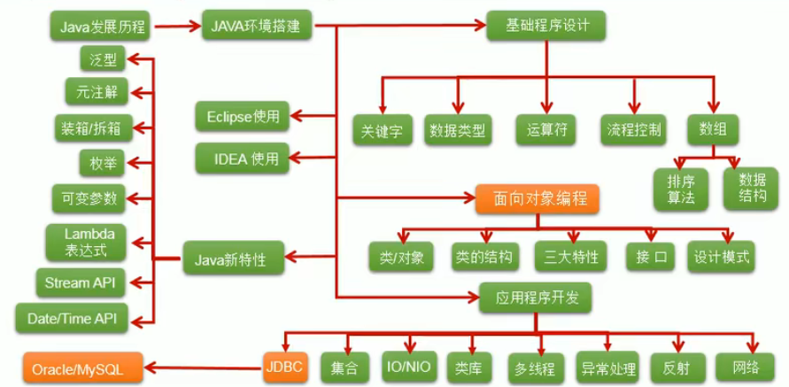

人机交互方式：
1. GUI：Graphical User Interface (图像化界面)
2. GLI：Command Line Interface (命令行方式)

## 概述

### Java语言历史

SUN(stanford university network， 斯坦福大小网络公司) 1995年推出。

java语言之父：James Gosling

类c语言

纯粹的面向对象程序设计语言

**Java舍弃了C语言种容易引起错误的指针（以引用替代）**

**增加了垃圾回收器功能，用于回收不再被引用的对象所占据的内存空间**

**JDK1.5引入泛型编程**

语言特点
1. 面向对象
   1. 类、对象
   2. 3大特性：封装、基础、多条
2. 健壮性
   1. 提供较为安全的内存管理和访问机制
3. 跨平台
   1. JVM(java virtual machine)负责java程序在该系统中的运行（不同操作系统都有相应的jvm）

Java技术体系平台
1. JavaSE:Standard Edition 标准版（桌面级）
2. JavaEE:Enterprise Edition 企业版
3. JavaME:Micro Edition 小型版
4. JavaCard: 支持一些小程序(Applets)运行在小内存设备上的平台

应用：
1. 企业级应用
2. Android平台
3. 大数据平台开发

**核心机制——垃圾回收**
1. C/C++语言由程序员负责回收无用内存
2. Java语言消除程序员回收无用内存的责任：提供一种系统级线程跟踪存储空间的分配情况。并在JVM空闲时，检查并释放哪些可以被释放的内存空间。
3. 在Java程序中自动进行，程序员无法精确控制和干预。
4. **还是会存在内存泄漏和内存溢出问题**

### JDK、JRE、JVM的关系

JDK:java development kit 开发工具包
1. 提供给开发人员使用
2. 包含**开发工具**
   1. javac.exe:编译工具
   2. jar.exe:打包工具
3. 包含jre

JRE:java runtime environment 运行环境
1. 包括jvm和java程序所需的**核心类库**
2. 想要运行java程序只需要按照jre


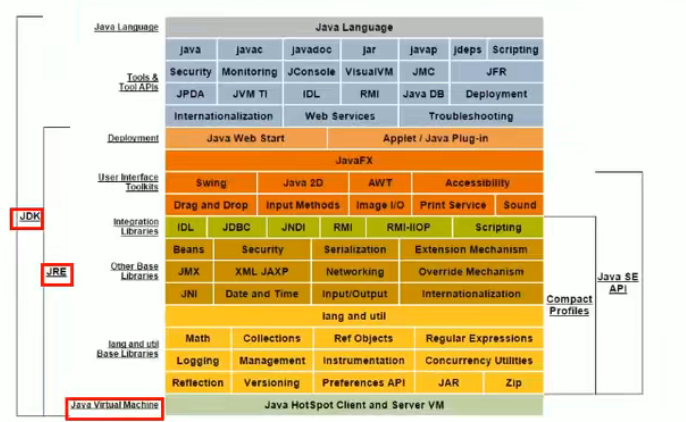

### Java安装和简单使用

**Java安装**

[Oracle Java Downloads](https://www.oracle.com/java/technologies/downloads/)

可以安装在D盘

将bin文件夹目录加入环境变量（8和11都装了，11在8上面所以默认是11）

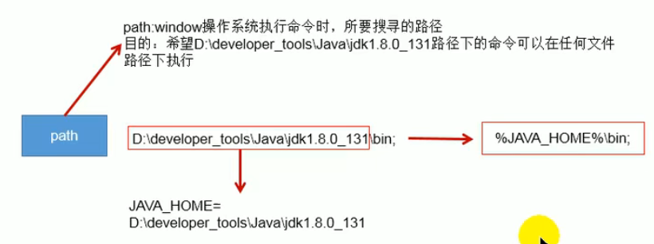

**需要添加一个环境变量JAVA_HOME（就用这个名称，其他工具也会去寻找这个变量）**

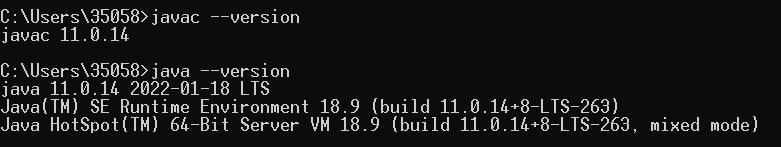

**HelloWorld程序**

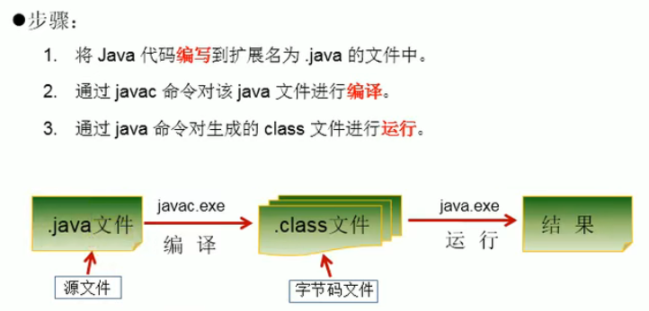

两个过程

```java
class HelloWorld
{
   public static void main(String[] args)
   {
		System.out.println("helloworld");
	}
}
```

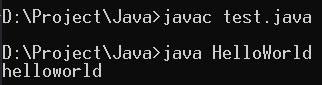

上面的命令要加文件后缀，下面的命令不用加路径。

**注释comment**

注释的内容不参与编译。

main方法是程序入口

注释类型
1. 单行注释，//
2. 多行注释，/* */，不能嵌套使用
3. 文档注释（java特有），/** */，可以被javadoc解析，生成一套以网页文件形式体现该程序的说明文档。


**在一个java源文件中可以声明多个class，但是最多有一个类声明为public（只能加给和文件名同名的类）**，函数不限制。

**程序的入口是main()方法。其格式是固定的（public static void main(String[] args)）**

**println和print都是输出。前者是输出加换行，后者是仅输出**

**每一个执行语句以分号结束**

**编译的过程，编译后会生成一个或多个字节码文件。字节码文件名与java源文件中的类名相同。**

### Java API文档

API：application programming interface，应用程序编程接口

在oracle官网的java sdk下载位置的下面，**documentation download**


## 基础篇

### 变量与运算符

**关键字和保留字**

keywords：被java语言赋予特殊含义，有专门用途的字符串

所有关键字都是小写

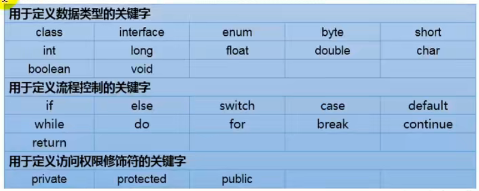

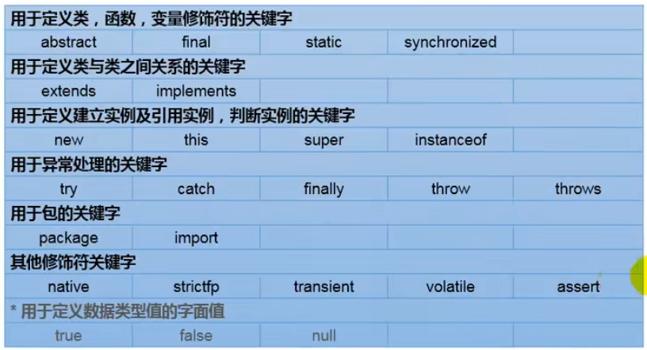

reserved words：java现有版本尚未使用，但是以后版本可能会作为关键字使用
1. goto
2. const

**标识符 identifier**

对变量、方法、类等命名

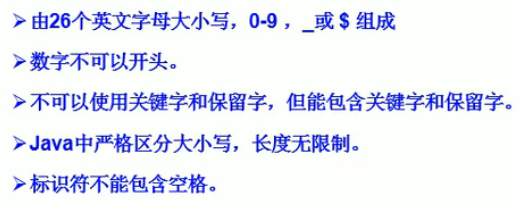


**变量**

java中的每个**变量必须先声明并且赋值后使用**，需要明确具体类型，变量的作用域在 { } 中。

同一个文件下，不能有同名类。

同一个作用域内，不能有同名变量。

1. 基本数据类型
   1. 按照数据类型分
      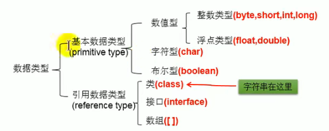
   2. 按照变量在类中的声明位置分
      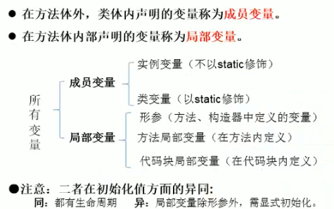

   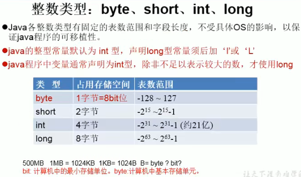

   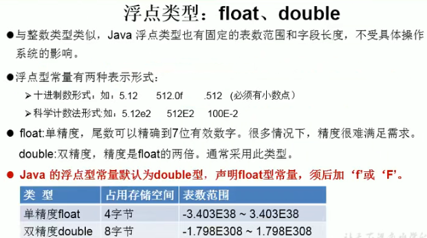

   给float类型的变量进行赋值的时候，需要加f或F否则编译报错。

   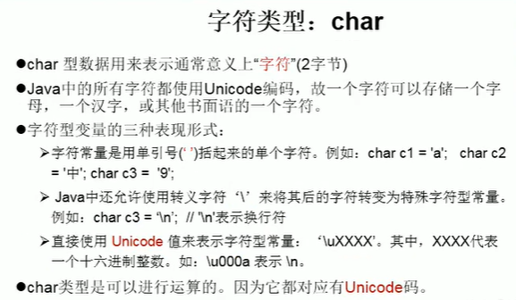

   使用一对单引号、内部能且只能写一个字符（中文也行）。（转义字符加一个\）

   boolean布尔型，只能取两个值：true、false（**都是小写**）

2. 基本数据类型变量间转换
   
   **自动类型提升**

   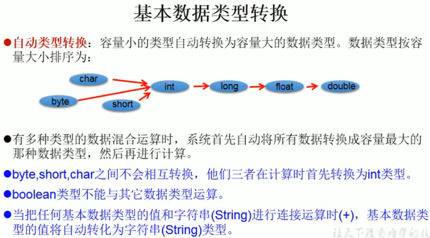

   boolean型无法参与运算（和C语言不同）

   **强制类型转换**：自动类型提升的逆运算

   使用说明：(类型)变量名

   小括号是强转符。**截断操作，可能导致精度损失**

   整形常量默认为int，浮点型常量默认为double

3. 基本数据类型与String间转换

   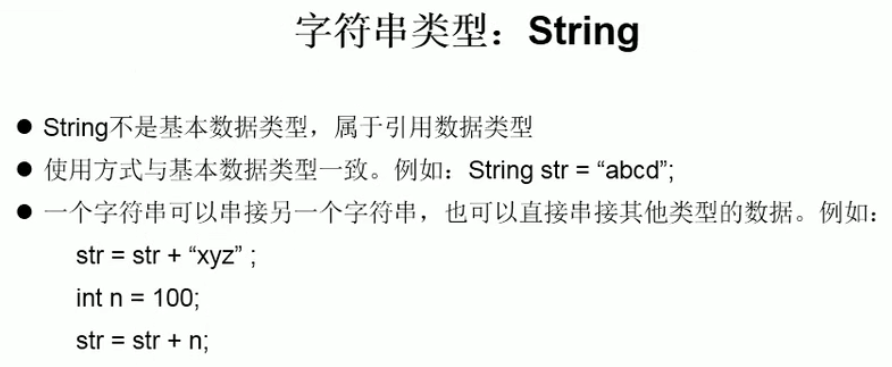

   +加号作为连接运算符，运算结果任然为String类型

   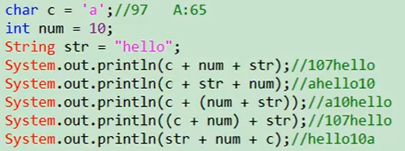

4. 进制与进制之间转换

   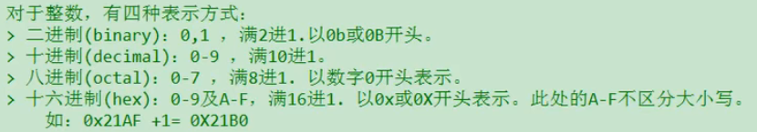

   **REMAIN P62-P91**

**运算符**

1. 算数运算符

   比较特殊的是：加号（+）还可以用作字符串连接

   和C++相同：++和--也分前后

   整除运算符结果的符号和被除数相同

2. 位运算符

   

3. 逻辑运算符

   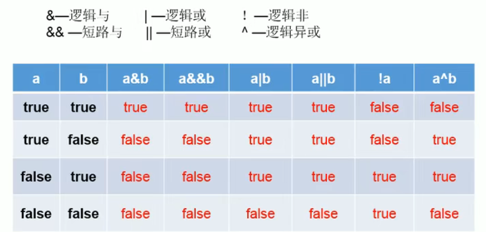

4. 三元运算符

   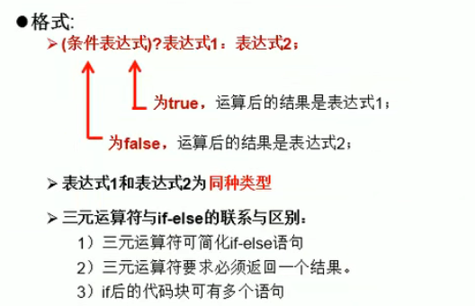

5. 运算符的优先级

   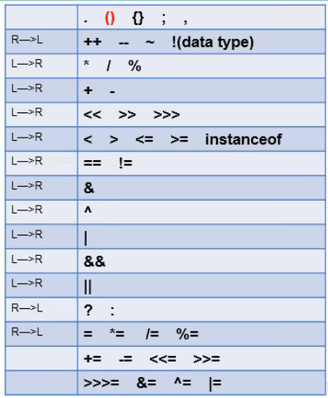

**程序流程控制**
1. 顺序结构
2. 分支结构（和C/C++一样）
   1. if -- else if -- else
   2. switch--case（case后面的常量可以是字符串等）
3. 循环结构（和C/C++一样）
   1. for
   2. while
   3. do-while
   4. break：默认跳出最近一层循环
   5. continue：默认跳过最近一层循环的一次
   6. 带标签的break、continue
      1. 在循环前加上一个标签：**[label]:**
      2. break、continue后添加该标签，**break [label]; continue [label];**

p123


### Scanner

从键盘获取不同类型的变量：需要使用Scanner类

具体实现步骤：
1. 导包：**import java.util.Scanner;**（注意分号）
2. Scanner的实例化：**Scanner scan = new Scanner(System.in);**
3. 调用Scanner类的相关方法，获取指定类型的变量。
4. 对于char型变量，scanner没有提供相关的方法。只能用next获取字符串（再使用方法xxx.charAt(index),index从0开始）。
5. Scanner只需要实例化一次。**和C++的cin不同，java需要根据相应的方法，输入指定类型的值**。输入类型不匹配会报异常（InputMisMatchException），导致程序终止。


### 数组

数组本身是**引用数据类型**，而数组中的元素可以是任何数据类型，包括基本数据类型和引用数据类型。

数组长度一旦确定就不能修改。

创建数组会在内存开辟一块**连续的空间**，而**数组名**中引用的是这块连续空间的**首地址**。

可以通过索引（下标）的方式调用指定位置的元素。

数组的初始化
1. 静态初始化：数组的初始化和数组元素的幅值操作同时进行
   ```java
   int[] array = new int[]{0,1,2,3};
   ```
2. 动态初始化：数组的初始化和数组元素的幅值操作分开进行
   ```java
   int[] array = new int[4]{};
   ```
3. **注意**
   1. 前面的中括号一定为空
   2. 使用静态初始化就不要在第二个中括号内填数字
   3. 使用动态初始化就不要在大括号内填数字
   4. 前后指明的数组元素类型也必须一致

**length**属性：获取数组长度

数组有默认初始化值


## 高级篇

## 深入解读

## 新特性


P43


# 狂神说 Java零基础学习视频

[狂神说 JavaSE阶段回顾总结](https://www.bilibili.com/video/BV1MJ411v7tJ)

[狂神说 Java零基础学习视频](https://www.bilibili.com/video/BV12J41137hu)

## Java特性和优势

1. 面向对象
2. 可移植性（跨平台）
3. 高性能
4. 分布式
5. 动态性（反射机制）
6. 多线程
7. 安全性
8. 健壮性

## 包机制

为了更好的组织类，提供包机制，用于区别类名的命名空间

仍然需要尽量保证类名不重复，否则从其他包导入同名类的时候还是会冲突会冲突。

**本质就是文件夹**，一般使用公司域名倒置作为包名

语法格式：
```java
package pkg1[.pkg2[.pkg3]];
//在.java文件的第一行，不能去掉
```

为了使用某一个包的成员，需要在Java程序中明确导入该包。
```java
import package1[.package2[.package3]].(classname|*);
//*表示导入所有
```

## Scanner

Java工具类

java.util.Scanner是Java5新特征

获取用户输入

常用方法
```java
hasNext();
hasNextLine();
next();
nextLine();
```

```java
scanner.close();
```
用完关闭，节省资源。

**next&nextLine区别**

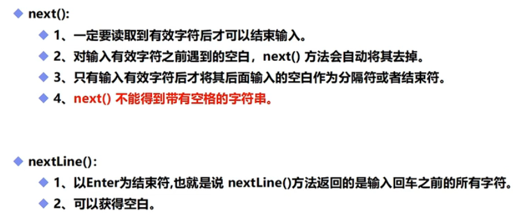

```java
public static void main(String[] args)
    {
        Scanner scan = new Scanner(System.in);
        System.out.println("input");

        if(scan.hasNextInt())
        {
            int i = scan.nextInt();System.out.println(i);
        }
        else
            System.out.println("no int");

        if(scan.hasNextFloat())
        {
            float f = scan.nextFloat();System.out.println(f);
        }
        else
            System.out.println("no float");

        scan.close();
    }
```

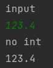

似乎和C/C++处理方式不同

直接检查对不对，不对直接跳过，缓冲区保留。

## 方法

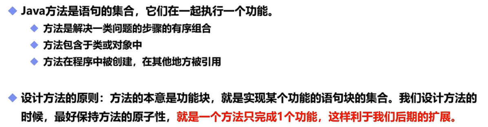

原子性

加static方便调用

### 方法的定义及调用

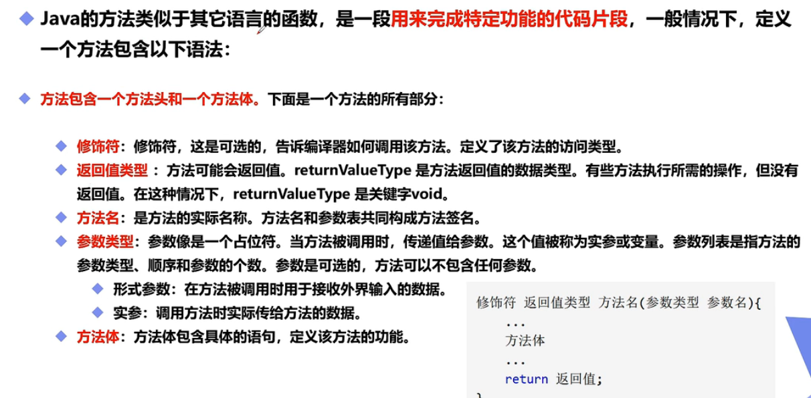

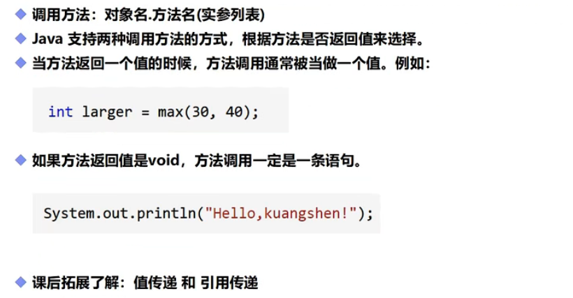

java都是值传递

**引用数据类型传入方法进行修改会保留修改**

### 方法重载

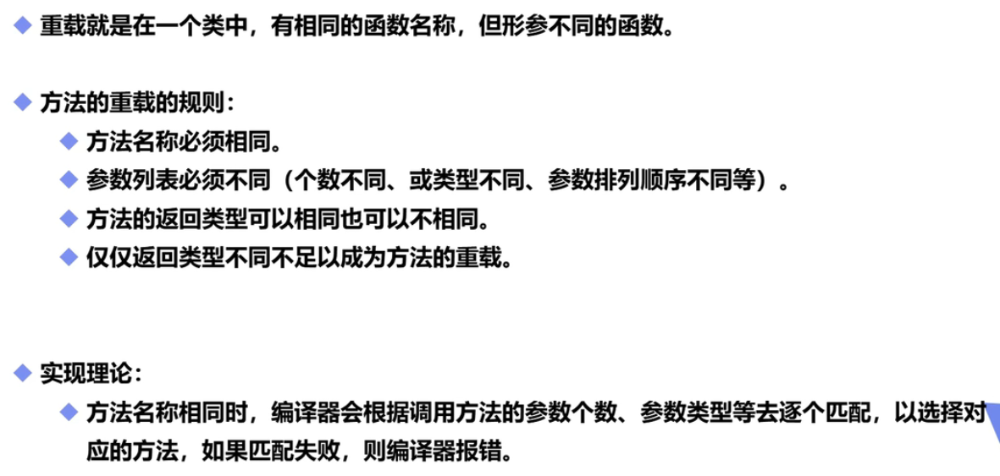

### 命令行传递参数

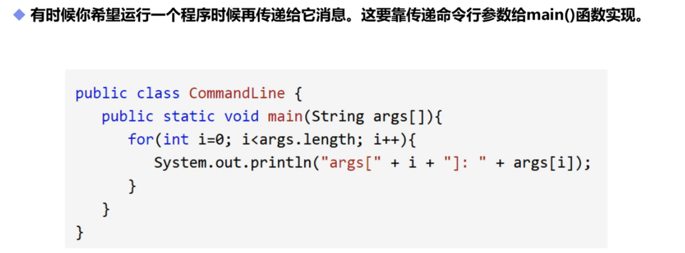

### 可变参数

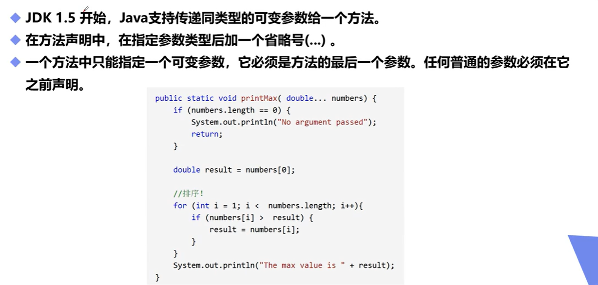

省略号，三个点

**只能指定一个可变参数**

**必须是最后一个参数**

用起来类似于数组

```java
public class VarLenParameter
{
    public static void main(String[] args)
    {
        varlen(11,22,33);
        varlen(new int[]{1,2,3});
    }

    public static void varlen(int ...l)
    {
        int x = l.length;
        for(int i=0;i<x;i++)
        {
            System.out.println(l[i]);
        }
    }
}
```

### 静态&非静态

1. 静态方法
   1. 可以直接调用
2. 非静态方法
   1. 需要实例化:[class_name] [object_name] = new [class_name]();
   2. 通过成员调用方法


```java
public class test1
{
    public static void main(String[] args)
    {
        System.out.println("test1_main");
        test2.print2();
        test3 t3 = new test3();
        t3.print3();
    }
}
```
静态方法，无需创建对象即可调用函数
```java
public class test2
{
    public static void main(String[] args)
    {
        System.out.println("test2_main");
    }
    public static void print2()
    {
        System.out.println("test2");
    }
}
```
非静态方法，需要创建实例才能调用函数
```java
public class test3
{
    public static void main(String[] args)
    {
        System.out.println("test3_main");
    }
    public void print3()
    {
        System.out.println("test3");
    }
}
```

上述三个文件可以写在同一个类中（后两个的public去掉即可），也可以分开为3个类（同一个包下）。

```java
public class test1
{
    public static void main(String[] args)
    {
        System.out.println("test1_main");
        test2.print2();
        test3 t3 = new test3();
        t3.print3();
    }
}

class test2
{
    public static void main(String[] args)
    {
        System.out.println("test2_main");
    }
    public static void print2()
    {
        System.out.println("test2");
    }
}

class test3
{
    public static void main(String[] args)
    {
        System.out.println("test3_main");
    }
    public void print3()
    {
        System.out.println("test3");
    }
}
```

静态方法和类一起加载

非静态方法要等类实例化后才加载

```java
public class test1
{
    public static void main(String[] args)
    {
        System.out.println("test1_main");
        test2.print2();
        test3 t3 = new test3();
        t3.print3();
    }

    public static void main1()
    {
        main2();//报错
        main3();
    }

    public void main2()
    {
        main1();
        main3();
    }

    public static void main3()
    {
        main1();
        main2();//报错
    }
}
```

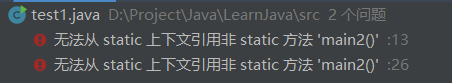


## 数组

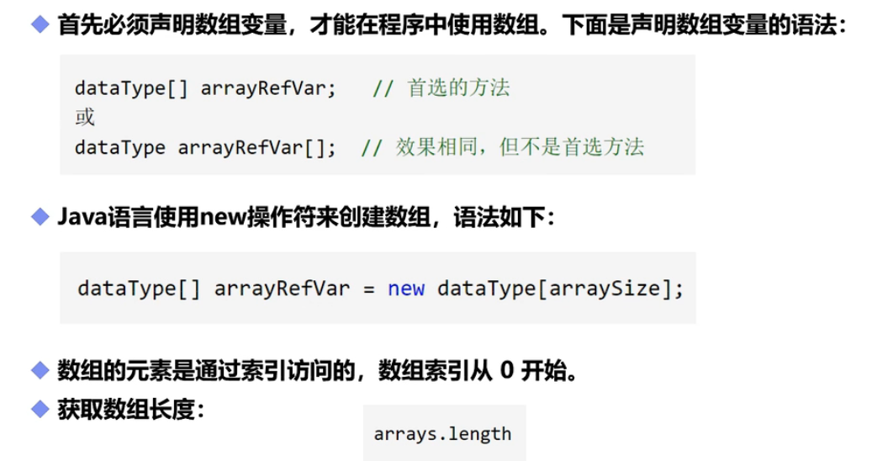


数组名字在栈中（未new的时候）

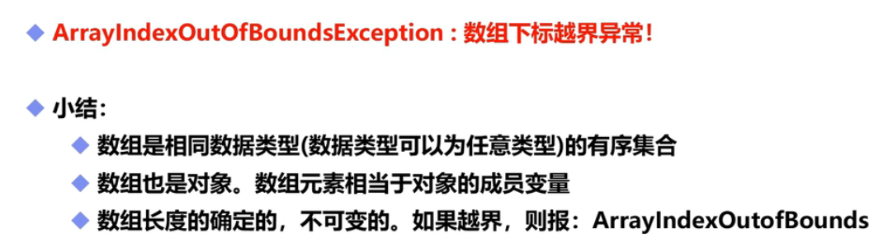

### 数组的初始化及内存分析

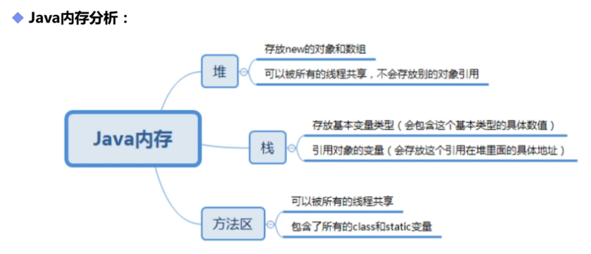

静态初始化：创建+赋值

动态初始化：创建（包含默认初始化）

**for-each循环**

简便的for循环，称之为for-each循环，不使用下标变量就可以顺序地遍历整个数组

但是，当需要以其他顺序遍历数组或改变数组中地元素时，还是必须使用下标变量。

```java
for (int i : array)
        {
            System.out.println(i);
        }
```

### 多维数组

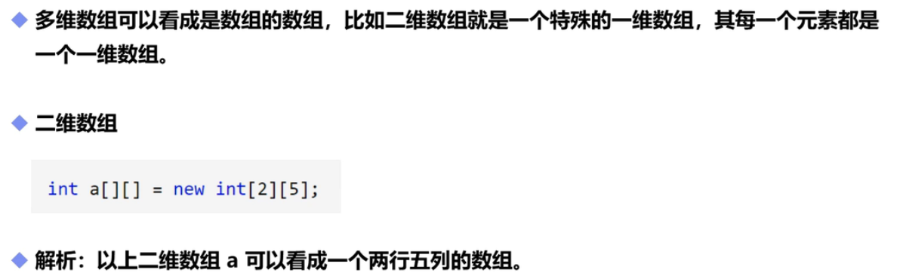

```java
public class MultiDimArray
{
    public static void main(String[] args)
    {
        int[][] array = new int[][]{{1,2,3},{3,4,5,6}};
        System.out.println("rows: "+array.length);
        System.out.println("cols: "+array[0].length);

        System.out.println("遍历");
        for(int i=0;i<array.length;i++)
        {
            for(int j=0;j<array[i].length;j++)
            {
                System.out.print(array[i][j]+"  ");
            }
            System.out.println("");
        }
    }
}

// rows: 2
// cols: 3
// 遍历
// 1  2  3  
// 3  4  5  6  
```

输出数组的时候需要自己遍历

### Arrays类

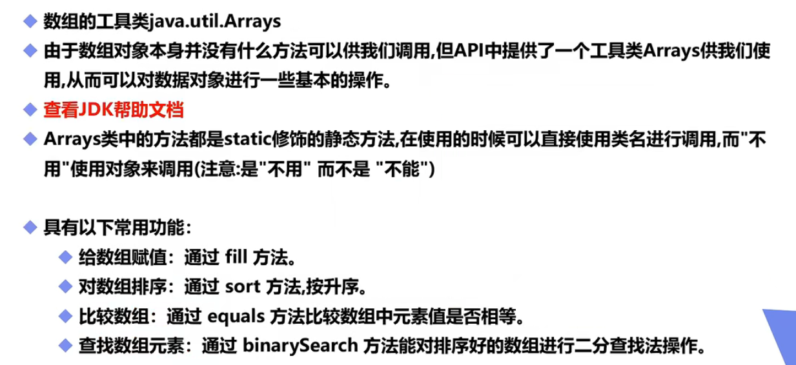

常见方法
1. binarySearch: 使用二分法查找元素在数组中的索引位置
   **数组一定是排好序的，否则会出错**
   **若数据重复，则输出按照二分查找，最先找到的那个元素的下标**
   ```java
   public static void main(String[] args)
   {
       int[] t1 = new int[]{7,3,3,5,234,-12};
       Arrays.sort(t1);
       System.out.println(Arrays.toString(t1));
       //[-12, 3, 3, 5, 7, 234]
       int pos_no = Arrays.binarySearch(t1,0);
       int pos_yes = Arrays.binarySearch(t1,3);
       System.out.println(pos_no);//-2
       System.out.println(pos_yes);//2
   }
   ```
2. copyOf&copyOfRange: 截取数组
   ```java
   public static void main(String[] args)
   {
       int[] t1 = new int[]{7,3,3,5,234,-12};
       int[] t2 = Arrays.copyOf(t1,3);
       int[] t3 = Arrays.copyOfRange(t1,1,4);
       String str1 = Arrays.toString(t1);//[7, 3, 3, 5, 234, -12]
       String str2 = Arrays.toString(t2);//[7, 3, 3]
       String str3 = Arrays.toString(t3);//[3, 3, 5]
       System.out.println(str1+"\n"+str2+"\n"+str3);
   }
   ```
3. equals
   ```java
   public static void main(String[] args)
   {
      int[] t1 = new int[]{7,3,5,234,-12};
      int[] t2 = new int[]{7,3,5,234,-12};
      boolean result_array_equals = Arrays.equals(t1,t2);
      boolean result_equals = t1.equals(t2);
      System.out.println("arrays_equals   : "+result_array_equals);
      System.out.println("equals          : "+result_equals);//比较的是两个对象的地址，不是里面的数
      //arrays_equals   : true
      //equals          : false
   }
   ```
4. fill: 填充数组
   ```java
   public static void main(String[] args)
   {
       int[] test = new int[10];
       Arrays.fill(test, 123);
       for (int i : test)
       {
           System.out.println(i);
       }
   }
   ```
5. hashCode
6. parallelPrefix
7. parallelSetAll
8.  parallelSort
9.  setAll
10. sort: 将数组进行升序排序
    ```java
    public static void main(String[] args)
    {
        int[] test = new int[]{7,3,5,234,-12,0,77,21,34,1};
        Arrays.sort(test);
        for (int i : test)
        {
            System.out.println(i);
        }
    }
    ```
11. spliterator
12. stream
13. toString: 将数组按照默认格式输出为字符串
    ```java
    public static void main(String[] args)
    {
        int[] test = new int[]{7,3,5,234,-12};
        String str = Arrays.toString(test);
        System.out.println(str);
    }
    ```

## 面向对象

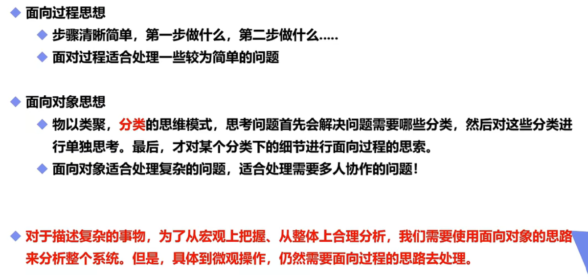

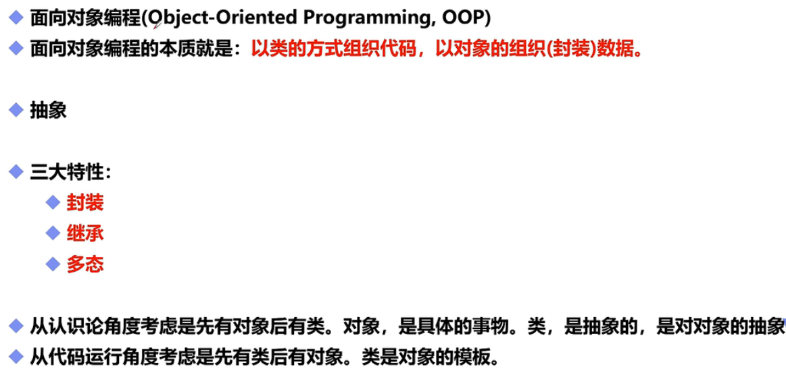

类是一种抽象的数据类型，对一类事物的整体描述、定义，不是具体的事物

对象是抽象概念的具体实例

**对象的引用**

引用类型（与基本类型相对）

对象通过引用来操作（变量名在栈中，实际存储在堆中（地址））

**属性**

字段 field

成员变量

### 类和对象的创建

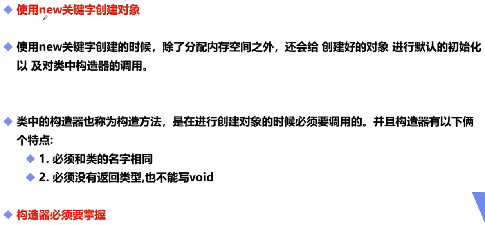

一个项目应该只有一个main方法。

### 构造器

一个类即使是空的也会存在一个默认的构造器

可以自己显式定义构造器

**构造器用于初始化值**

**必须和类名相同，没用返回值**

**new关键字，本质是在调用构造器**

**如果定义了有参构造，就必须自己显示定义无参构造**

idea中使用**alt+insert**快捷键创建构造函数

### 创建对象内存分析

**堆**
变量名/引用

**栈**
对象存储，使用方法的时候会调用方法区

**方法区**
包含静态方法区，所有类的成员都可以调用
包含各种方法
包含类（字段和方法）

### 封装

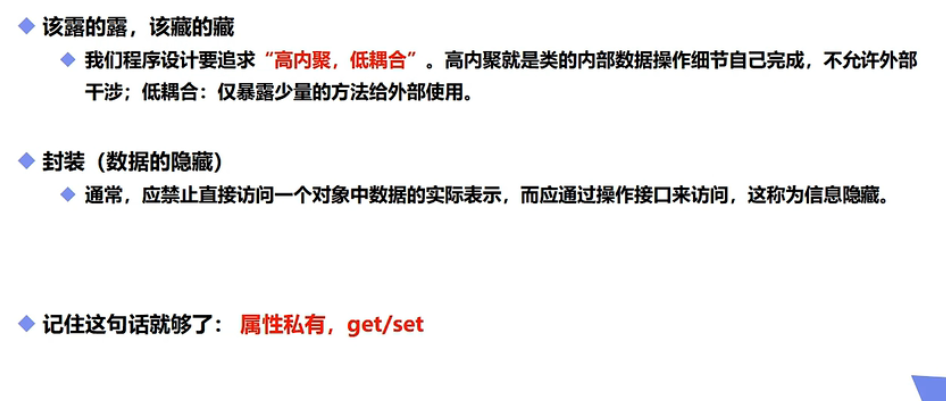

优点：
1. 提高程序安全性
2. 隐藏代码实现细节
3. 统一接口，规范
4. 提高系统可维护性

### 继承

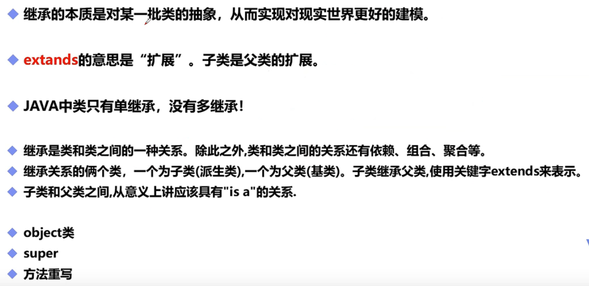

将父类进行细分

子类、派生类

子类继承父类就会拥有父类的全部方法（public修饰符的）

**在java中所有类都默认继承Object类**（可以不用显式写明extends Object）

idea中**Ctrl+h**快捷键看继承关系

#### Super

super，输出父类的方法或属性，和this相对

super代表父类对象的引用

**private私有的内容无法被继承**

**子类的构造会调用父类的构造**
```java
super();//调用父类构造器，必须要在子类的最上方，可以不显式写出
```

子类和父类的属性和方法可以重名

父类的protected可以使子类通过super方法访问到（private不行）

**若父类没有无参构造，子类也不能用无参构造函数，只能显式调用有参构造函数**

子类的属性和父类重复，则默认使用子类的（也可也this、super指定）。如果父类有子类没有的，也可以不用显式指定，可以直接使用。

#### 方法重写

**前提：继承关系、子类重写父类的方法、方法名相同、参数列表相同**

修饰符可以扩大但不能缩小 : public > protected > default > private

抛出的异常：范围可以被缩小单不能被扩大。（小异常）

不等于重载，之和非静态有关

IDEA会有图标提示

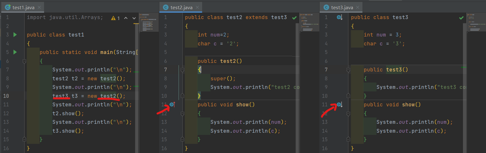

使用子类的构造器构造父类对象

**重写针对方法，和属性无关**

**父类的引用指向子类的对象**（new xxx是对象，[father]xxx是引用）

**静态方法和非静态方法不同**

静态方法：可以用子类的构造器构造父类

动态方法：子类可以重写父类的方法


**为什么需要重写**
1. 子类不一定需要、满足父类的功能。


### 多态

多态也是针对方法

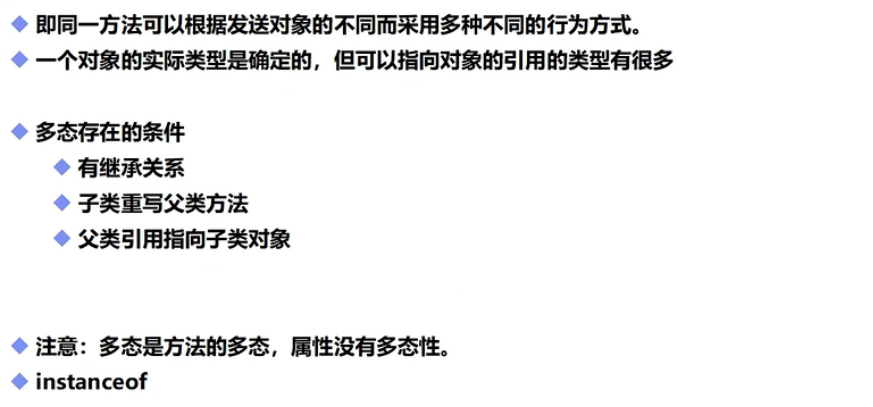

**一个类的实际对象的类型是确定的，但是可以指向该类型的引用类型不确定（父类的引用指向子类）**

**对象能执行哪些方法主要看创建对象时，等号左边的类型**

**子类可以调用自己的方法以及继承的父类的方法**

**父类只能调用自己的方法但是不能调用子类独有的方法（除非进行强制类型转换），虽然可以指向子类**

**一定有继承关系才能进行类型转换，否则会报异常（ClassCastException）**

存在条件：
1. 继承关系
2. 方法重写
   1. static方法属于类，不属于实例，不能被重写
   2. final不能重写
   3. private不能重写
3. 父类引用指向子类：father f = new son();

### instanceof

引用类型之间的

判断对象的类型

```java
[variable_name] instanceof [typename];
```

```java
public static void main(String[] args)
{
    //test2是子类,test3是父类
    test2 t22 = new test2();
    test3 t32 = new test2();
    test3 t33 = new test3();
    System.out.println(t22 instanceof test2);//true
    System.out.println(t32 instanceof test2);//true
    System.out.println(t33 instanceof test2);//false
    System.out.println(t22 instanceof test3);//true
    System.out.println(t32 instanceof test3);//true
    System.out.println(t33 instanceof test3);//true
    System.out.println(t22 instanceof Object);//true
    System.out.println(t32 instanceof Object);//true
    System.out.println(t33 instanceof Object);//true
    Object to2 = new test2();
    System.out.println(to2 instanceof Object);//true
    System.out.println(to2 instanceof test2);//true
    System.out.println(to2 instanceof test3);//true
    Object to3 = new test3();
    System.out.println(to3 instanceof Object);//true
    System.out.println(to3 instanceof test2);//false
    System.out.println(to3 instanceof test3);//true
}
```
X指向的类型是不是Y类型或者其子类型

```java
X instanceof Y;
```

**完全没有继承关系的不能使用instanceof**

### 类型转换

基本类型转换，高转低需要强制类型转换，低转高不用

父类代表高、子类代表低

**丢失内容方面和基本类型恰好相反（基本类型高转低丢失截断、面向对象低转高丢失方法）**

```java
father f = new son();//低转高，不需要强制类型转换
```

高转低需要强制类型转换才能使用子类的方法

子类转换为父类可能会丢失一些自己本来的方法

**方便方法的调用**

### static详解

静态变量可以直接使用类名访问，被该类所有对象共享。

非静态变量只能使用成员名访问。

静态方法可以不定义对象就直接使用（和类一块加载）。

静态导入包

### 代码块

static代码块：**static {}**，只会在第一次执行

匿名代码块：**{}**，可以用于赋初值

创建类的对象的顺序**静态代码块->匿名代码块->构造方法**

### 抽象类

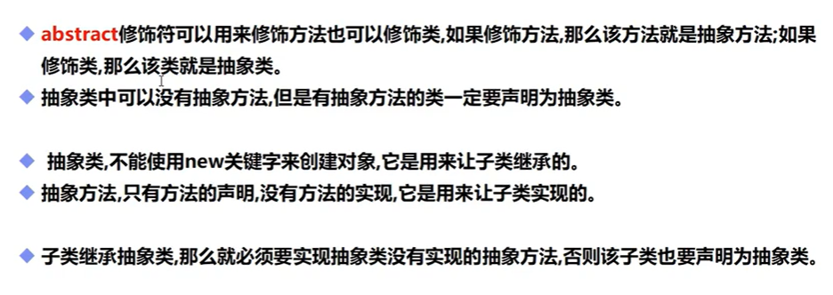

abstract

```java
public abstract void t1();
```

```java
@Override
public void t1()
{

}
```

包含抽象方法，只有方法名字，没有具体实现。需要子类去实现。

继承

**若子类没实现，则子类也必须为抽象类**

类只能单继承

接口可以多继承

**不能new抽象类**

**有抽象方法一定是抽象类**

### 接口

**interface**

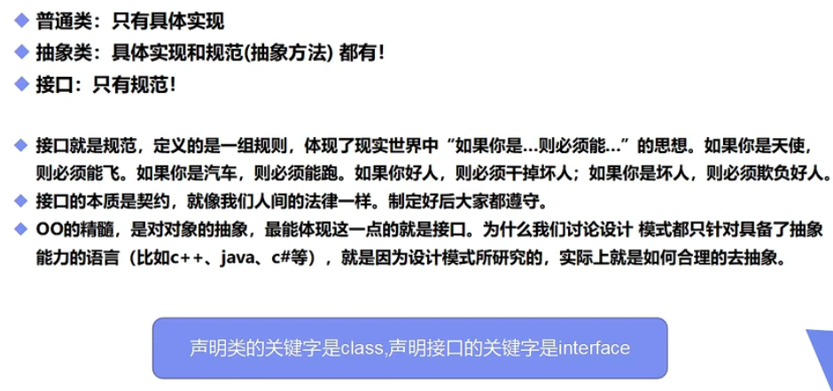

专业的约束

面向接口编程

约束和实现分离

接口中的所有定义都是抽象的 public abstract，可以不用写这些关键字

**接口都需要有实现类，implements**，必须要重写接口中的方法

可以利用接口实现多继承

```java
public interface test1
{
    void t1();
}
```

```java
public interface test3
{
    void t3();
}
```

```java
public class test2 implements test1,test3
{
    @Override
    public void t1()
    {
        System.out.println("haha1");
    }

    @Override
    public void t3()
    {
        System.out.println("haha3");
    }
}
```

接口里定义的属性是常量，public static final

**接口不能被实例化，也没有构造方法**

### N种内部类

一个.java文件只能有一个public类，可以有多个普通class

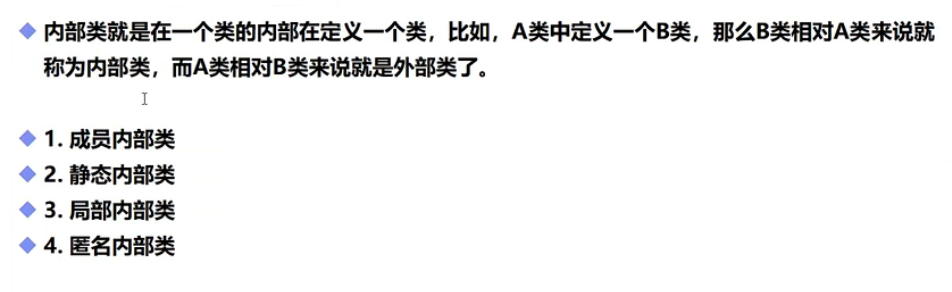

**成员内部类**

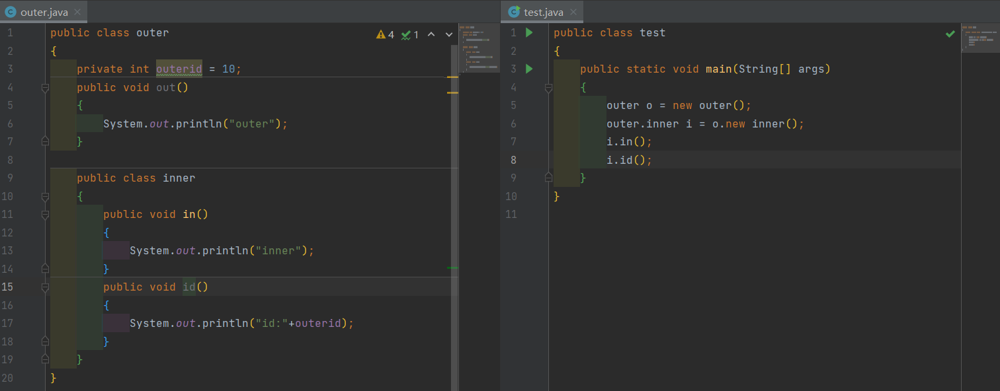

成员内部类可以获得外部类的私有属性

**静态内部类**

比内部类多一个static

只能访问外部类的static（从什么时候加载来考虑）

**局部内部类**

在方法内，和局部变量类似

**匿名内部类**

不用将实例保存在变量中

## 异常

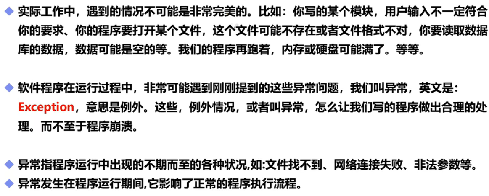

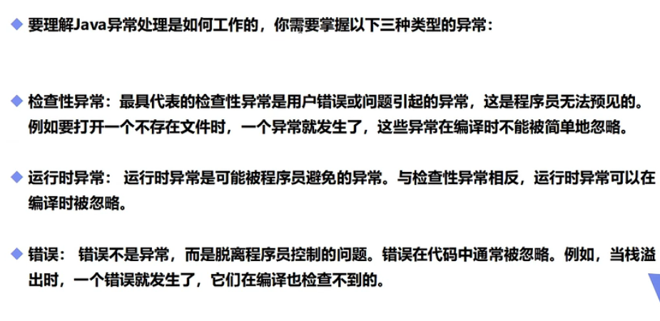

### Error和Exception

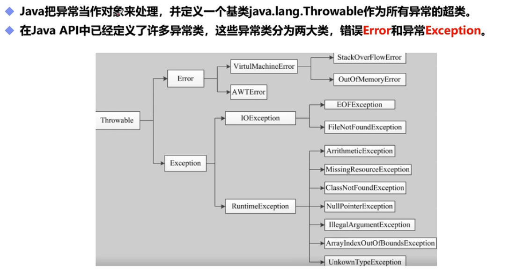

error一般难以预见，exception可以预见

Throwable的子类

Error
1. VirtualMachine
2. AWT(GUI)

Exception
1. IO
2. Runtime

异常必须要处理，否则可能编译不通过

### 捕获和抛出异常

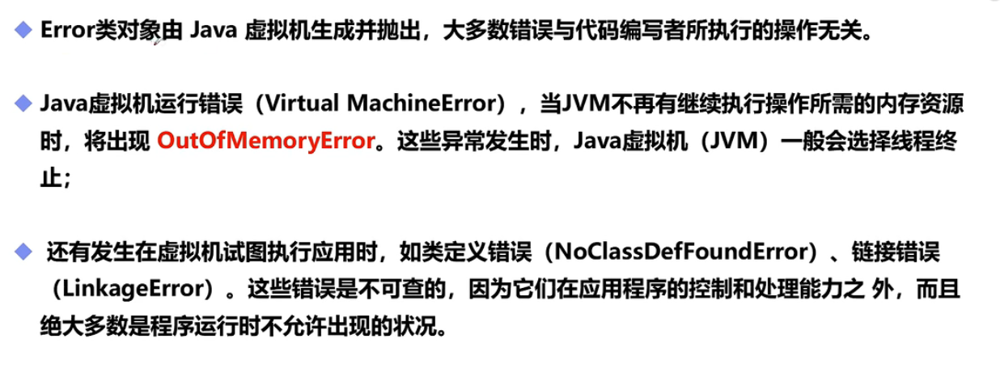

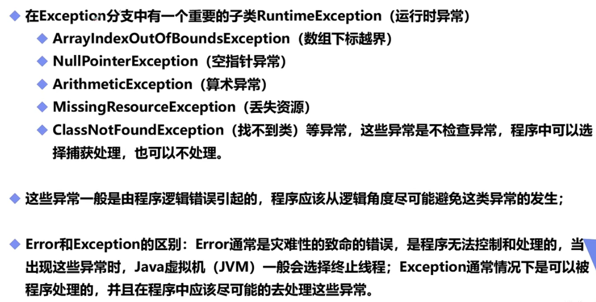

五个关键字
1. try
2. catch：捕获
3. finally：无论是否有异常都会操作（可以不用）
4. throw：抛出
5. throws：在方法上抛出，传递给其他地方处理

异常被捕获被处理，程序就不至于被终止

如果尝试catch却没有捕获到，则也会先执行finally再抛出异常，程序报错

一个try可以跟多个catch，捕获到对应类型的异常就结束，后续的catch不会被执行，所以应该将大异常放在下面

可能一个方法无法处理这个异常，可以主动进行抛出，避免执行

### 自定义异常

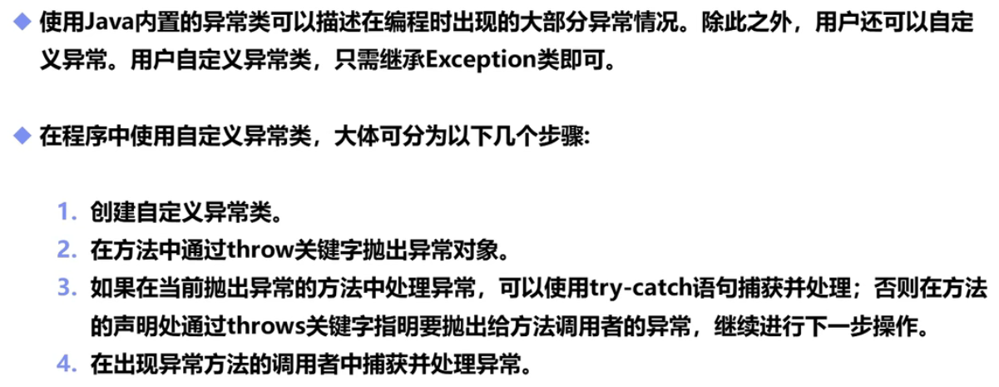

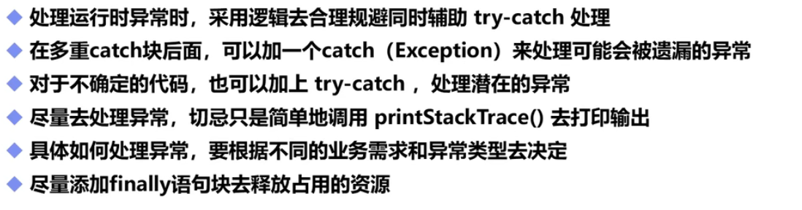

