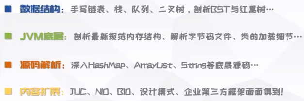
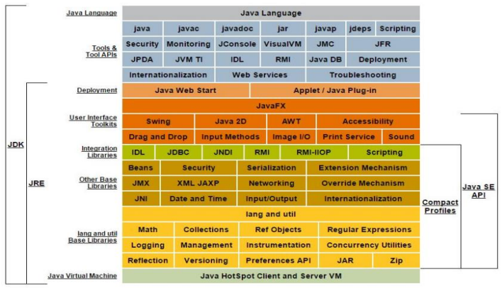
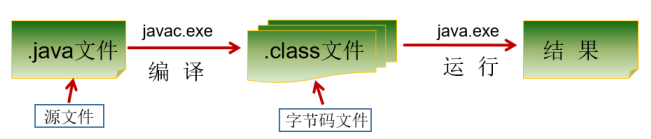
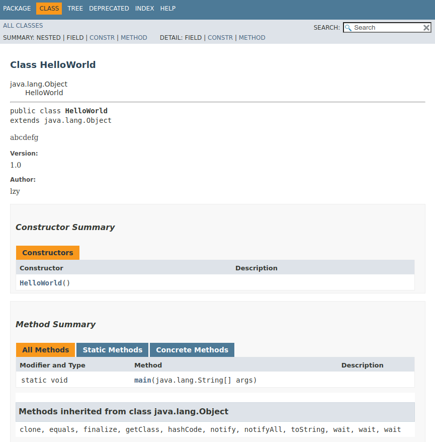
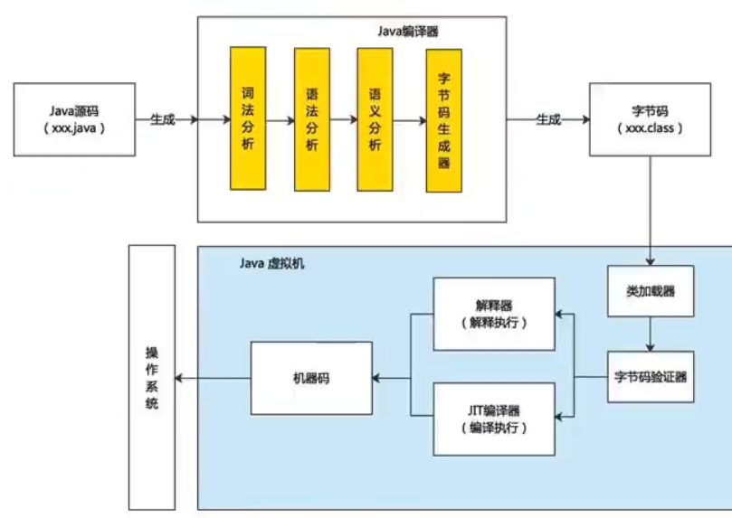
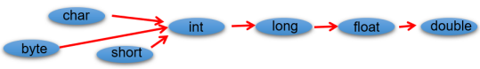

# Java

**目录**
[toc]

---

# 尚硅谷Java零基础全套视频教程2023版 --- 宋红康

[尚硅谷Java零基础全套视频教程2023版 --- 宋红康](https://www.bilibili.com/video/BV1PY411e7J6/)



---

## 第01章 Java语言概述

### 4 人机交互方式

GUI --- graphical user interface

CLI --- command line interface

### 5 计算机编程语言

高级语言按照程序设计方法
1. 面向过程
2. 面向对象(更高级)

Talk is cheap, show me the code.

### 6 Java语言概述

是 SUN (Stanford University Network，斯坦福大学网络公司) 1995 年推出的一门高级编程语言。

James Gosling -> 创造Oak -> 改造为Java

LTS 长期支持版本 -> 8、11、17

Java技术体系平台
1. JavaSE 
   1. (standard edition)
   2. 桌面级
2. JavaEE 
   1. (enterprise edition)
   2. 服务器、Web
3. JavaME 
   1. (micro edition)
   2. 移动终端
   3. != Android

JDK
1. Java Development Kit
2. 包含 JRE & 开发工具集

JRE
1. Java Runtime Environment
2. 包含 JVM & 核心类库



### 13 开发体验HelloWorld

步骤(先编译后运行)
1. .java(源文件) 通过 javac.exe(c -> compile) 编译为 .class
2. .class(字节码文件) 通过 java.exe 运行得到 结果



**字节码文件名和类名一致**

插件
1. code_runner 会生成 .class
2. redhat 插件不会显示生成 .class

```java
class HelloWorld 
{
    public static void main(String[] args) 
    {
        System.out.println("Hello World");
        System.out.println("你好 世界");
    }
}
```

class 是关键字，表示类，后面跟类名

main() 方法的格式固定 psvm

**==java 程序严格区分大小写==**

语句以分号结束

一个源文件中可以写多个类(==但最多只能有一个public类，且public类的类名要与源文件名相同==)，编译后会生成多个.class字节码文件，文件名与类名一致

windows环境下
1. javac 编译的时候不区分大小写 (windows不区分大小写)
2. java 运行的时候区分大小写 (针对类运行，需要严格和类名一致，java区分大小写)

语法问题、运行时异常

### 15 注释

```java

// 单行注释

/*
多行注释
多行注释
多行注释
*/
```

注释 != 注解(@)

单行&多行注释不参与编译，生成的字节码文件不包含它们的信息

多行注释不能嵌套使用

```java
/**
文档注释(java 特有)
文档注释(java 特有)
文档注释(java 特有)
*/
```

```bash
javadoc -d [result save dir] -author -version [xxx.java]
```

可以将 [result save dir] 中的 index.html 拖到浏览器中 查看



### 16 Java API文档

[在线文档 Java Platform, Standard Edition & Java Development Kit
Version 11 API Specification](https://docs.oracle.com/en/java/javase/11/docs/api/index.html)

[文档下载 Java SE Development Kit 17 Documentation](https://www.oracle.com/java/technologies/javase-jdk11-doc-downloads.html)

API application programming interface

Java 提供的现成的类库


### 17 Java语言特点 & JVM功能

Java 优点
1. 跨平台性(不同版本 JVM)
2. 面向对象性
3. 健壮性
4. 安全性高
5. 简单性
6. 高性能(JVM 通过 JIT just in time)

Java 缺点
1. 语法复杂、严谨
2. 架构比较厚重
3. 并非使用所有领域

JVM(Java Virtual Machine) 
1. 实现 Java 的跨平台性
2. 帮助进行 内存资源管理 (分配 和 执行)

虚拟的计算机，Java程序的运行环境

Java 程序仍然会出现 内存溢出 和 内存泄漏(没识别出垃圾) 问题

泄漏多了可能导致溢出

#### 半解释型语言

from chatGPT

Java通常被称为“半解释型”或“半编译型”语言，这是因为Java编译器将Java源代码编译成一种名为**Java字节码（bytecode）的中间代码**，而**不是直接编译成本地机器代码**。然后，Java虚拟机（JVM）将Java字节码解释执行成机器代码，使得Java程序可以跨平台运行。

这种设计使Java具有许多优点。例如，Java字节码可以在任何支持JVM的计算机上运行，而**不需要重新编译源代码**。这使得Java程序的可移植性非常强，可以轻松地在不同的操作系统和硬件平台上运行。

此外，Java的半解释型设计还使得Java程序的**开发和调试变得更加容易**。Java编译器可以在编译时检查代码中的语法和类型错误，并提供更好的错误提示信息。同时，JVM可以在运行时执行一些性能优化，以提高程序的执行效率。

总之，Java的半解释型设计使得它成为一种非常灵活和强大的编程语言，可以在不同的平台上实现高效的开发和运行。



有两步编译

---

## 第02章 变量与运算符

### 21 关键字 & 保留字

[Java 关键字](https://docs.oracle.com/javase/tutorial/java/nutsandbolts/_keywords.html)

被 Java 语言赋予特殊含义，用作专门用途

eg: class void public private

保留字是还没启用的

### 22 标识符

Java 中变量、方法、类等要素命名时使用的字符序列，称为标识符(凡是自己可以起名字的地方都叫标识符)

命名规则
1. 由 26 个英文字母大小写，0-9 ，**_ 或 $** 组成
2. **数字不可以开头**
3. **不可以使用关键字和保留字**，但能包含关键字和保留字
4. Java 中**严格区分大小写**，长度无限制
5. 标识符**不能包含空格**

**标识符命名规范**
1. **包名**：多单词组成时所有字母**都小写**：xxxyyyzzz(例如：java.lang、com.atguigu.bean)
2. **类名、接口名**：多单词组成时，**所有单词的首字母大写**：XxxYyyZzz(例如：HelloWorld，String，System 等) --- 大驼峰
3. **变量名、方法名**：多单词组成时，**第一个单词首字母小写，第二个单词开始每个单词首字母大写**：xxxYyyZzz(例如：age,name,bookName,main,binarySearch,getName) --- 小驼峰
4. **常量名**：**所有字母都大写**。多单词时**每个单词用下划线连接**：XXX_YYY_ZZZ(例如：MAX_VALUE,PI,DEFAULT_CAPACITY)

### 23 变量

变量 -> 最基本的存储单元

要素
1. 数据类型
2. 变量名
3. 存储的值

Java 是强类型语言，必须指明数据类型

连接符 +

数据类型
1. 基本数据类型(8种)
   1. 整型
      1. byte
      2. short
      3. int
      4. long
   2. 浮点型
      1. float
      2. double
   3. 字符型
      1. char
   4. 布尔型
      1. boolean
2. 引用数据类型
   1. 数组 array
   2. 类 class
   3. 接口 interface
   4. 枚举 enum
   5. 注解 annotation
   6. 记录 record

变量仅仅在 **作用域** 内有效

同一个作用域内，不能声明两个同名变量

变量在赋值时，必须满足变量的数据类型，并且不能超出数据类型对应的范围

#### 声明 初始化 赋值

在Java中，变量的赋值和初始化是两个不同的概念。

**变量的初始化是在声明变量时给变量赋予一个初始值**。例如：

```java
int count = 0; // 声明一个整数型变量count并初始化为0
String name = "Tom"; // 声明一个字符串型变量name并初始化为"Tom"
```

**变量的赋值是在程序运行时给一个已经声明和初始化的变量赋予一个新的值**。例如：

```java
int count = 0; // 声明一个整数型变量count并初始化为0
count = 10; // 给count变量赋值为10
```

需要注意的是，**变量的赋值可以在任何时候进行**，而变量的**初始化只能在声明变量时进行**。

在Java中，变量的赋值可以改变变量的值，而变量的初始化只能给变量赋予一个初始值。在程序中，我们通常会使用变量的赋值来修改变量的值，而变量的初始化则是为了给变量赋予一个初始值，以便变量在使用前具有合法的值。

### 24、25、26、27 变量与运算符

整形
1. byte  --- 1字节
2. short --- 2字节
3. int   --- 4字节
   1. **默认**
4. long  --- 8字节
   1. ==赋值时要以 l 或 L 作为后缀==

浮点型(精度有限)
1. float --- 单精度 --- 4字节
   1. ==赋值时要以 f 或 F 作为后缀==
2. double --- 双精度 --- 8字节
   1. 精度是 float 的两倍
   2. **默认**
3. 可以用十进制方式(必须有小数点) 或 科学计数法(e或E)
4. 对精度有要求的领域需要使用 **BigDecimal类**

字符类型
1. char --- 2字节 --- 
   1. 单引号，内部**有且仅有**一个字符  Unicode 编码
   2. \uXXXX Unicode值表示 X表示一个十六进制整数
   3. \ 转义字符
   4. 用数值 使用ASCII码
2. String

布尔类型
1. 判断逻辑条件
   1. 只能是 true / false， 不能 0/1


### 28 自动类型提升

**不包括boolean类型**



规则
1. 当把存储范围小的值（常量值、变量的值、表达式计算的结果值）赋值给了存储范围大的变量时 (**范围指的是表示数据的范围大小**)
2. 当存储范围小的数据类型与存储范围大的数据类型变量一起混合运算时，会按照其中最大的类型运算
3. 当 byte,short,char 数据类型的变量进行算术运算时，按照 int 类型处理

### 29 强制类型转换

小括号在前，包裹目标数据类型，写在变量名前

```java
long l = 123;  // 自动类型提升(没写L)
int i = (int)l;  // 强制类型转换
```

可能出现精度损失问题

遵循的不是四舍五入，而是直接截断

### 30 String类

String类是引用数据类型，用双引号方式赋值

String声明的字符串可以包含任意多个字符(包括0个)

**String类与基本数据类型变量间的运算**
1. 任意八种基本数据类型的数据与 String 类型只能进行连接 "+" 运算，且结果一定也是 String 类型，纯粹是拼一起
2. String 类型不能通过强制类型()转换，转为其他的类型

```java
String s = "10";
int i = Integer.parseInt(s);

System.out.println(i);
```


### 32、33 常见进制

十进制 decimal
1. 0~9
2. 满10进1

二进制 binary
1. 0 1
2. 0b 0B 开头

八进制 octal
1. 0~7
2. 0 开头

十六进制
1. 0~9 a~f(不区分大小写)
2. 0x 0X 开头

println 后都转为十进制

计算机内部存储**补码**

相互转换使用 **二进制** 作为中介


### 34、35、36、37、38 变量与运算符 Operator

功能
1. 算数 7 : +(正号 连接(String与其他类型) 加) = * /(除法) %(取余，**取模后，结果与被模数符号相同**) ++(前++ 后++) --(前-- 后--) 自增自减不会改变数据类型，可以节约空间
2. 赋值 12 : = += -= *= /= %= >>= <<= >>>= &= |= ^= ，支持连续赋值
   1. ```java
      public static void main(String[] args)
      {
         int i1=10, i2 = 30;
         System.out.println("i1"+i1+"--"+"i2"+i2);
         i1=i2=20;  // 连续赋值
         System.out.println("i1"+i1+"--"+"i2"+i2);
      }
      ```
   2. += 等操作不会改变变量本身的数据类型 
      ```java
      public static void main(String[] args)
      {
         int i = 1;
         i *= 0.1;
         System.out.println(i);  // 0
      }
      ```
3. 比较 6 : > < >= <= !=(不等于) == instanceof(检查是否是类的对象)
   1. 适用于出 boolean类型之外的其他基本数据类型
   2. 运算的结果为 boolean
   3. == 和 != 适用于引用数据类型(面向对象)
4. 逻辑 6 : &(与) |(或) ^(异或) !(非) &&(短路与) ||(短路或)
   1. 针对 boolean
   2. 结果也是 boolean
   3. 开发中推荐使用短路与 && 和 短路或 || ，"及时止损"
5. 位 7 : & | ^ ~(按位取反) <<(左移 空位补0、高位丢弃) >>(右移 空位补原最高位) >>>(无论原最高位，都补0)
   1. 主要不要超出范围
   2. 左移绝对值变大，右移绝对值变小
   3. ```java
      public class HelloWorld
      {
         public static void main(String[] args)
         {
            int a=0, b=0;
            a=1; b=10;
            System.out.println("a="+a+","+"b="+b);
            a=1; b=10;
            swap1(a, b);
            a=1; b=10;
            swap2(a, b);
            a=1; b=10;
            swap3(a, b);
         }

         public static void swap1(int a, int b) 
         {
            int temp = a;
            a = b;
            b = temp;
            System.out.println("a="+a+","+"b="+b);
         }

         public static void swap2(int a, int b) 
         {
            a = a^b;  // a的每一位是和b不同bit位置，b为原始b
            b = b^a;  // 对同一数据异或两次结果不变，b^(a^b) = a 
            a = a^b;  // (a^b)^a = b
            System.out.println("a="+a+","+"b="+b);
         }

         public static void swap3(int a, int b)  // 适用性差 可能超出范围
         {
            a = a - b;  // a为原始a-b差值，b为原始b
            b = b + a;  // b加上原始a-b差值等于a，a为原始a-b差值
            a = b - a;  // b为原始a，减去原始a-b差值等于b
            System.out.println("a="+a+","+"b="+b);
         }
      }
      ```
6. 条件 1 : (条件表达式)?xxx1:xxx2 也叫三元运算符
   1. 条件表达式为true 运行 xxx1
   2. 条件表达式为false 运行 xxx2
7. lambda 1 : ->

操作数个数
1. 一元(单目)
2. 二元(双目)
3. 三元(三目)


---

## 第03章 流程控制语句

---

## 第04章 IDEA的安装与使用

---

## 第05章 数组

---

## 第06章 面向对象编程(基础)

---

## 第07章 面向对象编程(进阶)

---

## 第08章 面向对象编程(高级)

---

## 第09章 异常处理

---

## 第10章 多线程

---

## 第11章 常用类与基础 API

---

## 第12章 集合框架

---

## 第13章 泛型

---

## 第14章 数据结构与集合源码

---

## 第15章 File类与IO流

---

## 第16章 网络编程

---

## 第17章 反射机制

---

## 第18章 JDK8-17新特性

---


