# HTML

[toc]

## Portals

[狂神说 HTML](https://www.bilibili.com/video/BV1x4411V75C)


# 狂神说 HTML

## 背景

Hyper Text Markup Language(超文本标记语言)

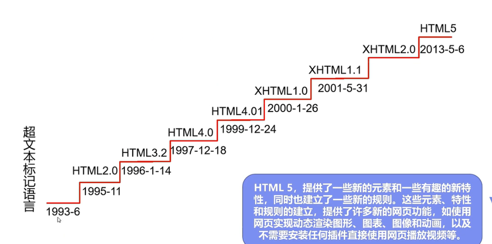

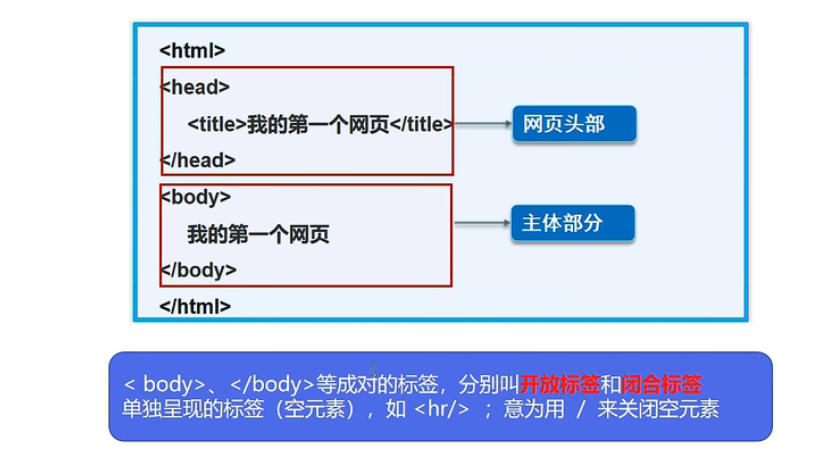

开放标签、闭合标签

用Intellij创建项目时，仍选择java项目即可，里面添加HTML文件

## 网页基本信息

```html
<!DOCTYPE html>
<html lang="en">
<head>
    <meta charset="UTF-8">
    <title>Title</title>
</head>
<body>

</body>
</html>
```
说明：
1. DOCTYPE：告诉浏览器使用的规范
2. html闭合标签：所有代码在里面（总标签）
3. head头部标签，描述网站的信息
   1. meta：描述性标签
   2. title：网页标题
      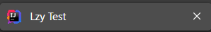
4. body网页主体

## 网页基本标签

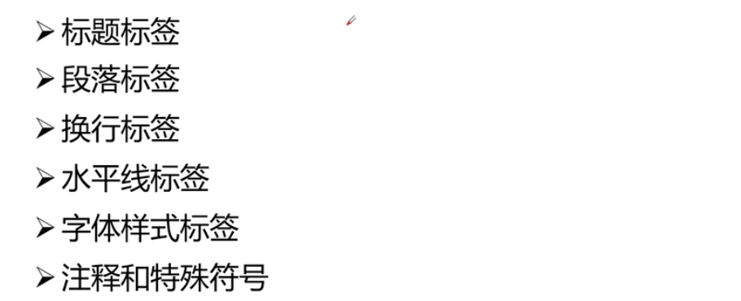

```html
<!--标题标签-->
<h1>一级标签</h1>
<h2>二级标签</h2>
<h3>三级标签</h3>
<h4>四级标签</h4>
<h5>五级标签</h5>
<h6>六级标签</h6>
<!--没有七级标签，会自动换行-->

<!--段落标签-->
<p>0501 lzy</p>
<p>0502 qyc</p>
<!--每一行都有p标签，否则不换行-->

<!--水平线标签-->
<hr>

<!--换行标签-->
lzy<br>
qyc<br>
yyr<br>
<!--不能闭合，间距比p小-->

<!--字体样式标签-->
<strong>lzy 粗体</strong>
<em>lzy 斜体</em>

<!--注释和特殊符号-->
<!--空格-->
lzy&nbsp;&nbsp;&nbsp;&nbsp;&nbsp;&nbsp;&nbsp;&nbsp;&nbsp;lzy
<br>
<!--大于-->
&gt;
<br>
<!--小于-->
&lt;
<br>
<!--版权-->
&copy;
```
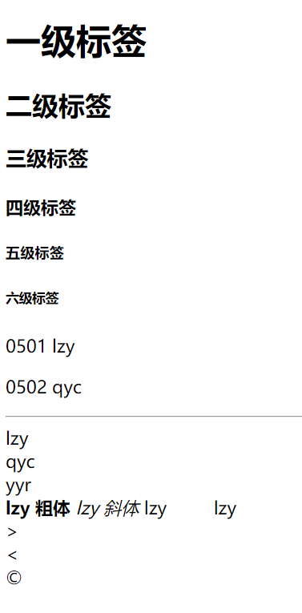


## 图像标签

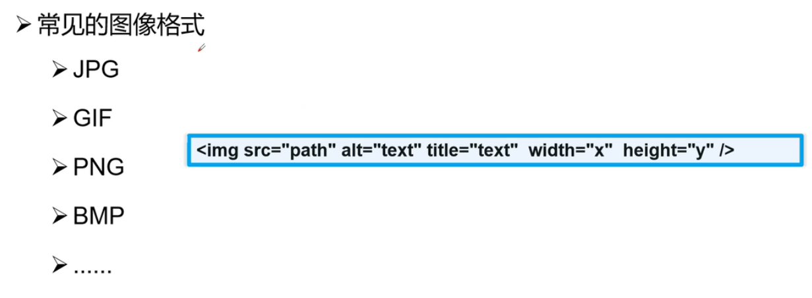

属性
1. src：图像地址
2. alt：图像的替代文字
3. title：鼠标悬停提示文字
4. width
5. height

```html
<!--中间不是逗号，img不是闭合的-->

<!--绝对路径在edge和idea自带的preview中均无法显式，但是可以在ie中显示-->
<!--如果图片不存在，则会显示alt的内容，鼠标放在图片上会显示title-->
```

## 超链接标签

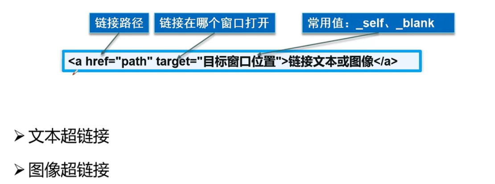

```html
<p>
  <a href="test3.html">goto test3</a>
</p>
<p>
  <a href="https://www.baidu.com">goto baidu</a>
<!--  一定要加https://-->
</p>
<p>
  <a href="test3.html" target="_blank">
    
  </a>
</p>

<!--herf是要跳转的网页-->
<!--标签a中填超链接的“按钮”-->

<!--target表示打开的位置-->
<!--_blank是在新的空白页打开-->
<!--_self是在当前打开，默认-->

<!--锚链接-->
<!--需要一个标记-->
<!--跳转到标记-->
<!--标记：名称，显示内容-->
<a name="top">note</a>

<a href="#top">jump</a>
<a href="test3.html#down">jump to test3's bottom</a>
<!--也可以跳转到其他html的标记处-->
```

## 行内元素块元素

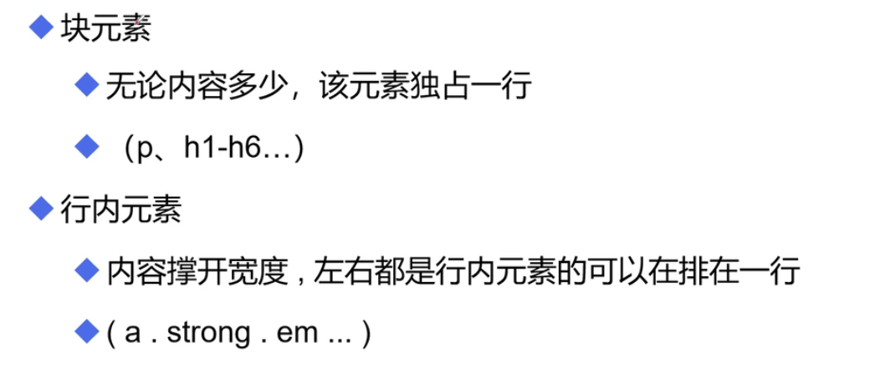

## 列表标签

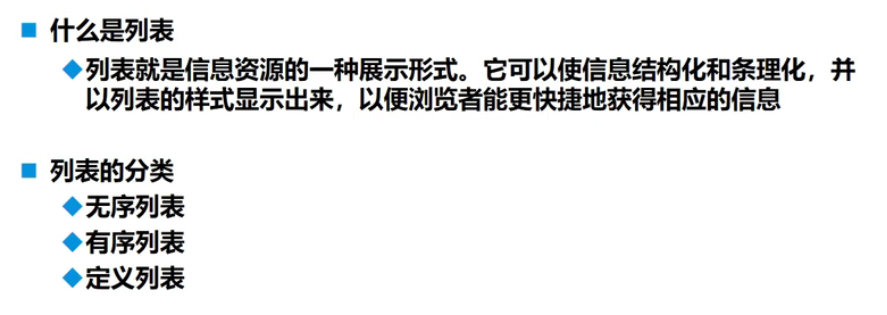

```html
<!--有序列表，自动添加序号-->
<ol>
  <li>lzy</li>
  <li>qyc</li>
  <li>yyr</li>
  <li>yty</li>
  <li>zzy</li>
</ol>

<hr>

<!--无序列表，自动加点-->
<ul>
  <li>lzy</li>
  <li>qyc</li>
  <li>yyr</li>
  <li>yty</li>
  <li>zzy</li>
</ul>

<hr>

<!--自定义列表
1.dl:标签
2.dt:列表名称(特点)
3.dd:列表内容
-->

<dl>
  <dt>az</dt>
  <dd>lzy</dd>
  <dd>qyc</dd>
  <dd>yyr</dd>
  <dd>yty</dd>
  <dd>zzy</dd>
</dl>
```

## 表格标签


```html
<table border="1px">
  <tr>
    <td rowspan="2">a11</td>
    <td colspan="2">a12</td>
  </tr>
  <tr>
    <td>a22</td>
    <td>a23</td>
  </tr>
</table>
```

## 音频和视频

video

audio

```html
<video src="1.C++编程简介.mp4" controls autoplay muted></video>
<audio src="04.残酷な天使のテーゼ%202009VERSION.mp3" autoplay controls muted></audio>
<!--
controls：进度条等工具栏
autoplay：打开网页自动播放
mute:静音
-->

<!--edge中视频可以自动播放，音频不行。ie中均没有问题-->
```

## 页面结构分析

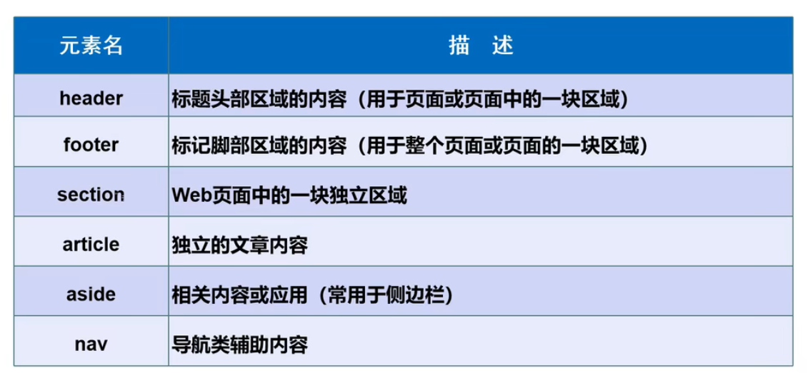

```html
<header> <h2>header</h2> </header>
<section> <h2>section</h2> </section>
<footer> <h2>footer</h2> </footer>
```

## iframe内联框架

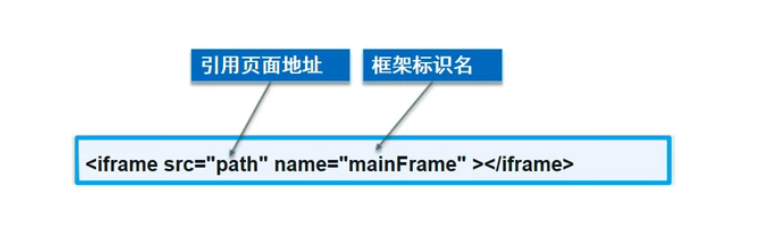

```html
<iframe src="https://www.bilibili.com" name="bilibili" width="1800px" height="900px"></iframe>
<br>
<a href="test1.html" target="bilibili">test jump in iframe</a>
<!--在内嵌框架中进行跳转-->
```

## 表单post和提交get

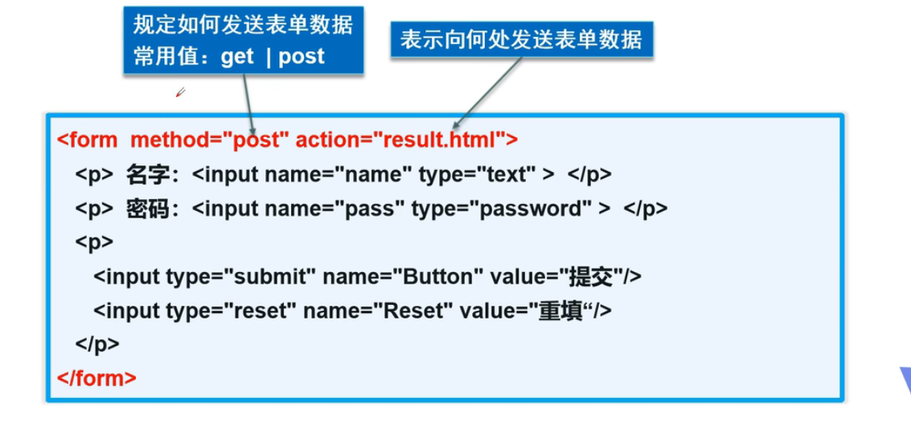

若使用edge浏览器，可以在下图所示位置查看（Ctrl+Shift+C）

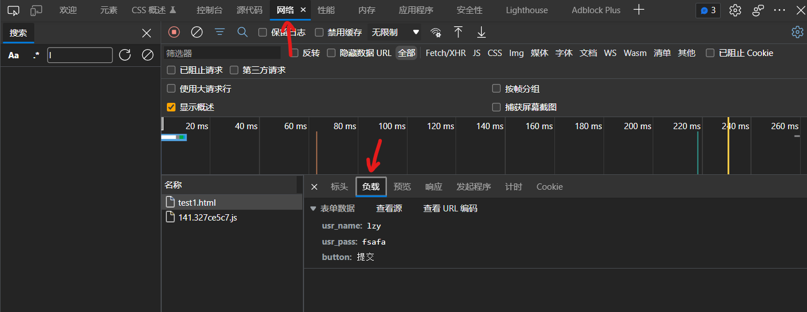

```html

```

## 文本框和单选框
```html

```
## 按钮和多选框
```html

```

## 列表框文本域和文件域
```html

```

## 搜索框还款和简单验证
```html

```
## 表单的应用
```html

```
## 表单的验证
```html

```
## 总结
```html

```
