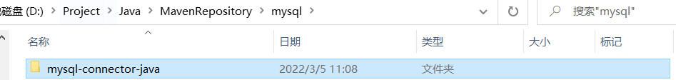
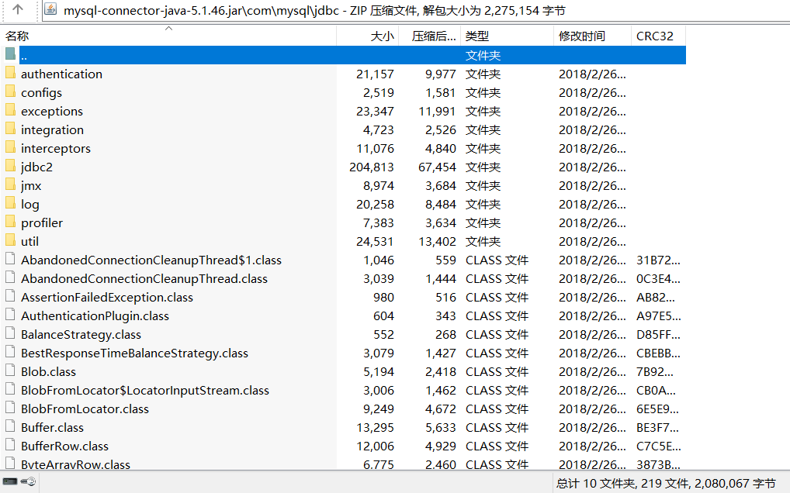
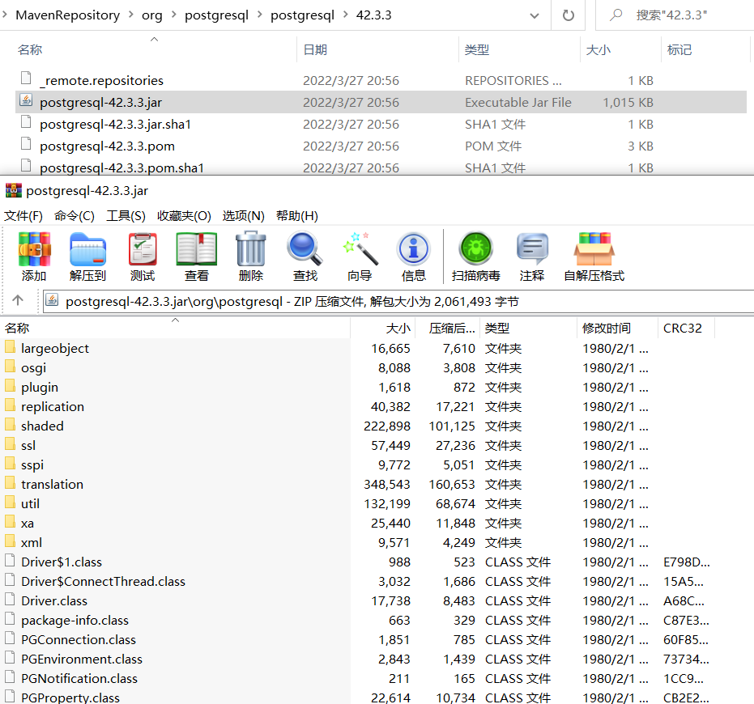
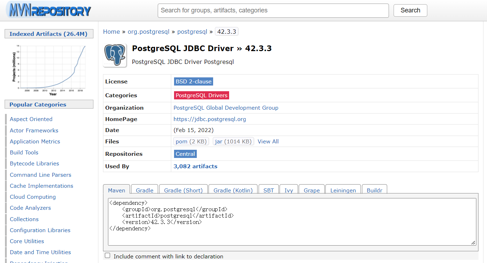
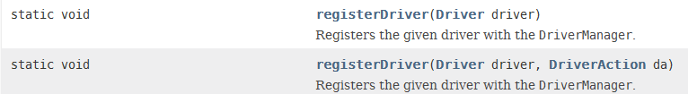
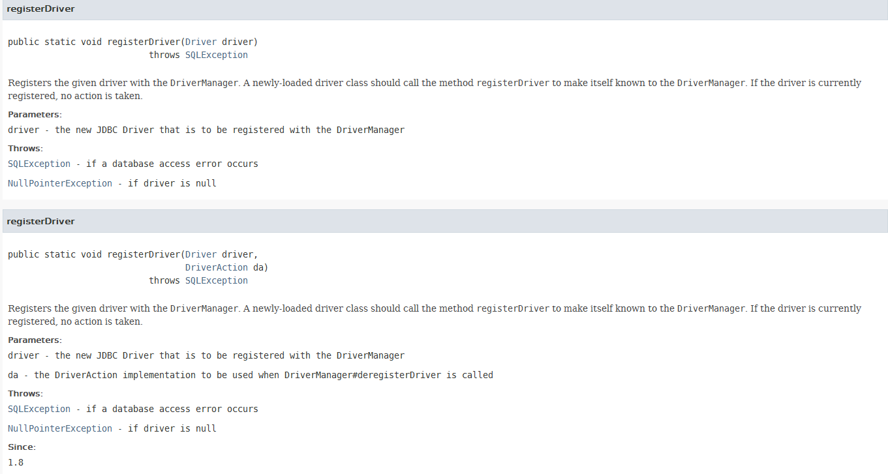
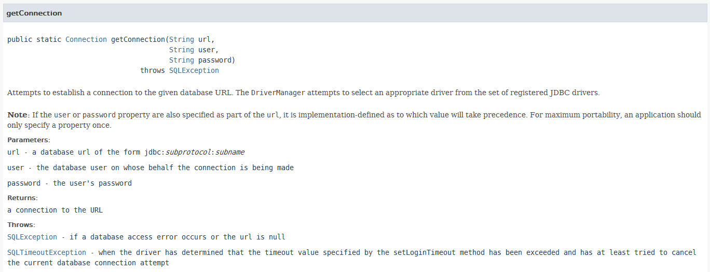

# JDBC

[toc]

## Portals

[狂神说 JDBC(MySQL)](https://www.bilibili.com/video/BV1NJ411J79W?p=37)

[老杜 JDBC从入门到精通视频教程](https://www.bilibili.com/video/BV1Bt41137iB)

[JDBC与PostgreSQL Blog](https://blog.csdn.net/qq_35732147/article/details/98878178)

# 老杜 JDBC从入门到精通视频教程

## JDBC本质的理解

Java DataBase Connectivity （Java语言连接数据库）

java.sql.*;软件包下有很多接口。

本质：
1. SUN公司制定的一套接口（interface）
2. 接口都有调用者和实现者
3. 面向接口调用、面向接口写实现类，都属于面向接口编程（为了解耦合，降低耦合度，提高扩展性）（多态就是典型的面向抽象编程）

SUN指定JDBC接口的原因：每一个数据库原理实现都不同，方便程序员使用相同的方法使用不同的数据库（面向JDBC接口编程）。数据库厂家负责接口的实现类，生产.class文件。

驱动，以jar包形式存在，jar包当中包含很多.class文件，这些class文件就是对JDBC接口的实现类，由数据库公司提供。本质上是**多态**，父类引用指向子类对象。

**MySQL驱动**

jar包中有很多类（class）

**PostgreSQL驱动**

可以直接在IDEA中创建maven项目，从MVNRepository上查找PostgreSQL的JDBC驱动

实际实现中可以利用反射机制或配置文件，更进一步解耦合。

**如果使用记事本进行开发，则需要将jdbc驱动配置到环境变量classpath中**（记得将.;也要写入（.表示当前文件夹），否则其他jar包会找不到）。如果使用IDEA等工具则无需进行配置。

## JDBC编程六步

六步
1. 注册驱动（告诉java程序，即将连接的数据库品牌）
2. 获取连接（表示JVM的进程和数据库进程之间的通道打开了，属于进程之间通信，使用完需要关闭）
3. 获取**数据库操作对象**（专门执行SQL语句的对象）
4. 执行SQL语句（DQL、DML...）
5. 处理查询结果集（当执行SELECT语句时，才需要处理查询结果集）
6. 释放资源（关闭资源。java和数据库之间属于进程间通信）

### 注册驱动与获取连接

**注册驱动**

DriverManager类

Driver接口(java.sql.Driver)

registerDriver函数会有异常（受检异常，用try-catch）

**获取连接**

DriverManager下的静态方法

# 狂神说 JDBC(MySQL)

## 数据库驱动

## JDBC程序

## JDBC对象解释

## 

