# JDBC

[toc]

## Portals

[狂神说 JDBC(MySQL)](https://www.bilibili.com/video/BV1NJ411J79W?p=37)

[老杜 JDBC从入门到精通视频教程](https://www.bilibili.com/video/BV1Bt41137iB)

[JDBC与PostgreSQL Blog](https://blog.csdn.net/qq_35732147/article/details/98878178)

# 老杜 JDBC从入门到精通视频教程

## JDBC本质的理解

Java DataBase Connectivity （Java语言连接数据库）

java.sql.*;软件包下有很多接口。

本质：
1. SUN公司制定的一套接口（interface）
2. 接口都有调用者和实现者
3. 面向接口调用、面向接口写实现类，都属于面向接口编程（为了解耦合，降低耦合度，提高扩展性）（多态就是典型的面向抽象编程）

SUN指定JDBC接口的原因：每一个数据库原理实现都不同，方便程序员使用相同的方法使用不同的数据库（面向JDBC接口编程）。数据库厂家负责接口的实现类，生产.class文件。

驱动，以jar包形式存在，jar包当中包含很多.class文件，这些class文件就是对JDBC接口的实现类，由数据库公司提供。本质上是**多态**，父类引用指向子类对象。

**MySQL驱动**

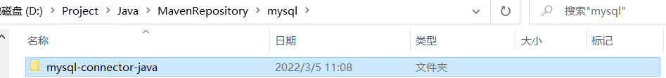

jar包中有很多类（class）

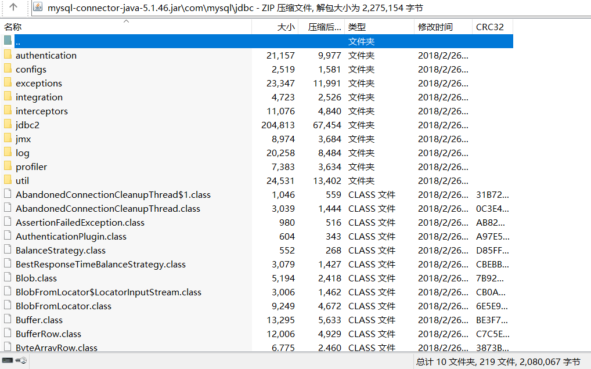

**PostgreSQL驱动**

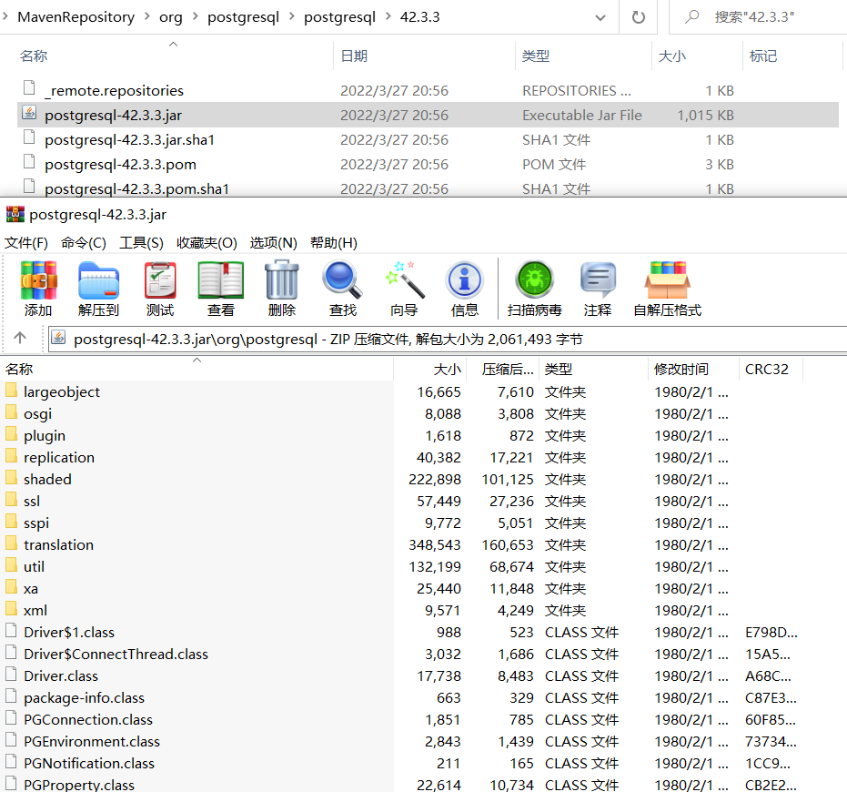

可以直接在IDEA中创建maven项目，从MVNRepository上查找PostgreSQL的JDBC驱动

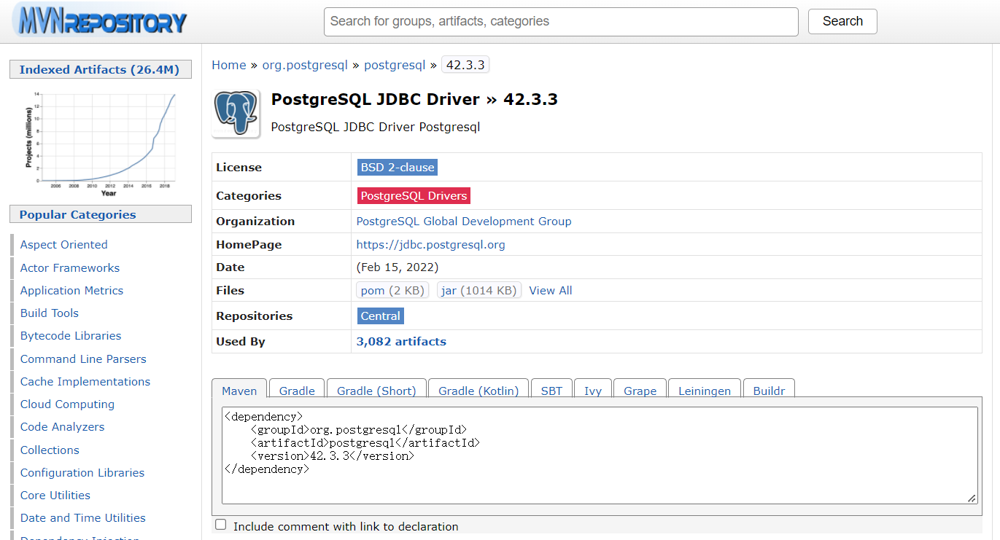

实际实现中可以利用反射机制或配置文件，更进一步解耦合。

**如果使用记事本进行开发，则需要将jdbc驱动配置到环境变量classpath中**（记得将.;也要写入（.表示当前文件夹），否则其他jar包会找不到）。如果使用IDEA等工具则无需进行配置。

## JDBC编程六步

六步
1. 注册驱动（告诉java程序，即将连接的数据库品牌）
2. 获取连接（表示JVM的进程和数据库进程之间的通道打开了，属于进程之间通信，使用完需要关闭）
3. 获取**数据库操作对象**（专门执行SQL语句的对象）
4. 执行SQL语句（DQL、DML...）
5. 处理查询结果集（当执行SELECT语句时，才需要处理查询结果集）
6. 释放资源（关闭资源。java和数据库之间属于进程间通信）

### ①注册驱动

DriverManager类


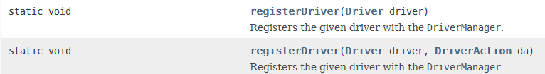

Driver接口(java.sql.Driver)

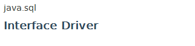

registerDriver函数会有异常（受检异常，用try-catch）

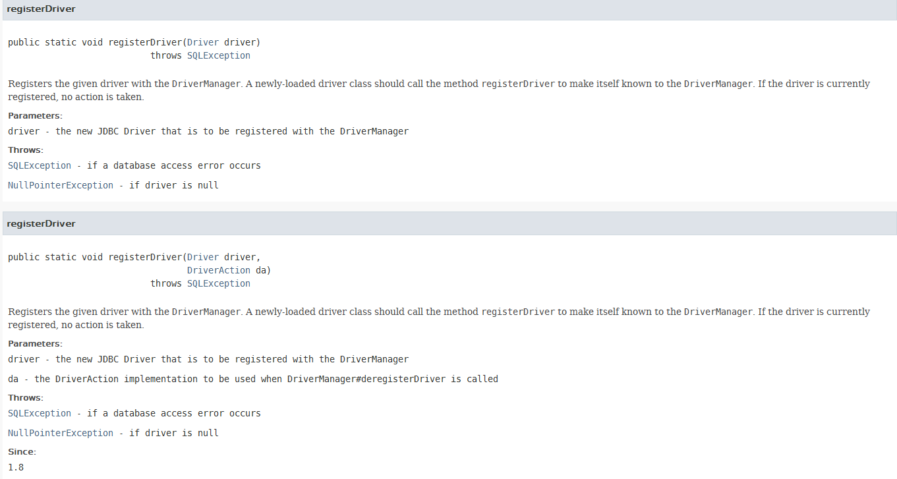


### ②获取连接

DriverManager下的静态方法，会抛出异常所以也要放在try-catch中

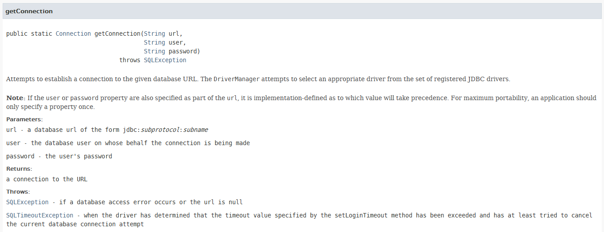

### ③获取数据库操作对象

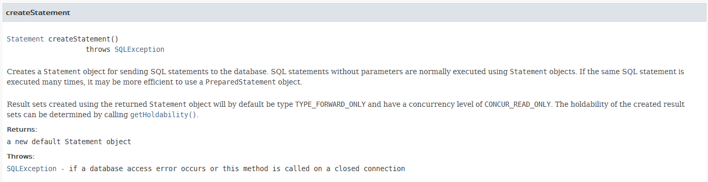

connection接口的方法，会抛出异常所以也要放在try-catch中

### ④执行SQL语句

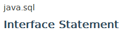
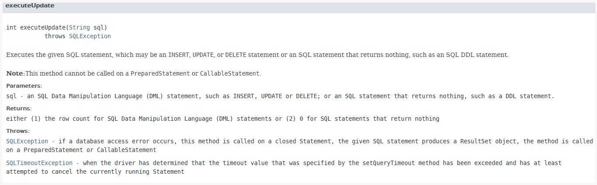

executeUpdate只能执行**增删改**。insert、delete、update

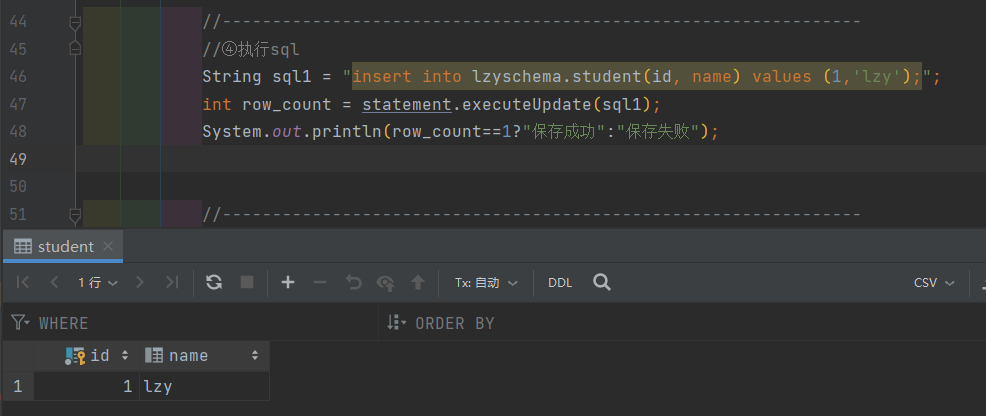

### ⑤处理查询结果集

暂无

### ⑥释放资源
写在finally中保证资源一定释放
遵循从小到大依次关闭，同时需要分开try-catch

创建引用型数据类型时，需要放在最try-catch的外面（程序最开始的时候，否则应该会编译不通过）

```java
try
{
    if(statement!=null)
        statement.close();
}
catch (SQLException throwables)
{
    throwables.printStackTrace();
}
```

### 总代码

```java
import java.sql.*;

public class JDBCTest01
{
    public static void main(String[] args)
    {
        Connection connection = null;
        Statement statement =null;
        try
        {
            //----------------------------------------------------------------
            //①注册驱动（告诉了java数据库品牌为PostgreSQL）
            //多态，父类的引用指向子类的对象
            java.sql.Driver PGDriver = new org.postgresql.Driver();//new的时候需要带包名
            //不能直接new Driver，因为是一个接口，需要找到其实现类
            DriverManager.registerDriver(PGDriver);


            //----------------------------------------------------------------
            //②获取连接
            //需要知道：数据库的地址、用户名、密码等
            //url:协议（jdbc:postgresql）、服务器IP、服务器端口（5432，PG默认端口号）
            //（后面还可以添加资源名（数据库实例名））
            //协议时通信之前就定义好的数据传输格式
            String url = "jdbc:postgresql://127.0.0.1:5432/testpg";
            String user = "postgres";
            String password = "Lzy010409";

            //静态方法，返回数据库连接对象（接口）
            connection = DriverManager.getConnection(url, user, password);
            System.out.println("数据库连接对象 = " + connection);
            //执行结果：
            //数据库连接对象 = org.postgresql.jdbc.PgConnection@20d28811（每次执行似乎都不一样）
            //如果长时间连接不到数据库会抛出异常


            //----------------------------------------------------------------
            //③获取数据库操纵对象(用于执行sql语句)
            //已经获取连接
            statement = connection.createStatement();


            //----------------------------------------------------------------
            //④执行sql
            //String sql1 = "insert into lzyschema.student(id, name) values (1,'lzy');";
            String sql1 = "DELETE FROM lzyschema.student WHERE id=1;";
            int row_count = statement.executeUpdate(sql1);
            System.out.println(row_count==1?"保存成功":"保存失败");


            //----------------------------------------------------------------
            //⑤


        }
        catch (SQLException throwables)
        {
            throwables.printStackTrace();
        }
        finally
        {
            //----------------------------------------------------------------
            //⑥释放资源
            //写在finally中保证资源一定释放
            //遵循从小到大依次关闭，同时需要分开try-catch
            try
            {
                if(statement!=null)
                    statement.close();
            }
            catch (SQLException throwables)
            {
                throwables.printStackTrace();
            }

            try
            {
                if(connection!=null)
                    connection.close();
            }
            catch (SQLException throwables)
            {
                throwables.printStackTrace();
            }
        }
    }
}

```

## 类加载方式注册驱动（常用）

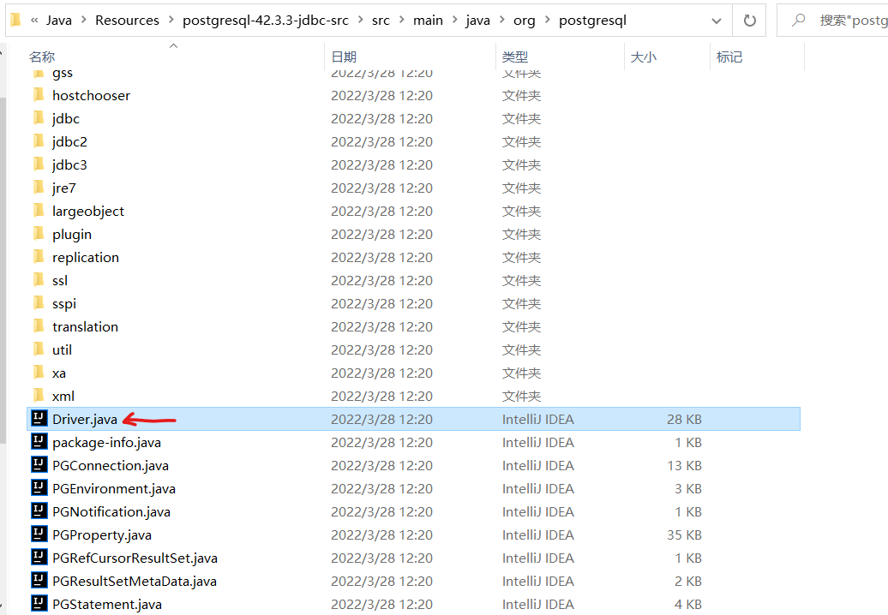

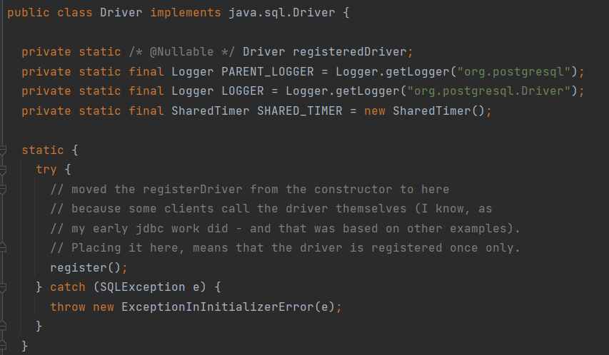

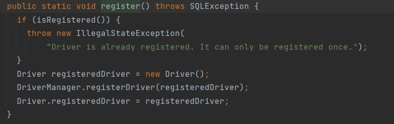

可以看的类的静态代码块中已经包含注册驱动的步骤，所以仅需加载类即可执行这些代码

使用反射机制进行类加载（参数是一个字符串，可以写在xxx.properties文件中），不需要接收返回值，只用到其类加载动作。

**代码如下**

```java
import java.sql.*;

public class JDBCTest03
{
    public static void main(String[] args)
    {
        try
        {
            /*
            Driver driver = new org.postgresql.Driver();
            DriverManager.registerDriver(driver);

            这些语句在静态代码块中有写，所以只需要加载类，就自动执行了
            */
            Class.forName("org.postgresql.Driver");//可能会有 ClassNotFoundException 异常
            connection = DriverManager.getConnection("jdbc:postgresql://localhost:5432/testpg","postgres","Lzy010409");
            System.out.println("数据库连接对象：" + connection);
            //执行结果
            //数据库连接对象：org.postgresql.jdbc.PgConnection@7c0c77c7
        }
        catch (SQLException throwables)
        {
            throwables.printStackTrace();
        }
        catch (ClassNotFoundException throwables)
        {
            //对Class.forName可能会产生的异常的捕捉
            throwables.printStackTrace();
        }
        finally
        {
            //try-catch部分省略
        }
    }
}

```

## 从属性资源文件中读取连接数据库信息

使用资源绑定器绑定属性配置文件

**实际开发中，不建议把连接数据库的信息写死在java程序中**


*（似乎 .properties 文件一定要放在特定的位置，否则会找不到）另外使用ResourceBundle.getBundle时，.properties 后缀不用写*

**参考代码**

```java
import java.sql.*;
import java.util.ResourceBundle;

public class JDBCTest03
{
    public static void main(String[] args)
    {
        ResourceBundle bundle = ResourceBundle.getBundle("jdbc");
        String driver = bundle.getString("driver");
        String url = bundle.getString("url");
        String user = bundle.getString("user");
        String password = bundle.getString("password");

        Connection connection = null;
        Statement statement = null;
        try
        {
            /*
            Driver driver = new org.postgresql.Driver();
            DriverManager.registerDriver(driver);

            这些语句在静态代码块中有写，所以只需要加载类，就自动执行了
            */
            Class.forName(driver);//可能会有 ClassNotFoundException 异常
            connection = DriverManager.getConnection(url, user, password);
            System.out.println("数据库连接对象 : " + connection);
            //执行结果
            //
        }
        catch (SQLException throwables)
        {
            throwables.printStackTrace();
        }
        catch (ClassNotFoundException throwables)
        {
            //对Class.forName可能会产生的异常的捕捉
            throwables.printStackTrace();
        }
        finally
        {
            //try catch
        }
    }
}
```

## 处理查询结果集

**首先获取结果集**

和之前的executeUpdate不同。executeQuery专门执行DQL。（两者应该是一个并列关系（都是步骤④））
executeQuery返回ResultSet对象。输入参数一般为静态的SELECT语句。（）

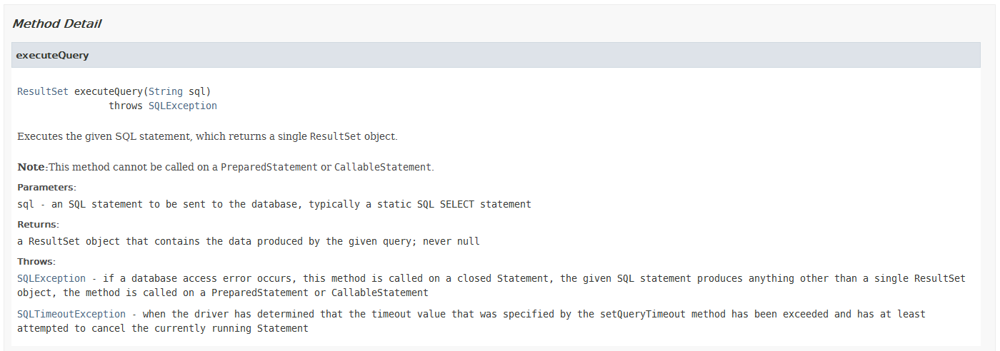

查询的数据封装在ResultSet对象中

**遍历结果集的每条数据**

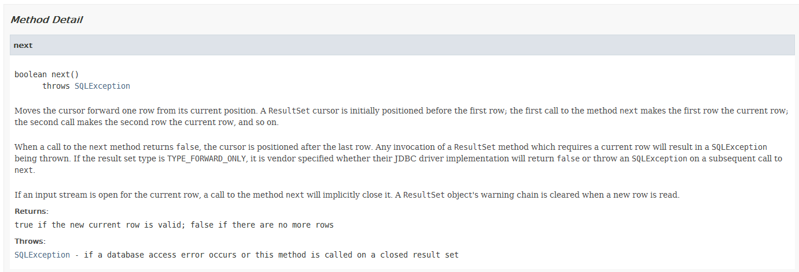

调用一次next方法到第一行（第一条记录），以后每次调用都会向下移动一行（一条记录）。如果已经到最后一行（最后一条记录），再次调用会返回false。

使用while遍历结果集，遍历每一条记录。

**取出数据的每一个属性（列）**

==注意JDBC所有下标从1开始==

==getString==方法取数据（方法进行重载）
1. 可以使用**查询结果集**的列名获取数据（如果使用别名的话（*后有验证*））
2. 可以使用列的序号（是在查询结果集中的序号（*后有验证*））
3. 推荐使用列名，**更加健壮**
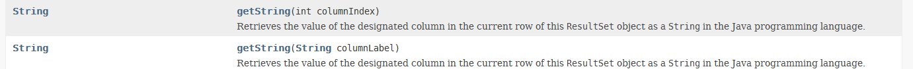

getString中传入columnIndex
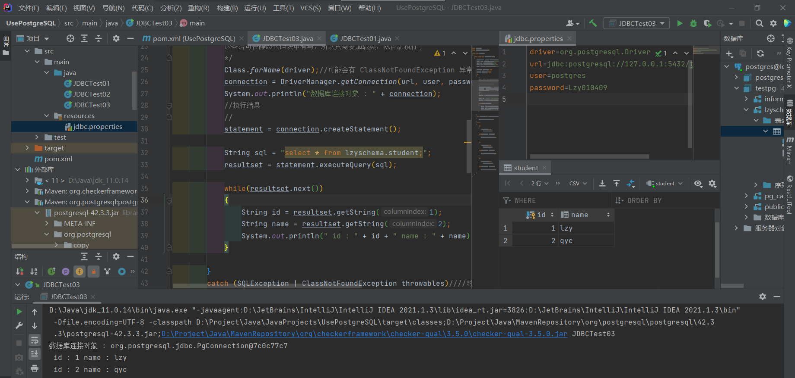
getString中传入columnLabel
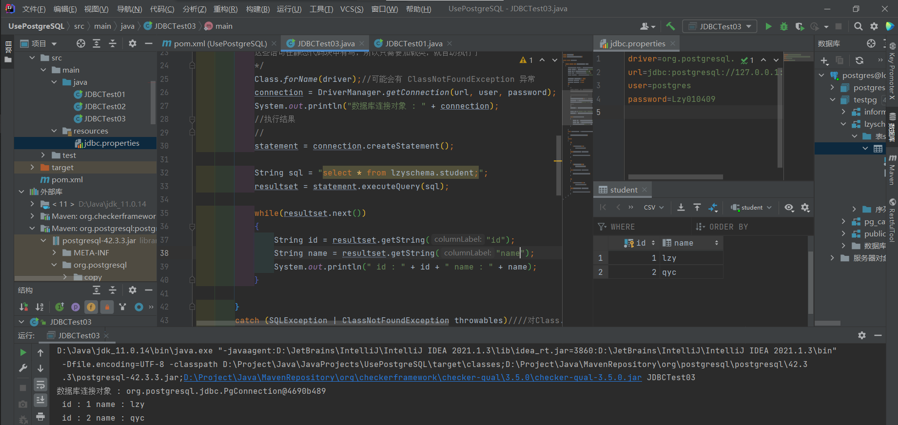

*对列序号理解的验证：取的是Table中的第2列(name)，但在结果集中是第一列，使用colunmIndex:1进行获取*
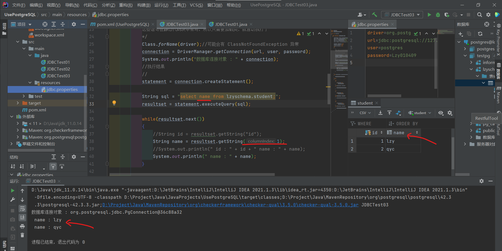

*使用了别名取属性的时候没有使用别名，结果报错*，而使用结果集的列名则正确执行
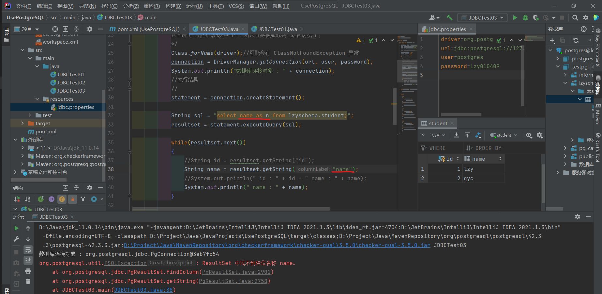

==除了使用getString，也可以以特定类型的获取数据==
getInt、getDouble等


```java
Class.forName(driver);//可能会有 ClassNotFoundException 异常
connection = DriverManager.getConnection(url, user, password);
System.out.println("数据库连接对象 : " + connection);
//执行结果
//
statement = connection.createStatement();

String sql = "select name as n from lzyschema.student;";
resultset = statement.executeQuery(sql);

while(resultset.next())
{
    //String id = resultset.getString("id");
    String name = resultset.getString("n");
    //System.out.println(" id : " + id + " name : " + name);
    System.out.println(" name : " + name);
}
```

## PowerDesigner工具

实际开发中，表的设计使用专业的建模工具。


# 狂神说 JDBC(MySQL)

## 数据库驱动

## JDBC程序

## JDBC对象解释

## 


