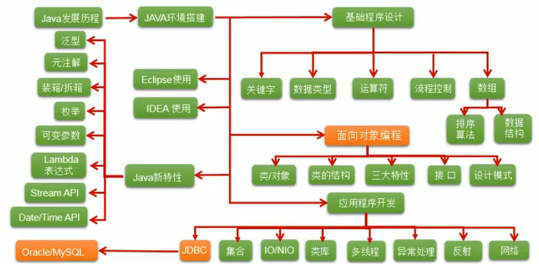
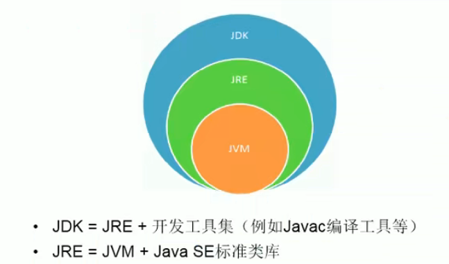
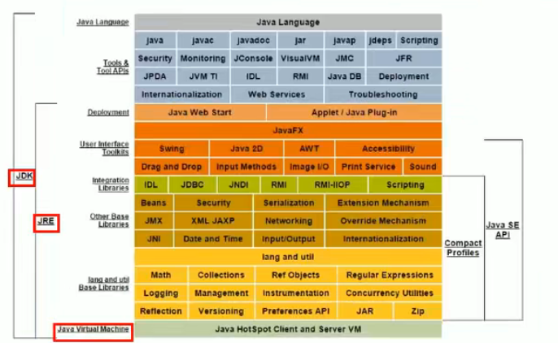

# Java

## Portals

[Java 基础到高级 - 宋红康](https://www.bilibili.com/video/av48370019)

# Java 基础到高级 - 宋红康

Java基础是学习JavaEE、大数据、Android开发的基石

**基础图谱**

人机交互方式：
1. GUI：Graphical User Interface (图像化界面)
2. GLI：Command Line Interface (命令行方式)

## Java语言历史

SUN(stanford university network， 斯坦福大小网络公司) 1995年推出。

java语言之父：James Gosling

类c语言

纯粹的面向对象程序设计语言

**Java舍弃了C语言种容易引起错误的指针（以引用替代）**

**增加了垃圾回收器功能，用于回收不再被引用的对象所占据的内存空间**

**JDK1.5引入泛型编程**

语言特点
1. 面向对象
   1. 类、对象
   2. 3大特性：封装、基础、多条
2. 健壮性
   1. 提供较为安全的内存管理和访问机制
3. 跨平台
   1. JVM(java virtual machine)负责java程序在该系统中的运行（不同操作系统都有相应的jvm）

Java技术体系平台
1. JavaSE:Standard Edition 标准版（桌面级）
2. JavaEE:Enterprise Edition 企业版
3. JavaME:Micro Edition 小型版
4. JavaCard: 支持一些小程序(Applets)运行在小内存设备上的平台

应用：
1. 企业级应用
2. Android平台
3. 大数据平台开发

**核心机制——垃圾回收**
1. C/C++语言由程序员负责回收无用内存
2. Java语言消除程序员回收无用内存的责任：提供一种系统级线程跟踪存储空间的分配情况。并在JVM空闲时，检查并释放哪些可以被释放的内存空间。
3. 在Java程序中自动进行，程序员无法精确控制和干预。
4. **还是会存在内存泄漏和内存溢出问题**

## JDK、JRE、JVM的关系

JDK:java development kit 开发工具包
1. 提供给开发人员使用
2. 包含开发工具
   1. javac.exe:编译工具
   2. jar.exe:打包工具
3. 包含jre

JRE:java runtime environment 运行环境
1. 包括jvm和java程序所需的核心类库
2. 想要运行java程序只需要按照jre

# 其他相关知识

## 常用DOS命令

常用DOS命令
1. dir
2. md
3. rd
4. cd
5. cd..
6. cd\
7. del
8. exit
