# Java

[toc]

## Portals

[Java 基础到高级 - 宋红康](https://www.bilibili.com/video/av48370019)

[狂神说 JavaSE阶段回顾总结](https://www.bilibili.com/video/BV1MJ411v7tJ)

[狂神说 Java零基础学习视频](https://www.bilibili.com/video/BV12J41137hu)

# Java 基础到高级 - 宋红康

Java基础是学习JavaEE、大数据、Android开发的基石

**基础图谱**


人机交互方式：
1. GUI：Graphical User Interface (图像化界面)
2. GLI：Command Line Interface (命令行方式)

## 概述

### Java语言历史

SUN(stanford university network， 斯坦福大小网络公司) 1995年推出。

java语言之父：James Gosling

类c语言

纯粹的面向对象程序设计语言

**Java舍弃了C语言种容易引起错误的指针（以引用替代）**

**增加了垃圾回收器功能，用于回收不再被引用的对象所占据的内存空间**

**JDK1.5引入泛型编程**

语言特点
1. 面向对象
   1. 类、对象
   2. 3大特性：封装、基础、多条
2. 健壮性
   1. 提供较为安全的内存管理和访问机制
3. 跨平台
   1. JVM(java virtual machine)负责java程序在该系统中的运行（不同操作系统都有相应的jvm）

Java技术体系平台
1. JavaSE:Standard Edition 标准版（桌面级）
2. JavaEE:Enterprise Edition 企业版
3. JavaME:Micro Edition 小型版
4. JavaCard: 支持一些小程序(Applets)运行在小内存设备上的平台

应用：
1. 企业级应用
2. Android平台
3. 大数据平台开发

**核心机制——垃圾回收**
1. C/C++语言由程序员负责回收无用内存
2. Java语言消除程序员回收无用内存的责任：提供一种系统级线程跟踪存储空间的分配情况。并在JVM空闲时，检查并释放哪些可以被释放的内存空间。
3. 在Java程序中自动进行，程序员无法精确控制和干预。
4. **还是会存在内存泄漏和内存溢出问题**

### JDK、JRE、JVM的关系

JDK:java development kit 开发工具包
1. 提供给开发人员使用
2. 包含**开发工具**
   1. javac.exe:编译工具
   2. jar.exe:打包工具
3. 包含jre

JRE:java runtime environment 运行环境
1. 包括jvm和java程序所需的**核心类库**
2. 想要运行java程序只需要按照jre


### Java安装和简单使用

**Java安装**

[Oracle Java Downloads](https://www.oracle.com/java/technologies/downloads/)

可以安装在D盘

将bin文件夹目录加入环境变量（8和11都装了，11在8上面所以默认是11）


**需要添加一个环境变量JAVA_HOME（就用这个名称，其他工具也会去寻找这个变量）**


**HelloWorld程序**


两个过程

```java
class HelloWorld
{
   public static void main(String[] args)
   {
		System.out.println("helloworld");
	}
}
```


上面的命令要加文件后缀，下面的命令不用加路径。

**注释comment**

注释的内容不参与编译。

main方法是程序入口

注释类型
1. 单行注释，//
2. 多行注释，/* */，不能嵌套使用
3. 文档注释（java特有），/** */，可以被javadoc解析，生成一套以网页文件形式体现该程序的说明文档。


**在一个java源文件中可以声明多个class，但是最多有一个类声明为public（只能加给和文件名同名的类）**，函数不限制。

**程序的入口是main()方法。其格式是固定的（public static void main(String[] args)）**

**println和print都是输出。前者是输出加换行，后者是仅输出**

**每一个执行语句以分号结束**

**编译的过程，编译后会生成一个或多个字节码文件。字节码文件名与java源文件中的类名相同。**

### Java API文档

API：application programming interface，应用程序编程接口

在oracle官网的java sdk下载位置的下面，**documentation download**


## 基础篇

### 变量与运算符

**关键字和保留字**

keywords：被java语言赋予特殊含义，有专门用途的字符串

所有关键字都是小写


reserved words：java现有版本尚未使用，但是以后版本可能会作为关键字使用
1. goto
2. const

**标识符 identifier**

对变量、方法、类等命名


**变量**

java中的每个**变量必须先声明并且赋值后使用**，需要明确具体类型，变量的作用域在 { } 中。

同一个文件下，不能有同名类。

同一个作用域内，不能有同名变量。

1. 基本数据类型
   1. 按照数据类型分
      
   2. 按照变量在类中的声明位置分
      

   

   

   给float类型的变量进行赋值的时候，需要加f或F否则编译报错。

   

   使用一对单引号、内部能且只能写一个字符（中文也行）。（转义字符加一个\）

   boolean布尔型，只能取两个值：true、false（**都是小写**）

2. 基本数据类型变量间转换
   
   **自动类型提升**

   

   boolean型无法参与运算（和C语言不同）

   **强制类型转换**：自动类型提升的逆运算

   使用说明：(类型)变量名

   小括号是强转符。**截断操作，可能导致精度损失**

   整形常量默认为int，浮点型常量默认为double

3. 基本数据类型与String间转换

   

   +加号作为连接运算符，运算结果任然为String类型

   

4. 进制与进制之间转换

   

   **REMAIN P62-P91**

**运算符**

1. 算数运算符

   比较特殊的是：加号（+）还可以用作字符串连接

   和C++相同：++和--也分前后

   整除运算符结果的符号和被除数相同

2. 位运算符

   

3. 逻辑运算符

   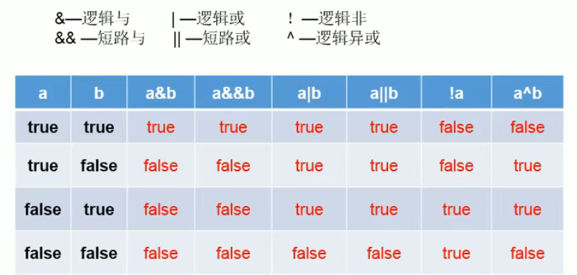

4. 三元运算符

   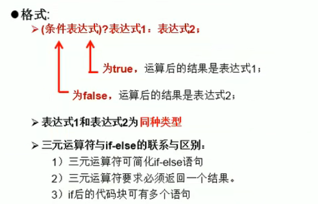

5. 运算符的优先级

   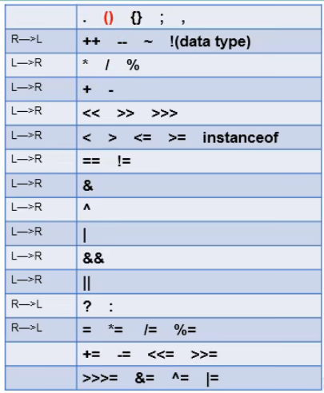

**程序流程控制**
1. 顺序结构
2. 分支结构（和C/C++一样）
   1. if -- else if -- else
   2. switch--case（case后面的常量可以是字符串等）
3. 循环结构（和C/C++一样）
   1. for
   2. while
   3. do-while
   4. break：默认跳出最近一层循环
   5. continue：默认跳过最近一层循环的一次
   6. 带标签的break、continue
      1. 在循环前加上一个标签：**[label]:**
      2. break、continue后添加该标签，**break [label]; continue [label];**

p123


### Scanner

从键盘获取不同类型的变量：需要使用Scanner类

具体实现步骤：
1. 导包：**import java.util.Scanner;**（注意分号）
2. Scanner的实例化：**Scanner scan = new Scanner(System.in);**
3. 调用Scanner类的相关方法，获取指定类型的变量。
4. 对于char型变量，scanner没有提供相关的方法。只能用next获取字符串（再使用方法xxx.charAt(index),index从0开始）。
5. Scanner只需要实例化一次。**和C++的cin不同，java需要根据相应的方法，输入指定类型的值**。输入类型不匹配会报异常（InputMisMatchException），导致程序终止。


### 数组

数组本身是**引用数据类型**，而数组中的元素可以是任何数据类型，包括基本数据类型和引用数据类型。

数组长度一旦确定就不能修改。

创建数组会在内存开辟一块**连续的空间**，而**数组名**中引用的是这块连续空间的**首地址**。

可以通过索引（下标）的方式调用指定位置的元素。

数组的初始化
1. 静态初始化：数组的初始化和数组元素的幅值操作同时进行
   ```java
   int[] array = new int[]{0,1,2,3};
   ```
2. 动态初始化：数组的初始化和数组元素的幅值操作分开进行
   ```java
   int[] array = new int[4]{};
   ```
3. **注意**
   1. 前面的中括号一定为空
   2. 使用静态初始化就不要在第二个中括号内填数字
   3. 使用动态初始化就不要在大括号内填数字
   4. 前后指明的数组元素类型也必须一致

**length**属性：获取数组长度

数组有默认初始化值


## 高级篇

## 深入解读

## 新特性


P43


# 狂神说 Java零基础学习视频

## Java特性和优势

1. 面向对象
2. 可移植性（跨平台）
3. 高性能
4. 分布式
5. 动态性（反射机制）
6. 多线程
7. 安全性
8. 健壮性

## 包机制

为了更好的组织类，提供包机制，用于区别类名的命名空间

仍然需要尽量保证类名不重复，否则从其他包导入同名类的时候还是会冲突会冲突。

**本质就是文件夹**，一般使用公司域名倒置作为包名

语法格式：
```java
package pkg1[.pkg2[.pkg3]];
//在.java文件的第一行，不能去掉
```

为了使用某一个包的成员，需要在Java程序中明确导入该包。
```java
import package1[.package2[.package3]].(classname|*);
//*表示导入所有
```

## Scanner

Java工具类

java.util.Scanner是Java5新特征

获取用户输入

常用方法
```java
hasNext();
hasNextLine();
next();
nextLine();
```

```java
scanner.close();
```
用完关闭，节省资源。

**next&nextLine区别**

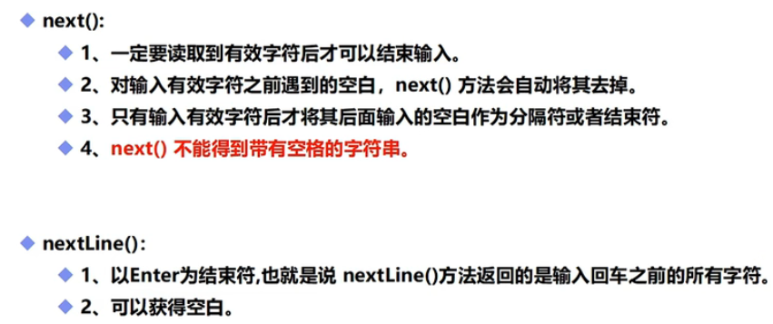

```java
public static void main(String[] args)
    {
        Scanner scan = new Scanner(System.in);
        System.out.println("input");

        if(scan.hasNextInt())
        {
            int i = scan.nextInt();System.out.println(i);
        }
        else
            System.out.println("no int");

        if(scan.hasNextFloat())
        {
            float f = scan.nextFloat();System.out.println(f);
        }
        else
            System.out.println("no float");

        scan.close();
    }
```

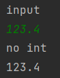

似乎和C/C++处理方式不同

直接检查对不对，不对直接跳过，缓冲区保留。

## 方法

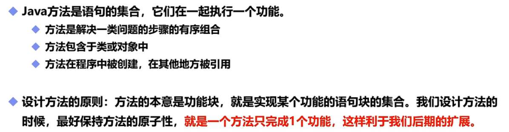

原子性

加static方便调用

### 方法的定义及调用

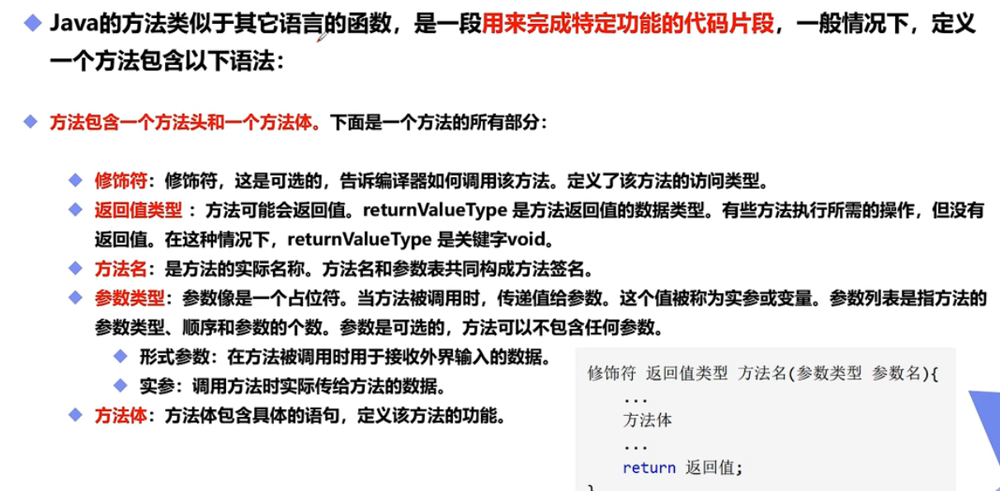

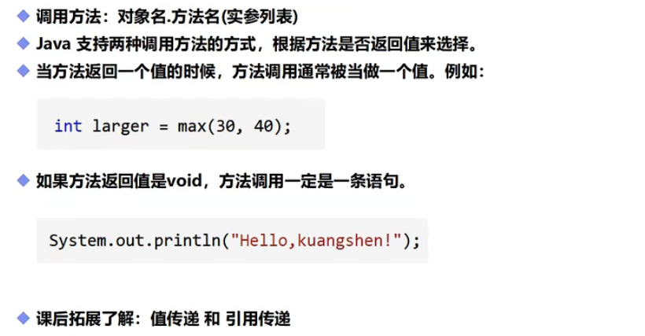

java都是值传递

### 方法重载

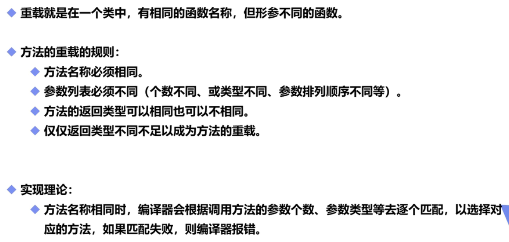

### 命令行传递参数

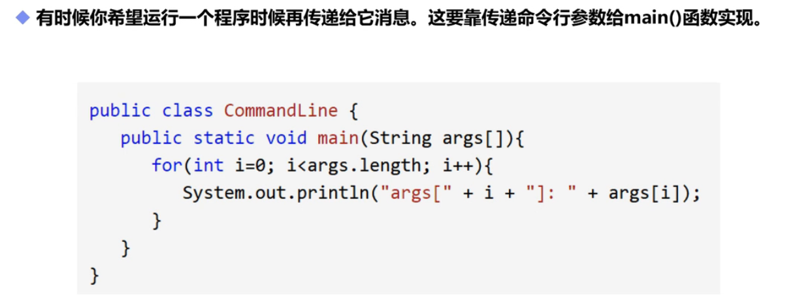

### 可变参数

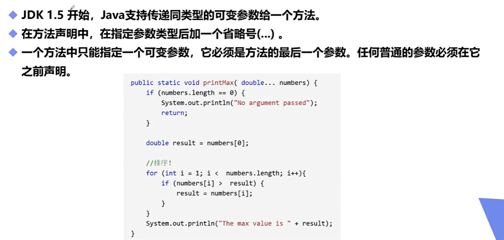

**只能指定一个可变参数**

**必须是最后一个参数**

用起来类似于数组

### 递归

## 初始化及内存分析

## 二维数组

## 面向对象

### 类和对象的创建

### 构造器

### 创建对象内存分析

### 封装

### 继承

### Super

### 方法重写

### 多态

### instance of和类型转换

### static

### 抽象类

### 接口的定义与实现

### N种内部类

### Error和Exception

### 捕获和抛出异常

### 自定义异常


# 狂神说 JavaSE阶段回顾总结

1. 基础
   1. Java诞生
   2. JDK、JRE
   3. javac、java
   4. 编译性、解释型语言

# IDEA配置

## IDEA优化

[IDEA的常见的设置和优化(功能)](https://blog.csdn.net/zeal9s/article/details/83544074)

## 大括号自动换行

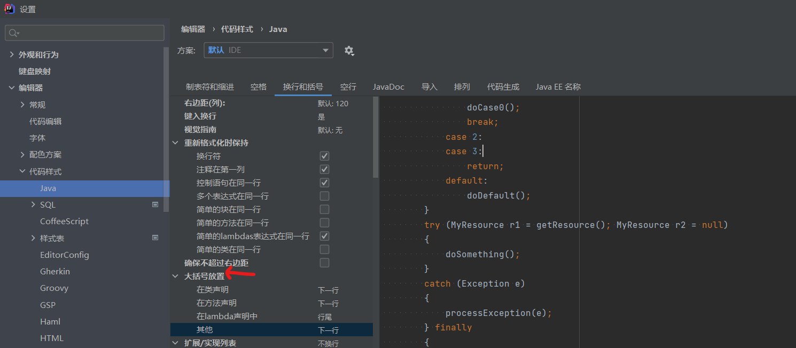

# 其他相关知识

## 常用DOS命令

常用DOS命令
1. dir
2. md
3. rd
4. cd
5. cd..
6. cd\
7. del
8. exit
