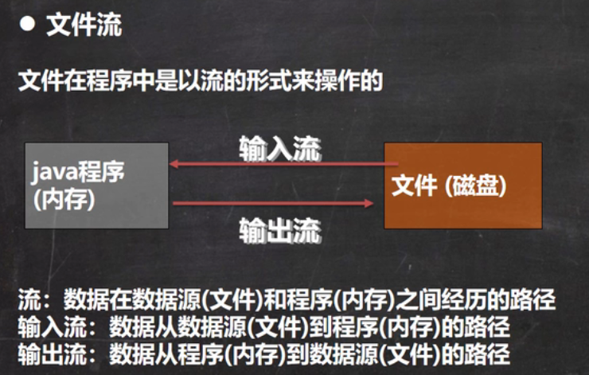
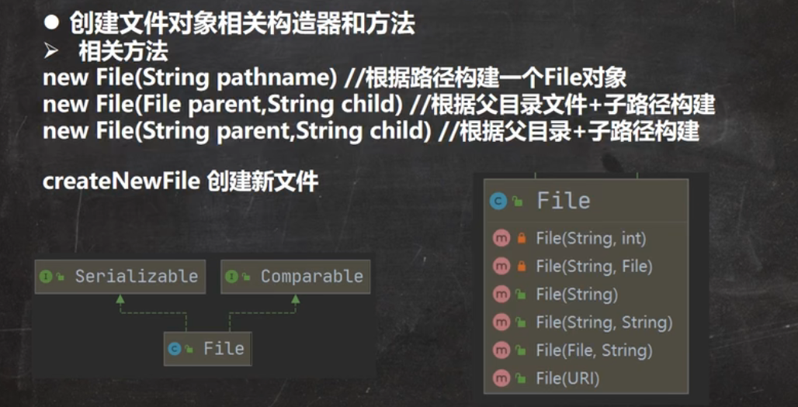
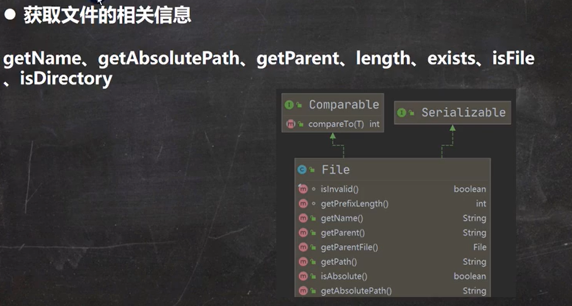
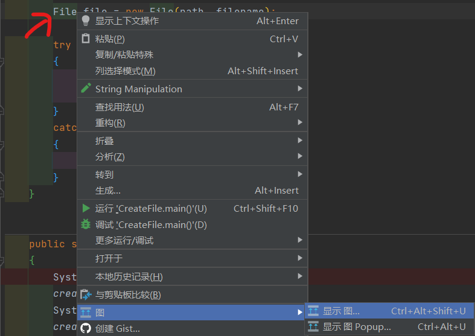
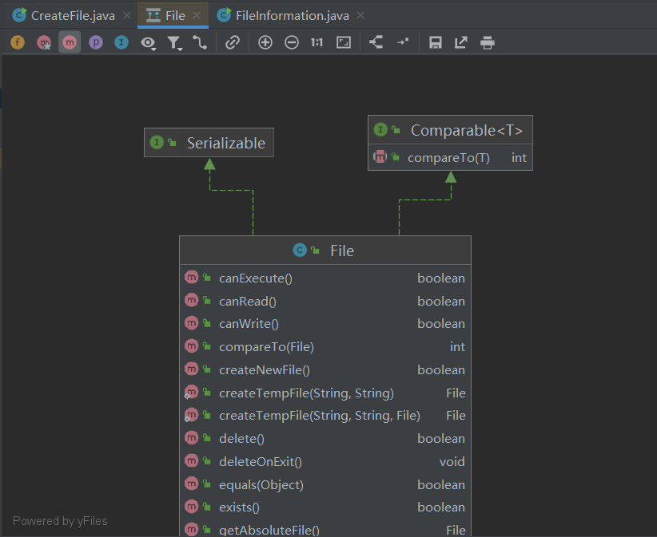
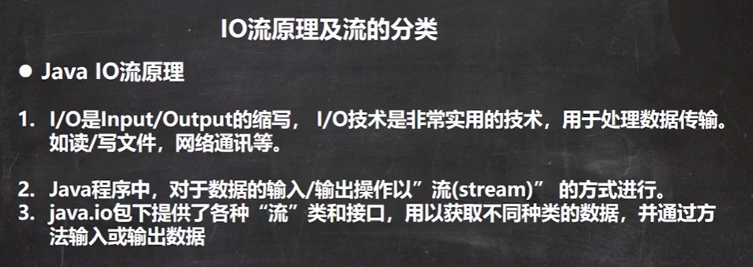
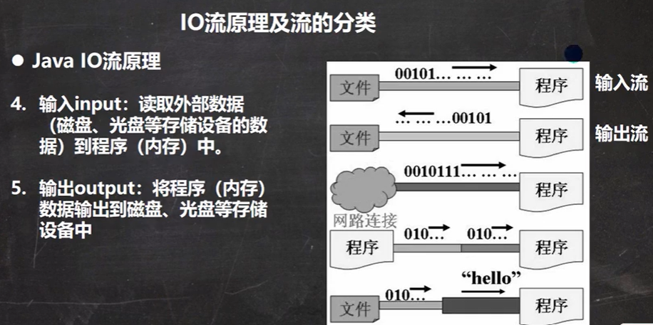
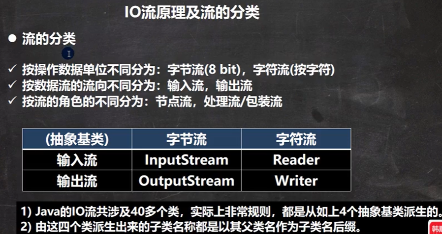

# Java IO

## Portals

[韩顺平 JavaIO流](https://www.bilibili.com/video/BV15B4y1u7Rn)

# 韩顺平 JavaIO流

## 创建文件 

文件就是保存数据的地方。

**文件流**（内存视角）



**常用的文件操作**



一个File对象对应一个文件

**实操**

说明：
```java
import java.io.File;
import java.io.IOException;

File file = new File(xxxx);//仅仅只是创建了一个对象
file.createNewFile();//在磁盘中创建file
```

```java
    public static void create()
    {
        //Method01
        String path = "D:\\Project\\Java\\JavaProjects\\JavaIO\\files\\new_create01.txt";
        File file = new File(path);
        //Method02
        File pfile = new File("D:\\Project\\Java\\JavaProjects\\JavaIO\\files");
        String filename = "new_create02.txt";
        File sfile = new File(pfile, filename);
        //Method03
        String path = "D:\\Project\\Java\\JavaProjects\\JavaIO\\files";
        String filename = "new_create03.txt";
        File file = new File(path, filename);

        try
        {
            file.createNewFile();
            System.out.println("文件创建成功");
        }
        catch(IOException e)
        {
            e.printStackTrace();
        }

    }
```

## 获取文件信息



**查看树**





**实操**


```java
public static void info()
    {
        File file = new File("D:\\Project\\Java\\JavaProjects\\JavaIO\\files\\new_create01.txt");
        //调用相应方法得到对应信息
        System.out.println("filename    "+file.getName());
        System.out.println("abs path    "+file.getAbsolutePath());
        System.out.println("parent path "+file.getParent());
        System.out.println("filesize    "+file.length()+" bytes");
        System.out.println("is exist    "+file.exists());
        System.out.println("is file     "+file.isFile());
        System.out.println("is dir      "+file.isDirectory());
        /*
        filename    new_create01.txt
        abs path    D:\Project\Java\JavaProjects\JavaIO\files\new_create01.txt
        parent path D:\Project\Java\JavaProjects\JavaIO\files
        filesize    14 bytes
        is exist    true
        is file     true
        is dir      false
        */
        //文件格式utf-8，文件内容：hello刘智宇（utf-8一个中文三个字节->5+3*3=14）
    }
```

## 目录操作


在java编程中，目录也被当作文件。

已有目录再次创建会失败。

即使都是空文件夹，删除只删最小一级文件夹。

创建多级目录必须使用mkdirs。

**实操**
```java
String dir_name = "D:\\Project\\Java\\JavaProjects\\JavaIO\\files";
File file = new File(dir_name);
boolean result = file.mkdir();

String dir_name = "D:\\Project\\Java\\JavaProjects\\JavaIO\\files\\1\\2\\3";
File file = new File(dir_name);
boolean result = file.mkdirs();

String filename = new String("D:\\Project\\Java\\JavaProjects\\JavaIO\\files\\1\\2");
File file = new File(filename);
boolean result = file.delete();
```


## IO流原理和分类







字符流（按字符为操作，但是不同编码方式的字符所占的字节数并不相同），用于处理文本文件

字节流（8bit）用于处理二进制文件

4个抽象类

**流和文件**有所不同，流可以理解为文件的载体，在磁盘和内存之间运输文件。

P6

## FileInputStream

## FileOutputStream

## 文件拷贝

## 文件字符流说明

## FileReader

## FileWriter

## 节点流&处理流

## 处理流设计模式

## BufferedReader

## BufferedWriter

## Buffered拷贝

## Buffered字节处理流

## 字节处理流拷贝文件

## 对象处理流


